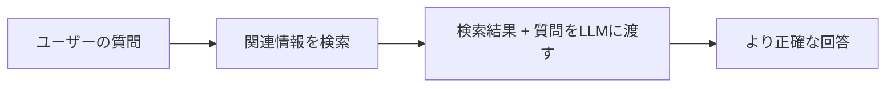
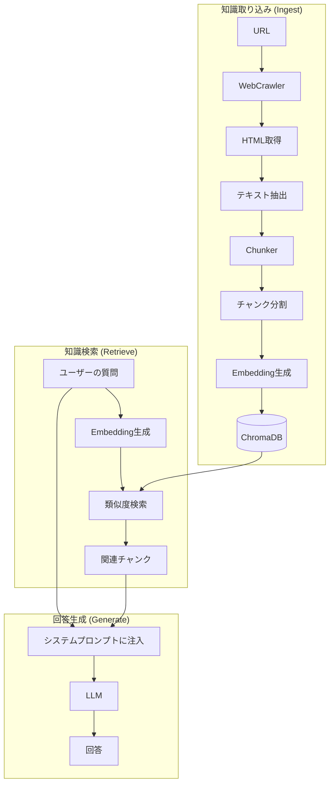
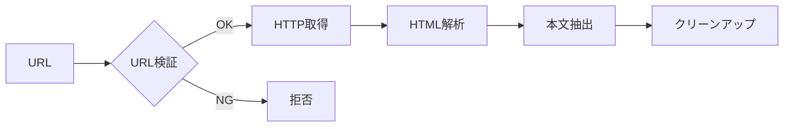
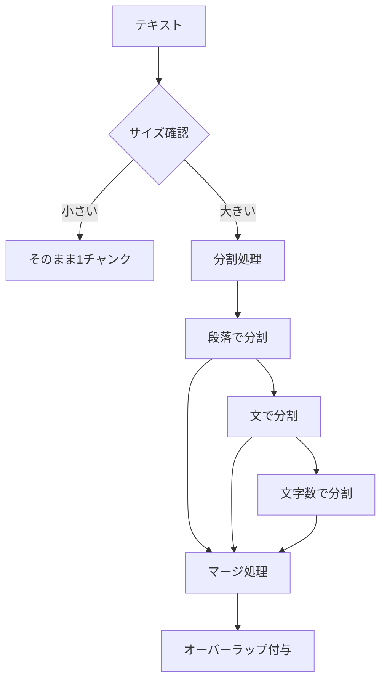
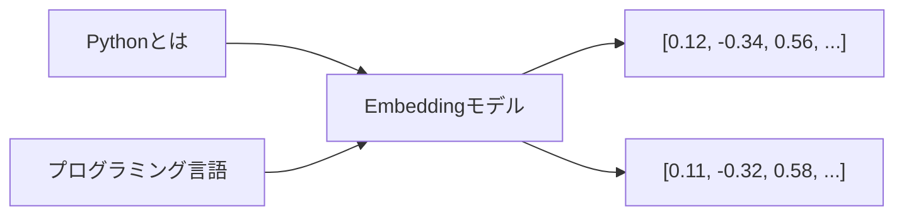
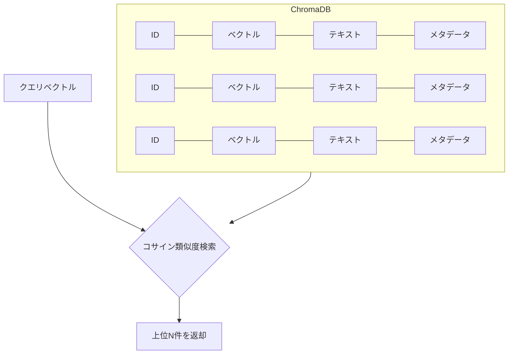
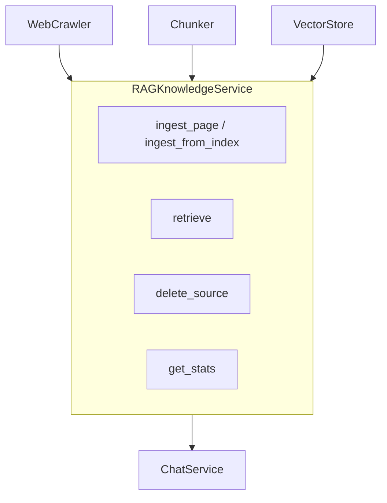
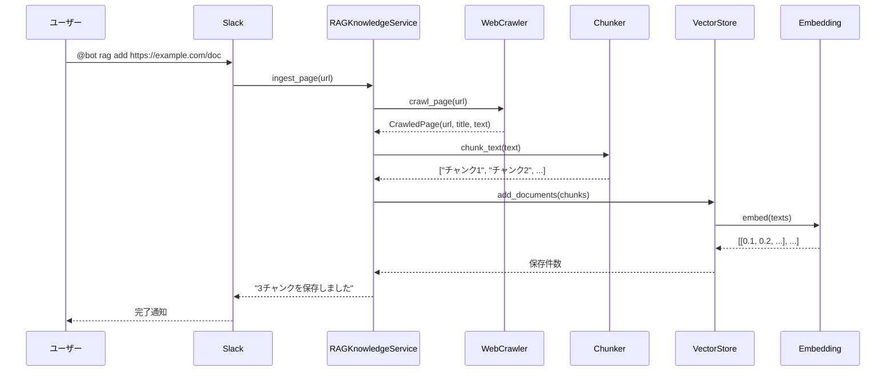
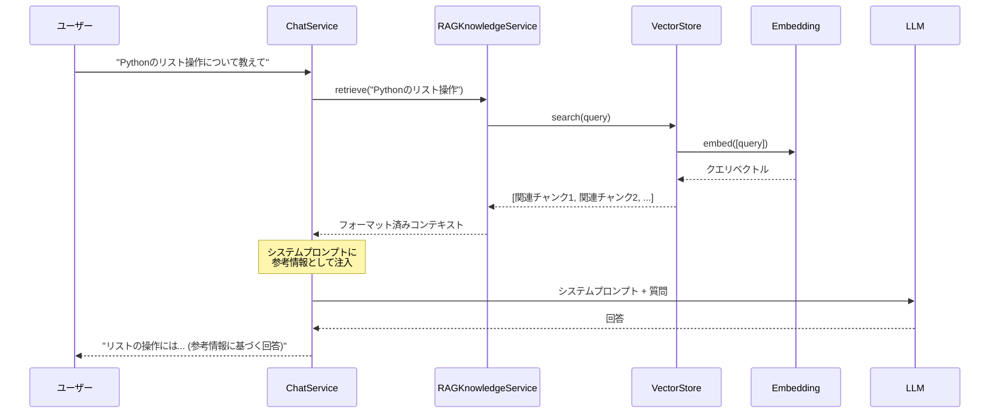

# RAGシステム概要

このドキュメントでは、本プロジェクトで実装されている **RAG (Retrieval-Augmented Generation)** システムの仕組みを解説します。

## RAGとは

RAGは「検索拡張生成」と呼ばれる技術で、LLM（大規模言語モデル）の回答精度を向上させる手法です。



### なぜRAGが必要なのか

LLMには以下の限界があります：

| 課題 | RAGによる解決 |
|------|---------------|
| 学習データ以降の情報を知らない | 最新のドキュメントを検索して補完 |
| 社内固有の情報を知らない | 社内ナレッジを検索して補完 |
| 回答の根拠が不明確 | 出典URLを明示できる |

## システム全体像



## コンポーネント詳細

### 1. WebCrawler（Webクローラー）

**役割**: 指定されたURLからWebページを取得し、テキストを抽出する



**主な機能**:

- SSRF対策（許可ドメインのホワイトリスト）
- リダイレクト追従の無効化（セキュリティ）
- 本文領域の自動特定（`<article>` → `<main>` → `<body>`）
- 不要タグの除去（`<script>`, `<style>`, `<nav>`等）

**ファイル**: `src/services/web_crawler.py`

---

### 2. Chunker（チャンカー）

**役割**: 長いテキストを検索に適したサイズに分割する



**なぜ分割が必要か**:

- Embeddingモデルには入力トークン制限がある
- 長すぎるテキストは検索精度が下がる
- 適切なサイズ（500文字程度）で分割すると検索精度が向上

**オーバーラップとは**:

```text
チャンク1: [ああああああああああ]
チャンク2:           [ああいいいいいいいい]  ← 50文字重複
チャンク3:                     [いいうううううううう]
```

文脈の断絶を防ぐため、チャンク間で一部のテキストを重複させます。

**ファイル**: `src/rag/chunker.py`

---

### 3. Embedding（埋め込み）

**役割**: テキストを数値ベクトル（多次元の数値配列）に変換する



**なぜベクトル化するのか**:

- テキストの「意味」を数値で表現できる
- 意味が近いテキストは、ベクトルも近くなる
- ベクトル間の距離で類似度を計算できる

**対応プロバイダー**:

| プロバイダー | モデル | 特徴 |
|-------------|--------|------|
| ローカル (LM Studio) | nomic-embed-text | 無料、プライバシー重視 |
| OpenAI | text-embedding-3-small | 高精度、API料金発生 |

**ファイル**: `src/embedding/`

---

### 4. VectorStore（ベクトルストア）

**役割**: ベクトル化されたチャンクを保存し、類似検索を行う



**保存されるデータ**:

```python
DocumentChunk(
    id="a1b2c3d4e5f6_0",      # URLハッシュ + チャンク番号
    text="Pythonは...",       # チャンク本文
    metadata={
        "source_url": "https://example.com/python",
        "title": "Python入門",
        "chunk_index": 0,
        "crawled_at": "2024-01-15T10:30:00Z"
    }
)
```

**ファイル**: `src/rag/vector_store.py`

---

### 5. RAGKnowledgeService（オーケストレーター）

**役割**: 上記コンポーネントを統合し、取り込み・検索の一連の処理を提供



**ファイル**: `src/services/rag_knowledge.py`

---

## データフロー詳細

### 知識取り込み (Ingest)



### 知識検索 (Retrieve)



## 技術スタック

| コンポーネント | 技術 | 選定理由 |
|---------------|------|----------|
| ベクトルDB | ChromaDB | 軽量、Python native、永続化対応 |
| Embedding | LM Studio / OpenAI | ローカル/クラウドの選択可能 |
| HTTPクライアント | aiohttp | 非同期対応 |
| HTML解析 | BeautifulSoup | 安定性、機能の豊富さ |

## 設定項目

`.env` ファイルで設定可能な項目：

```bash
# RAG機能の有効/無効
RAG_ENABLED=true

# Embeddingプロバイダー (local / online)
EMBEDDING_PROVIDER=local

# クロール許可ドメイン (SSRF対策)
RAG_ALLOWED_DOMAINS=docs.python.org,example.com

# チャンク設定
RAG_CHUNK_SIZE=500
RAG_CHUNK_OVERLAP=50

# 検索時の返却件数
RAG_RETRIEVAL_COUNT=5
```

## Slackコマンド

```
@bot rag add <URL>              # 単一ページを取り込み
@bot rag crawl <URL> [パターン]  # リンク集から一括取り込み
@bot rag status                 # 統計情報を表示
@bot rag delete <URL>           # 指定URLの知識を削除
```

## 関連ファイル

- 仕様書: `docs/specs/f9-rag-knowledge.md`
- RAGサービス: `src/services/rag_knowledge.py`
- ベクトルストア: `src/rag/vector_store.py`
- チャンカー: `src/rag/chunker.py`
- Webクローラー: `src/services/web_crawler.py`
- Embedding: `src/embedding/`
