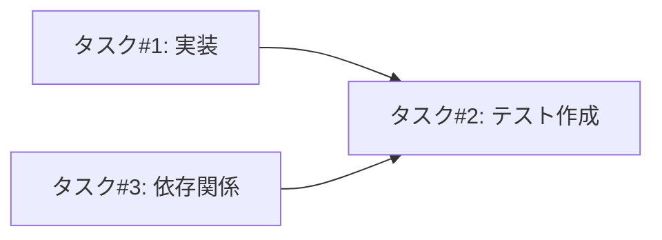
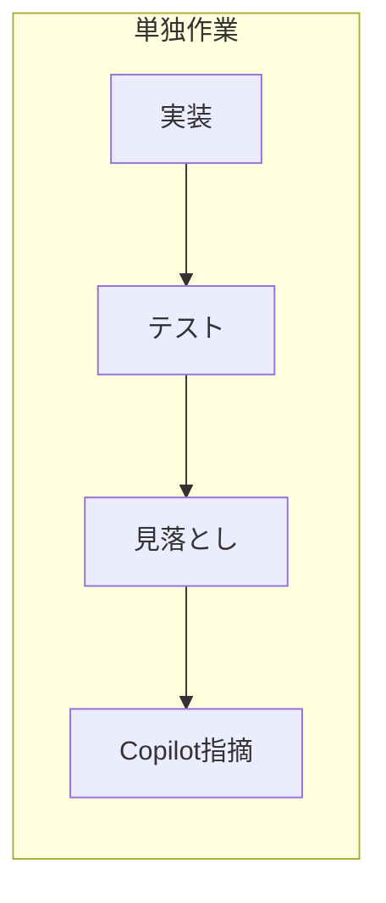
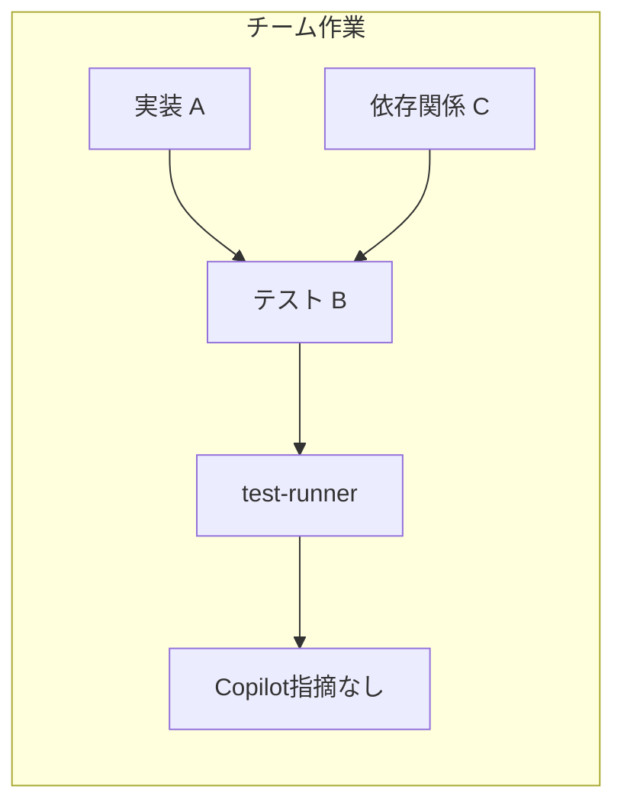

# エージェントチーム開発 — レトロスペクティブ

## 概要

Claude Codeのエージェントチーム機能を活用した開発手法の知見をまとめる。

## 初回適用: Issue #169 エンコーディング問題の修正（PR #172）

### 背景

RAG検索結果がチャット回答に反映されない問題（#169）を調査・修正した。

**根本原因**: Shift_JISエンコーディングのWebページがUTF-8として誤デコードされ、日本語テキストが文字化け状態でChromaDBに保存されていた。

### チーム構成

| 役割 | 担当タスク |
|------|-----------|
| リーダー | 統括・方針決定・PR作成 |
| 実装担当 | `web_crawler.py`のエンコーディング検出実装 |
| テスト担当 | テストコード作成（5件） |
| 依存関係担当 | `pyproject.toml`への依存追加 |

### 結果

- **Copilotレビュー指摘: ゼロ**（従来のPRでは毎回指摘があった）
- 全テスト通過（404 passed）
- ruff / mypy / markdownlint 違反なし

## うまくいったこと

### 1. 役割分離による専門性

- 各エージェントが専門タスクに集中
- 実装者とテスト作成者が別なので、第三者視点でテストが書かれた
- 「自分の実装をテストする」バイアスが排除された

### 2. タスク依存関係の制御

- テストタスクが実装タスクにブロックされる設定
- 実装完了後にテスト作成という流れが保証された
- 並行作業可能なタスク（実装と依存関係追加）は同時進行

### 3. 複数視点によるカバレッジ向上

- 単独作業では見落としがちなポイントが事前にカバーされた
- リーダーが方針を明示することで、実装のブレがなく一貫性のあるコードに

### 4. 最終品質ゲート

- test-runnerで全チェック（pytest/mypy/ruff/markdownlint）を通してからコミット
- チーム作業完了後に品質確認という流れが自然に組み込まれた

## 改善点・ハマったこと

### 1. レビュープロセスの抜け漏れ

**問題**: チーム解散後、レトロ作成時にdoc-reviewerを呼び忘れた。

**原因**: チーム開発では複数視点が入るが、チーム解散後の単独作業では従来通りの見落としが発生。

**対応**: ユーザーからの指摘で気づき、doc-reviewerを実行。

**教訓**: チーム開発でもCLAUDE.mdの手順（特にレビュー工程）は遵守が必要。

### 2. 初回適用のため手探り

**問題**: エージェントチーム機能の初回適用で、最適なタスク分割や依存関係設定が手探りだった。

**対応**: `docs/specs/agent-teams.md` を参照しながら実施。

**教訓**: 新機能適用前に仕様書を熟読することが重要。

## 単独作業との比較

## チーム開発が有効なケース

| シナリオ | 推奨 | 理由 |
|----------|------|------|
| 単純なテスト実行 | サブエージェント | 結果報告のみ |
| 単一ファイルのレビュー | サブエージェント | 焦点を絞ったタスク |
| 複数ファイルにまたがる機能実装 | **チーム** | 並行作業、相互調整が必要 |
| 調査 + 実装 + テストが必要な修正 | **チーム** | 役割分離の効果大 |

## 次に活かすこと

1. **複数ファイルにまたがる機能実装では、積極的にエージェントチームを検討する**

2. **リーダー役が実装方針を事前にチームメンバーに共有する** — ヘルパーメソッド名、処理フローなど

3. **依存関係のないタスクは並列実行を設定し、時間短縮を図る**

4. **実装者とテスト作成者を分けることで、第三者視点のテストを確保する**

5. **チーム解散後もCLAUDE.mdの手順（レビュー工程）は遵守する**

## キャラクター演出ガイドライン追加: Issue #190 / PR #193

### 背景

エージェントチームでキャラクターテーマを使用した際、キャラクターらしさの表現にばらつきがあった。原作の雰囲気を再現するための詳細なガイドラインを追加した。

### 実施内容

1. **キャラクター演出の基本方針**: 原作の表現をふんだんに使うことを明記
2. **リーダーもキャラクターとして振る舞う**: 無個性な「リーダー」役を廃止
3. **リーダーの統率責任**: 品質担保、ペナルティの仕組みを追加
4. **進捗報告ルール**: 作業開始時・中間・問題発見時の報告を義務化
5. **長時間返信がないメンバーへの対応**: リーダーの反応パターンを追加

### 動作確認

2つの異なるテーマでテスト実施:

| テスト | 進捗報告 | 結果 |
|--------|----------|------|
| 1回目（ガイドライン追加前） | 最終報告のみ | 物語感不足、作業状況が把握しづらい |
| 2回目（ガイドライン追加後） | 作業開始・中間・完了 | 物語感向上、リアルタイムで状況把握可能 |

### うまくいったこと

1. **進捗報告の義務化が効果的**: 作業開始時・中間報告により、メンバーが何をしているか把握可能に
2. **キャラクターらしい表現**: 各キャラクターの性格や口癖が自然に反映された
3. **リーダーのキャラクター化**: リーダーもキャラクターとして応答することで一体感が向上

### 改善点

1. **最初のテストでは報告が不足**: ガイドラインで明示する前は中間報告がなかった
2. **具体的な台詞サンプルは著作権リスク**: レビュー指摘を受けて削除し、方針のみ記載する形式に変更

### 次に活かすこと

1. **ガイドラインは「どう表現するか」を言葉で示す**: 具体的な台詞例は避け、Claudeの知識を活用
2. **進捗報告を明示的に指示する**: 「細かく報告して物語感を出す」と伝えると効果的
3. **リーダーは沈黙にも反応する**: メンバーの沈黙を放置せず、キャラクターらしく声をかける

## テーマ履歴管理＋物語構造ルール追加: Issue #198 / PR #200

### 背景

「チームで開発して」でランダム選択する際、有名なタイトル（ジョジョ、鬼滅の刃など）が頻出しやすく、多様性が損なわれていた。また、チーム作業中の物語演出が「ただの作業報告」になりがちだった。

### 実施内容

1. **テーマ履歴管理機能**: `~/.claude/team-theme-history.json` に使用履歴を保存し、直近10件との重複を避ける
2. **物語構造の適用ルール**: 課題を「敵」「ライバル」として擬人化し、倒すストーリーとして進める
3. **リーダーによる物語オープニング**: チーム開始時に敵を命名・紹介する手順を追加
4. **外部成果物への物語演出禁止**: コミット・PR・Issueにキャラクター名を含めないルール
5. **レビュー担当役割の必須ルール**: チームに必ず1名以上のレビュー担当を含める

### チーム構成

| 役割 | 担当タスク |
|------|-----------|
| リーダー | 統括・コミット・PR対応 |
| 仕様修正担当 | フィールド表修正、ルール追加 |
| レビュー担当 | doc-reviewer、markdownlint実行 |

### うまくいったこと

1. **物語構造の導入**: レビュー指摘を「敵スタンド使い」として擬人化することで、作業に物語感が生まれた
   - Copilot指摘 → 敵「コピロット」
   - 管理者指摘 → 敵「レビュー・ルール」
   - 仕様不備 → 敵「ルール・ブレイカー」

2. **リアルタイムの仕様改善**: 作業中にユーザーから「物語が足りない」という指摘を受け、即座に仕様を追加・改善できた

3. **レビュー担当の分離**: レビュー担当が専任として機能し、仕様修正担当の成果物を第三者視点で確認

### 改善点・ハマったこと

1. **外部成果物への演出漏れ**
   - **問題**: PRコメントにキャラクター名を含むチーム名・メンバー名を記載してしまった
   - **原因**: 物語の熱量がそのまま外部出力に流れた
   - **対応**: 「外部成果物への物語演出禁止」ルールを仕様に追加

2. **物語オープニングの欠如**
   - **問題**: チーム開始時に「敵」を紹介するターンがなく、いきなり作業に入った
   - **対応**: 「リーダーによる物語オープニング」手順を追加

3. **意識的な切り替えの必要性**
   - **問題**: キャラクターを演じながら外部出力を書く際、無意識にキャラクター要素が混入
   - **対応**: `git commit`や`gh pr`実行時に「ここから外部出力」と意識するトリガーを設定

### 次に活かすこと

1. **チーム開始時に必ず「物語オープニング」を行う**: 敵の命名・能力説明・作戦宣言

2. **外部出力の前に一時停止**: コミット・PR・Issueを書く前にキャラクター要素がないか確認

3. **課題を「敵」として擬人化**: ジャンルに応じた物語構造（バトル系なら敵、スポーツ系ならライバル）を適用

4. **レビュー担当を必ず1名以上配置**: チーム構成時に品質担保の役割を明確化

5. **仕様は運用しながら改善**: 問題が発生したら即座にルール化し、仕様書に刻む

## 参考

- エージェントチーム仕様: [docs/specs/agent-teams.md](../specs/agent-teams.md)
- 関連PR: #172（エンコーディング自動検出修正）、#193（キャラクター演出ガイドライン）、#200（テーマ履歴管理＋物語構造ルール）
- 関連Issue: #169（RAG検索結果がチャット回答に反映されない）、#190（キャラクター演出）、#198（チームビルディングの偏りを防ぐ）
