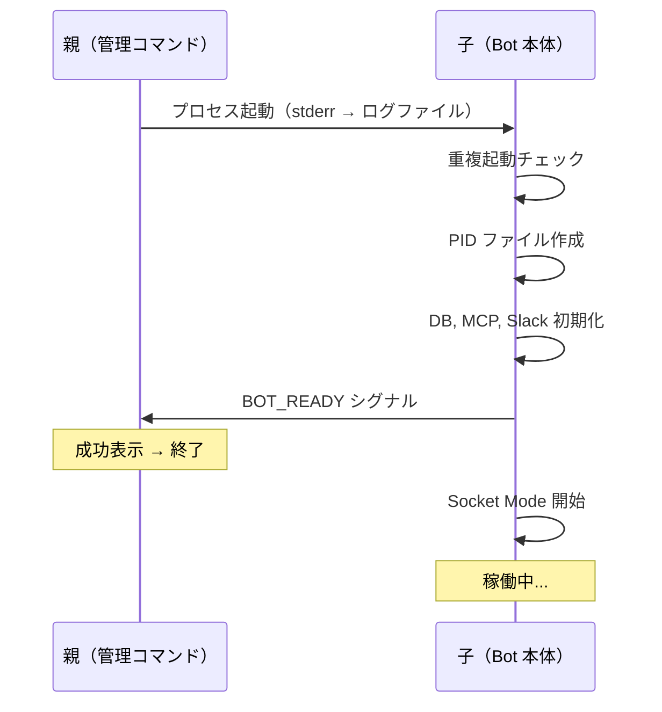

# Bot プロセスガード

## 概要

Bot 起動時に PID ファイルを使って既存プロセスの重複起動を検知し、管理コマンドにより Bot の起動・停止・状態確認を行う基盤機能。シャットダウン時に子プロセス（MCP サーバー等）のクリーンアップも担う。

## 背景

- Bot 停止時に子プロセスが残存し、次回起動時に Slack への二重セッションが発生する問題があった
- Bot の起動成功・失敗を確認する手段がなく、セッション切り替え後に状態が不明になる
- 起動・停止・再起動・状態確認に手動でのプロセス操作が必要だった

## 制約

<!-- How追加理由: PR #137 で os.kill の Windows 非互換が検出 -->
- プロセス生存確認はプラットフォーム分岐で行う（Windows: `tasklist` / Unix: `os.kill(pid, 0)`）
- Windows の強制終了では `finally` ブロックが実行されないため、クリーンアップは管理コマンド側で行う
- PID ファイルのプロセスが Bot かどうかの名前検証は行わない
- 起動・停止管理は Python 内で完結する（シェルスクリプトは使用しない。Git Bash + Windows の相性問題を回避）

## インターフェース

### PID ファイル管理

PID ファイル（`bot.pid`）によりプロセスの状態を管理する。

| 操作 | 振る舞い |
|---|---|
| 作成 | Bot 起動時に排他的に作成する（TOCTOU 対策）。既存ファイルがある場合はプロセス生存を確認し、生存していれば起動を拒否、stale PID なら削除して再作成する |
| 読み取り | PID ファイルから PID を取得する。ファイルが存在しない・内容が不正な場合は「なし」として扱う |
| 削除 | Bot 終了時に削除する。ファイルが存在しない場合は何もしない。削除失敗時はログ警告を出力して続行する |

### 子プロセスクリーンアップ

Bot 終了時に子プロセス（MCP サーバー等）を停止する。

- 子プロセスが存在しない場合は何もしない
- 個々の子プロセス停止失敗はログ出力して続行する（Bot 終了を妨げない）

### 管理コマンド

| コマンド | 既存プロセスなし | 既存プロセスあり |
|---|---|---|
| `--start` | 起動 → 初期化完了待ち → 成功表示 | 「Already running」表示で終了 |
| `--restart` | 起動 → 初期化完了待ち → 成功表示 | 停止 → 起動 → 初期化完了待ち → 成功表示 |
| `--stop` | 「Not running」表示 | 停止 → 完了 |
| `--status` | 「Not running」表示 | 「Running」+ PID 表示 |
| （なし） | 直接起動（従来動作） | 重複検知で終了 |

#### 起動シグナル

Bot 本体は全初期化完了後に `BOT_READY` を stdout に出力する（管理コマンド経由かどうかに関わらず常に出力する）。管理コマンドはこのシグナルを受信して起動完了を判定する。

初期化完了シグナルが一定時間内に届かない場合はタイムアウトエラーで終了する。

#### 停止処理

管理コマンドの停止処理は、プロセスツリー全体（子プロセス → 本体の順）を外部から停止する。PID ファイルの削除も管理コマンド側で行う。

#### ログ出力

管理コマンド経由の起動時は、Bot 本体の stderr をログファイルにリダイレクトする。ログファイルのディレクトリが存在しない場合は自動作成する。

## コンポーネント構成

| コンポーネント | 役割 |
|---|---|
| プロセスガード | PID ファイル管理・重複検知・子プロセスクリーンアップ |
| 管理コマンド | 起動・再起動・停止・状態確認のオーケストレーション |
| Bot 本体 | エントリーポイント・プロセスガード統合・管理コマンド分岐 |

## エッジケース

| ケース | 振る舞い |
|---|---|
| stale PID（PID ファイルはあるが対応プロセスが存在しない） | PID ファイルを削除して正常に起動する |
| 起動タイムアウト | タイムアウトエラーで終了する |
| 起動中の子プロセス異常終了（パイプが閉じた） | エラー表示で終了する |
| プロセス確認用コマンド未検出 | スキップしてログ出力する |
| 子プロセス停止失敗 | ログ出力して次の子プロセスの停止に進む |
