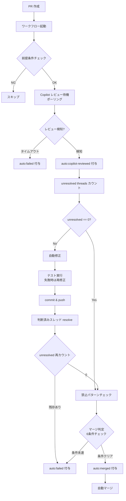

# Copilot ベース自動修正ワークフロー

## 概要

GitHub Copilot のレビュー結果に基づき、レビュー指摘の自動修正と自動マージを行うワークフロー。PR 作成をトリガーに、Copilot レビュー検知・修正・マージまでを単一ワークフロー内で完結する。

単方向フロー（レビュー → 修正 → マージ）を採用し、再レビューループは行わない。

## 背景

- 旧方式ではレビュー→修正→再レビューのループが収束しない問題があった。再レビュー時に修正済みコードが「初見のコード」として再評価され、新規指摘が出続ける構造が根本原因
- 外部の schedule ワークフローによるポーリング検知は、遅延・スキップが発生し PR が滞留する問題があった
- これらを解決するため、再レビューループを廃止し、ワークフロー内で sleep ポーリングによる検知を行う自己完結型設計に移行した

## 制約

- 再レビューは行わない。初回レビューで重要な問題は検出される前提とし、修正後の品質は post-merge 通知でカバーする
- 外部ワークフローへの依存を持たない（自己完結型）
- Copilot レビューは guaranteed delivery ではない。サービス障害等でレビューが来ない場合はタイムアウトで停止する
- ワークフローの実行には認証トークン（Copilot 修正用・マージ用 PAT・GitHub API 用）が必要

## トリガー条件

### プライマリトリガー

PR 作成時（`pull_request[opened]`）に自動起動する。

**発火条件**:

- PR の head リポジトリが同一リポジトリ（フォーク PR を除外）
- ブランチ名が `auto/` プレフィックスで始まる（自動パイプライン由来の PR のみ対象）

PR 作成元は PAT で作成される必要がある（`GITHUB_TOKEN` で作成された PR は GitHub の無限ループ防止仕様により他のワークフローをトリガーしない）。

### セカンダリトリガー

障害復旧後の手動再実行用（`workflow_dispatch`）。

- 入力パラメータとして PR 番号を指定する
- ワークフロー内で `auto/` ブランチプレフィックスを検証する

### 同時実行制御

PR 番号ごとの concurrency グループで制御する。進行中のジョブはキャンセルしない（コミットが不完全な状態になるリスクを回避）。

## 処理フロー

### 前提条件チェック

以下を満たさない場合はスキップする:

- PR が OPEN 状態であること（マージ済み・クローズ済みの PR は対象外）
- `auto:failed` ラベルが付与されていないこと

### Copilot レビュー検知

REST API で PR のレビュー一覧を固定間隔でポーリングし、Copilot のレビュー完了を検知する。

- レビュアー判定: REST API では `copilot-pull-request-reviewer[bot]` として返される
- 検知した場合: `auto:copilot-reviewed` ラベルをステータスマーカーとして付与
- タイムアウトした場合: `auto:failed` ラベルを付与し停止

ポーリングのタイムアウトは Actions variable（`COPILOT_REVIEW_TIMEOUT`）で設定可能。

**API エラーの分類**:

| エラー種別 | 振る舞い |
|---|---|
| 認証・権限エラー | 即停止 |
| 一時的障害 | 警告を出力し次のポーリングへ |

### 分岐処理

| 条件 | アクション |
|---|---|
| unresolved == 0 | 禁止パターンチェック → マージ判定 |
| unresolved > 0 | 自動修正（テスト → 失敗時は再修正） → commit & push → 判断済みスレッド resolve → unresolved 再カウント → 禁止パターンチェック → マージ判定 |

unresolved threads は GraphQL API で PR の `reviewThreads` から `isResolved == false` のスレッド数をカウントする。

### 禁止パターンチェック

マージ判定の直前に 1 回だけ実行する。自動修正が禁止ファイルの変更を取り消す可能性があるため、チェックはマージ直前に行う。

### マージ判定

以下の 6 条件を全て満たす場合にマージを実行する:

1. PR が OPEN 状態
2. unresolved threads == 0
3. ステータスチェック通過（外部 CI 未設定時は自動 PASS、自ワークフローは除外）
4. コンフリクトなし
5. `auto:failed` ラベルなし
6. 禁止パターンなし

## 出力

### ラベル体系

| ラベル | 用途 | 付与タイミング |
|---|---|---|
| `auto:pipeline` | 検索・フィルタ用マーカー | PR 作成時（上流ワークフロー） |
| `auto:copilot-reviewed` | レビュー完了のステータスマーカー | Copilot レビュー検知後 |
| `auto:failed` | 自動処理停止 | エラー発生時 |
| `auto:merged` | マージ完了マーカー | マージ直前 |

### マージ結果

- 条件クリア: `auto:merged` ラベル付与後、develop ブランチへマージ
- 条件未達: `auto:failed` ラベル付与

### エラー通知

全ステップで失敗時に `auto:failed` ラベルを付与し、PR コメントで失敗ステップ名・エラー概要・実行ログへのリンクを通知する。

## エッジケース

| ケース | 振る舞い |
|---|---|
| Copilot レビューが来ない | タイムアウトで `auto:failed` 停止 |
| 自動修正後も unresolved が残存 | `auto:failed` で停止 |
| 禁止パターン検出 | 自動修正は続行するが、マージ判定（条件 6）でブロック |
| GitHub API エラー | 即座に `auto:failed` で停止（リトライしない） |
| Copilot が同一 PR に複数回レビュー | 前提条件チェックで OPEN 状態を確認しガード |

### 障害復旧手順

1. PR コメントの `auto:failed` 通知で失敗原因を特定
2. 問題を修正
3. `auto:failed` ラベルを除去
4. Actions タブから `workflow_dispatch` で PR 番号を指定して再実行

## 関連ドキュメント

- [auto-progress](auto-progress.md): 全体パイプライン仕様
