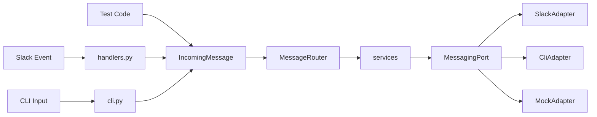

# F11: CLIアダプター（Slack非依存テスト）

## 概要

メッセージングを `MessagingPort` ABC で抽象化し、Slack以外のインターフェース（CLI、テスト）から
同一のコードパスで動作確認できるようにする。Port/Adapter パターンを適用する。

## 背景

- Slackアシスタントの動作確認はSlackからメッセージを送信する方法しかない
- CLIからメッセージを入力して同一のコードパスで動作確認したい
- Slack接続部分を疎結合にし、将来のプラットフォーム変更に備える

## ユーザーストーリー

- 開発者として、ターミナルからメッセージを打ち込んでボットの応答を確認したい
- 開発者として、Slack接続なしでコマンド（feed list、status等）の動作確認をしたい
- 開発者として、テストコードから直接 `IncomingMessage` を構築してロジックを検証したい

## 設計方針: Port/Adapter パターン

LLMプロバイダーが `LLMProvider` ABC で抽象化されているのと同じパターンで、
メッセージングを `MessagingPort` ABC で抽象化する。



**コア共通原則:** Slack / CLI / テスト の全てが同一の `MessageRouter` + サービス層を通る。
異なるのは入口（イベント抽出 / stdin / テストコード）と出口（Slack API / print / assert）だけ。

## 入出力仕様

### IncomingMessage

| フィールド | 型 | Slack | CLI | 説明 |
|-----------|-----|-------|-----|------|
| `user_id` | `str` | Slack user ID | CLI user ID | ユーザー識別子 |
| `text` | `str` | メンション除去済みテキスト | 入力テキスト | メッセージ本文 |
| `thread_id` | `str` | thread_ts | セッションID | スレッド/セッション識別子 |
| `channel` | `str` | チャンネルID | `"cli"` | チャンネル識別子 |
| `is_in_thread` | `bool` | スレッド内かどうか | `False` | スレッドフラグ |
| `message_id` | `str` | ts | 自動生成 | メッセージ識別子 |
| `files` | `list[dict] \| None` | 添付ファイル情報 | `None` | ファイル情報 |

### MessagingPort ABC

| メソッド | 説明 |
|---------|------|
| `send_message(text, thread_id, channel)` | メッセージ送信 |
| `upload_file(content, filename, thread_id, channel, comment)` | ファイル送信 |
| `fetch_thread_history(channel, thread_id, current_message_id)` | スレッド履歴取得 |
| `get_format_instruction()` | フォーマット指示取得 |
| `get_bot_user_id()` | Bot User ID 取得 |

### CLI モード

```bash
# REPL モード
uv run python -m src.cli

# ワンショットモード
uv run python -m src.cli --message "こんにちは"

# user-id を指定
uv run python -m src.cli --user-id alice
```

| オプション | デフォルト | 説明 |
|-----------|-----------|------|
| `--user-id` | `cli-user` | ユーザーID |
| `--message` | なし | 指定時ワンショット、未指定時REPL |

### CLI モードでの出力

| Slack動作 | CLI動作 |
|----------|---------|
| `chat_postMessage` | `print(text)` |
| `files_upload_v2` | ローカルファイル保存（`.tmp/cli_exports/`） |
| スレッド履歴取得 | `None` 返却（DBフォールバック使用） |
| Slack mrkdwn 指示 | 空文字列（プレーンテキスト） |

## 受け入れ条件

- [ ] AC1: `MessagingPort` ABC が定義され、`send_message`, `upload_file`, `fetch_thread_history`, `get_format_instruction`, `get_bot_user_id` を持つ
- [ ] AC2: `SlackAdapter` が `MessagingPort` を実装し、既存のSlack API呼び出しをラップする
- [ ] AC3: `CliAdapter` が `MessagingPort` を実装し、stdout/ローカルファイルで動作する
- [ ] AC4: `MessageRouter` が `_process_message` のロジックを保持し、全キーワードコマンドをルーティングする
- [ ] AC5: `handlers.py` がイベント→`IncomingMessage`変換 + `MessageRouter` 委譲の薄いラッパーになる
- [ ] AC6: CLI REPL モードで通常チャット・status・profile・feed list・topic コマンドが動作する
- [ ] AC7: CLI ワンショットモードで単発メッセージが処理される
- [ ] AC8: 既存のSlackボットが変わらず動作する（回帰なし）
- [ ] AC9: `ChatService` の `thread_history_service` が `thread_history_fetcher` (callable) に変更される
- [ ] AC10: `ChatService` の `slack_format_instruction` が `format_instruction` にリネームされる
- [ ] AC11: 会話履歴がDB経由で永続化される（CLI/Slack共通）

## スコープ境界

### 対応する

- 全キーワードコマンド（chat, status, profile, topic, deliver, feed \*, rag \*）
- feed deliver/collect/test は Slack 接続時のみサポート（CLI単体モードではエラーメッセージを返却）
- REPL + ワンショット両モード
- 会話履歴のDB永続化
- `--db-dir` オプションによるDB分離（デフォルト: `.tmp/.cli_data/`）

### 対応しない（将来Issue）

- feed import/replace のCSVローカルファイル対応（Slack経由のファイルダウンロードが前提の処理）
- DB カラム名 `slack_user_id` → `user_id` のリネーム
- Discord等の新アダプター実装

## 関連ファイル

### 新規

| ファイル | 役割 |
|---------|------|
| `src/messaging/__init__.py` | パッケージ |
| `src/messaging/port.py` | `MessagingPort` ABC + `IncomingMessage` データクラス |
| `src/messaging/slack_adapter.py` | Slack実装 |
| `src/messaging/cli_adapter.py` | CLI実装 |
| `src/messaging/router.py` | `MessageRouter` |
| `src/cli.py` | CLIエントリーポイント |
| `tests/test_messaging_port.py` | CliAdapter, IncomingMessage のテスト |
| `tests/test_message_router.py` | MessageRouter のテスト |

### 変更

| ファイル | 変更内容 |
|---------|---------|
| `src/services/chat.py` | パラメータリネーム |
| `src/slack/handlers.py` | MessageRouter 委譲 |
| `src/main.py` | SlackAdapter/MessageRouter 組み立て |
| `tests/test_chat_service.py` | パラメータ名変更に追従 |
| `tests/test_slack_handlers.py` | ハンドラ変更に追従 |
| `docs/specs/overview.md` | F11追加 |

## テスト方針

- `test_messaging_port.py`: CliAdapter の各メソッド単体テスト、IncomingMessage の構築テスト
- `test_message_router.py`: MockAdapter を使ったルーティングテスト（キーワードコマンド全種）
- 既存テスト: パラメータ名変更への追従、ハンドラ変更への追従
