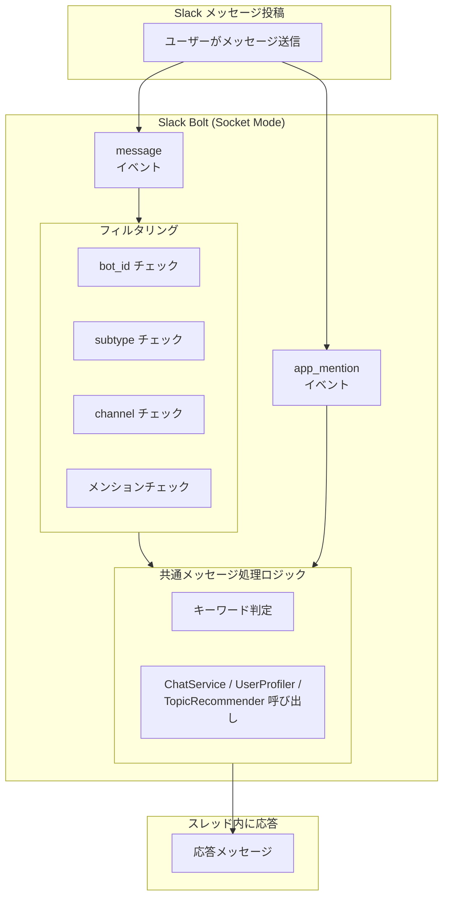

# F6: 特定チャンネル自動返信

## 概要

特定のSlackチャンネルでは、ボットへのメンションなしでも全ての投稿に対して自動的に返信する機能を提供する。これにより、専用の質問チャンネルや学習サポートチャンネルでの利便性が向上する。

## ユーザーストーリー

- ユーザーとして、特定のチャンネルではメンションせずに質問を投稿するだけで、ボットから返信を受け取りたい。
- 管理者として、自動返信を有効にするチャンネルを環境変数で設定したい。
- ユーザーとして、自動返信チャンネルでも通常のチャンネルと同様の機能（プロファイル確認、トピック提案など）を利用したい。

## 入出力仕様

### 入力

- Slackの `message` イベント（対象チャンネルのみ）
  - `event.text`: メッセージ本文
  - `event.user`: 送信者のSlack User ID
  - `event.channel`: チャンネルID
  - `event.thread_ts`: スレッドのタイムスタンプ（スレッド内の場合）
  - `event.ts`: メッセージのタイムスタンプ
  - `event.subtype`: メッセージのサブタイプ（編集、削除など）
  - `event.bot_id`: ボットが投稿した場合のBot ID

### 出力

- スレッド内にテキストメッセージで応答（新規投稿の場合は新しいスレッドを作成）

### 具体例

```
チャンネル: #learning-support (SLACK_AUTO_REPLY_CHANNELS に含まれる)

入力: "Pythonのリスト内包表記について教えて"
出力: (スレッド内で) "リスト内包表記は、リストを簡潔に生成するための構文です..."
      (アシスタントの性格設定に応じた口調で応答)
```

```
チャンネル: #general (SLACK_AUTO_REPLY_CHANNELS に含まれない)

入力: "Pythonのリスト内包表記について教えて"
出力: (応答なし — メンションがないため)
```

## 受け入れ条件

- [ ] AC1: `SLACK_AUTO_REPLY_CHANNELS` 環境変数で指定されたチャンネルの全メッセージに自動返信する
- [ ] AC2: Bot自身の投稿（`bot_id` が存在）には反応しない
- [ ] AC3: メッセージのサブタイプ（`message_changed`, `message_deleted` など）には反応しない
- [ ] AC4: 自動返信チャンネルでも既存の機能（プロファイル確認、トピック提案、フィードコマンドなど）が動作する
- [ ] AC5: 自動返信チャンネルでもスレッド内の会話履歴を保持し、文脈を踏まえた応答ができる
- [ ] AC6: `SLACK_AUTO_REPLY_CHANNELS` が未設定または空の場合、自動返信機能は無効になる
- [ ] AC7: `app_mention` イベントと `message` イベントが重複して発火した場合、二重応答しない

## 設定

### 環境変数

| 変数名 | 説明 | 例 |
|--------|------|-----|
| `SLACK_AUTO_REPLY_CHANNELS` | 自動返信を有効にするチャンネルIDのカンマ区切りリスト | `C0123456789,C9876543210` |

### 設定例（`.env`）

```bash
# 自動返信チャンネル（カンマ区切り）
SLACK_AUTO_REPLY_CHANNELS=C0123456789,C9876543210
```

## 使用LLMプロバイダー

**既存設定に準拠** — F1（チャット応答）と同じLLMプロバイダー設定（`CHAT_LLM_PROVIDER`）を使用

## 技術設計

### イベントハンドリング

```python
@app.event("message")
async def handle_message(event: dict, say: object) -> None:
    # 1. フィルタリング
    #    - bot_id がある → 無視（Bot自身の投稿）
    #    - subtype がある → 無視（編集、削除など）
    #    - channel が AUTO_REPLY_CHANNELS に含まれない → 無視

    # 2. メッセージ処理（handle_mention と同じロジック）
    #    - キーワード判定（プロファイル、トピック、フィードなど）
    #    - デフォルト: ChatService で応答
```

### 二重応答防止（AC7）

メンション付きメッセージが自動返信チャンネルで投稿された場合：

- `app_mention` イベントと `message` イベントの両方が発火する可能性がある
- **対策**: `message` ハンドラでメンションを検出した場合はスキップ（`app_mention` 側で処理される）

```python
# message ハンドラ内
if re.search(r"<@[A-Za-z0-9]+>", text):
    return  # メンション付きは app_mention で処理
```

### アーキテクチャ



## 関連ファイル

| ファイル | 役割 |
|---------|------|
| `src/slack/handlers.py` | messageイベントハンドラの追加 |
| `src/config/settings.py` | `slack_auto_reply_channels` 設定の追加 |
| `.env.example` | 環境変数の例を追加 |

## テスト方針

- `message` イベントでの自動返信動作をテスト
- Bot自身の投稿への非反応をテスト
- サブタイプ付きメッセージへの非反応をテスト
- 対象外チャンネルへの非反応をテスト
- メンション付きメッセージでの二重応答防止をテスト
- 既存機能（プロファイル、トピック、フィード）の動作をテスト

## 考慮事項

### セキュリティ

- 自動返信チャンネルはプライベートチャンネルも指定可能だが、Botがそのチャンネルに招待されている必要がある
- 環境変数でチャンネルを明示的に指定することで、意図しないチャンネルでの自動返信を防止

### パフォーマンス

- 高トラフィックチャンネルでの使用は避けることを推奨
- 必要に応じてレートリミット機能の追加を検討（将来拡張）

### 将来拡張

- チャンネルごとの応答設定（特定キーワードのみ反応など）
- 時間帯による自動返信のON/OFF
- ユーザーごとの自動返信除外設定
