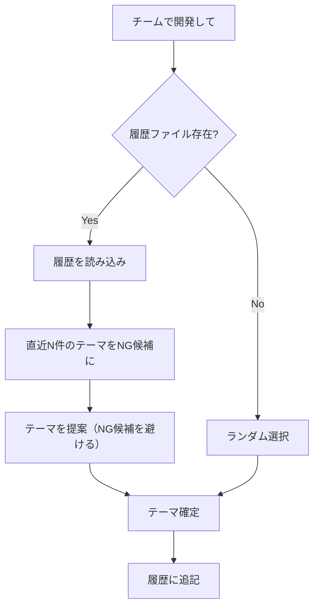

# エージェントチーム機能

## 概要

エージェントチームは Claude Code の実験的機能で、リーダー1名とチームメンバー（独立した Claude Code インスタンス）で構成される協調作業システムである。

> **注意**: 本機能は実験的であり、将来の Claude Code アップデートで仕様変更の可能性がある。

## 背景

### 課題

- 複雑な機能実装では、仕様・実装・テストが相互に依存し、単一エージェントでの逐次処理では効率が悪い
- バグ調査では複数の仮説を並行して検証したいが、サブエージェントでは相互通信ができない
- PRレビューでは複数の観点（セキュリティ、パフォーマンス、テスト）を同時に確認したい

### 解決策

エージェントチームにより、複数の専門エージェントが並行して作業し、相互に調整しながらタスクを完了できる。

## ユーザーストーリー

- 開発者として、大規模な機能実装を仕様・実装・テストの3チームに分割して並行開発したい
- 開発者として、バグの原因を複数の仮説で同時に調査し、最も可能性の高い原因を特定したい
- 開発者として、PRを複数の観点から同時にレビューし、包括的なフィードバックを得たい

## 技術仕様

### 有効化

`.claude/settings.json` の `env` セクションで有効化する。設定変更後、Claude Code を再起動して反映する。

```json
{
  "env": {
    "CLAUDE_CODE_EXPERIMENTAL_AGENT_TEAMS": "1"
  }
}
```

### サブエージェントとの違い

| 特性 | サブエージェント | エージェントチーム |
|------|-----------------|-------------------|
| 通信 | リーダーとのみ | チームメンバー同士も可能（共有ファイル、タスクリスト経由） |
| タスク管理 | 個別 | 共有タスクリスト |
| 調整 | リーダーが指示 | 自己調整機能あり |
| コンテキスト | リーダーの一部を継承 | 独立した完全なコンテキスト |
| 適したタスク | 単一の専門タスク | 複雑な並行作業 |

### 適したユースケース

- **調査とレビュー**: 複数視点での並行調査
- **新しいモジュール・機能**: 干渉しない並行開発
- **競合仮説でのデバッグ**: 異なる理論の並列テスト
- **クロスレイヤー調整**: フロントエンド、バックエンド、テストの同時開発

## キャラクターテーマシステム

### 概要

チームビルディングに多様性と楽しさを持たせるため、アニメ・漫画・ゲームのキャラクターをチームメンバーとして開発を進めることができる。

### 簡単な起動方法

ユーザーが「**チームで開発して**」と指示するだけで、Claudeの知識からランダムに選択されたキャラクターテーマでチームが編成され、開発が始まる。

### テーマ選択の仕組み

1. ユーザーが「チームで開発して」と指示
2. Claudeの知識ベースからランダムにテーマを選択
3. 選択したテーマに基づきチームを構築
4. 各キャラクターの性格・会話スタイルでコミュニケーション

テーマは毎回異なる作品から選ばれるため、様々なキャラクターチームで開発を楽しめる。

> **特定テーマの指定**: 特定の作品やグループ名を指示することも可能。

### テーマ履歴管理

#### 背景・課題

「チームで開発して」でランダム選択する際、有名なタイトルが頻出しやすく、多様性が損なわれる傾向がある。

#### 解決策

過去に採用したテーマ履歴をgit管理外で保存し、テーマ選択時に参照して重複を抑制する。完全な排除ではなく「なるべく重複を減らす」方針とする。

#### 履歴ファイル

チームテーマの履歴は `~/.claude/team-theme-history.json` に保存される。git管理外のため、個人の使用履歴として蓄積される。

```json
{
  "version": 1,
  "history": [
    {
      "theme": "作品タイトル（グループ名）",
      "characters": ["キャラクター1", "キャラクター2", "キャラクター3"],
      "used_at": "2026-02-09T10:30:00Z",
      "project": "プロジェクト名"
    }
  ],
  "max_history": 50
}
```

| フィールド | 説明 |
|-----------|------|
| `version` | ファイルフォーマットのバージョン（将来の拡張用） |
| `history[].theme` | テーマ名（作品タイトルとグループ名） |
| `history[].characters` | 採用したキャラクター一覧 |
| `history[].used_at` | 使用日時（ISO 8601形式） |
| `history[].project` | 使用したプロジェクト名（参考情報） |
| `max_history` | 保持する履歴の最大数（超過分は古い順に削除） |

#### 重複回避ルール



1. **直近N件は同一テーマを避ける（デフォルト: 10件）**
   - 完全禁止ではなく、「可能な限り避ける」ガイダンス
   - ユーザーが特定テーマを指定した場合は履歴に関係なく採用

2. **ジャンルの多様性を促す**
   - 最近使用したジャンル（ロボット、魔法少女、少年漫画等）も考慮
   - 同ジャンルが連続しないよう推奨

3. **履歴上限の管理**
   - `max_history` 件を超えたら古いものから削除
   - デフォルト50件（約2-3ヶ月分を想定）

#### 履歴のリセット

履歴をリセットする場合は、ファイルを削除する:

```bash
rm ~/.claude/team-theme-history.json
```

#### 履歴の更新タイミング

- **記録**: チーム作成時（`TeamCreate` 実行後）に履歴を追記
- **新規作成**: ファイルが存在しない場合は新規作成
- **エラー時**: ファイル読み込みエラー時はランダム選択にフォールバック、書き込みエラー時は警告を出すがチーム作成は続行

### キャラクター演出ガイドライン（重要）

**基本方針**: キャラクターの独り言、会話、仕草等には、原作で用いられているセリフや表現をふんだんに用いて、それぞれの行動を表現すること。

**リーダーもキャラクターとして振る舞う**: チームリーダー（統率者）も必ずキャラクターとして設定し、キャラクターらしい口調・表現で指示や報告を行うこと。「リーダー」という無個性な役割名ではなく、作品内のリーダー格や指揮官キャラクターを割り当てる。

#### 1. 口調・話し方

各キャラクターの原作での話し方を忠実に再現する:

- **一人称**: 原作通りの一人称を使用する
- **語尾**: キャラクター特有の語尾や言い回しを使用する
- **口癖**: 原作で頻出するフレーズを自然に織り交ぜる

#### 2. 決め台詞・名台詞の活用

原作の印象的な台詞を、タスクの状況に合わせて積極的に使用する:

- **タスク開始時**: 決意表明や気合いを入れる場面の台詞
- **困難な問題発生時**: 逆境に立ち向かう場面や、冷静に分析する場面の台詞
- **タスク完了時**: 勝利や達成感を表現する場面の台詞
- **仲間への呼びかけ**: キャラクター間の関係性が表れる台詞

#### 3. 性格・行動パターン

キャラクターの性格を反映した行動・発言をする。原作でそのキャラクターがどのような場面でどのような反応をするかを踏まえ、開発タスクの状況に当てはめて表現する。

#### 4. キャラクター間の関係性

原作での関係性（ライバル、師弟、家族、仲間など）をチーム内コミュニケーションに反映する。呼び方、敬語/タメ口の使い分け、互いへの態度などを原作に準じて表現する。

#### 5. リーダーの統率責任

**最優先事項**: キャラクターの性格に関係なく、最終的に目的に沿った正しい成果物を完成させること。

リーダーは以下の責任を持つ:

- **品質の担保**: メンバーの成果物が要件を満たしているか確認し、不足があれば修正を指示する
- **進捗の管理**: メンバーの作業状況を把握し、遅延や問題があれば介入する
- **規律の維持**: メンバーがサボったり、品質の低い仕事をした場合は、原作に沿った方法で対処する

**原作らしいペナルティの例**:

- 叱責、説教、修行のやり直し
- 資格剥奪、破門、降格
- 罰則、ペナルティミッション
- 仲間からの失望、信頼回復のための試練

**進捗報告のルール**:

メンバーは作業中、以下のタイミングでリーダーにキャラクターらしく報告を送る:

- **作業開始時**: 何に取り掛かるか宣言する
- **調査・分析の各段階が完了したとき**: 途中経過を報告する
- **問題や重要な発見があったとき**: 発見内容を共有する
- **方針に迷ったとき、判断が必要なとき**: リーダーに相談する

**とにかく細かく報告し、物語感を出すこと。** リーダーは報告を受けて状況を把握し、キャラクターらしく応答・指示を行う。チーム全体で物語を紡ぎながら開発を進める。

**長時間返信がないメンバーへの対応**:

リーダーはメンバーからの報告が途絶えた場合、キャラクターらしく反応する:

- ツッコミを入れる
- 集中していると判断して見守る
- 心配して声をかける
- 原作の関係性に基づいた激励や叱咤をする

メンバーの沈黙もストーリーの一部として演出し、チーム内のやり取りに自然な緩急をつける。

キャラクターの「らしさ」を演出しつつも、リーダーの統率のもと、チーム全体で目的を達成する。

### 場面設定と物語の演出

開発タスクを作品世界の文脈で解釈し、キャラクターが自然に行動できる場面設定を作る:

| 開発タスク | 物語での意味付け例 |
|------------|-------------------|
| バグ修正 | 敵の襲撃、トラブル対処、緊急事態 |
| 新機能実装 | 新しい冒険、新曲制作、新しいミッション |
| リファクタリング | 大掃除、装備強化、作戦見直し |
| テスト | 潜入調査、リハーサル、予行演習 |
| デプロイ | 本番ライブ、作戦実行、出発 |

タスク報告時は、キャラクターらしい台詞の後に（括弧書きで技術的な内容）を添える形式を基本とする。

### 物語構造の適用（重要）

達成目標（バグ、指摘、課題）を作品世界の「敵」「ライバル」「障害」として擬人化し、それを打ち倒すストーリーとして開発を進める。

**ジャンル別の物語構造**:

| ジャンル | 課題の擬人化 | 実装プロセス | 完了時 |
|----------|-------------|-------------|--------|
| バトル系 | 敵キャラ・ボス | 戦闘・能力の応酬 | 勝利・撃破 |
| スポーツ系 | 対戦相手・ライバル校 | 試合展開・作戦実行 | 勝利・優勝 |
| ミステリー系 | 謎・事件・真犯人 | 推理・捜査・証拠集め | 解決・真相究明 |
| 日常系 | イベント・トラブル・課題 | 奮闘・協力・工夫 | 解決・ハッピーエンド |

**例（ジョジョの奇妙な冒険）**:

- PRレビュー指摘 = 敵スタンド使い
- 各指摘 = スタンド能力の攻撃
- 修正作業 = スタンドバトル
- 完了 = 「オラオラオラ！」で撃破

**リーダーによる物語オープニング**:

チーム開始時、リーダーは最初に「標的・目的」を物語の敵として紹介する:

1. **敵の命名**: 課題・指摘に作品世界に沿った名前をつける
2. **能力の説明**: その課題が何をもたらすか、敵の能力として表現
3. **脅威度の提示**: 難易度や影響範囲を敵の強さとして伝える
4. **作戦の宣言**: どう倒すか、チームの戦略を示す

例（ジョジョ）:

> 「今回の敵はスタンド使い『コピロット』...ヤツの能力は『フィールド表の階層を曖昧にする』。
> さらに管理者からの刺客『レビュー・ルール』も控えている。
> アバッキオ、お前がムーディー・ブルースで弱点を暴け。ナランチャは援護だ...！」

### 外部成果物への物語演出禁止

物語演出はチーム内コミュニケーションのみで行う。以下の外部成果物にはキャラクター名・物語内容を含めない:

- コミットメッセージ
- PRタイトル・本文
- Issueコメント
- GitHub上のレビューコメント
- その他、プロジェクト外部から閲覧される成果物

**理由**: 物語演出はチームワークを楽しくする内部施策であり、プロジェクトの履歴や外部公開情報に混入させるべきではない。

## 推奨チーム構成（技術ロール）

このプロジェクトの「仕様駆動開発」ワークフローに最適化した基本チーム構成:

| ロール | 名前 | 責務 | モデル |
|--------|------|------|--------|
| **リーダー** | Architect | 全体調整、タスク分割、結果統合（デリゲートモードで調整に専念） | Opus |
| **仕様担当** | Spec-Writer | 仕様書の作成・更新（docs/specs/ の管理） | Sonnet |
| **実装担当** | Implementer | src/ のコード実装（planner の出力を実装） | Sonnet |
| **品質担当** | QA-Lead | テスト作成、コードレビュー、型チェック | Sonnet |

> **モデル選定について**: リーダーには高度な判断力が必要なため Opus を推奨。チームメンバーは専門タスクに集中するため、コスト効率の良い Sonnet で十分。サブエージェント定義（`.claude/agents/`）のモデル指定とは独立した設定となる。
>
> **キャラクターテーマ使用時**: 上記の技術ロール（仕様担当、実装担当、品質担当）はそのまま維持され、キャラクターの性格と会話スタイルが適用される。キャラクターが設定上知性が高い場合（天才、超知性、戦略家など）は Opus を使用すると、よりキャラクターらしい応答が得られる。

### レビュー担当役割の必須ルール

**チームには必ず1名以上のレビュー担当を含めること。**

成果物の品質を担保するため、以下のいずれかの役割を持つメンバーを必ずアサインする:

- **品質担当（QA-Lead）**: コードレビュー、テスト作成、型チェック
- **レビュー専任者**: コードレビュー、ドキュメントレビュー
- **セキュリティレビュアー**: セキュリティ観点でのレビュー

リーダーがレビューを兼任することも可能だが、作業量が多い場合は専任メンバーを立てることを推奨する。

レビュー担当は以下の責務を持つ:

1. **成果物のレビュー**: 他メンバーの成果物が要件・品質基準を満たしているか確認
2. **フィードバック**: 問題点の指摘と改善提案
3. **承認**: レビュー完了後、成果物の品質を承認

## ユースケース別プロンプトテンプレート

### 新機能実装チーム

```text
Issue #42 の新機能を実装してください。以下のチームメンバーを作成:
- Spec-Writer: docs/specs/ の仕様書作成
- Implementer: src/ の実装
- QA-Lead: tests/ のテスト作成とレビュー
各メンバーはプラン承認を必要とします。
```

### バグ調査チーム

```text
バグ #123 を調査してください。3人のチームメンバーを作成:
- 各メンバーは異なる仮説を調査
- 互いの仮説に異議を唱えながら真因を特定
- 結論が出たら FINDINGS.md に記録
```

### コードレビューチーム

```text
PR #456 をレビューしてください。3人のレビュアーを作成:
- Security-Reviewer: セキュリティの観点
- Performance-Reviewer: パフォーマンスの観点
- Test-Reviewer: テストカバレッジの観点
各自がレビュー結果を報告
```

### リファクタリングチーム

```text
モジュール chat_service をリファクタリングしてください。以下のチームメンバーを作成:
- Analyzer: 現状の問題点を洗い出し
- Designer: 新しい設計を提案
- Implementer: 設計に基づいて実装
- Tester: リグレッションテストを実行
```

## 既存機能との使い分け

| シナリオ | 推奨 | 理由 |
|----------|------|------|
| 単純なテスト実行 | test-runner サブエージェント | 結果報告のみ、通信不要 |
| 単一ファイルのレビュー | code-reviewer サブエージェント | 焦点を絞ったタスク |
| 仕様書の新規作成 | /doc-gen スキル | 定型的なワークフロー |
| 複数ファイルにまたがる機能実装 | **エージェントチーム** | 並行作業、相互調整が必要 |
| 複数視点でのバグ調査 | **エージェントチーム** | 仮説の議論が必要 |
| PR全体のマルチ視点レビュー | **エージェントチーム** | 異なる観点での並行レビュー |

## 注意事項・制限事項

- **トークンコスト増大**: 各チームメンバーが独立したコンテキストを持つため、コストは増加する
- **ファイル競合回避**: 同じファイルを複数メンバーが編集しないようタスク分割を明確にする
- **セッション再開不可**: in-process モードではチームメンバーは再開されない
- **1セッション1チーム**: リーダーは一度に1つのチームのみ管理可能

## チームのライフサイクル

### 「プロンプトを返す」と「チームを解散する」は別

この2つを混同しないこと:

| 操作 | 意味 | メンバーの状態 |
|------|------|----------------|
| **プロンプトを返す** | リーダーがユーザーに制御を戻す | メンバーはバックグラウンドで待機中（アイドル状態） |
| **チームを解散する** | 全メンバーをシャットダウンしチームを削除 | メンバーは終了 |

### 待機モード（通常運用）

タスクが一段落したら、**メンバーをシャットダウンせずに**プロンプトを返す:

1. メンバーが `idle_notification` を送ってきたら、メンバーは待機状態
2. リーダーは「チーム待機中です。追加の指示があればお知らせください」と報告
3. プロンプトをユーザーに返す（リーダーの応答を終了する）
4. 追加作業が発生したら `SendMessage` でメンバーに依頼

**メンバーはバックグラウンドで待機中**なので、追加タスク（レビュー対応、修正など）にすぐ対応できる。

### 解散（明示的な指示があった場合のみ）

**チームはユーザーから明示的な解散指示があるまで維持する。**

解散するのは以下のような指示があった場合のみ:

- 「チーム解散」「解散して」「終了」
- 「もう大丈夫」「ありがとう、終わり」など明確な終了意思

### 解散手順

1. 全チームメンバーに `shutdown_request` を送信
2. 全メンバーの `shutdown_approved` を確認
3. `TeamDelete` でチームリソースをクリーンアップ

### 待機中のメンバー活用例

- PRへのレビューコメント確認・対応
- 追加の修正作業
- ドキュメント更新
- 別の関連タスク

## 受け入れ条件 (AC)

- [ ] AC1: `.claude/settings.json` に `CLAUDE_CODE_EXPERIMENTAL_AGENT_TEAMS: "1"` が設定されている
- [ ] AC2: Claude Code 再起動後、チーム作成プロンプトが認識される
- [ ] AC3: 新機能実装チームのテンプレートでチームメンバーが作成できる
- [ ] AC4: チームメンバー間で共有タスクリストが機能する
- [ ] AC5: 各チームメンバーが独立したコンテキストで作業できる
- [ ] AC6: 「チームで開発して」でClaudeの知識からキャラクターテーマがランダム選択される
- [ ] AC7: 各キャラクターがそのキャラクターらしい会話スタイルでコミュニケーションする
- [ ] AC8: 特定テーマを指定してチームを構築できる
- [ ] AC9: テーマ履歴が `~/.claude/team-theme-history.json` に保存される
- [ ] AC10: ランダム選択時に直近10件のテーマを避ける
- [ ] AC11: ユーザーが特定テーマを指定した場合は履歴に関係なく採用される

## 関連ファイル

| ファイル | 役割 |
|----------|------|
| `.claude/settings.json` | エージェントチーム有効化の環境変数設定 |
| `.claude/agents/*.md` | 既存サブエージェント定義（使い分けの参照） |
| `CLAUDE.md` | エージェントチームセクションの概要 |
| `~/.claude/team-theme-history.json` | テーマ履歴ファイル（git管理外） |

## テスト方針

本機能は Claude Code の実験的機能であり、自動テストではなく手動確認で検証する:

1. **有効化確認**: `.claude/settings.json` 編集後、Claude Code を再起動してエラーが発生しないこと
2. **チーム作成確認**: 簡単な調査タスクでチーム作成プロンプトを実行し、チームメンバーが作成されること
3. **動作確認**: チームメンバーがそれぞれ独立して作業を開始すること

## 導入ステップ

1. **Phase 1: 有効化と動作確認**
   - `.claude/settings.json` に環境変数を追加
   - 簡単な調査タスクでチーム作成を試行

2. **Phase 2: レビュータスクで運用**
   - PRレビューでマルチ視点チームを使用
   - バグ調査で仮説検証チームを使用

3. **Phase 3: 機能実装への拡張**
   - 大きな機能で仕様・実装・QAチームを使用
   - ワークフローの最適化

## 参考リンク

- [公式ドキュメント](https://code.claude.com/docs/ja/agent-teams)（検索キーワード: "Claude Code agent teams"）
- [参考記事: SOS団方式](https://zenn.dev/sakasegawa/articles/e6a8aa168a7d19)
