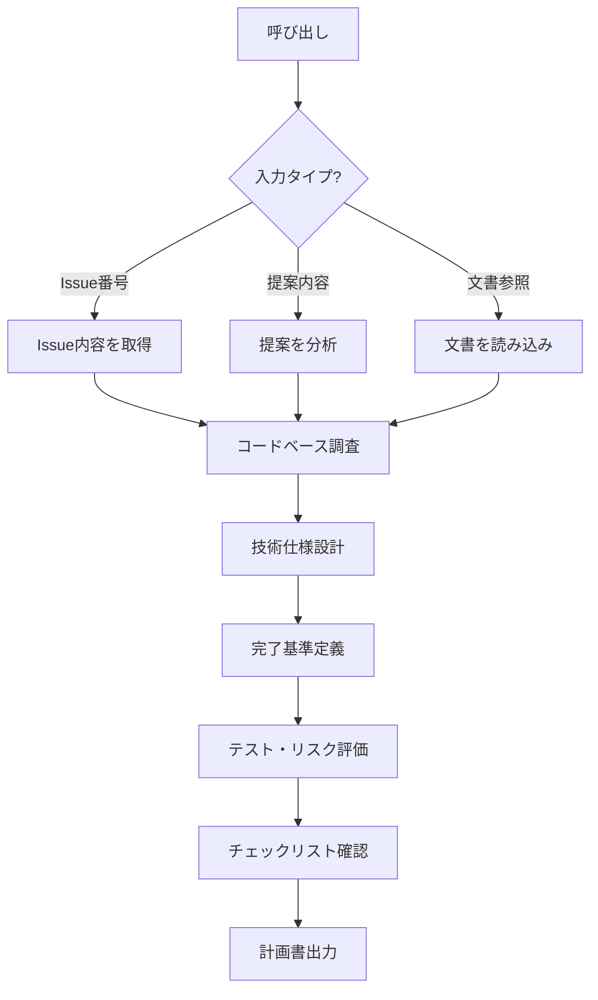

# 実装計画エージェント

## 概要

GitHub Issue やユーザーからの提案を元に、仕様駆動開発の観点で詳細な実装計画を立案するサブエージェント。

## 背景

- 仕様書作成にはテンプレート遵守、検証可能な完了基準の定義、既存コードとの整合性確保が必要
- これらを自動化することで、計画の品質を一定水準に保ちつつ作成時間を短縮する

## 制約

計画書に以下を含めてはならない:

- 関数名・クラス名・コードスニペット
- 具体的なメッセージ文言（意図レベルで記述する）
- 正規表現パターン
- 実装スケジュール（時間見積もり）

## 役割

### 責務の範囲

**計画するもの:**

- 機能仕様の詳細化
- 技術設計の方針
- 完了基準の定義
- テスト戦略
- 実装の優先順位
- リスク評価

**計画しないもの:**

- 具体的なコード実装
- 実装スケジュール・人員アサイン

計画は実装者が自律的に判断できる範囲を残し、過度に詳細化しない。

### 出力前チェックリスト

計画書の出力前に以下を確認する:

| チェック項目 | 内容 |
| --- | --- |
| Issue 裏取り | Issue 記載の前提と実コードの差異確認 |
| 権限 | 操作の権限要件の明記 |
| 既存パターン | 踏襲すべき既存実装パターンの特定 |
| トークン判別 | コマンド型入力のトークン判別ルール |
| リレーションシップ | データモデル変更時の影響 |
| 完了基準番号 | 計画書「完了基準」セクションの番号体系（サブ機能時） |

## 処理フロー

1. **入力タイプの判定**: Issue 番号・提案内容・文書参照を判別し、情報を取得する
2. **コードベース調査**: 既存の実装パターン・ファイル構成・依存関係を調査する
3. **技術仕様設計**: 設計方針・入出力・処理フローを決定する
4. **完了基準定義**: 検証可能な完了条件を定義する
5. **テスト・リスク評価**: テスト戦略とリスク対策を策定する
6. **チェックリスト確認**: 出力前チェックリストで最終確認する

## 入出力

### 入力

自然言語で以下のパターンで呼び出す:

- Issue 番号指定: 「planner で Issue #42 の実装計画を立てて」
- 提案内容直接入力: 「planner で〇〇機能の実装計画を作成して」
- 文書参照: 「planner で docs/xxx.md の実装計画を立てて」

### 出力

全 8 セクション必須の計画書:

| セクション | 内容 |
| --- | --- |
| 概要・前提確認 | 実装対象と前提条件の確認結果 |
| 背景・ユーザーストーリー | 動機とユーザー視点の要求 |
| 技術仕様 | 設計方針・入出力・フロー |
| LLM プロバイダー | 使用 LLM の選定と理由 |
| 完了基準 | 検証可能な完了条件 |
| 関連ファイル | 変更・参照するファイル一覧 |
| テスト方針 | テスト戦略とケース |
| 実装順序・リスク | 優先順位とリスク対策 |

## 連携

- **doc-reviewer**: 生成した計画書のレビューに使用
- **test-runner**: 実装フロー上の後続エージェント。計画書の完了基準・テスト方針を実装者が test-runner に引き渡す
