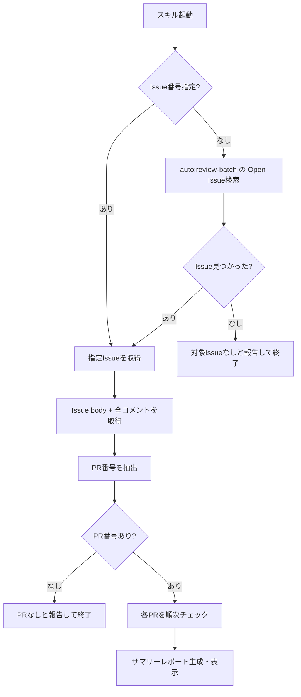

# 自動マージ Issue 確認スキル

## 概要

`auto:review-batch` ラベル付き Issue に記録された PR を一括チェックし、各 PR の対応概要・問題点・動作確認事項をサマリーレポートとして報告するスキル。

## 背景

- 自動マージパイプラインでは、PR マージ後にレビュー Issue へ PR 情報がコメントとして蓄積される
- PR 数が増えると個別確認の手間が大きいため、一括解析によるサマリーレポートで管理者の品質確認を効率化する

## コマンド体系

| コマンド | 用途 |
| --- | --- |
| `/check-review-batch` | `auto:review-batch` ラベルの Open Issue を自動検索してチェック |
| `/check-review-batch <Issue番号>` | 指定 Issue に対してチェック |

## 処理フロー

### PR 番号の抽出

Issue body およびコメントから PR 番号を抽出する。コメントフォーマットは `update-review-issue.sh` の出力形式に準拠する。

### 各 PR のチェック項目

| チェック項目 | 内容 |
| --- | --- |
| 対応概要 | PR タイトル、変更ファイル一覧、変更種別 |
| 変更内容の分析 | PR 差分を読み、変更内容を要約 |
| 問題点の検出 | セキュリティ懸念、エラーハンドリング不備、テスト不足、既存機能への影響 |
| 動作確認事項 | 変更ファイルのパスに基づき、手動確認すべき項目を判定 |

### 動作確認事項の判定

変更ファイルのパスに基づいて自動判定する:

| 変更パス | 動作確認事項 |
| --- | --- |
| `src/services/`, `src/bot/` | Bot 起動確認、該当機能の動作確認 |
| `src/utils/` | 関連する機能の動作確認 |
| `.github/workflows/` | 次回トリガー時にワークフロー動作確認 |
| `config/`, `pyproject.toml` | Bot 起動確認、設定・依存関係の反映確認 |
| `docs/` のみ、`CLAUDE.md` のみ | 動作確認不要 |

## 入出力

### 入力

| 入力 | 形式 |
| --- | --- |
| `/check-review-batch` | 引数なし。Open Issue を自動検索 |
| `/check-review-batch <Issue番号>` | 対象 Issue を直接指定 |

対象 Issue が見つからない場合、PR 番号が抽出できない場合はエラーメッセージを表示する。

### 出力

PR ごとに以下を含むサマリーレポートを表示する:

- 各 PR: 対応概要、変更内容の要約、問題点、動作確認事項
- 総評: チェック PR 数、問題点検出数、動作確認必要数
- 確認完了後の Issue クローズ案内

## 関連ドキュメント

- `workflows/github/auto-progress` — 自動進行管理
