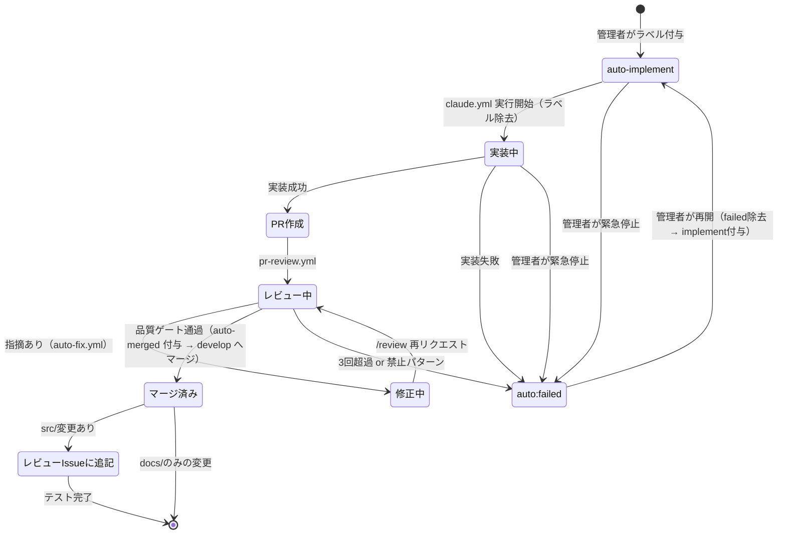
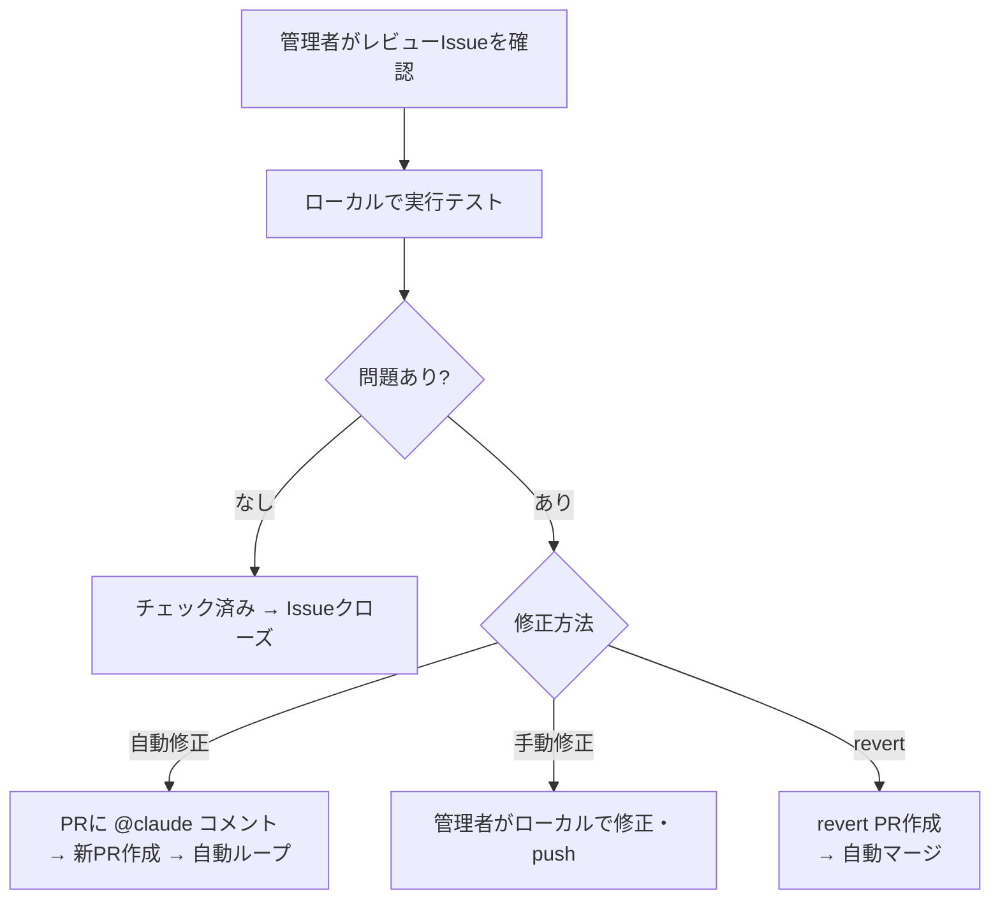

# 自動進行管理（auto-progress）

## 概要

IssueからPRマージまでの全工程を自動化するパイプライン。管理者がIssueに `auto-implement` ラベルを貼るだけで、仕様確認・実装・PR作成・レビュー・指摘対応・マージまでを自律的に実行する。

**コンセプト**: 「管理者はIssueにラベルを貼るだけ、朝にはマージ済み」

## 背景

- 管理者1名体制のため、人間のチェック（レビュー確認・マージ判断等）がボトルネック
- 既存の `@claude` メンション方式は手動トリガーが前提
- PRレビュー後の指摘対応→再レビュー→マージの繰り返しサイクルが特に遅延の原因

## ユーザーストーリー

- 管理者として、Issueに `auto-implement` ラベルを貼るだけで実装からマージまで自動で進めてほしい
- 管理者として、自動処理をいつでも `auto:failed` ラベルで停止できる安全弁がほしい
- 管理者として、自動マージされたPRの品質が手動時と同等であることを確認したい

## ブランチ戦略

### 概要

簡易 git-flow（develop + main）を採用する。自動パイプラインのマージ先を develop にすることで、main（本番）の安定性を保証する。

### ブランチの役割

| ブランチ | 役割 | マージ方式 |
|---------|------|-----------|
| `main` | 本番（プロダクション）。常に安定版 | develop からの手動マージ |
| `develop` | ステージング。自動マージ先。feature ブランチのベース | feature ブランチからの自動マージ |
| `feature/*` | 機能開発ブランチ。develop から分岐 | develop へのPRマージ |

### 採用理由

- **自動マージの安全弁**: develop が「サンドボックス」として機能し、自動マージで何か壊れても main に影響しない
- **ロールバックが容易**: develop で revert すれば OK。main はまだ更新されていない
- **リリースの一括確認**: develop → main のリリース PR で全変更をまとめてレビュー可能
- **変更コストが軽微**: CLAUDE.md の Git 運用ルール変更 + GitHub 設定のみ

### ブランチ保護ルール

**develop ブランチ（自動マージのサンドボックス）:**

| 設定 | 値 | 理由 |
|------|-----|------|
| Require a pull request before merging | YES | 直 push 禁止 |
| Require status checks to pass | YES | CI 必須（pytest, mypy, ruff, markdownlint） |
| Require approvals | NO | 自動マージを許可するため |
| Require linear history | YES | squash merge で履歴を綺麗に |
| Include administrators | NO | 管理者は緊急時にバイパス可能 |
| Allow auto-merge | YES | 自動マージを許可 |

**main ブランチ（プロダクション安定版）:**

| 設定 | 値 | 理由 |
|------|-----|------|
| Require a pull request before merging | YES | 直 push 禁止 |
| Require status checks to pass | YES | CI 必須 |
| Require approvals | YES (1名) | 管理者の承認必須 |
| Require linear history | YES | squash merge で履歴を綺麗に |
| Include administrators | YES | 管理者も保護対象 |
| Allow auto-merge | NO | 手動マージのみ |

### リリースフロー（develop → main）

**Phase 0-1: 手動リリース**（推奨頻度: 週1回）

管理者がローカルで実行テスト確認後、コマンド 1 つでリリース:

```bash
gh pr create --base main --head develop \
  --title "Release: vX.Y.Z" \
  --body "develop の変更を main にリリース"
```

main 向き PR が作成 → pr-review.yml で自動レビュー → 管理者がマージ

**main への自動マージは手動維持**。将来的に自動化する場合も、GitHub 通知で猶予期間（「30分以内に auto:failed がなければ自動マージ」）を設ける。

### ワークフローへの影響

| ファイル | 変更 | 内容 |
|---------|------|------|
| `claude.yml` | YAML 変更なし | CLAUDE.md で `gh pr create --base develop` を指示 |
| `pr-review.yml` | 変更不要 | 既に動的にベースブランチを解決済み |
| `auto-fix.yml` | 変更不要 | `gh pr merge` は PR のベースブランチに自動マージ |
| GitHub 設定 | Default branch を develop に変更 | `Settings > General > Default branch` |

## 全体フロー

```mermaid
flowchart TD
    A[Issue作成] --> B{auto-implement<br/>ラベル付与}
    B -->|管理者が付与| C[claude.yml: 自動実装開始]
    C --> D{仕様書あり?}
    D -->|あり| D2{AC定義済み?}
    D2 -->|あり| E[仕様書に従い実装]
    D2 -->|なし| D3[ACを追加]
    D3 --> E
    D -->|なし| D4{Issue具体的?}
    D4 -->|具体的| F[/doc-gen spec で仕様書自動生成]
    F --> E
    D4 -->|曖昧| F2[不明点をコメント<br/>auto:failed 付与]
    E --> G[テスト・品質チェック]
    G --> H[PR作成]
    H --> I[pr-review.yml: 自動レビュー]
    I --> J{指摘あり?}
    J -->|あり| K[auto-fix.yml: 自動修正]
    K --> L[Resolve conversation]
    L --> M[/review 再リクエスト]
    M --> I
    J -->|なし| N{品質ゲート通過?}
    N -->|全条件クリア| O[自動マージ → develop]
    N -->|条件未達| P[auto:failed ラベル付与]
    J -->|3回超過| P

    O --> R{実行テスト必要?}
    R -->|必要| S[レビューIssueに追記]
    R -->|不要| Q
    S --> Q[post-merge.yml: 次Issue選定]
    Q --> B

    O --> T{develop → main<br/>リリース}
    T -->|手動| U[管理者がリリースPR作成]

    style O fill:#0d0,color:#fff
    style P fill:#d00,color:#fff
    style F2 fill:#d876e3,color:#fff
    style S fill:#C2E0C6,color:#000
    style T fill:#1D76DB,color:#fff
    style U fill:#0E8A16,color:#fff
```

## 自動設計フェーズ

仕様書がないIssueや、ざっくりとしたIssueに対して、実装前に自動で仕様書を作成するフェーズ。

### 判断フロー

```mermaid
flowchart TD
    A[claude.yml 起動] --> B[Issue内容分析<br/>タイトル・本文・コメント]
    B --> C{docs/specs/ に<br/>対応する仕様書あり?}
    C -->|あり| D{ACが定義済み?}
    D -->|あり| E[実装へ進む]
    D -->|なし| F[ACを追加して実装へ]
    C -->|なし| G{Issue の具体性判定}
    G -->|具体的| H[/doc-gen spec で仕様書自動生成]
    H --> E
    G -->|曖昧| I[auto:failed 付与<br/>不明点をIssueにコメント<br/>停止して人間の追記を待つ]

    style E fill:#0d0,color:#fff
    style I fill:#d876e3,color:#fff
```

### 仕様書の存在チェック

以下の順序で仕様書の有無を判定する:

1. Issueの本文・コメントに `docs/specs/` へのパス参照があるか
2. Issue番号に紐づく仕様書があるか（`docs/specs/` 内を検索）
3. Issueタイトルのキーワードで `docs/specs/` を照合

### Issue具体性の判定基準

**具体的と見なす条件（いずれかを満たす）:**

- Issueに入出力の例が書かれている
- 既存の類似機能が特定でき、差分が明確
- 「〇〇を△△に変更する」のような具体的な変更指示
- バグ修正で再現手順が書かれている

**曖昧と見なす条件（いずれかに該当）:**

- 「〇〇の検討」「〇〇を改善」のみで具体策がない
- 複数の異なる要求が1つのIssueに混在
- 外部サービスとの連携で仕様が未確定
- 「どうするか考えて」系の検討Issue

**曖昧判定時のIssueコメント内容:**

- 判定理由（上記のどの条件に該当したか）
- 不足している情報の具体例（「入出力例を追記してください」「複数の要求を別Issueに分割してください」等）
- `auto:failed` ラベルを付与した旨と、情報追記後に再トリガーする方法

### ざっくり Issue からの仕様書自動生成

「〇〇機能を追加して」レベルの Issue であっても、Claude は以下の手順で仕様書を組み立てる:

1. **Issue 内容の解析**: タイトル・本文・全コメントから要求の意図を抽出
2. **既存コードベースの調査**: `src/`, `docs/specs/`, `tests/` を検索し、類似機能・関連機能を特定
3. **既存パターンの踏襲**: 類似機能の仕様書（AC構成、入出力形式）を参考にして新仕様書のフォーマットを決定
4. **`/doc-gen spec` の実行**: Issue から収集した情報と既存コードの調査結果を基に仕様書を自動生成
5. **AC の定義**: 正常系・異常系・境界値を網羅した受け入れ条件を自動生成

**具体例:**

- Issue:「Feed追加はURLだけですませたい」（#241）
  - Claude の解釈: 現在のフィード追加フローを調査 → URL入力のみで RSS 自動検出・タイトル自動取得する機能を設計
  - 参考にする既存仕様: `docs/specs/f2-feed-collection.md`
  - 生成する仕様書: `docs/specs/f2.X-feed-url-only.md`（既存機能のサブ仕様）

- Issue:「Slack返信のMarkdown装飾が正しく表示されない」（#89）
  - Claude の解釈: バグ修正。Slack API の mrkdwn 形式と Markdown の差異を調査
  - 生成する仕様書: バグ修正の場合は既存仕様への AC 追加で対応（新規仕様書不要の場合あり）

### 自動生成する仕様書の扱い（事後拒否権モデル）

仕様書の事前承認ステップは設けない。デフォルトは「進む」、止めたい時だけ管理者が `auto:failed` で停止する。

**フロー:**

1. `/doc-gen spec` で仕様書を自動生成
2. **停止せずそのまま実装に進む**
3. 仕様書はPRに含めてコミット（変更追跡可能）
4. PR作成時の GitHub 通知で管理者に自動的に届く
5. 管理者は通知を見て、問題があれば `auto:failed` で停止

**事後拒否権の仕組み:**

- 仕様書の品質チェックはPR作成後の自動レビュー（pr-review.yml）で実施
- 管理者は GitHub 通知（PR作成）で仕様書を確認し、方向性が間違っていれば `auto:failed` で停止
- 問題がなければ何もしなくてよい（デフォルトで進行）

**事前承認を不要とする理由:**

- 承認ステップがボトルネックになる（管理者1名体制の課題がそのまま残る）
- 仕様書はPRに含まれるため、自動レビューで品質保証可能
- `auto:failed` による事後停止で十分な安全性を確保できる

## ラベル設計

### ラベル一覧

| ラベル | 色 | 用途 | 付与タイミング |
|--------|-----|------|--------------|
| `auto-implement` | `#0E8A16` (緑) | 自動実装トリガー | 管理者が手動 |
| `auto-merged` | `#1D76DB` (青) | 自動マージ済みマーカー（post-merge.yml の発火条件） | auto-fix.yml がマージ直前に付与 |
| `auto:failed` | `#d73a4a` (赤) | 自動処理の失敗・停止（緊急停止にも使用） | 各ワークフロー失敗時 or 管理者が手動 |
| `auto:review-batch` | `#C2E0C6` (薄緑) | 自動マージレビューバッチIssue | post-merge.yml |

**設計方針**: ラベルは最小限に抑え、Phase 2 で必要になったら追加する。自動処理の状態は GitHub Actions の実行状態で把握できるため、中間状態ラベル（`auto:in-progress` 等）は不要。`auto:failed` は失敗と緊急停止の両方をカバーする（旧 `auto:hold` の機能を統合）。ラベルなし = 自動処理対象外（旧 `skip-auto` に相当）。

### ラベル状態遷移



## ワークフロー構成

### 一覧

| ファイル | 状態 | トリガー | 役割 |
|----------|------|---------|------|
| `claude.yml` | 既存改修 | `issues[labeled]` 追加 | `auto-implement` ラベルで自動実装開始 |
| `pr-review.yml` | 据え置き | 変更なし | PR自動レビュー |
| `auto-fix.yml` | 新規 | `workflow_run[completed]`（pr-review.yml） | レビュー指摘の自動修正 + マージ判定 |
| `post-merge.yml` | 新規 | `pull_request[closed]` | マージ後の次Issue自動ピックアップ + 実行テスト通知 |

### claude.yml 改修内容

**変更点:**

1. **トリガー追加**: `issues` イベントに `labeled` アクションを追加
2. **if 条件追加**: 既存の `@claude` メンション判定に加え、以下の条件を OR で追加:
   - `issues` イベントの `labeled` アクション
   - 付与されたラベルが `auto-implement`
   - `auto:failed` ラベルが付いていない（停止中は発火しない）
3. **既存機能への影響なし**: `@claude` メンションによる手動トリガーは従来通り動作

### auto-fix.yml 設計

**トリガー条件:**

- イベント: `workflow_run[completed]`（pr-review.yml の完了時）
- 発火条件:
  1. pr-review.yml が `completed`（成功/失敗問わず）
  2. 対象PRに `auto:failed` ラベルが付いていない
- 理由: pr-review.yml の全レビュアー（prt-* ツール群）がコメント投稿を完了してから auto-fix を開始するため。`issue_comment` トリガーではコメント逐次投稿による早期発火のリスクがある
- 同時実行制御: workflow_run から対象PR番号を取得し、PR番号ごとの concurrency グループで制御（cancel-in-progress: false）

**対象レビューツール:**

- auto-fix ループの修正対象は pr-review.yml が実行する prt-* ツール群のインラインコメントのみ
- GitHub 組み込みの Copilot PR Reviewer は auto-fix ループの対象外（GitHub 側の制御であり、投稿タイミングを管理できないため）
- Copilot の指摘は管理者が手動確認、または自動ループ安定後に再導入を検討

**処理フロー:**

1. **対象PR特定**: workflow_run イベントのペイロードから、トリガー元の pr-review.yml が処理したPR番号を取得
2. **ループ回数チェック**: PR内の `github-actions[bot]` による「レビュー指摘への自動対応」コメント数をカウント。3回以上なら上限到達
3. **レビュー結果判定（GraphQL unresolvedスレッド方式）**: GraphQL API で PR の reviewThreads を取得し、isResolved == false のスレッド数で指摘の有無を判定
4. **禁止パターンチェック**: PRの変更ファイルを走査し、禁止パターン（`CLAUDE.md`, `.claude/settings.json`, `.env*`, `pyproject.toml` の dependencies 変更）に該当するか判定。`.github/workflows/*` は develop 向き緩和により対象外
5. **分岐処理**:
   - ループ上限到達 + 指摘あり → `auto:failed` 付与 + PRコメントで通知
   - 禁止パターン検出 → `auto:failed` 付与 + PRコメントで通知
   - 指摘あり + 上限未到達 → `claude-code-action` で `/check-pr` を実行し自動修正 → 対応済みスレッドを `resolveReviewThread` で resolve → `REPO_OWNER_PAT` で `/review` コメント投稿（再レビュートリガー）
   - 指摘なし + 禁止パターンなし → マージ判定へ
6. **マージ判定**: 4条件（レビュー指摘ゼロ、CI全通過、コンフリクトなし、`auto:failed` なし）を全て確認
7. **自動マージ**: 条件クリアで `auto-merged` ラベルを付与した後、`gh pr merge --merge` を `REPO_OWNER_PAT` で実行
   - `auto-merged` ラベルは post-merge.yml の発火条件
   - ※ ラベル付与は Phase 1（auto-fix.yml）実装時に `merge-or-dryrun.sh` に追加予定

**エラー時の共通挙動:**

- 全ステップで失敗時は `auto:failed` ラベル付与 + PRコメントで理由を通知
- 通知内容: 失敗したステップ名、エラー概要、GitHub Actions 実行ログへのリンク
- GitHub API エラー（レート制限、権限不足、ネットワーク障害等）は即座に `auto:failed` で停止（リトライしない）
- 実装の詳細（`set -euo pipefail`、ロギングレベル等）はYAML実装時に定義

**使用シークレット:**

| シークレット | 用途 |
|-------------|------|
| `CLAUDE_CODE_OAUTH_TOKEN` | claude-code-action の認証 |
| `REPO_OWNER_PAT` | `/review` コメント投稿（ワークフロー連鎖）+ 自動マージ実行 |
| `GITHUB_TOKEN` | その他のGitHub API操作（ラベル付与、PRチェック等） |

## Resolve conversation 自動化

### 概要

PRレビューの「Resolve conversation」を GitHub GraphQL API で自動実行する。check-pr スキルの指摘対応後に、対応済みスレッドを自動的に resolve する。

### 技術仕様

**未解決スレッドの取得:**

```bash
gh api graphql -f query='
{
  repository(owner: "{owner}", name: "{repo}") {
    pullRequest(number: $PR_NUMBER) {
      reviewThreads(first: 100) {
        nodes {
          id
          isResolved
          comments(first: 10) {
            nodes {
              author { login }
              body
              path
              line
            }
          }
        }
      }
    }
  }
}'
```

**スレッドの resolve:**

```bash
gh api graphql -f query='
mutation($threadId: ID!) {
  resolveReviewThread(input: { threadId: $threadId }) {
    thread { isResolved }
  }
}' -f threadId="$THREAD_ID"
```

### エラー時の挙動

- 個別スレッドの resolve 失敗は `::warning::` でログし、次のスレッドに継続（1件の失敗で全体を止めない）
- 全スレッドの resolve が失敗した場合は `::error::` でログ（`auto:failed` は付与しない。再レビューで再検出されるため）
- GraphQL レスポンスの `errors` フィールドをチェックし、エラー内容をログに記録

### 組み込み箇所

check-pr スキル（`.claude/skills/check-pr/SKILL.md`）のステップ11（対応コメント投稿）の後に追加:

> 11.5. 対応済みスレッドの resolve: 修正が完了した指摘のレビュースレッドを `resolveReviewThread` mutation で resolve する

### 自動ループでのタイミング

```
レビュー指摘検出 → Claude が /check-pr で修正 → コミット & push
→ 対応コメント投稿 → 対応済みスレッドを resolve → /review 再リクエスト
→ 再レビュー（resolve済みスレッドは対象外）
```

## 安全弁設計

### 多層防御（9層）

**第1層: ループ回数制限**

- レビュー→修正ループは最大3回まで
- 超過時は `auto:failed` ラベル付与 + PRコメントで通知

**第2層: 禁止パターン（自動マージ不可ファイル）**

以下のファイルが変更に含まれるPRは `auto:failed` ラベルを付与し、自動マージしない:

| パターン | 理由 | develop 向き緩和 |
|---------|------|-----------------|
| `CLAUDE.md` | Claude自身の動作ルール変更 | 不可（常に禁止） |
| `.github/workflows/*` | CI/CD設定の変更 | 可（develop へのマージは許可） |
| `.claude/settings.json` | Claude Code設定の変更 | 不可（常に禁止） |
| `.env*` | 環境変数・シークレット | 不可（常に禁止） |
| `pyproject.toml` の dependencies | 依存パッケージ変更 | 不可（常に禁止） |

**develop 向き緩和の理由**: `.github/workflows/*` の変更は develop にマージしても即座にプロダクションに影響しない。リリースPR（develop → main）時に管理者が確認できるため、develop への自動マージは許可する。ただし main への直接自動マージは引き続き禁止。

**注記**: リリースPR（develop → main）は管理者が手動で作成・マージするため、auto-fix.yml の処理対象外。ワークフロー変更を含む場合でも、リリースPRでの人間レビューが安全弁として機能する。

**第3層: `auto:failed` ラベル（緊急停止ボタン兼用）**

- Issue/PRに `auto:failed` ラベルを付与すると全自動処理が即停止
- 自動処理の失敗時にも自動付与される
- 全ワークフローの if 条件で最初にチェックされる
- 管理者が手動で除去し、`auto-implement` を再付与すると再開

**第4層: concurrency グループ**

- PR番号ごとの concurrency グループで同じPRに対する同時実行を防止
- `cancel-in-progress: false`（進行中のジョブはキャンセルしない）

**第5層: マージ前4条件チェック**

自動マージ実行前に以下を全て確認:

1. レビュー指摘ゼロ
2. CI全チェック通過
3. コンフリクトなし
4. `auto:failed` ラベルなし

**第6層: ブランチ保護ルール（2層構成）**

- **develop**: PR必須 + CI必須。承認不要（自動マージ許可）
- **main**: PR必須 + CI必須 + 承認必須。手動マージのみ
- 自動マージは develop にのみ実行。main への直接自動マージは禁止

**第7層: ロールバック準備**

- 自動マージ後に develop のテストが壊れた場合、revert PRを作成
- main はリリースPR経由でのみ更新されるため、develop で revert すれば main は無傷

**第8層: 段階的信頼（導入時の安全策）**

- ドライラン → docs限定 → 全面解禁の段階的な移行
- develop ブランチの採用により、全面解禁時のリスクが軽減（main への影響はリリースPRで制御）

**第9層: リリースPRゲートキーピング**

- develop → main のリリースPRで、自動マージされた全変更を管理者が一括確認
- 管理者が手動でリリースPR作成

## GitHub Actions 環境の制約

### 制約事項

GitHub Actions（ubuntu-latest）環境では以下が利用不可:

| 制約 | 理由 |
|------|------|
| ローカル LLM（LM Studio） | Actions 環境からローカルマシンにアクセスできない |
| Slack Bot 実行テスト | Bot トークンでの実際のメッセージ送信・受信ができない |
| 統合テスト全般 | 外部サービス（Slack API、ローカル LLM）への接続が必要 |

**実行可能なテスト:**

- pytest（モック使用のユニットテスト）
- mypy（型チェック）
- ruff（リンター）
- markdownlint（ドキュメントチェック）

### 実行テスト要否の判定

マージ後にローカルでの実行テストが必要かどうかを、変更内容から自動判定する。

**実行テスト不要（静的チェックのみで品質保証可能）:**

| 変更パターン | 理由 |
|-------------|------|
| `docs/` 配下のみの変更 | ドキュメント変更は実行に影響しない |
| `.github/workflows/*` の変更 | CI 設定はデプロイ時に検証される |
| `.claude/` 配下のみの変更 | Claude Code 設定はローカル実行に影響しない |
| `CLAUDE.md`, `README.md` のみ | ドキュメント |
| テストファイルのみの変更 | テスト自体は CI で実行済み |

**実行テスト必要（ローカル環境での動作確認が必要）:**

| 変更パターン | 理由 |
|-------------|------|
| `src/` 配下のコード変更 | Bot の動作に直接影響 |
| `pyproject.toml` の依存追加・変更 | 依存パッケージの動作確認が必要 |
| `config/` 配下の変更 | 設定変更が動作に影響する可能性 |
| `mcp-servers/` 配下の変更 | MCP サーバーの動作確認が必要 |

### マージ後の実行テスト通知（自動マージレビューIssue方式）

`auto:review-batch` ラベル付きの集約Issueで管理する。自動マージが発生するたびにIssueに追記され、管理者がまとめてレビューする。GitHub 通知で管理者に自動的に届くため、カスタム通知は不要。

**フロー:**

```
PRマージ完了
  ↓
[post-merge.yml] 変更ファイル分析
  ↓
実行テスト必要と判定
  ↓
auto:review-batch ラベルの Open Issue を検索
  ↓
既存あり → 追記 / なし → 新規作成（ピン留め）
（GitHub 通知で管理者に自動的に届く）
```

**レビューIssueのフォーマット:**

```markdown
# 自動マージレビュー

自動マージされたPRのうち、実行テストが必要なものの一覧です。
確認完了後、このIssueをクローズしてください。

---

## PR #123: フィード追加機能の改善 (2026-02-12)

- 変更: `src/services/feed.py`, `src/utils/parser.py`
- [ ] Bot起動確認（`uv run python -m src.main`）
- [ ] エラーログに異常がないこと

## PR #125: MCP サーバー設定変更 (2026-02-13)

- 変更: `mcp-servers/weather/main.py`, `config/mcp_servers.json`
- [ ] MCPサーバー起動確認
```

**Issueの管理ルール:**

- Issueタイトル: `自動マージレビュー (created:YYYY-MM-DD)`（作成日付を含める、UTC基準）
- `auto:review-batch` ラベルの Open Issue は常に1つのみ
- ピン留め（`gh issue pin`）して常に目につくようにする
- 管理者がまとめてチェック → 問題なければIssueクローズ
- 次の自動マージで新しいIssueが自動作成される
- チェックリストは変更ファイルパターンから自動テンプレート生成（`src/*` → Bot起動確認、`config/*` → 設定変更確認 等）

**管理者のアクション:**

- レビューIssueを定期的にチェック（推奨: 毎朝）
- 問題なし: チェックボックスを埋めてIssueクローズ
- 問題あり: 対象PRに `@claude` で修正依頼コメント（既存の操作フロー）

### 実行テストで問題が見つかった場合のフロー



## マージ判定基準

自動マージは以下の4条件を全て満たす場合のみ実行:

| 条件 | 確認方法 |
|------|---------|
| レビュー指摘ゼロ | レビュー結果コメントに「なし」を含む |
| CI全チェック通過 | `gh pr checks` で全て SUCCESS or SKIPPED |
| コンフリクトなし | `gh pr view --json mergeable` が `MERGEABLE` |
| `auto:failed` なし | PRのラベルに `auto:failed` が含まれない |

マージ方式: `gh pr merge --merge`（通常マージ）
マージ先: `develop` ブランチ（main への直接マージは禁止）

## 失敗時の振る舞い

| パターン | 対応 | 通知先 | ラベル |
|---------|------|--------|--------|
| テスト失敗 | 最大3回修正を試行。解消しなければ失敗報告 | PRコメント + `auto:failed` → GitHub通知 | `auto:failed` |
| 仕様不明確 | Issueにコメントで不明点を報告。人間の判断を待つ | Issueコメント + `auto:failed` → GitHub通知 | `auto:failed` |
| 実装が長時間 | `--max-turns` で間接制御。タイムアウト時に停止 | `auto:failed` ラベル → GitHub通知 | `auto:failed` |
| API/権限エラー | 即座に停止。エラー内容とActionsログURLを通知 | PRコメント + `auto:failed` → GitHub通知 | `auto:failed` |
| コンフリクト | 既存の `@claude` フローで対応可能 | なし | なし（手動対応） |
| 同時実行 | `concurrency` グループで防止 | なし | なし |

**管理者の次のアクション:**

- `auto:failed` 通知を受けたら、PRコメントまたはIssueコメントでエラー内容を確認
- 修正可能: Issue/PRの内容を修正し、`auto:failed` 除去 → `auto-implement` 再付与
- 修正不要: `auto:failed` のまま放置（手動対応に切り替え）

## 自動実装の対象外

以下に該当するIssueは自動実装せず、Issueにコメントで理由を報告する:

- セキュリティに関わる変更（認証、権限、暗号化等）
- 外部サービスの契約・設定変更が必要なもの
- 破壊的変更（既存APIの変更、DBスキーマ変更等）
- Issue本文が曖昧で仕様書の作成が困難なもの

## CLAUDE.md 追加セクション

以下のセクションを CLAUDE.md の `## 開発ルール` の後に追加する:

```markdown
## 自動進行ルール（auto-progress）

`auto-implement` ラベルによりIssueが自動実装トリガーされた場合、
以下のルールに従って実装を進める。
仕様: docs/specs/auto-progress.md

### 起動時の判断フロー

1. Issueの内容を読む（タイトル、本文、全コメント）
2. 仕様書の存在確認（`docs/specs/` に対応する仕様書があるか）
   - あり + AC定義済み: 仕様書に従って実装を開始
   - あり + AC未定義: ACを追加してから実装を開始
   - なし + Issue具体的: `/doc-gen spec` で仕様書を自動生成し、そのまま実装（事後拒否権モデル）
   - なし + Issue曖昧: `auto:failed` 付与、不明点をIssueにコメントして停止
3. 通常の開発ルール（仕様駆動開発）に従って実装
4. 実装完了後、通常の手順でPR作成まで行う（ベースブランチは `develop`）
5. ラベル更新:
   - 実装開始時: `auto-implement` ラベルを除去
   - 失敗時: `auto:failed` 付与

### Git運用（auto-progress）

- PRのベースブランチは `develop`（`gh pr create --base develop`）
- `main` への直接PRは作成しない（リリースPR以外）
- ブランチ命名規則は既存ルールを踏襲

### Issue具体性の判定

具体的と見なす: 入出力例あり、具体的な変更指示、バグ再現手順あり
曖昧と見なす: 「検討」「改善」のみ、複数要求混在、外部仕様未確定

### `auto:failed` ラベル

`auto:failed` ラベルが付いたIssue/PRは自動処理を一切行わない。
自動処理の失敗時に自動付与されるほか、管理者が手動で付与して緊急停止にも使う。
再開するには `auto:failed` を除去し、`auto-implement` を再付与する。
```

## ワークフロー連鎖の技術仕様

### 問題

GitHub Actions は `GITHUB_TOKEN` で作成したイベントでは同一リポジトリのワークフローを再トリガーしない（無限ループ防止の仕様）。

### 解決策

`REPO_OWNER_PAT`（Personal Access Token）を使用して `/review` コメントを投稿する。PATで作成されたイベントは `github.actor` がPAT所有者のログイン名になるため、`pr-review.yml` の if 条件（`github.actor` によるフィルタ）を通過してワークフロー連鎖が成立する。

### 必要なシークレット

| シークレット名 | 用途 | スコープ |
|---------------|------|---------|
| `CLAUDE_CODE_OAUTH_TOKEN` | 既存。claude-code-action の認証 | — |
| `REPO_OWNER_PAT` | 新規。ワークフロー連鎖トリガー + 自動マージ | Fine-grained PAT 推奨（詳細は下記） |

**REPO_OWNER_PAT の作成手順（推奨: Fine-grained PAT）:**

1. GitHub Settings > Developer settings > Personal access tokens > **Fine-grained tokens**
2. Repository access: 対象リポジトリのみ（例: `<owner>/<repo>`）。最小権限の原則に従い、必要なリポジトリのみに限定する
3. Permissions: Contents (Read and write), Issues (Read and write), Pull requests (Read and write), Workflows (Read and write)
4. Expiration: 最大90日（定期的なローテーションが必要）
5. Token を作成し、リポジトリの Settings > Secrets and variables > Actions に `REPO_OWNER_PAT` として登録

**セキュリティ注記:**

- **Fine-grained PAT を推奨**: リポジトリ単位でスコープを限定でき、漏洩時の影響を最小化できる
- **Classic PAT は非推奨**: `repo` + `workflow` スコープが全リポジトリに適用されるため、漏洩時に全リポジトリへの書き込み権限が流出するリスクがある
- **代替案: GitHub App トークン**: より細かい権限制御が可能。将来的に PAT の管理コストが問題になった場合に検討する
- **ローテーション**: Fine-grained PAT は有効期限があるため、期限切れ前に再作成が必要。GitHub Actions のシークレット更新も忘れないこと

## 導入ロードマップ

### Phase 0: 最小構成（即日）

- `develop` ブランチ作成（main から分岐）
- GitHub リポジトリの Default branch を `develop` に変更
- claude.yml に `labeled` トリガーと if 条件追加
- `auto-implement` + `auto:failed` + `auto:review-batch` ラベル作成
- CLAUDE.md に自動進行ルールセクション追加（Git運用の `--base develop` 含む）
- 動作確認: 1つのIssueに `auto-implement` を付与してテスト

### Phase 1: レビュー自動ループ + マージ

- auto-fix.yml の新規作成
- `REPO_OWNER_PAT` シークレット登録
- check-pr スキルに resolve conversation ステップ追加
- ブランチ保護ルール設定（develop: 自動マージ許可、main: 手動のみ）
- ラベルの動作確認（`auto:failed` による停止・再開フロー）
- 段階的マージ解禁の開始
- develop → main のリリースPRは管理者が手動作成

### Phase 2: マージ後処理の自動化

**実装済み:**

- post-merge.yml の新規作成（マージ後の次Issue自動ピックアップ + 実行テスト通知）

**検討（運用状況を見て判断）:**

- revert PR の自動作成（develop でテストが壊れた場合の自動ロールバック）

### 段階的マージ解禁

| ステップ | 内容 | 判断基準 |
|---------|------|---------|
| Step 1: ドライラン | PRコメントでマージ可能と通知のみ。マージは手動 | 判定の正確性を確認 |
| Step 2: 限定解禁 | `docs/` のみの変更、または `fix:` コミットに限定して自動マージ | Step 1 で誤判定がないこと |
| Step 3: 全面解禁 | 禁止パターン以外の全PRで自動マージ | Step 2 で問題がないこと |

## コスト見積もり

| 項目 | 1回あたり | 月次（1日1件ペース） |
|------|---------|-------------------|
| 自動実装（claude.yml） | 〜$8 | 〜$160 |
| 自動レビュー（pr-review.yml） | 〜$1 | 〜$20 |
| 自動修正（auto-fix.yml）※平均1.5回 | 〜$3 | 〜$60 |
| **Phase 1 合計** | **〜$12** | **〜$240** |
| マージ後処理（post-merge.yml） | 〜$0.5 | 〜$6 |
| **Phase 2 追加分合計** | **〜$0.5** | **〜$6** |

GitHub Actions の実行時間（ubuntu-latest）は無料枠（2,000分/月）内で収まる見込み。

## 受け入れ条件

### Phase 0

- [ ] AC1: `auto-implement` ラベルをIssueに付与すると claude.yml が自動実行される
- [ ] AC2: `auto:failed` ラベルが付いたIssueでは `auto-implement` を付与してもワークフローが実行されない
- [ ] AC3: 既存の `@claude` メンション機能に影響がない
- [ ] AC4: CLAUDE.md に自動進行ルールセクションが追加されている

### Phase 1

- [ ] AC5: pr-review.yml の完了後（`workflow_run[completed]`）、auto-fix.yml が自動的に起動する
- [ ] AC6: auto-fix.yml が既存の check-pr スキルを使用してレビュー指摘に自動対応する
- [ ] AC7: 対応済みのレビュースレッドが `resolveReviewThread` で自動的に resolve される
- [ ] AC8: 修正後に `/review` が自動投稿され、pr-review.yml の再レビューがトリガーされる
- [ ] AC9: レビュー→修正ループが最大3回で停止し、超過時は `auto:failed` ラベルが付与される
- [ ] AC10: レビュー指摘ゼロ・CI全通過・コンフリクトなし・auto:failedなしの4条件を全て満たす場合のみ自動マージが実行される
- [ ] AC11: 禁止パターンに該当するファイルが変更に含まれるPRは自動マージされず `auto:failed` ラベルが付与される
- [ ] AC12: 同じPRに対する auto-fix.yml の同時実行が concurrency で防止される
- [ ] AC13: `REPO_OWNER_PAT` シークレットが登録されている
- [ ] AC14: feature ブランチが develop をベースに作成される
- [ ] AC15: 自動マージが develop ブランチに対して実行される（main には直接マージしない）
- [ ] AC16: develop ブランチに保護ルールが設定されている（CI必須、PR必須）
- [ ] AC17: main ブランチに保護ルールが設定されている（承認必須、手動マージのみ）

### Phase 1（自動設計フェーズ）

- [ ] AC18: 仕様書がないIssueに `auto-implement` が付与された場合、`/doc-gen spec` で仕様書が自動生成され、停止せずそのまま実装に進む
- [ ] AC19: Issue内容が曖昧な場合、`auto:failed` ラベルが付与され、不明点がIssueにコメントされる
- [ ] AC20: 自動生成された仕様書がPRに含まれてコミットされる

### Phase 2（post-merge.yml）

- [ ] AC21: `src/` 配下の変更を含むPRがマージされた場合、`auto:review-batch` レビューIssueにチェックリストが追記される
- [ ] AC22: `docs/` 配下のみの変更PRではレビューIssueへの追記が行われない
- [ ] AC23: チェックリストが変更ファイルパターンからテンプレート生成される（`src/*` → Bot起動確認、`config/*` → 設定変更確認、`mcp-servers/*` → MCPサーバー起動確認、`pyproject.toml` → 依存パッケージ確認）
- [ ] AC24: PRマージ後に post-merge.yml が次の `auto-implement` 候補Issueをピックアップし、PRコメントに投稿する（ラベルは付与しない）

## テスト方針

- Phase 0: テスト用Issueに `auto-implement` ラベルを付与し、claude.yml が起動することを確認
- Phase 1: テスト用PRを作成し、レビュー→修正→再レビュー→マージの全サイクルが自動実行されることを確認
- 自動設計テスト: 仕様書がないIssueに `auto-implement` を付与し、`/doc-gen spec` で仕様書が自動生成され、停止せずそのまま実装に進むことを確認
- 実行テスト通知: `src/` 変更を含むPRの自動マージ後に `auto:review-batch` レビューIssueにチェックリストが追記されることを確認
- 安全弁テスト: `auto:failed` ラベルで処理が停止すること、ループ上限で停止すること、禁止パターンで `auto:failed` が付くことを各々確認
- ブランチ戦略テスト: 自動実装PRのベースブランチが develop であること、main への直接自動マージが行われないことを確認
- **注意**: GitHub Actions 環境ではローカル LLM・Slack Bot の統合テストは実行不可。pytest はモック使用のユニットテストのみ実行される
- **Phase 2**: post-merge.yml がマージ後に正しくトリガーされ、変更ファイルの分類・review-batch Issue更新・次Issue候補の投稿が行われることを確認する

## 関連ファイル

| ファイル | 役割 |
|---------|------|
| `.github/workflows/claude.yml` | 自動実装ワークフロー（既存改修） |
| `.github/workflows/pr-review.yml` | PR自動レビュー（据え置き） |
| `.github/workflows/auto-fix.yml` | レビュー指摘自動対応（新規） |
| `.github/workflows/post-merge.yml` | マージ後処理（新規） |
| `.github/scripts/post-merge/classify-changes.sh` | 変更ファイル分類スクリプト |
| `.github/scripts/post-merge/update-review-issue.sh` | レビューIssue更新スクリプト |
| `.github/scripts/post-merge/pick-next-issue.sh` | 次Issue候補ピックアップスクリプト |
| `.claude/skills/check-pr/SKILL.md` | check-prスキル（resolve追加） |
| `CLAUDE.md` | 自動進行ルールセクション追加 |

## 参考資料

- [claude-code-action](https://github.com/anthropics/claude-code-action)
- [Claude Code GitHub Actions ドキュメント](https://code.claude.com/docs/en/github-actions)
- [GitHub GraphQL API - resolveReviewThread](https://docs.github.com/en/graphql/reference/mutations#resolvereviewthread)
- [GitHub Actions - Events that trigger workflows](https://docs.github.com/en/actions/using-workflows/events-that-trigger-workflows)
- Issue #253: Claudeにリポジトリ全体を監視させ、自動的に進行手続きを行う
