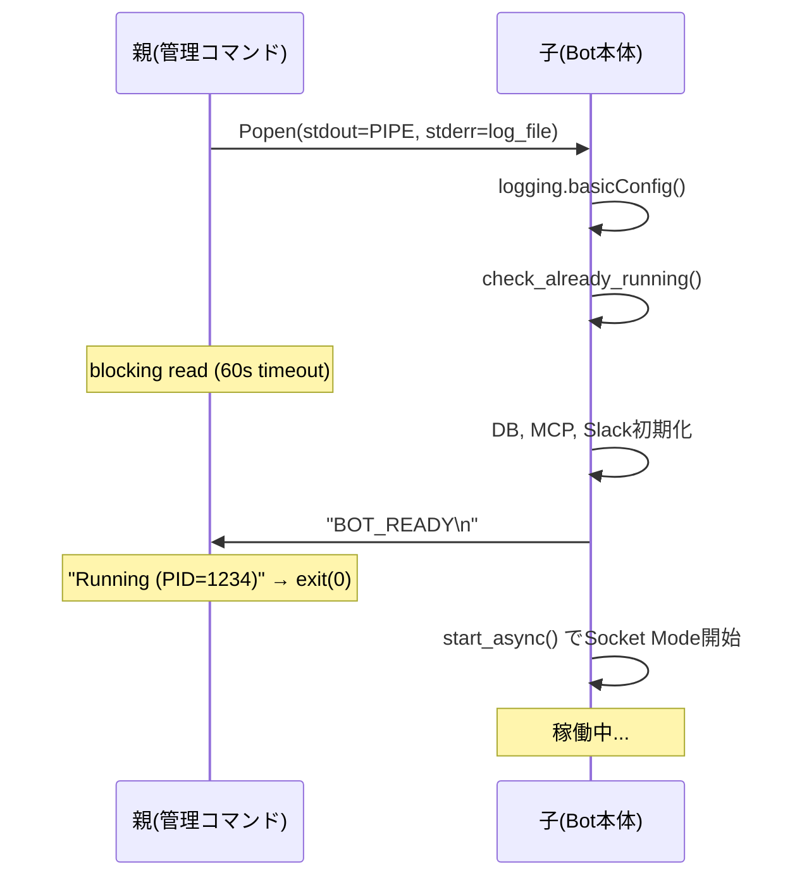

# Bot プロセスガード（重複起動検知・管理コマンド）

## 概要

Bot起動時にPIDファイルを使って既存プロセスの重複起動を検知し、警告メッセージを表示して終了する。また、シャットダウン時に子プロセス（MCPサーバー等）をクリーンアップする。

管理コマンド（`--start` / `--restart` / `--stop` / `--status`）により、Botの起動・停止・状態確認をプログラムから確実に行える。

## ユーザーストーリー

- 開発者として、Botが二重起動していることに気づかず問題が発生するのを防ぐために、重複起動を検知して警告を受けたい
- 運用者として、Bot停止後に残存する子プロセスをクリーンアップするために、シャットダウン時に子プロセスを自動停止したい
- 開発者として、Botの起動・停止・再起動・状態確認をコマンド一つで行いたい（手動でのPIDファイル確認やプロセスkillを不要にしたい）
- 開発者として、Bot起動の成功/失敗をコマンドの戻り値で判断したい

## 背景

- Bot停止時に子プロセス（MCPサーバー等）が残存し、次回起動時にSlackに二重セッションが発生する問題があった
- PR #137 で `os.kill(pid, 0)` ベースの実装をしたが、Windowsでは `SystemError` が発生しリバート済み
- 今回は `tasklist`（Windows）/ `os.kill`（Unix）のプラットフォーム分岐で再実装する
- Claude Codeからのボット起動が毎回スムーズに行かない（起動成功/失敗の確認手段がない、セッション切り替え後に状態不明）
- 過去にシェルスクリプトでの起動管理を試みたが、Git Bash + Windowsの相性問題で断念（#136）
- 今回は全てPython内で完結する管理コマンドとして実装する

## 受け入れ条件

- [ ] AC1: Bot起動時にPIDファイル（`bot.pid`）が作成される
- [ ] AC2: Bot終了時にPIDファイルが削除される
- [ ] AC3: 既にBotが起動中の場合、重複起動を検知して警告メッセージを表示し `sys.exit(1)` で終了する
- [ ] AC4: PIDファイルが残っているが対応プロセスが存在しない場合（stale PID）、正常に起動できる
- [ ] AC5: Windowsで `tasklist` コマンドによるプロセス生存確認が正しく動作する
- [ ] AC6: Unix系OSで `os.kill(pid, 0)` によるプロセス生存確認が正しく動作する
- [ ] AC7: Bot終了時に子プロセス（MCPサーバー等）がクリーンアップされる
- [ ] AC8: クリーンアップ処理の失敗がBot終了を妨げない（例外をキャッチしてログ出力）
- [ ] AC9: `bot.pid` が `.gitignore` に含まれている

### 管理コマンド（#580）

- [ ] AC10: `--start` で Bot を起動し、初期化完了（`BOT_READY`）を待って `Running (PID=xxxx)` を表示する
- [ ] AC11: `--start` で既にBotが起動中の場合、`Already running (PID=xxxx)` を表示して終了する
- [ ] AC12: `--stop` で起動中のBotを停止し、PIDファイルを削除する
- [ ] AC13: `--stop` でBotが起動していない場合、`Not running` を表示して終了する
- [ ] AC14: `--restart` でBotを停止→起動する（既存プロセスの有無に関わらず動作する）
- [ ] AC15: `--status` でBotの状態を表示する（`Running (PID=xxxx)` / `Not running`）
- [ ] AC16: `--start` / `--restart` で起動完了を60秒以内に確認できない場合、タイムアウトエラーで終了する
- [ ] AC17: `--stop` 時に管理コマンド側で Botの子プロセス（MCPサーバー等）も停止する（`taskkill /F` で Bot の `finally` ブロックが走らないケースに対応）
- [ ] AC18: `--start` / `--restart` でBotのログが `.tmp/bot.log` に自動出力される

## 技術設計

### PIDファイル管理

PIDファイルのパスはプロジェクトルート直下の `bot.pid`。

```python
PID_FILE = Path("bot.pid")
```

#### `write_pid_file() -> None`

- `O_CREAT | O_EXCL` フラグによる排他作成でPIDファイルを確保する（TOCTOU対策）
- PIDファイルが既に存在する場合:
  - 既存PIDのプロセスが生存していれば `sys.exit(1)`
  - stale PIDならファイルを削除して再試行（1回のみ）

#### `read_pid_file() -> int | None`

- PIDファイルを読み取り、整数値として返す
- ファイルが存在しない、内容が不正、または PID <= 0 の場合は `None` を返す

#### `remove_pid_file() -> None`

- PIDファイルを削除する
- ファイルが存在しない場合は何もしない
- 削除に失敗した場合はログ警告を出力して続行する

### プロセス生存確認

#### `is_process_alive(pid: int) -> bool`

- `sys.platform == "win32"` で判定し、Windows用 / Unix用の内部関数にディスパッチする

#### `_is_process_alive_unix(pid: int) -> bool`

- `os.kill(pid, 0)` でプロセスの存在を確認
- `ProcessLookupError` → `False`（プロセスなし）
- `PermissionError` → `True`（プロセスあり、権限なし）

#### `_is_process_alive_windows(pid: int) -> bool`

- `subprocess.run(["tasklist", "/FI", f"PID eq {pid}", "/NH"], ...)` を実行
- 標準出力にPID文字列が含まれていれば `True`
- `"INFO:"` で始まるか、PID文字列が見つからなければ `False`
- `FileNotFoundError`（tasklist未検出）→ `False`
- `subprocess.TimeoutExpired`（タイムアウト）→ `False`

### 重複起動チェック

#### `check_already_running() -> None`

1. `read_pid_file()` でPIDを取得
2. PIDが取得できなければ正常通過
3. `is_process_alive(pid)` でプロセス生存確認
4. 生存していればエラーメッセージをログ出力し `sys.exit(1)`
5. stale PIDの場合はPIDファイルを削除して正常通過

### 子プロセスクリーンアップ

#### `cleanup_children() -> None`

- 現在のプロセスの子プロセスを停止する
- **Unix**: `pgrep -P {pid}` で子プロセスを取得し `os.kill(child_pid, signal.SIGTERM)` で停止
- **Windows**: `wmic process where (ParentProcessId={pid}) get ProcessId` で子プロセスを取得し `taskkill /PID {child_pid} /F` で停止
- 子プロセスが存在しない場合は何もしない
- `pgrep`/`wmic` コマンドが見つからない場合やタイムアウト時はスキップしてログ出力
- 個々の子プロセス停止失敗（`taskkill` 未検出、タイムアウト等）はログ出力して継続

### 管理コマンド（`src/bot_manager.py`）

管理コマンドのロジックは `src/bot_manager.py` に実装する。`src/main.py` の `if __name__ == "__main__"` で argparse によるコマンド分岐を行い、管理コマンドの場合は `bot_manager` の関数を呼び出す。

#### コマンド一覧

```
uv run python -m src.main --start    # 起動（既存ありならエラー）
uv run python -m src.main --restart  # 停止→起動（状態問わず常に動く）
uv run python -m src.main --stop     # 停止
uv run python -m src.main --status   # 状態表示
uv run python -m src.main            # 直接起動（従来と同じ）
```

#### 動作マトリクス

| コマンド | 既存プロセスなし | exit | 既存プロセスあり | exit |
|---------|----------------|------|----------------|------|
| `--start` | 起動 → READY待ち → 完了 | 0 | `Already running (PID=xxx)` | 1 |
| `--restart` | 起動 → READY待ち → 完了 | 0 | 停止 → 起動 → READY待ち → 完了 | 0 |
| `--stop` | `Not running` | 0 | 停止 → 完了 | 0 |
| `--status` | `Not running` | 1 | `Running (PID=xxx)` | 0 |
| （なし） | 直接起動（従来動作） | — | 重複検知で終了（従来動作） | 1 |

#### 起動フロー（`--start` / `--restart`）



- 親プロセスは `subprocess.Popen([sys.executable, "-m", "src.main"], stdout=subprocess.PIPE, stderr=log_file)` で子プロセスを起動
- 子プロセス（Bot本体）は全初期化完了後、`handler.start_async()` 直前に `print("BOT_READY", flush=True)` を出力
- 親プロセスはパイプをブロッキング read し、`BOT_READY` を受信したら成功メッセージを表示して `exit(0)`
- 60秒以内に `BOT_READY` を受信できない場合、タイムアウトエラーで `exit(1)`
- パイプが閉じた（子プロセスが異常終了した）場合もエラーで `exit(1)`

#### BOT_READY シグナル

- Bot本体（`src/main.py` の `main()`）は **常に** `BOT_READY` を stdout に出力する（管理コマンド経由かどうかに関わらず）
- 出力タイミング: `handler.start_async()` 直前（DB初期化、MCP初期化、Slack auth_test 等の主要初期化が全て完了した時点）
- `print("BOT_READY", flush=True)` で即座にフラッシュする（パイプのブロックバッファリング対策）

#### 停止フロー（`--stop` / `--restart` の停止部分）

1. `read_pid_file()` でBot PIDを取得
2. `is_process_alive(pid)` で生存確認
3. `_kill_process_tree(pid)` でプロセスツリー全体を停止（子プロセス→本体の順）
4. PIDファイルを削除

`taskkill /F` は Windows で `finally` ブロックを走らせないため、管理コマンド側でPIDファイル削除と子プロセスクリーンアップを行う。

#### `_kill_process_tree(pid: int) -> None`

指定PIDのプロセスツリー（子プロセス→本体の順）を **外部から** 停止する。

既存の `cleanup_children()` は Bot 自身の `finally` ブロック内で自プロセスの子を停止するために使用するが、Windows の `taskkill /F` では `finally` が実行されない。そのため管理コマンド側では `_kill_process_tree()` を使って外部からプロセスツリーを停止する。

- **Windows**: `wmic process where (ParentProcessId={pid}) get ProcessId` で子プロセスを取得し `taskkill` で停止、最後に本体を `taskkill`
- **Unix**: `os.kill(child_pid, SIGTERM)` で子プロセスを停止、最後に `os.kill(pid, SIGTERM)` で本体を停止

#### ログファイル管理

- `--start` / `--restart` 時に `.tmp/bot.log` に **stderr をリダイレクト** する（`stdout` は `PIPE` のまま、BOT_READY 等の制御メッセージに使用）
- 管理コマンド側が `open(".tmp/bot.log", "a")` でファイルを開き、`Popen(stderr=log_file)` で渡す
- Bot本体のアプリケーションログは `logging` モジュール経由で **stderr に出力される前提**（Python の `logging.basicConfig()` のデフォルト動作）
- `.tmp/` ディレクトリが存在しない場合は自動作成
- `--status` でログファイルのパスも表示する

#### argparse 構成（`src/main.py`）

```python
if __name__ == "__main__":
    parser = argparse.ArgumentParser()
    group = parser.add_mutually_exclusive_group()
    group.add_argument("--start", action="store_true")
    group.add_argument("--restart", action="store_true")
    group.add_argument("--stop", action="store_true")
    group.add_argument("--status", action="store_true")
    args = parser.parse_args()

    if args.start or args.restart or args.stop or args.status:
        from src.bot_manager import handle_command
        handle_command(args)
    else:
        asyncio.run(main())
```

## `src/main.py` への統合

```python
async def main() -> None:
    check_already_running()
    write_pid_file()

    mcp_manager = None
    try:
        # ... 既存の初期化処理 ...

        # Socket Mode で起動（BOT_READY シグナル付き）
        async with socket_mode_handler(app, settings) as handler:
            print("BOT_READY", flush=True)
            try:
                await handler.start_async()
            except asyncio.CancelledError:
                logger.info("シャットダウンシグナルを受信しました")
    finally:
        # ... クリーンアップ処理 ...
        remove_pid_file()


if __name__ == "__main__":
    # argparse による管理コマンド分岐（詳細は「argparse 構成」セクション参照）
    # 管理コマンド → bot_manager.handle_command()
    # フラグなし → asyncio.run(main())
```

- `write_pid_file()` 直後から全体を `try/finally` で包むことで、初期化中の例外でもPIDファイル削除と子プロセスクリーンアップが確実に実行される
- `print("BOT_READY", flush=True)` は `handler.start_async()` 直前に出力する（全初期化完了後、Socket Mode 接続開始前）

## やらないこと

- **プロセス名検証**: PIDファイルのプロセスがBotかどうかの検証は行わない
- **シェルスクリプト**: 起動・停止はPython管理コマンドで行う。シェルスクリプトは使用しない（Git Bash + Windowsの相性問題を回避）
- **グレースフル停止の保証**: Windows の `taskkill /F` は強制終了のため `finally` ブロックは走らない。クリーンアップは管理コマンド側で行う

## 関連ファイル

| ファイル | 役割 |
|---------|------|
| `src/process_guard.py` | PIDファイル管理・重複検知・子プロセスクリーンアップ |
| `src/bot_manager.py` | 管理コマンド（start/restart/stop/status） |
| `src/main.py` | エントリーポイント・プロセスガード統合・argparse分岐 |
| `tests/test_process_guard.py` | プロセスガードのテスト |
| `tests/test_bot_manager.py` | 管理コマンドのテスト |
| `.gitignore` | `bot.pid` の除外設定 |

## テスト方針

### 既存テスト（`tests/test_process_guard.py`）

- PIDファイルの読み書き・削除
- Unix向けプロセス生存確認（`os.kill` モック）
- Windows向けプロセス生存確認（`tasklist` 出力モック）
- 重複起動チェック（生存プロセスあり→SystemExit / stale PID→正常通過）
- 子プロセスクリーンアップ（Unix: pgrep+SIGTERM / Windows: wmic+taskkill）

### 管理コマンドテスト（`tests/test_bot_manager.py`）

- `--start`: 正常起動 — Popen + BOT_READY受信 → 成功メッセージ（AC10）
- `--start`: 既存プロセスありで拒否 — Already running（AC11）
- `--start`: タイムアウト — 60秒以内にBOT_READY未受信（AC16）
- `--start`: 子プロセス異常終了 — パイプ閉じ → エラー（AC10）
- `--stop`: 正常停止 — プロセスツリー停止（子プロセス→本体の順）→ PIDファイル削除（AC12, AC17）
- `--stop`: 未起動時 — Not running（AC13）
- `--restart`: 既存あり → 停止 → 起動（AC14）
- `--restart`: 既存なし → 起動のみ（AC14）
- `--status`: 起動中 / 未起動（AC15）
- ログファイル: `.tmp/bot.log` への出力（AC18）
  - `.tmp/` ディレクトリが存在しない場合でも自動作成されること
  - 既存のログファイルがある場合は追記モード（`"a"`）で書き込まれること
- プロセスツリー停止: 子プロセスが先に停止されること（AC17）

テスト名は `test_ac{N}_...` 形式で受け入れ条件と対応させる。

## 関連Issue

- #136: Bot重複起動防止の仕組みを導入する
- #137: 初回実装（Windowsで SystemError 発生のためリバート）
- #139: PR #137 のリバート
- #580: Bot管理コマンドの追加（--start / --restart / --stop / --status）
