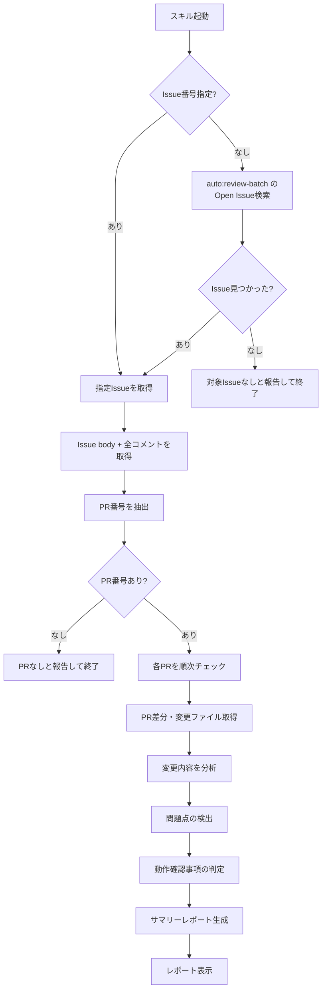

# 自動マージIssue確認スキル (check-review-batch)

## 概要

`auto:review-batch` ラベル付きIssue（自動マージレビューIssue）に記録されたPRを一括チェックし、各PRの対応概要・問題点の有無・動作確認が必要な事項を報告するスキル。

## 背景

自動マージパイプライン（`auto-progress.md`）では、PRマージ後に
`post-merge.yml` が `auto:review-batch` ラベル付きIssueにPR情報を
コメントとして記録する。管理者はこのIssueを定期的にチェックして
品質を確認するが、PR数が増えると個別に確認する手間が大きい。

本スキルは、レビューIssue内の全PRを自動解析し、管理者が効率的に確認できるサマリーレポートを生成する。

## ユーザーストーリー

- 管理者として、`/check-review-batch` で自動マージされた全PRの概要を一覧で確認したい
- 管理者として、各PRの変更内容・問題点・動作確認事項をまとめて把握したい
- 管理者として、確認完了後にIssueをクローズする判断材料を得たい

## 技術仕様

### スキルメタデータ

```yaml
name: check-review-batch
description: 自動マージIssueの全PRをチェックし、対応概要・問題点・動作確認事項を報告する
user-invocable: true
allowed-tools: Bash, Read, Grep, Glob
argument-hint: "[issue-number]"
```

### 引数

`$ARGUMENTS` の形式:

- `<Issue番号>` — 対象の `auto:review-batch` Issue番号（任意）
- 未指定の場合: `auto:review-batch` ラベルのOpen Issueを自動検索

### 処理フロー



### PR番号の抽出

Issue body およびコメントから `## PR #(\d+):` パターンでPR番号を
抽出する。これは `update-review-issue.sh` のコメントフォーマットに
準拠している。

### 各PRのチェック項目

1. **対応概要**: PRタイトル、変更ファイル一覧、変更の種類（feat/fix/docs/ci等）
2. **変更内容の分析**: PR差分を読み、何が変更されたかを要約
3. **問題点の検出**:
   - セキュリティ上の懸念（入力検証不足、認証バイパス等）
   - エラーハンドリングの不備
   - テスト不足の可能性
   - 既存機能への影響
4. **動作確認事項**: 変更内容に基づき、手動で確認すべき項目を列挙
   - Bot起動確認が必要か
   - 特定の操作フローのテストが必要か
   - 設定変更の反映確認が必要か

### 動作確認事項の判定ロジック

変更ファイルのパスに基づいて自動判定する:

| 変更パス | 動作確認事項 |
| --- | --- |
| `src/services/` | Bot起動確認（`uv run python -m src.main`）、該当サービスの動作確認 |
| `src/bot/` | Bot起動確認、Slackでの動作確認 |
| `src/utils/` | 関連する機能の動作確認 |
| `.github/workflows/` | ワークフローの動作確認（次回トリガー時に確認） |
| `docs/` のみ | 動作確認不要（ドキュメントのみの変更） |
| `CLAUDE.md` のみ | 動作確認不要（開発ルールのみの変更） |
| `config/` | Bot起動確認、設定反映の確認 |
| `pyproject.toml` | 依存関係の確認、Bot起動確認 |

### 出力フォーマット

```markdown
## 自動マージレビュー: Issue #N のチェック結果

対象Issue: #N (タイトル)
PR数: X件

---

### PR #123: PRタイトル

**対応概要:**

- 変更種別: feat
- 変更ファイル:
  - `src/services/example.py`
  - `tests/test_example.py`
- 概要: 変更内容の簡潔な説明

**問題点:**

- なし / 問題の説明

**動作確認事項:**

- [ ] Bot起動確認（`uv run python -m src.main`）
- [ ] エラーログに異常がないこと

---

### PR #124: PRタイトル

...

---

### 総評

- 全X件のPRをチェック
- 問題点が検出されたPR: N件 / なし
- 動作確認が必要なPR: N件
- ドキュメントのみの変更: N件（動作確認不要）
```

## 受け入れ条件

- [ ] AC1: `/check-review-batch` で `auto:review-batch` ラベルのOpen Issueを自動検索し、PRチェックが実行される
- [ ] AC2: `/check-review-batch <Issue番号>` で指定Issueに対してPRチェックが実行される
- [ ] AC3: Issue body およびコメントから全PR番号が正しく抽出される
- [ ] AC4: 各PRの対応概要（タイトル、変更ファイル、変更種別）が表示される
- [ ] AC5: 各PRの変更内容が要約される
- [ ] AC6: 問題点がある場合に検出・報告される
- [ ] AC7: 変更ファイルに基づいた動作確認事項が自動判定・表示される
- [ ] AC8: 対象Issueが見つからない場合にエラーメッセージが表示される
- [ ] AC9: PR番号が1件も抽出できない場合にエラーメッセージが表示される
- [ ] AC10: 総評で全体の状況が把握できる

## 関連ファイル

| ファイル | 役割 |
| --- | --- |
| `.claude/skills/check-review-batch/SKILL.md` | スキル定義（新規） |
| `docs/specs/check-review-batch-skill.md` | 本仕様書（新規） |
| `docs/specs/auto-progress.md` | 自動進行管理の仕様（参照） |
| `.github/scripts/post-merge/update-review-issue.sh` | レビューIssue更新スクリプト（参照） |
| `.claude/skills/check-pr/SKILL.md` | check-prスキル（参考） |
| `CLAUDE.md` | スキル一覧への追記 |
