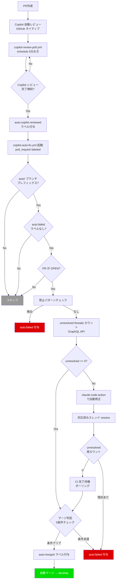

# Copilot ベース自動修正ワークフロー（copilot-auto-fix.yml）

## 概要

GitHub Copilot のネイティブレビュー結果に基づき、レビュー指摘の自動修正と自動マージを行うワークフロー。PRKit ベースの pr-review.yml + auto-fix.yml ループに代わる方式。

**コンセプト**: 「Copilot が1回レビュー → 指摘があれば修正 → マージ。ループしない。」

## 背景

### PRKit ベース方式の問題（Issue #351）

PRKit（prt-silent-failure-hunter）の正答率が17%（CRITICAL 判定の正答率20%）と低く、レビュー→修正→再レビューのループが収束しない問題があった。

**根本原因**: 再レビュー時に、修正済みコードが「初見のコード」として再評価され、同じコードに別の観点で新規指摘が出続ける構造。

**PR #350 実績データ:**

| ラウンド | 指摘件数 | 内容 |
|---------|---------|------|
| 1 | 5件 | エラーハンドリング不足等（妥当） |
| 2 | 2件（全て新規） | 設計判断への意見（誤検出） |
| 3 | 2件（全て新規） | except Exception 広すぎ（部分的に妥当） |
| 4 | 4件（新規3+重複1） | 到達不可能コード等（一部妥当） |

### Copilot への移行判断

- PR #352 で Copilot ネイティブレビューの技術検証を実施
- Copilot は PR #350 の全4ラウンドで正確な判断を出していた
- レビューコストが $0（GitHub サブスクリプション込み）
- Issue #351 コメント3件で分析・方針決定済み

## 設計思想

**再レビューループの廃止**: 再レビューループ自体がレビュー収束問題の温床であるため、単方向フロー（レビュー → 修正 → マージ）を採用する。

**理由:**

- Copilot の初回レビューで重要な問題は検出される（検証: 初回7件→再レビュー4件と指摘減少を確認）
- 修正後の品質は post-merge.yml の通知でカバー可能
- 「Review new pushes」設定は信頼できない（検証で push では発火しなかった）

## 全体フロー



## トリガー条件

- **イベント**: `pull_request` の `labeled` タイプ（`auto:copilot-reviewed` ラベル付与時）
- **発火条件（if）**:
  1. 付与されたラベルが `auto:copilot-reviewed`
  2. PR の head リポジトリが同一リポジトリ（フォーク PR を除外）
  3. ブランチ名が `auto/` プレフィックスで始まる（自動パイプライン由来の PR のみ対象。Actions 分数節約）
- **同時実行制御**: PR番号ごとの concurrency グループ（cancel-in-progress: false — 進行中の修正ジョブをキャンセルするとコミットが不完全な状態になるリスクがあるため）

### トリガー方式の経緯（Issue #365）

当初は `pull_request_review[submitted]` イベントで直接トリガーしていたが、Copilot の内部 `dynamic` ワークフロー実行中にレビューが投稿されると workflow run が生成されない問題が判明した（Issue #365）。

**解決策**: schedule ポーリング + ラベルトリガー方式に変更。

1. `copilot-review-poll.yml`（schedule: 5分おき）が `auto/` ブランチの open PR を監視
2. Copilot レビュー完了を REST API で検知したら `auto:copilot-reviewed` ラベルを `REPO_OWNER_PAT` で付与
3. ラベル付与により `copilot-auto-fix.yml`（`pull_request[labeled]`）がトリガーされる

**PAT が必要な理由**: `GITHUB_TOKEN` で付与したラベルでは `pull_request[labeled]` イベントが発火しない（GitHub の無限ループ防止仕様）。`REPO_OWNER_PAT` を使用することでワークフロー連鎖が成立する。

### Copilot レビューが来ない場合

Copilot のレビューは guaranteed delivery ではない。サービス障害やリポジトリ設定の変更でレビューが実行されない場合、`copilot-review-poll.yml` がレビューを検知できず PR が「レビュー待ち」のまま滞留する。

**運用方針**: `copilot-review-poll.yml` は 5 分おきに実行されるため、Copilot レビュー完了後は最大約 5 分（+ GitHub schedule の遅延）で検知される。Copilot レビュー自体が長時間来ない場合は、管理者が手動で `/review-pr` を実行するか、`auto:failed` を付与して手動対応に切り替える。

### reviewer 名の注意点（PR #352 検証結果）

`copilot-review-poll.yml` は REST API でレビューを取得するため、`copilot-pull-request-reviewer[bot]` で判定する。

| 取得元 | reviewer login |
|--------|---------------|
| `pull_request_review[submitted]` イベントペイロード | `"Copilot"`（参考情報: 現在は未使用） |
| REST API (`/pulls/{PR}/reviews`) | `"copilot-pull-request-reviewer[bot]"`（**schedule ワークフローで使用**） |

```yaml
# copilot-auto-fix.yml の if 条件（labeled イベント）
if: >-
  github.event.label.name == 'auto:copilot-reviewed'
  && github.event.pull_request.head.repo.full_name == github.repository
  && startsWith(github.event.pull_request.head.ref, 'auto/')
```

## 処理フロー

### 1. 前提条件チェック

- `auto/` ブランチプレフィックスの判定はジョブレベル `if` で実施済み（Actions 分数節約）
- PR が OPEN 状態であること（マージ済み・クローズ済みの PR はスキップ。Copilot が複数回レビューを投稿した場合のガード）
- `auto:failed` ラベルの有無を確認（停止中の PR はスキップ）
- いずれの条件も満たさない場合はスキップ

### 2. 禁止パターンチェック

既存 `check-forbidden.sh` を流用。禁止パターン検出時は `auto:failed` 付与 + PRコメント。

### 3. unresolved threads カウント

既存 `check-review-result.sh` を流用。GraphQL API で PR の reviewThreads を取得し、`isResolved == false` のスレッド数をカウント。

**前提条件（PR #352 で検証済み）**: Copilot のインラインレビューコメントは GitHub の `reviewThreads.nodes` に含まれ、`isResolved` フラグで管理される。Copilot が PR 全体への general comment のみ投稿するケースでは `reviewThreads` にカウントされないが、Copilot のコード指摘はインラインコメントとして投稿されることを確認済み。

### 4. 分岐処理

| 条件 | アクション |
|------|----------|
| 禁止パターン検出 | `auto:failed` 付与 + PRコメントで通知 |
| unresolved == 0 | マージ判定へ |
| unresolved > 0 | `claude-code-action` で `/check-pr` を実行し自動修正 → 対応済みスレッドを `resolveReviewThread` で resolve → unresolved threads を再カウント（残存指摘の確認） → CI 完了待機 → マージ判定へ |

### 5. CI 完了待機

修正コミットの push 後、CI（pytest, mypy, ruff, markdownlint）が完了するまでポーリング待機する。

- `gh pr checks` で全チェックの完了を確認（ポーリング間隔: 30秒、タイムアウト: 10分）
- タイムアウト時は `auto:failed` 付与で停止
- `/check-pr` スキル内でもテスト実行するが、GitHub Actions CI の通過を最終的なゲートとする

**注記**: unresolved == 0（修正不要）の場合は、PR 作成時の CI が既に完了しているためこのステップはスキップされる。

### 6. マージ判定

既存 `merge-check.sh` を流用。5条件を全て確認:

1. PR が OPEN 状態であること（既にマージ済みの場合はスキップ）
2. レビュー指摘ゼロ（unresolved threads == 0）
3. CI 全チェック通過（`EXCLUDE_CHECK` で自ワークフローのチェックを除外。自己参照による誤判定を防止）
4. コンフリクトなし
5. `auto:failed` ラベルなし

### 7. 自動マージ

既存 `merge-or-dryrun.sh` を流用。条件クリアで `auto:merged` ラベルを付与した後、`gh pr merge --merge` を `REPO_OWNER_PAT` で実行。

## 使用シークレット

| シークレット | 用途 |
|-------------|------|
| `CLAUDE_CODE_OAUTH_TOKEN` | claude-code-action の認証（unresolved > 0 の場合のみ使用） |
| `REPO_OWNER_PAT` | 自動マージ実行。`copilot-review-poll.yml` でのラベル付与（ワークフロー連鎖に必要） |
| `GITHUB_TOKEN` | その他のGitHub API操作（ラベル付与、PRチェック、GraphQL クエリ等） |

## 流用する既存スクリプト

| スクリプト | パス | 用途 | 変更 |
|-----------|------|------|------|
| `_common.sh` | `.github/scripts/auto-fix/` | 共通ユーティリティ | なし |
| `check-review-result.sh` | `.github/scripts/auto-fix/` | unresolved threads カウント | なし |
| `check-forbidden.sh` | `.github/scripts/auto-fix/` | 禁止パターンチェック | なし |
| `merge-check.sh` | `.github/scripts/auto-fix/` | マージ5条件チェック | **あり**: PR OPEN 状態チェックを追加 |
| `merge-or-dryrun.sh` | `.github/scripts/auto-fix/` | マージ実行 / ドライラン | なし |
| `handle-errors.sh` | `.github/scripts/auto-fix/` | エラー時の auto:failed 付与 | **あり**: エラーメッセージ内の再開手順を修正（`/fix` コメント → `auto:failed` 除去 + Copilot 再レビュー） |

**不要になるスクリプト（PRKit 方式固有）:**

| スクリプト | 理由 |
|-----------|------|
| `check-loop-count.sh` | 再レビューループ廃止のため不要（PRKit 方式復帰時に必要となるため削除せず残す） |
| `remove-label.sh` | `auto:fix-requested` ラベル除去（Copilot 方式では不使用。同上、削除せず残す） |

## エラーハンドリング

- 全ステップで失敗時は `auto:failed` ラベル付与 + PRコメントで理由を通知
- 通知内容: 失敗したステップ名、エラー概要、GitHub Actions 実行ログへのリンク
- GitHub API エラー（レート制限、権限不足、ネットワーク障害等）は即座に `auto:failed` で停止（リトライしない）
- 既存 `handle-errors.sh` のフォールバック機構をそのまま利用

## PRKit 方式との比較

| 項目 | PRKit ベース（休止中） | Copilot ベース（本方式） |
|------|----------------------|------------------------|
| レビュー実行 | claude-code-action（pr-review.yml） | Copilot ネイティブ（GitHub 組み込み） |
| レビューコスト | 〜$1/回 | $0（サブスク込み） |
| 修正ワークフロー | auto-fix.yml | copilot-auto-fix.yml |
| 修正コスト | 〜$3/回（平均1.5ラウンド） | 〜$2/回（1ラウンドのみ） |
| トリガー | `pull_request[labeled]`（auto:fix-requested） | `pull_request[labeled]`（auto:copilot-reviewed） |
| 再レビューループ | あり（最大3回） | **なし**（単方向フロー） |
| レビュー精度 | 正答率17%（silent-failure-hunter） | 高（PR #350 実績） |
| 収束性 | 収束しない | 収束する（ループなし） |
| マージ判定ロジック | check-review-result.sh | **同じ**（流用） |
| 設計書 | `auto-fix-structure.md` | 本ドキュメント |

## 受け入れ条件

- [ ] AC1: `auto:copilot-reviewed` ラベル付与（`pull_request[labeled]`）で copilot-auto-fix.yml が起動する
- [ ] AC2: `auto:copilot-reviewed` 以外のラベル付与ではスキップされる
- [ ] AC3: `auto/` ブランチプレフィックスのない PR ではスキップされる（ジョブレベル `if` で判定）
- [ ] AC4: `auto:failed` ラベルのある PR ではスキップされる
- [ ] AC5: マージ済み・クローズ済みの PR ではスキップされる
- [ ] AC6: unresolved threads == 0 のときマージ判定（5条件チェック）に進み、全条件クリアで自動マージされる
- [ ] AC7: unresolved threads > 0 のとき claude-code-action で修正が実行される
- [ ] AC8: 修正後に対応済みスレッドが `resolveReviewThread` で resolve される
- [ ] AC9: 修正後に unresolved threads が再カウントされ、残存指摘がないことが確認される
- [ ] AC10: 修正コミットの push 後、CI 完了をポーリング待機してからマージ判定に進む
- [ ] AC11: 修正後に自動マージされる（再レビューは行わない）
- [ ] AC12: 禁止パターン検出時に `auto:failed` が付与される
- [ ] AC13: `auto-fix.yml` が無効化されている（トリガーが `workflow_dispatch` のみに変更）。`pr-review.yml` は通常PR向けに稼働継続し、`auto/` ブランチプレフィックス付きPRのみスキップする — auto-progress.md AC19 と対応
- [ ] AC14: `handle-errors.sh` のエラーメッセージが Copilot 方式の再開手順に更新されている
- [ ] AC15: `copilot-review-poll.yml` が 5 分おきの schedule で実行され、`auto/` ブランチの open PR の Copilot レビュー完了を検知する
- [ ] AC16: Copilot レビュー完了検知時に `auto:copilot-reviewed` ラベルが `REPO_OWNER_PAT` で付与される
- [ ] AC17: `auto:copilot-reviewed` / `auto:failed` ラベル付きの PR はポーリング対象外としてスキップされる

## テスト方針

copilot-auto-fix.yml 固有のテストケース（auto-progress.md のテスト方針を補完）:

- `auto:copilot-reviewed` 以外のラベル付与では起動しないことを確認
- `auto/` ブランチプレフィックスなし PR で起動しないことを確認
- `copilot-review-poll.yml` が `auto/` ブランチの open PR のみを対象にすることを確認
- Copilot レビュー完了検知時に `auto:copilot-reviewed` ラベルが付与されることを確認
- `auto:copilot-reviewed` / `auto:failed` ラベル付きの PR がポーリング対象外であることを確認
- マージ済み PR に対する Copilot レビューでスキップされることを確認
- unresolved == 0 のとき、CI 完了待機をスキップしてマージ判定に進むことを確認
- 修正後の unresolved 再カウントで残存指摘がある場合に `auto:failed` が付与されることを確認
- CI 完了待機のタイムアウト（10分）時に `auto:failed` が付与されることを確認
- `handle-errors.sh` のエラーメッセージに Copilot 方式の再開手順が含まれることを確認

## 関連ファイル

| ファイル | 役割 |
|---------|------|
| `.github/workflows/copilot-auto-fix.yml` | 本ワークフロー |
| `.github/workflows/copilot-review-poll.yml` | Copilot レビュー検知 schedule ワークフロー（`auto:copilot-reviewed` ラベル付与） |
| `.github/workflows/pr-review.yml` | PRKit ベースの自動レビュー（通常PR向けに稼働、`auto/` ブランチプレフィックス付き PR はスキップ） |
| `.github/workflows/auto-fix.yml` | PRKit ベースの自動修正（**無効化対象**） |
| `.github/scripts/auto-fix/` | 共通スクリプト群（流用、一部変更あり） |
| `.github/prompts/auto-fix-check-pr.md` | auto-fix 用プロンプトテンプレート（流用） |
| `docs/specs/auto-progress.md` | 全体パイプライン仕様（参照元） |
| `docs/specs/auto-fix-structure.md` | PRKit ベースの設計書（休止中） |

## 参考資料

- Issue #351: auto-fix パイプラインのレビュー収束問題の解決
- Issue #353: Copilot ベースの auto-fix ワークフロー実装
- Issue #365: copilot-auto-fix.yml トリガー問題（`pull_request_review[submitted]` が発火しない問題）
- PR #352: Copilot レビューイベント検証（検証用、マージなし）
- [GitHub Copilot code review](https://docs.github.com/en/copilot/using-github-copilot/code-review/using-copilot-code-review)
