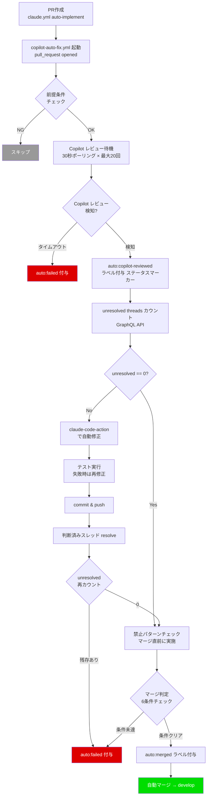
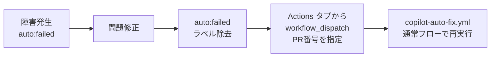

# Copilot ベース自動修正ワークフロー（copilot-auto-fix.yml）

## 概要

GitHub Copilot のネイティブレビュー結果に基づき、レビュー指摘の自動修正と自動マージを行うワークフロー。PRKit ベースの pr-review.yml + auto-fix.yml ループに代わる方式。

**コンセプト**: 「Copilot が1回レビュー → 指摘があれば修正 → マージ。ループしない。」

**本ワークフローは自己完結型**: PR 作成をトリガーに Copilot レビュー検知・修正・マージまでを単一ワークフロー内で完結する。外部の schedule ワークフロー（`copilot-review-poll.yml`）への依存を排除した。

## 背景

### PRKit ベース方式の問題（Issue #351）

PRKit（prt-silent-failure-hunter）の正答率が17%（CRITICAL 判定の正答率20%）と低く、レビュー→修正→再レビューのループが収束しない問題があった。

**根本原因**: 再レビュー時に、修正済みコードが「初見のコード」として再評価され、同じコードに別の観点で新規指摘が出続ける構造。

**PR #350 実績データ:**

| ラウンド | 指摘件数 | 内容 |
|---------|---------|------|
| 1 | 5件 | エラーハンドリング不足等（妥当） |
| 2 | 2件（全て新規） | 設計判断への意見（誤検出） |
| 3 | 2件（全て新規） | except Exception 広すぎ（部分的に妥当） |
| 4 | 4件（新規3+重複1） | 到達不可能コード等（一部妥当） |

### Copilot への移行判断

- PR #352 で Copilot ネイティブレビューの技術検証を実施
- Copilot は PR #350 の全4ラウンドで正確な判断を出していた
- レビューコストが $0（GitHub サブスクリプション込み）
- Issue #351 コメント3件で分析・方針決定済み

### schedule ポーリングの問題（Issue #386）

初期設計では `copilot-review-poll.yml`（5分おき schedule）で Copilot レビュー完了を検知し、`auto:copilot-reviewed` ラベル付与で `copilot-auto-fix.yml` をトリガーしていた。

**問題点**:

- GitHub Actions の schedule は guaranteed delivery ではない。遅延・スキップが発生し、Issue が「レビュー待ち」のまま滞留する
- 2段階の間接トリガー（schedule → ラベル → workflow）で障害ポイントが多い
- schedule ワークフローは対象 PR がなくても5分おきに実行され、無駄な Actions 分数を消費する
- `REPO_OWNER_PAT` をラベル付与のためだけに schedule ワークフローに渡す必要がある（セキュリティ表面積の増加）

**解決策**: schedule ワークフローを廃止し、`copilot-auto-fix.yml` 内で sleep ポーリングによる Copilot レビュー検知を行う自己完結型設計に変更する。

## 設計思想

**再レビューループの廃止**: 再レビューループ自体がレビュー収束問題の温床であるため、単方向フロー（レビュー → 修正 → マージ）を採用する。

**理由:**

- Copilot の初回レビューで重要な問題は検出される（検証: 初回7件→再レビュー4件と指摘減少を確認）
- 修正後の品質は post-merge.yml の通知でカバー可能
- 「Review new pushes」設定は信頼できない（検証で push では発火しなかった）

**自己完結型設計**: 外部ワークフローとのラベルベースの連携を排除し、単一ワークフロー内で完結させる。

**理由:**

- schedule ワークフローの不安定さを根本的に排除
- 障害ポイントの削減（2段階 → 1段階）
- PR 作成から検知までの遅延を最小化（最大5分+ → Copilot の実レビュー時間のみ）
- デバッグが容易（全ログが単一の workflow run に集約）

## 全体フロー



**手動再実行フロー**（障害復旧時）:



## トリガー条件

### プライマリトリガー: `pull_request[opened]`

PR 作成時に自動起動する。

- **イベント**: `pull_request` の `opened` タイプ
- **発火条件（if）**:
  1. PR の head リポジトリが同一リポジトリ（フォーク PR を除外）
  2. ブランチ名が `auto/` プレフィックスで始まる（自動パイプライン由来の PR のみ対象。Actions 分数節約）

**PR 作成元**: `claude.yml` の `claude-auto-implement` ジョブが `REPO_OWNER_PAT` で PR を作成するため、`pull_request[opened]` イベントが発火する（`GITHUB_TOKEN` で作成された PR イベントは GitHub の無限ループ防止仕様により他のワークフローをトリガーしない）。

### セカンダリトリガー: `workflow_dispatch`

障害復旧後の手動再実行用。

- **入力パラメータ**: `pr_number`（処理対象の PR 番号）
- **用途**: `auto:failed` による停止後、問題解消 → ラベル除去 → 手動再実行
- ワークフロー内で `auto/` ブランチプレフィックスを検証する（ジョブレベル if では `workflow_dispatch` に PR 情報がないため）

```yaml
on:
  pull_request:
    types: [opened]
  workflow_dispatch:
    inputs:
      pr_number:
        description: 'PR number to process (for manual re-trigger after failure recovery)'
        required: true
        type: number

jobs:
  copilot-auto-fix:
    if: >-
      github.event_name == 'workflow_dispatch'
      || (
        github.event.pull_request.head.repo.full_name == github.repository
        && startsWith(github.event.pull_request.head.ref, 'auto/')
      )
```

### 同時実行制御

PR番号ごとの concurrency グループ（cancel-in-progress: false — 進行中の修正ジョブをキャンセルするとコミットが不完全な状態になるリスクがあるため）。

```yaml
concurrency:
  group: copilot-auto-fix-pr-${{ github.event.pull_request.number || github.event.inputs.pr_number }}
  cancel-in-progress: false
```

### 旧トリガー方式からの変更（Issue #386）

| 項目 | 旧方式 | 新方式 |
|------|--------|--------|
| トリガー | `pull_request[labeled]`（`auto:copilot-reviewed`） | `pull_request[opened]` + `workflow_dispatch` |
| Copilot 検知 | `copilot-review-poll.yml`（5分おき schedule） | ワークフロー内 sleep ポーリング |
| `auto:copilot-reviewed` の役割 | ワークフロートリガー | ステータスマーカー（任意） |
| 検知までの遅延 | 最大5分 + schedule 遅延 | Copilot の実レビュー時間のみ |
| 依存ワークフロー | `copilot-review-poll.yml`（必須） | なし（自己完結） |
| 障害復旧 | `auto:failed` 除去 → Copilot 再レビュー → schedule 検知 | `auto:failed` 除去 → `workflow_dispatch` |

### Copilot レビューが来ない場合

Copilot のレビューは guaranteed delivery ではない。サービス障害やリポジトリ設定の変更でレビューが実行されない場合、ポーリングがタイムアウト（10分）して `auto:failed` で停止する。

**運用方針**: タイムアウト後は管理者が状況を確認し、Copilot 側の問題であれば手動で対応する。復旧後は `auto:failed` を除去して `workflow_dispatch` で再実行する。

### reviewer 名の注意点（PR #352 検証結果）

ポーリングは REST API でレビューを取得するため、`copilot-pull-request-reviewer[bot]` で判定する。

| 取得元 | reviewer login |
|--------|---------------|
| `pull_request_review[submitted]` イベントペイロード | `"Copilot"`（参考情報: 未使用） |
| REST API (`/pulls/{PR}/reviews`) | `"copilot-pull-request-reviewer[bot]"`（**本ワークフローで使用**） |

## 処理フロー

### 0. PR 番号取得・ブランチ検証

- `pull_request[opened]`: `github.event.pull_request.number` から取得（`auto/` プレフィックスはジョブレベル if で検証済み）
- `workflow_dispatch`: `github.event.inputs.pr_number` から取得。PR のブランチ名が `auto/` プレフィックスであることをスクリプト内で検証する

### 1. 前提条件チェック

- PR が OPEN 状態であること（マージ済み・クローズ済みの PR はスキップ。Copilot が複数回レビューを投稿した場合のガード）
- `auto:failed` ラベルの有無を確認（停止中の PR はスキップ）
- いずれの条件も満たさない場合はスキップ

### 2. Copilot レビュー検知（sleep ポーリング）

`wait-for-copilot.sh` スクリプトで Copilot レビュー完了をポーリング検知する。

**ポーリングロジック**:

1. REST API (`/repos/{owner}/{repo}/pulls/{pr}/reviews`) でレビュー一覧を取得
2. `copilot-pull-request-reviewer[bot]` のレビューで `state != "PENDING"` のものがあるか確認
3. 検知した場合は `copilot_reviewed=true` を出力して終了
4. 検知しない場合は 30 秒 sleep して再試行
5. タイムアウト（デフォルト 10 分）に達したら `copilot_reviewed=false` を出力

**パラメータ**:

| パラメータ | 種別 | デフォルト値 | 説明 |
|-----------|------|-------------|------|
| `COPILOT_REVIEW_TIMEOUT` | Actions variable (`vars.`) | `600` | Copilot レビューの最大待機時間（秒）。Copilot の応答が遅い場合に増やす |

- **ポーリング間隔**: 30 秒固定（ハードコード）。技術的なデフォルトとして十分であり、チューニング不要
- **試行回数**: `COPILOT_REVIEW_TIMEOUT / 30` で自動計算（デフォルト: 600 / 30 = 20 回）
- **チューニング指針**: Copilot の応答が安定して 10 分以内なら変更不要。遅延が頻発する場合は `900`（15分）等に増やす

**API レート制限**: 30秒おき × 最大20回（デフォルト）= 最大20回のAPI呼び出し。GitHub の上限 5,000回/時間に対して十分に余裕がある。タイムアウトを 900 に増やしても 30 回で問題ない。

**タイムアウト時**: `auto:failed` ラベル付与 + PR コメントで通知。管理者が Copilot の状態を確認し、問題解消後に `workflow_dispatch` で再実行する。

**検知後**: `auto:copilot-reviewed` ラベルをステータスマーカーとして付与（`GITHUB_TOKEN` で付与。ワークフロートリガーではないため PAT 不要）。

### 3. unresolved threads カウント

既存 `check-review-result.sh` を流用。GraphQL API で PR の reviewThreads を取得し、`isResolved == false` のスレッド数をカウント。

**前提条件（PR #352 で検証済み）**: Copilot のインラインレビューコメントは GitHub の `reviewThreads.nodes` に含まれ、`isResolved` フラグで管理される。Copilot が PR 全体への general comment のみ投稿するケースでは `reviewThreads` にカウントされないが、Copilot のコード指摘はインラインコメントとして投稿されることを確認済み。

### 4. 分岐処理

| 条件 | アクション |
|------|----------|
| unresolved == 0 | 禁止パターンチェック → マージ判定へ |
| unresolved > 0 | `claude-code-action` で `/check-pr` を実行し自動修正（テスト → 失敗時は再修正のループ） → commit & push → 判断済みスレッド（✅❌⏸️）を resolve → unresolved threads を再カウント（残存指摘の確認） → 禁止パターンチェック → マージ判定へ |

### 5. 禁止パターンチェック

既存 `check-forbidden.sh` を流用。マージ判定の直前に1回だけ実行する。

auto-fix が禁止ファイルの変更を取り消す可能性があるため、チェックはマージ直前に行い、fresh な結果で条件6を判定する。検出時はマージ条件未達として `auto:failed` で停止する。

### 6. マージ判定

既存 `merge-check.sh` を流用。6条件を全て確認:

1. PR が OPEN 状態であること（既にマージ済みの場合はスキップ）
2. レビュー指摘ゼロ（unresolved threads == 0）
3. ステータスチェック通過（`statusCheckRollup` で確認。外部 CI 未設定時は自動 PASS。`EXCLUDE_CHECK` で自ワークフローを除外）
4. コンフリクトなし
5. `auto:failed` ラベルなし
6. 禁止パターンなし（`FORBIDDEN_DETECTED` 環境変数で判定。auto-fix は続行させつつマージのみブロック）

### 7. 自動マージ

既存 `merge-or-dryrun.sh` を流用。条件クリアで `auto:merged` ラベルを付与した後、`gh pr merge --merge` を `REPO_OWNER_PAT` で実行。

## 使用シークレット

| シークレット | 用途 |
|-------------|------|
| `CLAUDE_CODE_OAUTH_TOKEN` | claude-code-action の認証（unresolved > 0 の場合のみ使用） |
| `REPO_OWNER_PAT` | 自動マージ実行（`merge-or-dryrun.sh` で使用。`post-merge.yml` へのワークフロー連鎖に必要） |
| `GITHUB_TOKEN` | その他のGitHub API操作（ラベル付与、PRチェック、GraphQL クエリ、Copilot レビュー検知等） |

**旧設計との差異**: `REPO_OWNER_PAT` は旧設計では `copilot-review-poll.yml` のラベル付与（ワークフロー連鎖）にも使用されていたが、新設計ではマージ実行のみに使用する。`auto:copilot-reviewed` ラベルはステータスマーカーとして `GITHUB_TOKEN` で付与するため、PAT は不要。

### Actions Variables

| Variable | デフォルト値 | 説明 |
|----------|-------------|------|
| `COPILOT_REVIEW_TIMEOUT` | `600` | Copilot レビューの最大待機時間（秒） |
| `AUTO_MERGE_ENABLED` | — | 自動マージの有効/無効（既存） |

## スクリプト

### 新規スクリプト

| スクリプト | パス | 用途 |
|-----------|------|------|
| `wait-for-copilot.sh` | `.github/scripts/auto-fix/` | Copilot レビュー完了のポーリング検知 |

**`wait-for-copilot.sh` の仕様**:

- 環境変数: `PR_NUMBER`（必須）、`GH_TOKEN`（必須）、`GH_REPO`（必須）、`COPILOT_REVIEW_TIMEOUT`（任意、デフォルト600）
- `_common.sh` を source して `require_env`, `output`, `validate_pr_number` を使用
- 出力: `copilot_reviewed=true|false`（`$GITHUB_OUTPUT` 経由）
- 終了コード:
  - exit 0: 正常検知 or タイムアウト（`copilot_reviewed` で呼び出し元が判断）
  - exit 1: 回復不能エラー（権限/認証エラー。ワークフローの `Handle errors` ステップが `auto:failed` を付与）
- API エラー分類:
  - 認証/権限エラー（`401`/`403`/`forbidden`/`resource not accessible`）→ `::error::` + exit 1（即停止）
  - 一時的障害 → `::warning::` + 次のポーリングへ（耐性）
- ポーリング間隔: 30 秒固定（スクリプト内ハードコード）

### 流用する既存スクリプト

| スクリプト | パス | 用途 | 変更 |
|-----------|------|------|------|
| `_common.sh` | `.github/scripts/auto-fix/` | 共通ユーティリティ | なし |
| `check-review-result.sh` | `.github/scripts/auto-fix/` | unresolved threads カウント | なし |
| `check-forbidden.sh` | `.github/scripts/auto-fix/` | 禁止パターンチェック | なし |
| `merge-check.sh` | `.github/scripts/auto-fix/` | マージ6条件チェック | **あり**: 条件6（禁止パターン `FORBIDDEN_DETECTED` 環境変数チェック）の追加 |
| `merge-or-dryrun.sh` | `.github/scripts/auto-fix/` | マージ実行 / ドライラン | なし |
| `handle-errors.sh` | `.github/scripts/auto-fix/` | エラー時の auto:failed 付与 | **あり**: エラーメッセージ内の再開手順を修正（「`workflow_dispatch` で再実行」に変更） |

### 廃止対象

| 対象 | 理由 | アクション |
|------|------|-----------|
| `copilot-review-poll.yml` | sleep ポーリングに移行したため不要 | **削除** |

**不要になるスクリプト（PRKit 方式固有、削除せず残す）:**

| スクリプト | 理由 |
|-----------|------|
| `check-loop-count.sh` | 再レビューループ廃止のため不要（PRKit 方式復帰時に必要となるため削除せず残す） |
| `remove-label.sh` | `auto:fix-requested` ラベル除去（Copilot 方式では不使用。同上、削除せず残す） |

## エラーハンドリング

- 全ステップで失敗時は `auto:failed` ラベル付与 + PRコメントで理由を通知
- 通知内容: 失敗したステップ名、エラー概要、GitHub Actions 実行ログへのリンク
- GitHub API エラー（レート制限、権限不足、ネットワーク障害等）は即座に `auto:failed` で停止（リトライしない）
- 既存 `handle-errors.sh` のフォールバック機構をそのまま利用

### 障害復旧手順

1. PR コメントの `auto:failed` 通知を確認し、失敗原因を特定
2. 問題を修正（コード修正、設定変更、外部サービス復旧確認等）
3. `auto:failed` ラベルを除去
4. 必要に応じて Copilot に再レビューをリクエスト
5. Actions タブ → 「Copilot Auto Fix」 → 「Run workflow」 → PR 番号を入力して再実行

**旧設計との差異**: 旧設計では `auto:failed` 除去 → Copilot 再レビュー → `copilot-review-poll.yml` が検知 → `auto:copilot-reviewed` ラベル → `copilot-auto-fix.yml` トリガーという間接的な復旧フローだった。新設計では `workflow_dispatch` による直接再実行で、障害ポイントが少なくシンプル。

## PRKit 方式との比較

| 項目 | PRKit ベース（休止中） | Copilot ベース（本方式） |
|------|----------------------|------------------------|
| レビュー実行 | claude-code-action（pr-review.yml） | Copilot ネイティブ（GitHub 組み込み） |
| レビューコスト | ~$1/回 | $0（サブスク込み） |
| 修正ワークフロー | auto-fix.yml | copilot-auto-fix.yml |
| 修正コスト | ~$3/回（平均1.5ラウンド） | ~$2/回（1ラウンドのみ） |
| トリガー | `pull_request[labeled]`（auto:fix-requested） | `pull_request[opened]` + `workflow_dispatch` |
| Copilot 検知 | N/A | ワークフロー内 sleep ポーリング |
| 再レビューループ | あり（最大3回） | **なし**（単方向フロー） |
| レビュー精度 | 正答率17%（silent-failure-hunter） | 高（PR #350 実績） |
| 収束性 | 収束しない | 収束する（ループなし） |
| マージ判定ロジック | check-review-result.sh | **同じ**（流用） |
| 外部依存 | なし | なし（旧設計は copilot-review-poll.yml に依存） |
| 設計書 | `auto-fix-structure.md` | 本ドキュメント |

## ラベル体系

| ラベル | 用途 | 付与タイミング | 付与トークン |
|--------|------|---------------|-------------|
| `auto:pipeline` | 検索・フィルタ用マーカー | claude.yml が PR 作成後に付与 | `REPO_OWNER_PAT` |
| `auto:copilot-reviewed` | Copilot レビュー完了のステータスマーカー | 本ワークフローが Copilot レビュー検知後に付与 | `GITHUB_TOKEN` |
| `auto:failed` | 自動処理停止 | エラー発生時に付与 | `GITHUB_TOKEN` |
| `auto:merged` | マージ完了マーカー | マージ直前に付与 | `REPO_OWNER_PAT` |

**`auto:copilot-reviewed` の役割変更**: 旧設計ではワークフロートリガー（`pull_request[labeled]`）として使用していたが、新設計ではステータスマーカーに変更。`GITHUB_TOKEN` で付与するためワークフロー連鎖は発生しない。

## 受け入れ条件

### トリガー・検知

- [ ] AC1: `auto/` ブランチプレフィックスの PR が `opened` イベントで copilot-auto-fix.yml が起動する
- [ ] AC2: `auto/` ブランチプレフィックスのない PR では起動しない
- [ ] AC3: フォーク PR では起動しない
- [ ] AC4: `workflow_dispatch` で PR 番号を指定して手動実行できる
- [ ] AC5: `workflow_dispatch` で指定された PR が `auto/` ブランチでない場合はスキップする
- [ ] AC6: Copilot レビュー完了を 30 秒間隔のポーリングで検知する
- [ ] AC7: Copilot レビュー検知後に `auto:copilot-reviewed` ラベルがステータスマーカーとして付与される
- [ ] AC8: Copilot レビューが 10 分以内に検知されない場合、`auto:failed` が付与されタイムアウト停止する

### ガード条件

- [ ] AC9: `auto:failed` ラベルのある PR ではスキップされる
- [ ] AC10: マージ済み・クローズ済みの PR ではスキップされる

### 修正・マージ

- [ ] AC11: unresolved threads == 0 のとき直接マージ判定に進む
- [ ] AC12: unresolved threads > 0 のとき claude-code-action で修正が実行される（テスト → 失敗時は再修正のループ → commit & push）
- [ ] AC13: 修正後に対応済みスレッドが `resolveReviewThread` で resolve される
- [ ] AC14: 修正後に unresolved threads が再カウントされ、残存指摘がないことが確認される
- [ ] AC15: 修正後に自動マージされる（再レビューは行わない）

### 安全ガード

- [ ] AC16: 禁止パターン検出時に自動修正は続行され、マージ判定（条件6）でブロックされる

### 廃止

- [ ] AC17: `copilot-review-poll.yml` が削除されている
- [ ] AC18: `auto-fix.yml` が無効化されている（トリガーが `workflow_dispatch` のみに変更）— auto-progress.md AC19 と対応
- [ ] AC19: `handle-errors.sh` のエラーメッセージが `workflow_dispatch` による再実行手順に更新されている

## テスト方針

copilot-auto-fix.yml 固有のテストケース（auto-progress.md のテスト方針を補完）:

- `auto/` ブランチプレフィックスの PR を `opened` で作成した時にワークフローが起動することを確認
- `auto/` ブランチプレフィックスなし PR で起動しないことを確認
- `workflow_dispatch` で PR 番号を指定して起動できることを確認
- `workflow_dispatch` で `auto/` ブランチでない PR を指定した場合にスキップされることを確認
- Copilot レビュー検知のポーリングが 30 秒間隔で実行されることを確認
- Copilot レビュー完了後に `auto:copilot-reviewed` ラベルが付与されることを確認
- Copilot レビュータイムアウト（10分）時に `auto:failed` が付与されることを確認
- マージ済み PR に対する起動でスキップされることを確認
- unresolved == 0 のとき、直接マージ判定に進むことを確認
- 修正後の unresolved 再カウントで残存指摘がある場合に `auto:failed` が付与されることを確認
- `handle-errors.sh` のエラーメッセージに `workflow_dispatch` による再実行手順が含まれることを確認

## 関連ファイル

| ファイル | 役割 |
|---------|------|
| `.github/workflows/copilot-auto-fix.yml` | 本ワークフロー |
| `.github/scripts/auto-fix/wait-for-copilot.sh` | Copilot レビュー検知スクリプト（**新規**） |
| `.github/scripts/auto-fix/` | 共通スクリプト群（流用、`handle-errors.sh` のみ変更あり） |
| `.github/prompts/auto-fix-check-pr.md` | auto-fix 用プロンプトテンプレート（流用） |
| `.github/workflows/auto-fix.yml` | PRKit ベースの自動修正（**無効化対象**） |
| `docs/specs/auto-progress.md` | 全体パイプライン仕様（参照元、本PRで更新済み） |
| `docs/specs/auto-fix-structure.md` | PRKit ベースの設計書（休止中） |

### 廃止するファイル

| ファイル | 理由 |
|---------|------|
| `.github/workflows/copilot-review-poll.yml` | sleep ポーリングに移行したため完全に不要 |

## 参考資料

- Issue #351: auto-fix パイプラインのレビュー収束問題の解決
- Issue #353: Copilot ベースの auto-fix ワークフロー実装
- Issue #365: copilot-auto-fix.yml トリガー問題（`pull_request_review[submitted]` が発火しない問題）
- Issue #386: 自動レビューの最適化 — schedule 廃止 + sleep ポーリング方式への移行
- PR #352: Copilot レビューイベント検証（検証用、マージなし）
- [GitHub Copilot code review](https://docs.github.com/en/copilot/using-github-copilot/code-review/using-copilot-code-review)
