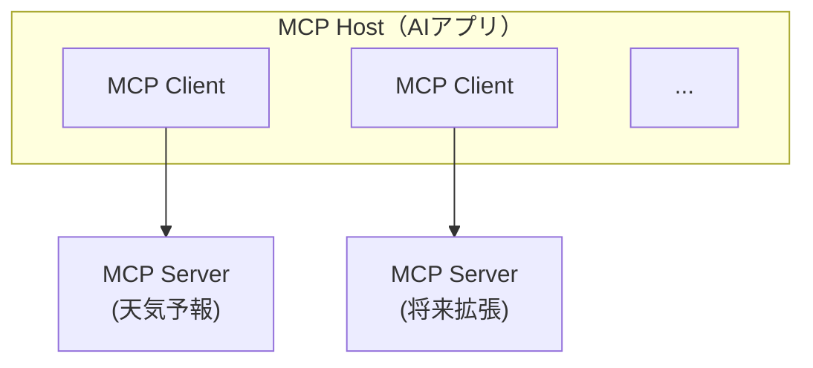

# F5: MCP統合（天気予報サンプル）

## 概要

Model Context Protocol (MCP) を活用して、チャットボットが外部ツールを動的に呼び出せる仕組みを導入する。
サンプル実装として天気予報MCPサーバーを構築し、Slackチャットから自然言語で天気を問い合わせられるようにする。

## 背景

- 現在のAI Assistantは、LLMに対して定型的なプロンプトを送信し応答を得るのみで、外部ツールとの連携機能がない
- MCP (Model Context Protocol) はAnthropicが提唱し、OpenAI・Linux Foundation (AAIF) も採用したオープン標準プロトコル
- MCPにより、LLMがツールを動的に発見・呼び出しできるようになり、エージェント的な振る舞いが可能になる
- 天気予報APIをサンプルとすることで、MCPの基本的な統合パターンを検証する

### MCPアーキテクチャの概要

MCPは3層のクライアント・サーバーモデルで構成される：



- **Host**: AI Assistant（Slackボット）がホストとして機能
- **Client**: MCPサーバーごとに1つのクライアントインスタンスを管理
- **Server**: 外部ツール・リソースを提供するプロセス（今回は天気予報サーバー）

### 一般的なMCP+チャットボット統合パターン

調査の結果、以下のパターンが標準的な実装方法として確認された：

1. **動的ツール発見**: チャットボットが起動時にMCPサーバーからツール一覧を取得し、LLMに利用可能ツールとして登録
2. **LLM主導のツール呼び出し**: ユーザーの質問をLLMに送信する際、利用可能ツール情報を付与 → LLMがツール使用を判断 → 結果をLLMに返送 → 最終応答生成
3. **ツール実行ループ**: LLMがtool_useを返す限りツール呼び出しを繰り返し、テキスト応答が得られるまで継続

### リポジトリ分離方針

MCPサーバーは将来的に別リポジトリに切り出すことを前提に設計する。

**設計原則**:

- MCPサーバーはトップレベルの `mcp-servers/` ディレクトリに配置する（`src/` の外）
- MCPサーバーのコードは `src/` 配下のモジュールを一切 import しないこと
- MCPサーバーとホストアプリはMCPプロトコルのみで通信する（直接のPython import禁止）

**分離時の作業**: `mcp-servers/{サーバー名}/` をそのまま別リポジトリに移動し、独自の `pyproject.toml` を追加するだけで完了する想定。

## ユーザーストーリー

- ユーザーとして、Slackでボットに「東京の天気を教えて」と聞くと、実際の天気予報データに基づいた回答を得たい
- ユーザーとして、明日の天気や週間予報も自然言語で問い合わせたい
- 開発者として、新しいMCPサーバーを追加するだけで、チャットボットの対応範囲を拡張できるようにしたい

## 入出力仕様

### 入力例

```
ユーザー: @bot 東京の天気を教えて
ユーザー: @bot 大阪の明日の天気は？
ユーザー: @bot 今日は傘が必要？
```

### 処理フロー

```
1. ユーザーがSlackで質問
2. ChatService が会話履歴 + 利用可能ツール情報をLLMに送信
3. LLMが tool_use レスポンスを返す場合:
   a. MCPクライアント経由でツールを実行
   b. ツール結果を会話履歴に追加し、LLMに再送信
   c. LLMが最終応答を生成（tool_use が無くなるまで繰り返し、最大10回）
4. LLMがテキスト応答を返す場合:
   → そのまま応答として返す
5. 応答をSlackに投稿
```

### 出力例

```
bot: 東京の天気予報です。
     今日: 晴れ時々くもり、最高気温 15°C / 最低気温 5°C
     明日: くもり、最高気温 12°C / 最低気温 4°C
     傘は今日は必要なさそうですが、明日は念のため持っておくと安心です。
```

## 技術仕様

### 依存パッケージ

```toml
# pyproject.toml に追加（ホストアプリ: クライアント + サーバー共通）
dependencies = [
    "mcp>=1.0,<2",       # MCP Python SDK（公式: modelcontextprotocol/python-sdk）
]
```

> **注意**: `mcp` パッケージ（公式SDK）を使用する。standalone の `fastmcp` パッケージとは別物。
> 公式SDKに内蔵の FastMCP を `from mcp.server.fastmcp import FastMCP` で使用する。
> 現在の最新は v1.26.0。将来リリースされる v2 との非互換性に備えて `<2` で上限を設定。

### ディレクトリ構成

```
ai-assistant/
├── src/                         # ホストアプリケーション
│   ├── mcp/                     # MCPクライアント（ホスト側）
│   │   ├── __init__.py
│   │   └── client_manager.py
│   ├── llm/                     # LLMプロバイダー（tool_use 拡張）
│   └── services/
│       └── chat.py              # ツール呼び出しループ追加
├── mcp-servers/                 # MCPサーバー群（トップレベル、将来分離対象）
│   └── weather/
│       └── server.py            # 天気予報MCPサーバー
├── config/
│   └── mcp_servers.json         # MCPサーバー接続設定
└── tests/
    ├── test_mcp_client_manager.py
    ├── test_weather_server.py
    └── test_chat_with_tools.py
```

### 共通データ型 (`src/llm/base.py`)

ツール呼び出しに対応するため、LLM基盤の型定義を拡張する。

```python
from typing import Any, Literal

@dataclass
class ToolDefinition:
    """LLMに渡すツール定義（プロバイダー非依存の中間表現）."""
    name: str
    description: str
    input_schema: dict[str, Any]  # JSON Schema形式

@dataclass
class ToolCall:
    """LLMが要求するツール呼び出し."""
    id: str
    name: str
    arguments: dict[str, Any]

@dataclass
class ToolResult:
    """ツール実行結果."""
    tool_call_id: str
    content: str
    is_error: bool = False

@dataclass
class Message:
    """LLMに送る1メッセージ."""
    role: Literal["system", "user", "assistant", "tool"]
    content: str
    tool_call_id: str = ""                                    # role="tool" 時: 対応するツール呼び出しID
    tool_calls: list[ToolCall] = field(default_factory=list)  # role="assistant" 時: ツール呼び出し要求

@dataclass
class LLMResponse:
    """LLMからの応答."""
    content: str
    model: str = ""
    usage: dict[str, int] = field(default_factory=dict)
    tool_calls: list[ToolCall] = field(default_factory=list)
    stop_reason: str = ""  # "end_turn" or "tool_use"
```

**後方互換性**: 既存コードは `Message(role="user", content="...")` の形式で使用しており、追加フィールドはすべてデフォルト値を持つため、既存コードの変更は不要。

### ツールスキーマ変換

MCPから取得したツール情報は `ToolDefinition` に変換し、各LLMプロバイダーが自身のAPI形式に変換する。

```
MCPサーバー → (MCP SDK) → MCPClientManager → ToolDefinition → LLMProvider
                                                                  ├→ OpenAI: Function Calling形式に変換
                                                                  └→ Anthropic: Tool Use形式に変換
```

**変換責務**: `MCPClientManager.get_available_tools()` が `ToolDefinition` のリストを返し、各プロバイダーの `complete_with_tools()` 内で API固有形式に変換する。

**OpenAI Function Calling形式**:

```python
{"type": "function", "function": {"name": td.name, "description": td.description, "parameters": td.input_schema}}
```

**Anthropic Tool Use形式**:

```python
{"name": td.name, "description": td.description, "input_schema": td.input_schema}
```

### MCPサーバー: 天気予報 (`mcp-servers/weather/server.py`)

天気予報APIから情報を取得するMCPサーバーを実装する。

```python
# FastMCP を使用したサーバー定義
from mcp.server.fastmcp import FastMCP

mcp = FastMCP("weather")

@mcp.tool()
async def get_weather(location: str, date: str = "today") -> str:
    """指定された場所の天気予報を取得する.

    Args:
        location: 地域名（例: "東京", "大阪", "札幌"）
        date: 日付指定（"today", "tomorrow", "week"）

    Returns:
        天気予報のテキスト
    """
    # 天気予報APIを呼び出して結果を返す
    ...
```

**天気予報API**:

- [気象庁API（非公式）](https://www.jma.go.jp/bosai/forecast/) — 無料、APIキー不要、日本国内全域対応
  - `https://www.jma.go.jp/bosai/common/const/area.json`: 地域コード一覧（offices レベル）
  - `https://www.jma.go.jp/bosai/forecast/data/forecast/{code}.json`: 天気予報データ（短期3日間 + 週間7日間）
- 地名検索: 完全一致 → 前方一致 → 部分一致 → 主要都市名フォールバックの4段階で検索
- 対応範囲: 日本国内のみ（海外都市は非対応）

**分離制約**: このファイルは `src/` 配下のモジュールを一切 import してはならない。依存は `mcp` SDK と `urllib.request`（標準ライブラリ）のみ。

### MCPサーバー設定 (`config/mcp_servers.json`)

MCPサーバーの接続設定を外部ファイルで管理する。

```json
{
  "mcpServers": {
    "weather": {
      "transport": "stdio",
      "command": "python",
      "args": ["mcp-servers/weather/server.py"],
      "env": {}
    }
  }
}
```

**トランスポート種別**:

- `"stdio"`: ローカルプロセスとして起動（初期実装）
- `"http"`: HTTP (Streamable HTTP) で接続（将来対応 — リポジトリ分離後のリモート接続用）

> 初期実装では `stdio` のみサポートする。`MCPClientManager` は `transport` フィールドで分岐できる構造にしておき、`"http"` が指定された場合はエラーログを出して警告する。

### MCP例外クラス (`src/mcp_bridge/client_manager.py`)

```python
class MCPToolNotFoundError(Exception):
    """指定されたツールが見つからない場合の例外."""
    pass

class MCPToolExecutionError(Exception):
    """ツール実行中にエラーが発生した場合の例外."""
    pass
```

### MCPサーバー設定型 (`src/mcp_bridge/client_manager.py`)

```python
@dataclass
class MCPServerConfig:
    """MCPサーバーの接続設定."""
    name: str
    transport: str = "stdio"     # "stdio" | "http"（初期は stdio のみ）
    command: str = ""            # stdio用: 実行コマンド
    args: list[str] = field(default_factory=list)  # stdio用: コマンド引数
    env: dict[str, str] = field(default_factory=dict)  # 環境変数
    url: str = ""                # http用: 接続URL（将来対応）
```

### MCPクライアント管理 (`src/mcp_bridge/client_manager.py`)

複数のMCPサーバーを管理し、ツール一覧を統合するクライアントマネージャー。

```python
class MCPClientManager:
    """MCPサーバーへの接続を管理し、ツール一覧を統合する.
    仕様: docs/specs/f5-mcp-integration.md
    """

    async def initialize(self, server_configs: list[MCPServerConfig]) -> None:
        """設定されたMCPサーバーに接続し、利用可能ツールを取得する.

        各サーバーへの接続を試み、失敗したサーバーはスキップしてログ出力する。
        """

    async def get_available_tools(self) -> list[ToolDefinition]:
        """全サーバーのツールをプロバイダー非依存形式で返す."""

    async def call_tool(self, tool_name: str, arguments: dict[str, Any]) -> str:
        """指定ツールを実行し、結果を返す.

        Raises:
            MCPToolExecutionError: ツール実行失敗時
            MCPToolNotFoundError: 指定ツールが見つからない場合
        """

    async def cleanup(self) -> None:
        """全接続をクリーンアップする."""
```

### MCPサーバーのライフサイクル管理

| イベント | 動作 |
|---------|------|
| アプリ起動時 | `MCPClientManager.initialize()` で全サーバーに接続。失敗したサーバーはスキップ（ログ出力） |
| ツール呼び出し時 | 接続済みサーバーに対してツール実行。未接続サーバーのツールはエラーとして処理 |
| サーバークラッシュ時 | ツール実行エラーをLLMに伝え、LLMがユーザーに適切に回答（再起動は行わない） |
| アプリ終了時 | `MCPClientManager.cleanup()` で全接続を閉じ、子プロセスを停止 |

> 初期実装ではサーバーの自動再起動・ヘルスチェックは行わない。必要に応じて将来拡張する。

### LLMProvider の拡張 (`src/llm/base.py`)

既存の `complete()` メソッドに加え、ツール対応の新メソッドを追加する。

```python
class LLMProvider(abc.ABC):
    @abc.abstractmethod
    async def complete(self, messages: list[Message]) -> LLMResponse:
        """メッセージリストを受け取り、応答を返す."""

    async def complete_with_tools(
        self,
        messages: list[Message],
        tools: list[ToolDefinition],
    ) -> LLMResponse:
        """ツール情報付きでLLMに問い合わせる.

        デフォルト実装はツールを無視して complete() にフォールバックする。
        ツール対応プロバイダー（OpenAI, Anthropic）はこのメソッドをオーバーライドする。
        """
        return await self.complete(messages)
```

### プロバイダー別のツール呼び出し対応

**OpenAIProvider** (`src/llm/openai_provider.py`):

`complete_with_tools()` をオーバーライドし、OpenAI の Function Calling API を使用する。

- `ToolDefinition` → OpenAI `tools` パラメータ形式に変換
- `Message(role="tool")` → OpenAI の `tool` ロールメッセージに変換
- `response.choices[0].message.tool_calls` から `ToolCall` リストを構築

**AnthropicProvider** (`src/llm/anthropic_provider.py`):

`complete_with_tools()` をオーバーライドし、Anthropic の Tool Use API を使用する。

- `ToolDefinition` → Anthropic `tools` パラメータ形式に変換
- `Message(role="tool")` → `role: "user"` + `tool_result` content block に変換
- `response.content` から `type="tool_use"` ブロックを抽出して `ToolCall` リストを構築

### ChatService の拡張 (`src/services/chat.py`)

既存の `ChatService.respond()` にツール呼び出しループを追加する。

**変更点**:

1. `MCPClientManager` を注入できるようにする（オプショナル）
2. `respond()` メソッドでツール情報をLLMに渡す
3. LLMが `tool_use` を返した場合、ツール実行 → 結果返送のループを実行
4. MCPClientManager が無い場合は従来通りの動作（後方互換性）

**ツール呼び出しループの安全弁**:

```python
# 定数
TOOL_LOOP_MAX_ITERATIONS = 10   # ツール呼び出しの最大反復回数
TOOL_CALL_TIMEOUT_SEC = 30      # 1回のツール実行タイムアウト（秒）
```

- ループが `TOOL_LOOP_MAX_ITERATIONS` に達した場合、「ツール呼び出しの上限に達しました」というエラーメッセージをLLMに渡し、テキスト応答を強制する
- 個々のツール実行が `TOOL_CALL_TIMEOUT_SEC` を超えた場合、タイムアウトエラーとして処理し、エラー内容をLLMに返す

**ツール呼び出しループの擬似コード**:

```python
async def respond(self, user_id: str, text: str, thread_ts: str) -> str:
    messages = self._build_messages(history, text)

    # MCP無効 or MCPClientManager未注入 → 従来通り
    if not self._mcp_manager:
        response = await self._llm.complete(messages)
        return self._save_and_return(response, ...)

    tools = await self._mcp_manager.get_available_tools()
    for _ in range(TOOL_LOOP_MAX_ITERATIONS):
        response = await self._llm.complete_with_tools(messages, tools)

        if not response.tool_calls:
            break  # テキスト応答 → ループ終了

        # ツール実行 & 結果をメッセージに追加
        messages.append(Message(role="assistant", content=response.content, tool_calls=response.tool_calls))
        for tc in response.tool_calls:
            result = await self._execute_tool_with_timeout(tc)
            messages.append(Message(role="tool", content=result.content, tool_call_id=tc.id))
    else:
        # 最大反復到達 → 強制的にテキスト応答を要求
        messages.append(Message(role="user", content="ツール呼び出しの上限に達しました。現在の情報で回答してください。"))
        response = await self._llm.complete(messages)

    return self._save_and_return(response, ...)
```

### 会話履歴におけるツール呼び出しの扱い

ツール呼び出しの中間ステップ（`role="assistant"` + tool_calls、`role="tool"` + 結果）は**DBに保存しない**。

**理由**:

- ツール呼び出しは1回の `respond()` 内で完結するため、スレッド再開時に再利用する必要がない
- 既存の `Conversation` テーブルのスキーマ変更を最小限にする
- LLMへの最終応答テキストのみを `role="assistant"` として保存する

> 将来、ツール呼び出し履歴の監査・デバッグが必要になった場合は、別テーブル（`tool_call_log` 等）の追加を検討する。

### 設定の拡張 (`src/config/settings.py`)

```python
class Settings(BaseSettings):
    # MCP
    mcp_servers_config: str = "config/mcp_servers.json"
    mcp_enabled: bool = False  # デフォルト無効（明示的に有効化）
```

### 新規ファイル一覧

| ファイル | 用途 |
|---------|------|
| `src/mcp_bridge/__init__.py` | MCPクライアントモジュール |
| `src/mcp_bridge/client_manager.py` | MCPクライアント管理 + `MCPServerConfig` |
| `mcp-servers/weather/server.py` | 天気予報MCPサーバー |
| `config/mcp_servers.json` | MCPサーバー接続設定 |
| `tests/test_mcp_client_manager.py` | MCPクライアントのテスト |
| `tests/test_weather_server.py` | 天気予報サーバーのテスト |
| `tests/test_chat_with_tools.py` | ツール呼び出し統合テスト |

### 変更ファイル一覧

| ファイル | 変更内容 |
|---------|---------|
| `pyproject.toml` | `mcp` 依存追加 |
| `src/llm/base.py` | `ToolDefinition`, `ToolCall`, `ToolResult` 追加、`Message` 拡張、`complete_with_tools` 追加 |
| `src/llm/openai_provider.py` | `complete_with_tools` 実装、ツールスキーマ変換 |
| `src/llm/anthropic_provider.py` | `complete_with_tools` 実装、ツールスキーマ変換 |
| `src/services/chat.py` | ツール呼び出しループ追加、安全弁定数 |
| `src/config/settings.py` | MCP設定項目追加 |
| `src/main.py` | MCPClientManager初期化・cleanup追加 |
| `.env.example` | MCP関連環境変数追加 |

## 受け入れ条件

### MCPサーバー

- [ ] **AC1**: 天気予報MCPサーバーが起動し、`get_weather` ツールを公開すること
- [ ] **AC2**: `get_weather` ツールが地域名と日付を受け取り、天気予報テキストを返すこと
- [ ] **AC3**: 気象庁API（非公式）から実データを取得すること

### MCPクライアント

- [ ] **AC4**: `MCPClientManager` がMCPサーバーに接続し、`ToolDefinition` リストとしてツール一覧を取得できること
- [ ] **AC5**: `MCPClientManager.call_tool()` でツールを実行し、結果を取得できること
- [ ] **AC6**: 複数のMCPサーバーを同時に管理できること（将来拡張のため）
- [ ] **AC7**: サーバー接続失敗時にエラーログを出力し、ツールなしで続行すること（グレースフルデグラデーション）

### LLMプロバイダー拡張

- [ ] **AC8**: `LLMProvider.complete_with_tools()` が `ToolDefinition` リストをLLMに渡せること
- [ ] **AC9**: OpenAIProvider が Function Calling に対応し、`ToolDefinition` → OpenAI形式の変換ができること
- [ ] **AC10**: AnthropicProvider が Tool Use に対応し、`ToolDefinition` → Anthropic形式の変換ができること
- [ ] **AC11**: LMStudioProvider が OpenAI互換 Function Calling でツール呼び出しに対応すること（Qwen3等の対応モデル使用時）

### チャット統合

- [ ] **AC12**: ユーザーが天気について質問すると、LLMがツールを呼び出して実データで回答すること
- [ ] **AC13**: ツール呼び出しが不要な通常の質問は、従来通り応答すること（後方互換性）
- [ ] **AC14**: ツール実行中にエラーが発生した場合、エラー内容をLLMに伝え、適切な応答を生成すること
- [ ] **AC15**: MCP無効時（`mcp_enabled=False`）は従来通りの動作をすること

### 設定・運用

- [ ] **AC16**: `config/mcp_servers.json` でMCPサーバーの追加・変更が可能であること
- [ ] **AC17**: `MCP_ENABLED` 環境変数でMCP機能のON/OFFを制御できること
- [ ] **AC18**: ツール呼び出しが最大反復回数（10回）に達した場合、ループを打ち切りテキスト応答を返すこと

## 使用LLMプロバイダー

| タスク | プロバイダー | 理由 |
|--------|-------------|------|
| ツール呼び出し判断 + 応答生成 | オンライン (OpenAI/Anthropic) またはローカル (LMStudio + Qwen3等) | tool_use / function_calling が必要 |
| 天気予報データ取得 | なし（HTTP API直接呼び出し） | LLM不要 |

## テスト方針

### ユニットテスト

| テスト | 対応AC |
|--------|--------|
| `test_ac1_weather_server_exposes_tool` | AC1 |
| `test_ac2_get_weather_returns_forecast` | AC2 |
| `test_ac3_weather_api_fetches_real_data` | AC3 |
| `test_ac4_client_manager_connects_and_lists_tools` | AC4 |
| `test_ac5_client_manager_calls_tool` | AC5 |
| `test_ac6_client_manager_handles_multiple_servers` | AC6 |
| `test_ac7_graceful_degradation_on_connection_failure` | AC7 |
| `test_ac8_complete_with_tools_passes_tool_definitions` | AC8 |
| `test_ac9_openai_function_calling` | AC9 |
| `test_ac10_anthropic_tool_use` | AC10 |
| `test_ac11_lmstudio_complete_with_tools` | AC11 |
| `test_ac11_lmstudio_complete_with_tools_no_tool_call` | AC11 |

### 統合テスト

| テスト | 対応AC |
|--------|--------|
| `test_ac12_chat_responds_with_weather_data` | AC12 |
| `test_ac13_chat_backward_compatible` | AC13 |
| `test_ac14_tool_error_handled_gracefully` | AC14 |
| `test_ac15_mcp_disabled_mode` | AC15 |
| `test_ac16_mcp_server_config_changes` | AC16 |
| `test_ac17_mcp_enabled_env_control` | AC17 |
| `test_ac18_tool_loop_max_iterations` | AC18 |

### テスト戦略

- MCPサーバーのテスト: `urllib.request.urlopen` をモック化し、APIレスポンスを差し替えて検証
- MCPクライアントのテスト: MCPサーバーをモック化してツール呼び出しを検証
- LLMプロバイダーのテスト: LLM応答をモック化してtool_use解析を検証
- 統合テスト: LLM・MCPサーバー両方をモック化してフロー全体を検証

## 実装ステップ

### Step 1: 基盤（LLMプロバイダー拡張）

1. `src/llm/base.py` に `ToolDefinition`, `ToolCall`, `ToolResult` を追加、`Message` を拡張
2. `OpenAIProvider.complete_with_tools()` を実装（ツールスキーマ変換含む）
3. `AnthropicProvider.complete_with_tools()` を実装（ツールスキーマ変換含む）
4. テスト作成

### Step 2: MCPサーバー（天気予報）

1. `mcp-servers/weather/server.py` を作成
2. 天気予報API連携を実装
3. テスト作成

### Step 3: MCPクライアント

1. `src/mcp_bridge/client_manager.py` を作成（`MCPServerConfig` 含む）
2. サーバー接続・ツール発見（`ToolDefinition` 変換）・ツール実行を実装
3. テスト作成

### Step 4: チャット統合

1. `ChatService.respond()` にツール呼び出しループを追加（安全弁含む）
2. `src/main.py` にMCPClientManager初期化・cleanup追加
3. 設定項目を追加
4. 統合テスト作成

## 参考資料

- [MCP公式ドキュメント - アーキテクチャ](https://modelcontextprotocol.io/docs/learn/architecture)
- [MCP公式ドキュメント - クライアント構築](https://modelcontextprotocol.io/quickstart/client)
- [MCP Python SDK](https://github.com/modelcontextprotocol/python-sdk)
- [MCP Chatbot実装例](https://github.com/3choff/mcp-chatbot)
- [参考記事: MCPサーバー構築 (Qiita)](https://qiita.com/k_ide/items/11c04869f9a179258618)
- [気象庁API（非公式）](https://www.jma.go.jp/bosai/forecast/) — 天気予報データ
- [参考記事: 気象庁APIの使い方 (Qiita)](https://qiita.com/Tatsuki_Yo/items/121afaecad59a7e11c61)
