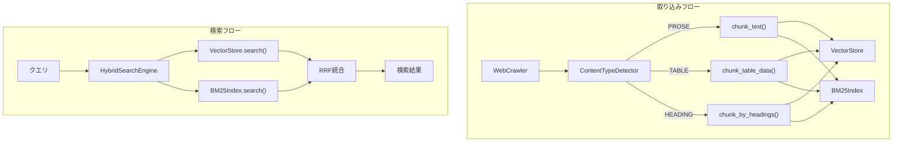

# F9-3: RAGチャンキング改善とハイブリッド検索

## 概要

RAG検索精度を向上させるため、テーブルデータを考慮したチャンキング戦略の改善と、BM25（キーワード検索）とベクトル検索を組み合わせたハイブリッド検索を実装する。

## 背景

### 発見された問題 (Issue #195)

PR #192 のテスト中に、RAG検索精度の根本的な課題が発見された:

- クエリ「りゅうおう」で、「りゅうおう」を含むドキュメントが distance 0.70 となり閾値(0.5)を超える
- 同じテキストを含むのにマッチしない

### 原因分析

当初はEmbeddingモデルの日本語対応問題と考えたが、調査の結果**チャンキングとコンテンツ構造の問題**と判明。

```
チャンク長: 342〜500文字
内容: 数値テーブルデータが大半（90 75 100 15 15 15 0 0 0 など）
「りゅうおう」はチャンクの一部分にすぎない
```

**問題のメカニズム**:

1. クエリ「りゅうおう」→ 短いテキストのベクトル
2. チャンク → 数値だらけの長いテキストのベクトル
3. ベクトル間の距離が大きくなる（意味的に異なる）

純粋なベクトル検索は「キーワード完全一致」を保証しない。

### 解決アプローチ

1. **チャンキング戦略の改善** - テーブルデータを別扱い、見出し単位で分割
2. **ハイブリッド検索** - BM25（キーワード検索）+ ベクトル検索の併用

## ユーザーストーリー

- ユーザーとして、テーブルデータを含むページからも正確に情報を検索したい
- ユーザーとして、固有名詞（キャラクター名など）で検索したとき、その名前を含む情報を確実に見つけたい
- ユーザーとして、意味的に関連する情報も、キーワードが完全一致する情報も、両方検索結果に含めてほしい

## 技術仕様

### Phase 1: チャンキング改善

#### 1.1 構造化データの検出と分離

```python
def detect_content_type(text: str) -> ContentType:
    """テキストの内容タイプを検出する.

    Returns:
        ContentType: PROSE（通常テキスト）, TABLE（テーブルデータ）, MIXED（混合）
    """
```

**テーブルデータの検出ヒューリスティック**:

- 数値が行の大半を占める（70%以上）
- タブ/スペース区切りの列構造
- 行ごとのパターンが類似

#### 1.2 見出しベースのチャンキング

```python
def chunk_by_headings(
    text: str,
    max_chunk_size: int = 500,
) -> list[HeadingChunk]:
    """見出し単位でテキストを分割する.

    - Markdown見出し（#, ##, ###）を検出
    - HTML見出し（<h1>〜<h6>）を検出
    - 見出し＋本文をセットでチャンク化
    - 見出しがない場合は従来のチャンキングにフォールバック
    """
```

```python
@dataclass
class HeadingChunk:
    """見出し付きチャンク."""
    heading: str          # 見出しテキスト（検索用メタデータ）
    content: str          # 本文
    heading_level: int    # 見出しレベル（1〜6）
    parent_headings: list[str]  # 親見出しの階層（パンくずリスト用）
```

#### 1.3 テーブルデータの特別処理

```python
def chunk_table_data(
    text: str,
    header_row: str | None = None,
    row_context_size: int = 3,
) -> list[TableChunk]:
    """テーブルデータをチャンキングする.

    - ヘッダー行を各チャンクに付加
    - 行単位で分割（意味的な単位を保持）
    - 前後の行をコンテキストとして含める
    """
```

```python
@dataclass
class TableChunk:
    """テーブルチャンク."""
    header: str           # ヘッダー行
    rows: list[str]       # データ行
    entity_name: str      # 行の識別子（キャラクター名など）
```

**テーブルチャンクの例**:

元データ:

```text
名前    HP  MP  攻撃力
りゅうおう  90  75  100
スライム    10  5   8
```

チャンク1:

```text
名前: りゅうおう
HP: 90, MP: 75, 攻撃力: 100
```

チャンク2:

```text
名前: スライム
HP: 10, MP: 5, 攻撃力: 8
```

### Phase 2: ハイブリッド検索

#### 2.1 BM25インデックス

```python
class BM25Index:
    """BM25ベースのキーワード検索インデックス.

    仕様: docs/specs/f9-rag-chunking-hybrid.md
    """

    def __init__(
        self,
        k1: float = 1.5,  # 用語頻度の飽和パラメータ
        b: float = 0.75,  # 文書長の正規化パラメータ
    ) -> None: ...

    def add_documents(
        self,
        documents: list[tuple[str, str]],  # (id, text)
    ) -> None:
        """ドキュメントをインデックスに追加する."""

    def search(
        self,
        query: str,
        n_results: int = 10,
    ) -> list[BM25Result]:
        """クエリでキーワード検索を実行する."""

    def delete_by_source(self, source_url: str) -> int:
        """ソースURL指定でドキュメントを削除する."""
```

**日本語トークナイザ**:

```python
def tokenize_japanese(text: str) -> list[str]:
    """日本語テキストをトークン化する.

    - 形態素解析（fugashi/MeCab）を使用
    - 名詞・動詞・形容詞のみ抽出
    - ストップワード除去
    """
```

**依存パッケージ**:

```toml
# pyproject.toml に追加
dependencies = [
    "rank-bm25>=0.2,<1",  # BM25実装
    "fugashi>=1.3,<2",    # 形態素解析
    "unidic-lite>=1.0,<2", # 辞書（軽量版）
]
```

#### 2.2 ハイブリッド検索エンジン

```python
class HybridSearchEngine:
    """ベクトル検索とBM25を組み合わせたハイブリッド検索.

    仕様: docs/specs/f9-rag-chunking-hybrid.md
    """

    def __init__(
        self,
        vector_store: VectorStore,
        bm25_index: BM25Index,
        vector_weight: float = 0.5,  # ベクトル検索の重み（0.0〜1.0）
        rrf_k: int = 60,  # RRFの定数
    ) -> None: ...

    async def search(
        self,
        query: str,
        n_results: int = 5,
        similarity_threshold: float | None = None,
    ) -> list[HybridSearchResult]:
        """ハイブリッド検索を実行する.

        1. ベクトル検索で候補を取得
        2. BM25検索で候補を取得
        3. RRF（Reciprocal Rank Fusion）でスコアを統合
        4. 統合スコアでソート
        """
```

**Reciprocal Rank Fusion (RRF)**:

```python
def reciprocal_rank_fusion(
    rankings: list[list[str]],  # 各検索結果のIDリスト（ランク順）
    k: int = 60,
) -> dict[str, float]:
    """RRFでスコアを統合する.

    RRF_score(d) = Σ 1 / (k + rank(d))

    Args:
        rankings: 各検索手法のランキング結果
        k: 定数（デフォルト: 60、論文推奨値）

    Returns:
        ドキュメントID → 統合スコアのマッピング
    """
```

#### 2.3 設定項目

| 設定名 | 型 | デフォルト | 説明 |
|--------|---|----------|------|
| `RAG_HYBRID_SEARCH_ENABLED` | bool | `false` | ハイブリッド検索の有効/無効 |
| `RAG_VECTOR_WEIGHT` | float | `0.5` | ベクトル検索の重み（0.0〜1.0） |
| `RAG_BM25_K1` | float | `1.5` | BM25の用語頻度パラメータ |
| `RAG_BM25_B` | float | `0.75` | BM25の文書長正規化パラメータ |
| `RAG_RRF_K` | int | `60` | RRFの定数 |

### Phase 3: テストケースページ

#### 3.1 評価用テストページの作成

外部サイトを繰り返しクロールする問題を回避するため、評価用のテストページを作成する。

**ファイル**: `tests/fixtures/rag_test_pages/`

```
rag_test_pages/
├── index.html              # リンク集ページ
├── prose_only.html         # 通常テキストのみ
├── table_numeric.html      # 数値テーブル（ゲームステータスなど）
├── table_mixed.html        # テキスト＋数値の混合テーブル
├── headings_deep.html      # 深い見出し階層
├── japanese_names.html     # 日本語固有名詞（キャラクター名など）
├── long_document.html      # 長文ドキュメント
└── edge_cases.html         # エッジケース（空、特殊文字など）
```

#### 3.2 評価データセット

**ファイル**: `tests/fixtures/rag_chunking_evaluation.json`

```json
{
  "test_cases": [
    {
      "id": "tc1",
      "description": "テーブル内のキャラクター名検索",
      "page": "table_numeric.html",
      "query": "りゅうおう",
      "expected_in_results": true,
      "expected_keywords": ["りゅうおう", "HP", "MP"],
      "max_distance": 0.5
    },
    {
      "id": "tc2",
      "description": "複数行にまたがる情報の検索",
      "page": "table_mixed.html",
      "query": "スライムの攻撃力",
      "expected_in_results": true,
      "expected_keywords": ["スライム", "攻撃力"]
    }
  ]
}
```

#### 3.3 自動評価スクリプト

```python
async def run_chunking_evaluation(
    rag_service: RAGKnowledgeService,
    test_pages_dir: str,
    dataset_path: str,
) -> ChunkingEvaluationReport:
    """チャンキング改善の評価を実行する.

    1. テストページをクロール・取り込み
    2. 各テストケースのクエリを実行
    3. 期待結果との照合
    4. レポート生成
    """
```

## アーキテクチャ



## ディレクトリ構成

```
ai-assistant/
├── src/
│   ├── rag/
│   │   ├── chunker.py              # 既存（拡張）
│   │   ├── content_detector.py     # 新規: コンテンツタイプ検出
│   │   ├── table_chunker.py        # 新規: テーブルチャンキング
│   │   ├── heading_chunker.py      # 新規: 見出しチャンキング
│   │   ├── bm25_index.py           # 新規: BM25インデックス
│   │   ├── hybrid_search.py        # 新規: ハイブリッド検索
│   │   └── vector_store.py         # 既存
│   └── services/
│       └── rag_knowledge.py        # 既存（拡張）
├── tests/
│   ├── fixtures/
│   │   ├── rag_test_pages/         # 新規: テストページ
│   │   └── rag_chunking_evaluation.json  # 新規: 評価データセット
│   ├── test_content_detector.py    # 新規
│   ├── test_table_chunker.py       # 新規
│   ├── test_heading_chunker.py     # 新規
│   ├── test_bm25_index.py          # 新規
│   └── test_hybrid_search.py       # 新規
└── docs/
    └── specs/
        └── f9-rag-chunking-hybrid.md  # この仕様書
```

## 受け入れ条件

### チャンキング改善

- [ ] **AC1**: テーブルデータを検出し、行単位でチャンキングできること
- [ ] **AC2**: 各テーブルチャンクにヘッダー行が付加されること
- [ ] **AC3**: 見出し単位でのチャンキングができること
- [ ] **AC4**: 見出しチャンクに親見出しの階層情報が含まれること
- [ ] **AC5**: 従来のチャンキングとの後方互換性が保たれること

### ハイブリッド検索

- [ ] **AC6**: BM25インデックスの追加・検索・削除ができること
- [ ] **AC7**: 日本語テキストのトークナイズができること
- [ ] **AC8**: RRFによるスコア統合ができること
- [ ] **AC9**: `RAG_HYBRID_SEARCH_ENABLED=false` 時は従来のベクトル検索のみ動作すること
- [ ] **AC10**: 重み設定（`RAG_VECTOR_WEIGHT`）でベクトル検索とBM25の比率を調整できること

### テストケース

- [ ] **AC11**: テストページを使ったローカル評価ができること
- [ ] **AC12**: 「りゅうおう」クエリでテーブル内のデータが検索できること
- [ ] **AC13**: キーワード完全一致のケースで確実にヒットすること

## 実装ステップ

### Step 1: テストケースページの作成 (#197)

1. `tests/fixtures/rag_test_pages/` にテストページを作成
2. 評価データセット `rag_chunking_evaluation.json` を作成
3. ローカルHTTPサーバーでのテスト方法を文書化

### Step 2: コンテンツタイプ検出 (#198)

1. `src/rag/content_detector.py` を作成
2. テーブルデータ検出ヒューリスティックを実装
3. テスト作成

### Step 3: テーブルチャンキング (#199)

1. `src/rag/table_chunker.py` を作成
2. ヘッダー行の抽出と各行への付加を実装
3. テスト作成

### Step 4: 見出しチャンキング (#200)

1. `src/rag/heading_chunker.py` を作成
2. Markdown/HTML見出しの検出を実装
3. テスト作成

### Step 5: BM25インデックス (#201)

1. `rank-bm25`, `fugashi` を依存に追加
2. `src/rag/bm25_index.py` を作成
3. 日本語トークナイザを実装
4. テスト作成

### Step 6: ハイブリッド検索 (#202)

1. `src/rag/hybrid_search.py` を作成
2. RRF統合を実装
3. `RAGKnowledgeService` に統合
4. テスト作成

### Step 7: 評価と閾値調整 (#203)

1. 評価スクリプトを作成
2. テストページでの評価を実行
3. 閾値・重みを調整
4. 結果をドキュメント化

## 注意事項

1. **後方互換性**: `RAG_HYBRID_SEARCH_ENABLED=false` がデフォルト。既存の動作に影響しない
2. **パフォーマンス**: BM25インデックスはインメモリ。大規模データセットでは永続化を検討
3. **辞書サイズ**: `unidic-lite` は約50MB。本番環境でのディスク使用量に注意
4. **トークナイザの初期化**: `fugashi` の初期化は重いため、シングルトンパターンで管理

## 関連

- Issue #195 - 本Issue
- Issue #194 - Embeddingモデル変更（クローズ検討）
- Issue #176 - RAG Phase 2（閾値フィルタリング）
- `docs/specs/f9-rag-knowledge.md` - RAG基本仕様

## 変更履歴

| 日付 | 内容 |
|------|------|
| 2026-02-09 | 初版作成 (Issue #195) |
