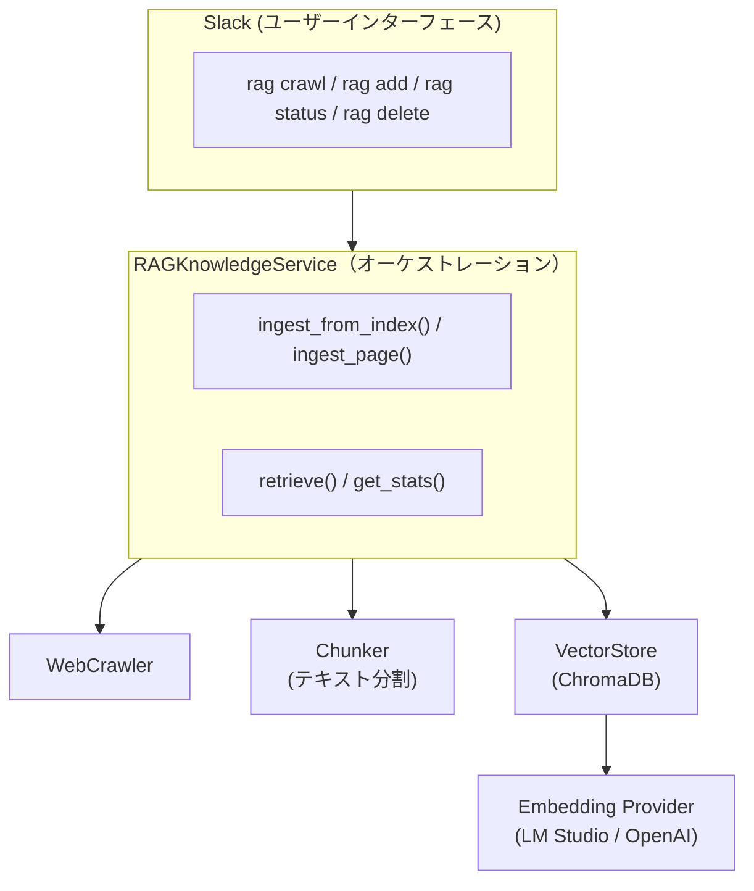
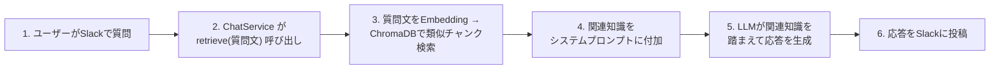

# F9: RAGナレッジ機能

## 概要

外部Webページから収集した知識をベクトルDBに蓄積し、ユーザーの質問に関連する情報を自動検索してチャット応答に活用するRAG（Retrieval-Augmented Generation）機能を実装する。

## 背景

- 現在のアシスタントはLLMの学習済み知識とリアルタイムの会話コンテキストのみで応答している
- 特定のWebサイトの情報を知識ベースとして蓄積し、ユーザーの質問に関連する情報を自動的に検索・活用できるようにしたい
- Embeddingモデルはローカル（LM Studio）とオンライン（OpenAI）を切替可能にし、既存のLLM使い分けルールと整合させる
- ChromaDB（SQLiteベース）を採用し、既存プロジェクトの軽量構成と親和させる

### RAGアーキテクチャの概要



**チャット応答時のフロー**:



## ユーザーストーリー

- ユーザーとして、Slackでボットに知識ベースの内容について質問すると、取り込み済みWebページの情報に基づいた回答を得たい
- ユーザーとして、リンク集ページのURLを指定するだけで、配下の記事を一括で知識ベースに取り込みたい
- ユーザーとして、単一のWebページを手軽に知識ベースに追加したい
- ユーザーとして、知識ベースの現在の状態（件数等）を確認したい
- ユーザーとして、不要になった知識をソースURL単位で削除したい
- 管理者として、RAG機能の有効/無効を `.env` で制御したい
- 管理者として、Embeddingプロバイダーをローカルとオンラインで切り替えたい

## 入出力仕様

### Slackコマンド

```
@bot rag crawl <URL> [パターン]  — リンク集ページからクロール＆取り込み
@bot rag add <URL>               — 単一ページ取り込み
@bot rag status                  — ナレッジベース統計表示
@bot rag delete <URL>            — ソースURL指定で削除
```

### 入力例

```
ユーザー: @bot rag crawl https://example.com/articles
ユーザー: @bot rag crawl https://example.com/docs \.html$
ユーザー: @bot rag add https://example.com/guide/getting-started
ユーザー: @bot rag status
ユーザー: @bot rag delete https://example.com/guide/getting-started
```

### 処理フロー（rag crawl）

```
1. ユーザーが @bot rag crawl <URL> [パターン] を送信
2. ハンドラが RAGKnowledgeService.ingest_from_index() を呼び出し
3. WebCrawler がリンク集ページからURLリストを抽出（パターンでフィルタ）
4. WebCrawler が各ページの本文テキストを並行クロール
5. Chunker がテキストをオーバーラップ付きチャンクに分割
6. VectorStore がチャンクをEmbedding → ChromaDBに保存
7. 結果サマリーをSlackに返答
```

### 出力例（正常系）

#### rag crawl（リアルタイム進捗表示）

```
ユーザー: @bot rag crawl https://example.com/docs

bot: クロールを開始しました... (リンク収集中)
  └─ [親スレッド内に進捗メッセージを投稿]

  └─ 5ページ取得中...
  └─ 10ページ取得中...
  └─ 完了: 15ページ / 128チャンク / エラー: 2件
```

**進捗フィードバック仕様**:

- **開始メッセージ**: コマンド受信後、即座に「クロールを開始しました... (リンク収集中)」を投稿
- **進捗メッセージ**: クロール中、一定間隔で進捗状況をスレッド内に投稿
  - 形式: `└─ {取得済みページ数}ページ取得中...`
  - 投稿間隔: `RAG_CRAWL_PROGRESS_INTERVAL` ページごと（デフォルト: 5）
- **完了メッセージ**: 処理完了後、結果サマリーをスレッド内に投稿
  - 形式: `└─ 完了: {ページ数}ページ / {チャンク数}チャンク / エラー: {エラー数}件`

**設計ポイント**:

- スレッド内投稿により、チャンネルへの通知過多を防止
- リアクション絵文字ではなくメッセージにすることで、詳細な進捗情報を提供
- 開始メッセージで即座にフィードバックを返し、ユーザーの不安を解消
- 進捗間隔は設定可能（大量ページクロール時のメッセージ数を制御）

#### rag add / status / delete

```
bot: ページを取り込みました: https://example.com/page (8チャンク)

bot: ナレッジベース統計:
     総チャンク数: 342
     ソースURL数: 20

bot: 削除しました: https://example.com/guide/getting-started (8チャンク)
```

### 出力例（エラー系）

```
bot: エラー: RAG機能が無効です。管理者に連絡してください。

bot: エラー: クロールに失敗しました。
     原因: 接続がタイムアウトしました (30秒)

bot: エラー: ページの取り込みに失敗しました。
     URL: https://example.com/broken-page
     原因: HTTP 404 Not Found
```

### チャット応答（自動統合）

```
ユーザー: @bot Pythonのasync/awaitについて教えて

（RAGが有効で、関連知識がある場合）
→ システムプロンプトに関連チャンクが自動注入される
→ LLMが取り込み済み知識を踏まえて応答

（RAGが無効、または関連知識がない場合）
→ 従来通りLLMの学習済み知識のみで応答
```

## 技術仕様

### 依存パッケージ

```toml
# pyproject.toml に追加
dependencies = [
    "chromadb>=0.5,<1",
    "beautifulsoup4>=4.12,<5",
]
```

### ディレクトリ構成

```
ai-assistant/
├── src/
│   ├── embedding/                  # Embeddingプロバイダー（新規）
│   │   ├── __init__.py
│   │   ├── base.py                 # EmbeddingProvider 抽象基底クラス
│   │   ├── lmstudio_embedding.py   # LM Studio経由
│   │   ├── openai_embedding.py     # OpenAI Embeddings API
│   │   └── factory.py              # get_embedding_provider()
│   ├── rag/                        # RAGインフラ（新規）
│   │   ├── __init__.py
│   │   ├── chunker.py              # テキストチャンキング
│   │   └── vector_store.py         # ChromaDBラッパー
│   ├── services/
│   │   ├── web_crawler.py          # Webクローラー（新規）
│   │   └── rag_knowledge.py        # RAGナレッジサービス（新規）
│   ├── config/
│   │   └── settings.py             # RAG設定追加
│   └── slack/
│       └── handlers.py             # ragコマンドハンドラ追加
├── tests/
│   ├── test_embedding.py
│   ├── test_chunker.py
│   ├── test_vector_store.py
│   ├── test_web_crawler.py
│   └── test_rag_knowledge.py
└── .env.example                    # RAG設定項目追加
```

### Embeddingプロバイダー (`src/embedding/`)

既存の `LLMProvider` とは入出力が異なるため、独立した `EmbeddingProvider` 階層として実装する。

#### 抽象基底クラス (`src/embedding/base.py`)

```python
class EmbeddingProvider(abc.ABC):
    """Embedding生成の抽象基底クラス.

    仕様: docs/specs/f9-rag-knowledge.md
    """

    @abc.abstractmethod
    async def embed(self, texts: list[str]) -> list[list[float]]:
        """テキストリストをベクトルリストに変換する."""

    @abc.abstractmethod
    async def is_available(self) -> bool:
        """プロバイダーが利用可能かチェックする."""
```

**`LLMProvider` と別階層にする理由**:

- chat completionとembeddingは入出力が根本的に異なる（`Message→str` vs `str→float[]`）
- モデルも別（chat用モデルとembedding用モデル）
- 既存の `LLMProvider` 実装を変更不要

#### LM Studio Embedding (`src/embedding/lmstudio_embedding.py`)

```python
class LMStudioEmbedding(EmbeddingProvider):
    """LM Studio経由のEmbeddingプロバイダー.

    仕様: docs/specs/f9-rag-knowledge.md
    """

    def __init__(
        self,
        base_url: str = "http://localhost:1234/v1",
        model: str = "nomic-embed-text",
    ) -> None:
        self._client = AsyncOpenAI(base_url=base_url, api_key="lm-studio")
        self._model = model

    async def embed(self, texts: list[str]) -> list[list[float]]:
        response = await self._client.embeddings.create(
            model=self._model, input=texts,
        )
        return [item.embedding for item in response.data]

    async def is_available(self) -> bool:
        # モデル一覧取得で疎通確認
        ...
```

#### OpenAI Embedding (`src/embedding/openai_embedding.py`)

`AsyncOpenAI(api_key=...)` を使用し、同じインターフェースで OpenAI Embeddings API を呼び出す。

#### ファクトリ関数 (`src/embedding/factory.py`)

```python
def get_embedding_provider(
    settings: Settings,
    provider_setting: Literal["local", "online"],
) -> EmbeddingProvider:
    """設定に応じたEmbeddingプロバイダーを返す.

    - "local": LMStudioEmbedding
    - "online": OpenAIEmbedding
    """
```

既存の `src/llm/factory.py` の `get_provider_for_service()` と同じパターン。

### テキストチャンキング (`src/rag/chunker.py`)

```python
def chunk_text(
    text: str,
    chunk_size: int = 500,
    chunk_overlap: int = 50,
) -> list[str]:
    """テキストをオーバーラップ付きチャンクに分割する.

    仕様: docs/specs/f9-rag-knowledge.md

    分割優先順: 段落 → 文 → 文字数
    外部依存なし（LangChain不要）。
    """
```

- 段落（空行区切り）でまず分割
- 段落が `chunk_size` を超える場合は文（句点区切り）で分割
- それでも超える場合は文字数で分割
- 各チャンクは `chunk_overlap` 文字分オーバーラップさせ、文脈の断絶を軽減

### ChromaDB ベクトルストア (`src/rag/vector_store.py`)

#### データ型

```python
@dataclass
class DocumentChunk:
    """ベクトルストアに格納するチャンク."""
    id: str                           # ユニークID（URLハッシュ + chunk_index）
    text: str                         # チャンク本文
    metadata: dict[str, str | int]    # source_url, title, chunk_index, crawled_at

@dataclass
class RetrievalResult:
    """検索結果."""
    text: str
    metadata: dict[str, str | int]
    distance: float                   # 小さいほど類似度が高い
```

#### VectorStoreクラス

```python
class VectorStore:
    """ChromaDBベースのベクトルストア.

    仕様: docs/specs/f9-rag-knowledge.md
    """

    def __init__(
        self,
        embedding_provider: EmbeddingProvider,
        persist_directory: str = "./chroma_db",
        collection_name: str = "knowledge",
    ) -> None:
        self._embedding = embedding_provider
        self._client = chromadb.PersistentClient(path=persist_directory)
        self._collection = self._client.get_or_create_collection(
            name=collection_name,
            metadata={"hnsw:space": "cosine"},
        )

    async def add_documents(self, chunks: list[DocumentChunk]) -> int:
        """チャンクをEmbedding→ベクトルストアに追加. Returns: 追加件数."""

    async def search(self, query: str, n_results: int = 5) -> list[RetrievalResult]:
        """クエリに類似するチャンクを検索する."""

    async def delete_by_source(self, source_url: str) -> int:
        """ソースURL指定でチャンクを削除. Returns: 削除件数."""

    def get_stats(self) -> dict[str, int]:
        """ナレッジベース統計（総チャンク数等）を返す."""
```

**設計ポイント**:

- ChromaDBは同期APIのため `asyncio.to_thread()` でラップ（`feed_collector.py` の `feedparser.parse` と同パターン）
- SQLAlchemyモデルは追加しない（ChromaDB自身がSQLiteに永続化するため）
- Embeddingは `VectorStore` 内で呼び出す（外部から渡す必要なし）

### Webクローラー (`src/services/web_crawler.py`)

```python
@dataclass
class CrawledPage:
    """クロール結果."""
    url: str
    title: str
    text: str          # 抽出済みプレーンテキスト
    crawled_at: str    # ISO 8601 タイムスタンプ

class WebCrawler:
    """Webページクローラー.

    仕様: docs/specs/f9-rag-knowledge.md
    """

    def __init__(
        self,
        timeout: float = 30.0,
        max_pages: int = 50,
        crawl_delay: float = 1.0,
    ) -> None:
        self._timeout = aiohttp.ClientTimeout(total=timeout)
        self._max_pages = max_pages
        self._crawl_delay = crawl_delay

    def validate_url(self, url: str) -> str:
        """URL検証. 問題なければ正規化済みURLを返す.

        検証内容:
        - スキームが http または https であること
        - ホスト名がプライベートIP/localhost/リンクローカルでないこと（SSRF対策）
        - フラグメント(`#...`)を `urllib.parse.urldefrag()` で除去し、正規化済みURLを返す
        - 検証失敗時は ValueError を送出
        """

    async def crawl_index_page(
        self, index_url: str, url_pattern: str = "",
    ) -> list[str]:
        """リンク集ページ内の <a> タグからURLリストを抽出する（深度1のみ、再帰クロールは行わない）.

        - index_url を validate_url() で検証（http/https スキームのみ許可）
        - ページ内の <a> タグから抽出した各リンクURLも validate_url() で検証・正規化し、不正なURLは除外する
        - validate_url() によるフラグメント除去で、同一ページのアンカー違い（例: `/page#a`, `/page#b`）は1つのURLに正規化される
        - 抽出URL数が max_pages を超える場合は先頭 max_pages 件に制限

        Args:
            index_url: リンク集ページのURL
            url_pattern: 正規表現パターンでリンクをフィルタリング（任意）
        """

    async def crawl_page(self, url: str) -> CrawledPage | None:
        """単一ページの本文テキストを取得する. 失敗時は None.

        - validate_url() でURL検証後にHTTPアクセスを行う
        """

    async def crawl_pages(self, urls: list[str]) -> list[CrawledPage]:
        """複数ページを並行クロールする.

        - 各リクエスト間に crawl_delay 秒の待機を挿入（同一ドメインへの負荷軽減）
        """
```

**セキュリティ要件（SSRF対策）**:

Slackコマンド経由でユーザーが任意のURLを指定できるため、サーバーサイドからのリクエストを安全に制限する。

- **スキーム制限**: `http://` と `https://` のみ許可。`file:`, `ftp:` 等は拒否する
- **プライベートIPブロック**: DNS解決後のIPアドレスを検証し、以下へのアクセスを拒否する
  - localhost / 127.0.0.0/8（ループバック）
  - 10.0.0.0/8, 172.16.0.0/12, 192.168.0.0/16（RFC1918 プライベート）
  - 169.254.0.0/16（リンクローカル、AWS metadata endpoint 等）
  - IPv6 ループバック (::1)、ユニークローカル (fc00::/7)、リンクローカル (fe80::/10)
- **リダイレクト無効化**: SSRFを防ぐため、HTTPリダイレクトの追従を無効化する

### URL安全性チェック（Google Safe Browsing API）

マルウェア・フィッシングサイトへのアクセスを防ぐため、Google Safe Browsing APIによる事前判定機能を提供する。

**設定項目:**

| 設定名 | 型 | デフォルト | 説明 |
|--------|---|----------|------|
| `RAG_URL_SAFETY_CHECK` | bool | `false` | URL安全性チェックの有効/無効 |
| `GOOGLE_SAFE_BROWSING_API_KEY` | str | `""` | Google Safe Browsing APIキー |
| `RAG_URL_SAFETY_CACHE_TTL` | int | `300` | キャッシュTTL（秒） |
| `RAG_URL_SAFETY_FAIL_OPEN` | bool | `true` | API障害時にフェイルオープンするか |
| `RAG_URL_SAFETY_TIMEOUT` | float | `5.0` | APIタイムアウト（秒） |

**動作:**

1. `rag add` / `rag crawl` コマンド実行時、各URLをGoogle Safe Browsing APIで検証
2. 脅威タイプ（MALWARE, SOCIAL_ENGINEERING, UNWANTED_SOFTWARE, POTENTIALLY_HARMFUL_APPLICATION）のいずれかが検出された場合、そのURLのクロールを拒否
3. API障害時は `RAG_URL_SAFETY_FAIL_OPEN` 設定に従う（デフォルト: チェックをスキップしてクロール続行）

**キャッシュ:**

- APIレート制限対策として、判定結果をインメモリキャッシュ
- デフォルトTTL: 300秒（`RAG_URL_SAFETY_CACHE_TTL` で変更可能）
- 最大エントリ数: 1000件（上限到達時は最も古いエントリを削除するLRU方式）

**APIキー取得手順:**

1. [Google Cloud Console](https://console.cloud.google.com/) にアクセス
2. プロジェクトを作成または選択
3. 「APIとサービス」→「ライブラリ」から「Safe Browsing API」を検索し有効化
4. 「APIとサービス」→「認証情報」→「認証情報を作成」→「APIキー」を選択
5. 作成されたAPIキーを `.env` の `GOOGLE_SAFE_BROWSING_API_KEY` に設定
6. （推奨）APIキーの制限を設定し、Safe Browsing APIのみに限定

**利用制限:**

- 無料枠: 1日あたり10,000リクエスト
- 超過時は課金が発生（詳細は[Google Cloud料金ページ](https://cloud.google.com/safe-browsing/pricing)を参照）

**クロール制御**:

- **ページ数上限**: 1回の `rag crawl` で取得するページ数を `RAG_MAX_CRAWL_PAGES`（デフォルト: 50）で制限する
- **リクエスト間隔**: 同一ドメインへの連続リクエスト間に `RAG_CRAWL_DELAY_SEC`（デフォルト: 1.0秒）の待機を挿入し、対象サーバーへの負荷を軽減する

**robots.txt対応方針**:

- 初期実装では `robots.txt` の解析・遵守は行わない
- User-Agentはaiohttpのデフォルト値を使用（ボット特定を回避しつつ、プログラムからのアクセスであることは示す）
- 将来的に `robots.txt` の解析・遵守機能を追加予定

**HTML本文抽出ロジック（BeautifulSoup4使用）**:

1. `<script>`, `<style>`, `<nav>`, `<header>`, `<footer>` タグを除去
2. `<article>` → `<main>` → `<body>` の優先順で本文領域を特定
3. テキストを抽出してクリーンアップ

**並行制御**:

- `asyncio.Semaphore` で同時接続数を制限（デフォルト: 5）
- 対象サーバーへの負荷を配慮

**エラー耐性**:

- ページ単位で失敗を隔離し、他のページの処理は継続
- 失敗時は `None` を返す（`OgpExtractor` と同パターン）

**既存パターンの再利用**:

| 参照元 | 用途 |
|--------|------|
| `src/services/ogp_extractor.py` — aiohttp + タイムアウト | HTTPクライアントパターン |
| `src/services/ogp_extractor.py` — `errors="replace"` | エラー耐性のあるテキストデコード |
| `src/services/feed_collector.py` — エラー隔離 | ページ単位の try/except + continue |

### RAGナレッジサービス (`src/services/rag_knowledge.py`)

各コンポーネントを統合するオーケストレーションサービス。

```python
class RAGKnowledgeService:
    """RAGナレッジ管理サービス.

    仕様: docs/specs/f9-rag-knowledge.md
    """

    def __init__(
        self,
        vector_store: VectorStore,
        web_crawler: WebCrawler,
        chunk_size: int = 500,
        chunk_overlap: int = 50,
    ) -> None: ...

    async def ingest_from_index(
        self, index_url: str, url_pattern: str = "",
    ) -> dict[str, int]:
        """リンク集ページから一括取り込み.

        Returns:
            {"pages_crawled": N, "chunks_stored": M, "errors": E}
        """

    async def ingest_page(self, url: str) -> int:
        """単一ページ取り込み.

        同一URLの再取り込み時は、新規チャンクをupsert後に古いチャンクを削除する
        （データロス防止のため、先に追加してから不要なチャンクを削除）。
        Returns: チャンク数.
        Raises: ValueError（URL検証失敗時）
        """

    async def retrieve(self, query: str, n_results: int = 5) -> str:
        """関連知識を検索し、フォーマット済みテキストとして返す.

        ChatService から呼ばれる。結果なしの場合は空文字列。
        """

    async def delete_source(self, source_url: str) -> int:
        """ソースURL指定で知識を削除. Returns: 削除チャンク数."""

    async def get_stats(self) -> dict[str, int]:
        """ナレッジベース統計."""
```

**`retrieve()` の出力フォーマット**:

検索結果のチャンクを以下の形式で連結し、1つの文字列として返す:

```
--- 参考情報 1 ---
出典: https://example.com/article1
{chunk_text}

--- 参考情報 2 ---
出典: https://example.com/article2
{chunk_text}
```

結果が0件の場合は空文字列を返す。

**同一URLの再取り込み**:

`ingest_page()` および `ingest_from_index()` で同一URLを再取り込みする場合、新規チャンクをupsert（`VectorStore.add_documents()` で同一ID上書き）してから古いチャンクを `VectorStore.delete_stale_chunks()` で削除する。データロス防止のため、先に追加してから不要なチャンクを削除する順序にしている。

### ChatServiceへの自動統合 (`src/services/chat.py`)

`ThreadHistoryService` や `MCPClientManager` と同じオプショナル注入パターンで統合する。

**変更点**:

```python
class ChatService:
    def __init__(
        self,
        llm: LLMProvider,
        session_factory: async_sessionmaker[AsyncSession],
        system_prompt: str = "",
        thread_history_service: ThreadHistoryService | None = None,
        mcp_manager: MCPClientManager | None = None,
        rag_service: RAGKnowledgeService | None = None,  # 追加
    ) -> None: ...
```

**respond() 内のRAGコンテキスト注入**:

```python
async def respond(self, ...) -> str:
    # RAGコンテキスト取得（オプショナル）
    rag_context = ""
    if self._rag_service:
        try:
            rag_context = await self._rag_service.retrieve(text)
        except Exception:
            logger.exception("Failed to retrieve RAG context")

    # メッセージリスト構築
    messages: list[Message] = []
    if self._system_prompt:
        system_content = self._system_prompt
        if rag_context:
            system_content += (
                "\n\n以下は質問に関連する参考情報です。"
                "回答に役立つ場合は活用してください:\n" + rag_context
            )
        messages.append(Message(role="system", content=system_content))
    # ... 以降は既存フローと同じ
```

- `rag_service=None` 時は既存動作と完全同一（後方互換性）
- RAG検索に失敗した場合は例外をキャッチしてログ出力し、通常応答を継続

### Slackコマンドハンドラ (`src/slack/handlers.py`)

```python
_RAG_KEYWORDS = ("rag",)
```

既存の `feed` コマンドと同じルーティングパターンで `rag` コマンドを追加する。

**コマンド処理**:

- `rag crawl <URL> [パターン]`: `RAGKnowledgeService.ingest_from_index()` を呼び出し
- `rag add <URL>`: `RAGKnowledgeService.ingest_page()` を呼び出し
- `rag status`: `RAGKnowledgeService.get_stats()` を呼び出し
- `rag delete <URL>`: `RAGKnowledgeService.delete_source()` を呼び出し

`register_handlers()` に `rag_service: RAGKnowledgeService | None = None` 引数を追加。

**クロール進捗フィードバック実装**:

`rag crawl` コマンドでは、処理の進捗をスレッド内にリアルタイムで投稿する。

```python
async def _handle_rag_crawl(
    rag_service: RAGKnowledgeService,
    url: str,
    pattern: str,
    raw_url_token: str = "",
    say: object | None = None,
    thread_ts: str = "",
    progress_interval: int = 5,
) -> str:
    """RAGクロール処理（進捗フィードバック付き）.

    Args:
        rag_service: RAGナレッジサービス
        url: クロール対象URL
        pattern: URLフィルタパターン
        raw_url_token: 生のURLトークン（エラー表示用）
        say: Slack say関数（進捗メッセージ投稿用）
        thread_ts: スレッドタイムスタンプ
        progress_interval: 進捗報告間隔（ページ数）
    """
    if not url:
        # ... エラー処理 ...

    # 1. 開始メッセージを即座に投稿
    if say:
        await say(
            text="クロールを開始しました... (リンク収集中)",
            thread_ts=thread_ts,
        )

    # 2. 進捗コールバックを定義
    async def progress_callback(crawled: int, total: int) -> None:
        if say and crawled % progress_interval == 0:
            await say(
                text=f"└─ {crawled}ページ取得中...",
                thread_ts=thread_ts,
            )

    # 3. クロール実行（進捗コールバック付き）
    result = await rag_service.ingest_from_index(
        url, pattern, progress_callback=progress_callback
    )

    # 4. 完了メッセージを投稿
    if say:
        await say(
            text=(
                f"└─ 完了: {result['pages_crawled']}ページ / "
                f"{result['chunks_stored']}チャンク / "
                f"エラー: {result['errors']}件"
            ),
            thread_ts=thread_ts,
        )

    return ""  # 通常の応答は不要（進捗メッセージで対応済み）
```

**進捗コールバックの設計**:

`RAGKnowledgeService.ingest_from_index()` にオプショナルな `progress_callback` 引数を追加する:

```python
async def ingest_from_index(
    self,
    index_url: str,
    url_pattern: str = "",
    progress_callback: Callable[[int, int], Awaitable[None]] | None = None,
) -> dict[str, int]:
    """リンク集ページから一括取り込み.

    Args:
        index_url: リンク集ページのURL
        url_pattern: URLフィルタパターン
        progress_callback: 進捗コールバック関数（オプション）
            引数: (crawled: int, total: int)
            crawled: クロール完了ページ数
            total: 総ページ数

    Returns:
        結果辞書
    """
```

**スレッド投稿のポイント**:

- `thread_ts` を指定することで、元のメッセージのスレッド内に投稿される
- チャンネルへの通知を避けるため、`reply_broadcast=False` は明示不要（デフォルト動作）
- `say()` 関数は `slack_bolt` の標準機能を使用するため、追加のAPI呼び出しは不要

### サービス初期化 (`src/main.py`)

```python
# RAG初期化（有効時のみ） — MCP初期化と同パターン
rag_service: RAGKnowledgeService | None = None
if settings.rag_enabled:
    embedding = get_embedding_provider(settings, settings.embedding_provider)
    vector_store = VectorStore(embedding, settings.chromadb_persist_dir)
    web_crawler = WebCrawler(
        max_pages=settings.rag_max_crawl_pages,
        crawl_delay=settings.rag_crawl_delay_sec,
    )
    rag_service = RAGKnowledgeService(
        vector_store, web_crawler,
        chunk_size=settings.rag_chunk_size,
        chunk_overlap=settings.rag_chunk_overlap,
    )

# ChatService に注入
chat_service = ChatService(..., rag_service=rag_service)

# register_handlers に注入
handlers_module.register_handlers(..., rag_service=rag_service)
```

### 設定 (`src/config/settings.py`)

```python
class Settings(BaseSettings):
    # ... 既存の設定 ...

    # RAG
    rag_enabled: bool = False
    embedding_provider: Literal["local", "online"] = "local"
    embedding_model_local: str = "nomic-embed-text"
    embedding_model_online: str = "text-embedding-3-small"
    chromadb_persist_dir: str = "./chroma_db"
    rag_chunk_size: int = 500
    rag_chunk_overlap: int = 50
    rag_retrieval_count: int = 5
    rag_max_crawl_pages: int = 50
    rag_crawl_delay_sec: float = 1.0
    rag_crawl_progress_interval: int = 5  # 進捗報告間隔（ページ数）
```

### 環境変数 (`.env`)

```env
# RAG Knowledge
RAG_ENABLED=false
EMBEDDING_PROVIDER=local
EMBEDDING_MODEL_LOCAL=nomic-embed-text
EMBEDDING_MODEL_ONLINE=text-embedding-3-small
CHROMADB_PERSIST_DIR=./chroma_db
RAG_CHUNK_SIZE=500
RAG_CHUNK_OVERLAP=50
RAG_RETRIEVAL_COUNT=5
RAG_MAX_CRAWL_PAGES=50
RAG_CRAWL_DELAY_SEC=1.0
RAG_CRAWL_PROGRESS_INTERVAL=5
```

## 受け入れ条件

### Embeddingプロバイダー

- [ ] **AC1**: `EmbeddingProvider` 抽象基底クラスが `embed()` と `is_available()` メソッドを定義すること
- [ ] **AC2**: `LMStudioEmbedding` が LM Studio 経由でテキストをベクトルに変換できること
- [ ] **AC3**: `OpenAIEmbedding` が OpenAI Embeddings API でテキストをベクトルに変換できること
- [ ] **AC4**: `get_embedding_provider()` が `EMBEDDING_PROVIDER` 設定に応じたプロバイダーを返すこと

### テキストチャンキング

- [ ] **AC5**: `chunk_text()` がテキストを指定サイズのチャンクに分割できること
- [ ] **AC6**: チャンク間にオーバーラップが適用されること（`RAG_CHUNK_OVERLAP` で設定可能）
- [ ] **AC7**: 空文字列や短いテキストに対しても正常に動作すること

### ChromaDB ベクトルストア

- [ ] **AC8**: `VectorStore.add_documents()` でチャンクをEmbedding→ChromaDBに保存できること
- [ ] **AC9**: `VectorStore.search()` でクエリに類似するチャンクを検索できること
- [ ] **AC10**: `VectorStore.delete_by_source()` でソースURL指定のチャンクを削除できること
- [ ] **AC11**: `VectorStore.get_stats()` でナレッジベースの統計情報を取得できること

### Webクローラー

- [ ] **AC12**: `WebCrawler.crawl_index_page()` がリンク集ページからURLリストを抽出できること
- [ ] **AC13**: URLパターン（正規表現）によるフィルタリングが機能すること
- [ ] **AC14**: `WebCrawler.crawl_page()` が単一ページの本文テキストを取得できること
- [ ] **AC15**: `WebCrawler.crawl_pages()` が複数ページを並行クロールし、ページ単位のエラーを隔離すること

### セキュリティ・クロール制御

- [ ] **AC31**: `http` / `https` 以外のスキーム（`file:`, `ftp:` 等）が拒否されること
- [ ] **AC32**: プライベートIP（127.0.0.0/8, 10.0.0.0/8, 172.16.0.0/12, 192.168.0.0/16, 169.254.0.0/16）へのアクセスが拒否されること
- [ ] **AC33**: HTTPリダイレクトの追従が無効化されていること
- [ ] **AC34**: 1回のクロールで取得するページ数が `RAG_MAX_CRAWL_PAGES` で制限されること
- [ ] **AC35**: 同一ドメインへの連続リクエスト間に `RAG_CRAWL_DELAY_SEC` の待機が挿入されること
- [ ] **AC41**: `crawl_index_page()` で外部ドメインへのリンクがスキップされること（クロール範囲の制御）

### URL正規化

- [ ] **AC36**: `validate_url()` がURLからフラグメント(`#...`)を除去した正規化済みURLを返すこと
- [ ] **AC37**: `rag crawl` 実行時、同一ページのアンカー違い（例: `/page#a`, `/page#b`）が1つのページとして取り込まれること

### RAGナレッジサービス（オーケストレーション）

- [ ] **AC16**: `ingest_from_index()` がリンク集ページから記事を一括クロール→チャンキング→ベクトル保存できること
- [ ] **AC17**: `ingest_page()` が単一ページをクロール→チャンキング→ベクトル保存できること
- [ ] **AC18**: `retrieve()` がクエリに関連するチャンクを検索し、フォーマット済みテキストを返すこと
- [ ] **AC19**: `retrieve()` で結果がない場合は空文字列を返すこと

### ChatServiceへの自動統合

- [ ] **AC20**: RAG有効時、チャット応答に関連知識がシステムプロンプトとして自動注入されること
- [ ] **AC21**: RAG無効時（`rag_enabled=False`）は従来通りの動作をすること（後方互換性）
- [ ] **AC22**: RAG検索に失敗した場合、エラーログを出力し通常応答を継続すること

### Slackコマンド

- [ ] **AC23**: `rag crawl <URL> [パターン]` でリンク集ページからの一括取り込みができること
- [ ] **AC24**: `rag add <URL>` で単一ページの取り込みができること
- [ ] **AC25**: `rag status` でナレッジベースの統計が表示されること
- [ ] **AC26**: `rag delete <URL>` でソースURL指定の削除ができること

### クロール進捗フィードバック

- [ ] **AC42**: `rag crawl` コマンド実行時、即座に開始メッセージがスレッド内に投稿されること
- [ ] **AC43**: クロール中、`RAG_CRAWL_PROGRESS_INTERVAL` ページごとに進捗メッセージがスレッド内に投稿されること
- [ ] **AC44**: クロール完了時、結果サマリー（ページ数・チャンク数・エラー数）がスレッド内に投稿されること
- [ ] **AC45**: 進捗メッセージはスレッド内のみに投稿され、チャンネルへの通知は発生しないこと

### 設定

- [ ] **AC27**: `RAG_ENABLED` 環境変数でRAG機能のON/OFFを制御できること
- [ ] **AC28**: `EMBEDDING_PROVIDER` で `local` / `online` を切り替えられること
- [ ] **AC29**: チャンクサイズ・オーバーラップ・検索件数が環境変数で設定可能であること

### 類似度閾値フィルタリング（Phase 2）

- [ ] **AC38**: `RAG_SIMILARITY_THRESHOLD` 設定で閾値フィルタリングが機能すること（閾値を超えるdistanceの結果を除外）
- [ ] **AC39**: `calculate_precision_recall()` が正しく Precision/Recall/F1 を計算すること
- [ ] **AC40**: `evaluate_retrieval()` がデータセットを読み込み評価レポートを生成すること

## 使用LLMプロバイダー

| タスク | プロバイダー | 理由 |
|--------|-------------|------|
| Embedding生成 | ローカル (LM Studio + `nomic-embed-text`) またはオンライン (OpenAI `text-embedding-3-small`) | `EMBEDDING_PROVIDER` で切替 |
| チャット応答生成 | 既存の `ChatService` 設定に従う | RAG固有のLLM設定は不要 |
| Webクロール・チャンキング | なし | LLM不要（テキスト処理のみ） |

## 関連ファイル

### 新規ファイル

| ファイル | 用途 |
|---------|------|
| `src/embedding/__init__.py` | Embeddingモジュール |
| `src/embedding/base.py` | `EmbeddingProvider` 抽象基底クラス |
| `src/embedding/lmstudio_embedding.py` | LM Studio Embedding |
| `src/embedding/openai_embedding.py` | OpenAI Embedding |
| `src/embedding/factory.py` | Embeddingファクトリ関数 |
| `src/rag/__init__.py` | RAGモジュール |
| `src/rag/chunker.py` | テキストチャンキング |
| `src/rag/vector_store.py` | ChromaDBベクトルストア |
| `src/services/web_crawler.py` | Webクローラー |
| `src/services/rag_knowledge.py` | RAGナレッジサービス |
| `tests/test_embedding.py` | Embeddingテスト |
| `tests/test_chunker.py` | チャンキングテスト |
| `tests/test_vector_store.py` | ベクトルストアテスト |
| `tests/test_web_crawler.py` | Webクローラーテスト |
| `tests/test_rag_knowledge.py` | RAGナレッジサービステスト |

### 変更ファイル

| ファイル | 変更内容 |
|---------|---------|
| `pyproject.toml` | `chromadb`, `beautifulsoup4` 依存追加 |
| `src/config/settings.py` | RAG設定項目追加 |
| `src/services/chat.py` | `rag_service` オプショナル注入、RAGコンテキスト注入 |
| `src/slack/handlers.py` | `rag` コマンドハンドラ追加 |
| `src/main.py` | RAGサービス初期化・注入 |
| `.env.example` | RAG関連環境変数追加 |
| `.gitignore` | `chroma_db/` ディレクトリを除外対象に追加 |

## テスト方針

### ユニットテスト

| テストファイル | テスト | 対応AC |
|--------------|--------|--------|
| `tests/test_embedding.py` | `test_ac1_embedding_provider_interface` | AC1 |
| `tests/test_embedding.py` | `test_ac2_lmstudio_embedding_converts_text` | AC2 |
| `tests/test_embedding.py` | `test_ac3_openai_embedding_converts_text` | AC3 |
| `tests/test_embedding.py` | `test_ac4_factory_returns_correct_provider` | AC4 |
| `tests/test_chunker.py` | `test_ac5_chunk_text_splits_by_size` | AC5 |
| `tests/test_chunker.py` | `test_ac6_chunk_overlap_applied` | AC6 |
| `tests/test_chunker.py` | `test_ac7_empty_and_short_text` | AC7 |
| `tests/test_vector_store.py` | `test_ac8_add_documents` | AC8 |
| `tests/test_vector_store.py` | `test_ac9_search_similar_chunks` | AC9 |
| `tests/test_vector_store.py` | `test_ac10_delete_by_source` | AC10 |
| `tests/test_vector_store.py` | `test_ac11_get_stats` | AC11 |
| `tests/test_web_crawler.py` | `test_ac12_crawl_index_page_extracts_urls` | AC12 |
| `tests/test_web_crawler.py` | `test_ac13_url_pattern_filtering` | AC13 |
| `tests/test_web_crawler.py` | `test_ac14_crawl_page_extracts_text` | AC14 |
| `tests/test_web_crawler.py` | `test_ac15_crawl_pages_isolates_errors` | AC15 |
| `tests/test_web_crawler.py` | `test_ac31_non_http_scheme_rejected` | AC31 |
| `tests/test_web_crawler.py` | `test_localhost_rejected` | AC32 |
| `tests/test_web_crawler.py` | `test_loopback_ip_rejected` | AC32 |
| `tests/test_web_crawler.py` | `test_private_ip_rejected` | AC32 |
| `tests/test_web_crawler.py` | `test_link_local_ip_rejected` | AC32 |
| `tests/test_web_crawler.py` | `test_crawl_page_rejects_redirect` | AC33 |
| `tests/test_web_crawler.py` | `test_crawl_index_page_rejects_redirect` | AC33 |
| `tests/test_web_crawler.py` | `test_ac34_max_crawl_pages_limit` | AC34 |
| `tests/test_web_crawler.py` | `test_ac35_crawl_delay_between_requests` | AC35 |
| `tests/test_web_crawler.py` | `test_ac36_validate_url_strips_fragment` | AC36 |
| `tests/test_web_crawler.py` | `test_ac37_crawl_index_page_deduplicates_fragment_urls` | AC37 |
| `tests/test_rag_knowledge.py` | `test_ac36_ingest_page_normalizes_fragment_url` | AC36 |
| `tests/test_rag_knowledge.py` | `test_ac37_ingest_crawled_page_uses_normalized_url_for_hash` | AC37 |
| `tests/test_rag_knowledge.py` | `test_ac37_delete_source_normalizes_fragment_url` | AC37 |

### 統合テスト

| テストファイル | テスト | 対応AC |
|--------------|--------|--------|
| `tests/test_rag_knowledge.py` | `test_ac16_ingest_from_index` | AC16 |
| `tests/test_rag_knowledge.py` | `test_ac17_ingest_page` | AC17 |
| `tests/test_rag_knowledge.py` | `test_ac18_retrieve_returns_formatted_text` | AC18 |
| `tests/test_rag_knowledge.py` | `test_ac19_retrieve_returns_empty_when_no_results` | AC19 |
| `tests/test_rag_knowledge.py` | `test_ac20_chat_injects_rag_context` | AC20 |
| `tests/test_rag_knowledge.py` | `test_ac21_chat_backward_compatible` | AC21 |
| `tests/test_rag_knowledge.py` | `test_ac22_rag_failure_graceful` | AC22 |
| `tests/test_rag_knowledge.py` | `test_ac23_rag_crawl_command` | AC23 |
| `tests/test_rag_knowledge.py` | `test_ac24_rag_add_command` | AC24 |
| `tests/test_rag_knowledge.py` | `test_ac25_rag_status_command` | AC25 |
| `tests/test_rag_knowledge.py` | `test_ac26_rag_delete_command` | AC26 |
| `tests/test_rag_knowledge.py` | `test_ac27_rag_enabled_toggle` | AC27 |
| `tests/test_rag_knowledge.py` | `test_ac28_embedding_provider_switch` | AC28 |
| `tests/test_rag_knowledge.py` | `test_ac29_configurable_parameters` | AC29 |

### クロール進捗フィードバック

| テストファイル | テスト | 対応AC |
|--------------|--------|--------|
| `tests/test_slack_rag_handlers.py` | `test_ac42_rag_crawl_posts_start_message` | AC42 |
| `tests/test_slack_rag_handlers.py` | `test_ac43_rag_crawl_posts_progress_messages` | AC43 |
| `tests/test_slack_rag_handlers.py` | `test_ac44_rag_crawl_posts_completion_summary` | AC44 |
| `tests/test_slack_rag_handlers.py` | `test_ac45_progress_messages_in_thread_only` | AC45 |

### テスト戦略

- **Embeddingプロバイダー**: `AsyncOpenAI` クライアントを `AsyncMock` でモック
- **VectorStore**: `chromadb.EphemeralClient()`（インメモリ）を使用し、ファイルシステム副作用を回避
- **Webクローラー**: `aiohttp.ClientSession` を `AsyncMock` でモック、HTMLサンプルで本文抽出を検証
- **RAGナレッジサービス**: VectorStore・WebCrawler をモック化してオーケストレーションを検証
- **ChatService統合**: RAGKnowledgeService をモック化してコンテキスト注入を検証

## 実装ステップ

### Step 1: Embeddingプロバイダー (#115)

1. `src/embedding/base.py` に `EmbeddingProvider` 抽象基底クラスを作成
2. `src/embedding/lmstudio_embedding.py` を実装
3. `src/embedding/openai_embedding.py` を実装
4. `src/embedding/factory.py` を実装
5. テスト作成

### Step 2: RAGインフラ (#116)

1. `src/rag/chunker.py` — テキストチャンキング実装
2. `src/rag/vector_store.py` — ChromaDBラッパー実装
3. `pyproject.toml` に `chromadb` 追加
4. テスト作成

### Step 3: Webクローラー (#117)

1. `src/services/web_crawler.py` を作成
2. `pyproject.toml` に `beautifulsoup4` 追加
3. テスト作成

### Step 4: RAGナレッジサービス＆既存コード統合 (#118)

1. `src/services/rag_knowledge.py` — オーケストレーションサービス実装
2. `src/config/settings.py` — RAG設定追加
3. `src/services/chat.py` — RAGコンテキスト注入
4. `src/slack/handlers.py` — `rag` コマンドハンドラ追加
5. `src/main.py` — RAGサービス初期化・注入
6. `.env.example` — RAG設定項目追加
7. 統合テスト作成

## 注意事項

1. **RAG_ENABLED のデフォルト**: `false`。明示的に有効化しない限り、既存の動作に一切影響しない
2. **ChromaDBの永続化**: `CHROMADB_PERSIST_DIR` で指定したディレクトリにSQLiteファイルが作成される。`.gitignore` に追加すること
3. **Embeddingモデルの整合性**: ベクトルストア内のデータは特定のEmbeddingモデルで生成されている。モデルを変更した場合、既存データとの類似度計算が不正確になるため、コレクションの再構築が必要
4. **Webクローラーの負荷配慮**: `asyncio.Semaphore` で同時接続数を制限し、対象サーバーへの過負荷を防ぐ
5. **LLMコンテキストウィンドウ**: 多数のチャンクが注入されるとトークン上限に近づく可能性がある。`RAG_RETRIEVAL_COUNT` で検索件数を制限し、対応する
6. **既存テストへの影響**: RAGサービスはオプショナル注入のため、既存テストに変更は不要
7. **robots.txt**: 初期実装では `robots.txt` の解析・遵守は行わない。User-Agentはaiohttpデフォルトを使用し、将来的に対応を検討する
8. **SSRF対策**: スキーム検証（http/httpsのみ）とリダイレクト無効化で対応。将来的にGoogle Safe Browsing APIによるURL安全性チェックを検討中（Issue #159）

## Phase 2: 評価メトリクス・類似度閾値 (#176)

### 類似度閾値フィルタリング

**設定項目:**

| 設定名 | 型 | デフォルト | 説明 |
|--------|---|----------|------|
| `RAG_SIMILARITY_THRESHOLD` | float \| None | `None` | cosine距離の閾値（0.0=完全一致、2.0=完全不一致）。この値より大きい距離の結果を除外。`None`の場合はフィルタリングなし。推奨値: `0.5`〜`0.7` |

**動作:**

1. `VectorStore.search()` で `similarity_threshold` パラメータを指定
2. 閾値フィルタリング時は多めに取得（n_results × 3、最低20件）してからフィルタリング
3. 除外件数はDEBUGログに出力

### 評価メトリクス

**Precision/Recall計測** (`src/rag/evaluation.py`):

```python
def calculate_precision_recall(
    retrieved_sources: list[str],
    expected_sources: list[str],
) -> PrecisionRecallResult:
    """Precision/Recall を計算する."""

async def evaluate_retrieval(
    rag_service: RAGKnowledgeService,
    dataset_path: str,
    n_results: int = 5,
) -> EvaluationReport:
    """データセットを使ってRAG検索の精度を評価する."""
```

**評価データセット** (`tests/fixtures/rag_evaluation_dataset.json`):

```json
{
  "queries": [
    {
      "id": "q1",
      "query": "質問文",
      "expected_sources": ["期待されるソースURL"],
      "negative_sources": ["含まれてはいけないソースURL"],
      "expected_keywords": ["回答に含まれるべきキーワード"]
    }
  ]
}
```

**戻り値型:**

```python
@dataclass
class PrecisionRecallResult:
    precision: float
    recall: float
    f1: float
    true_positives: int
    false_positives: int
    false_negatives: int

@dataclass
class EvaluationReport:
    queries_evaluated: int
    average_precision: float
    average_recall: float
    average_f1: float
    negative_source_violations: list[str]
    query_results: list[QueryEvaluationResult]
```

**expected_keywords について:**

`expected_keywords` は将来の整合性チェック機能（ハルシネーション検出）で使用予定。Phase 2 の評価メトリクスでは使用しない。

## 変更履歴

| 日付 | 内容 |
|------|------|
| 2026-02-11 | クロール進捗フィードバック機能を追加（案2: リアルタイム進捗・スレッド内投稿）(#158) |
| 2026-02-09 | Phase 2: 類似度閾値・評価メトリクス機能を追加 (#176) |
| 2026-02-09 | URL正規化（フラグメント除去）による重複取り込み防止を追加 (#161) |
