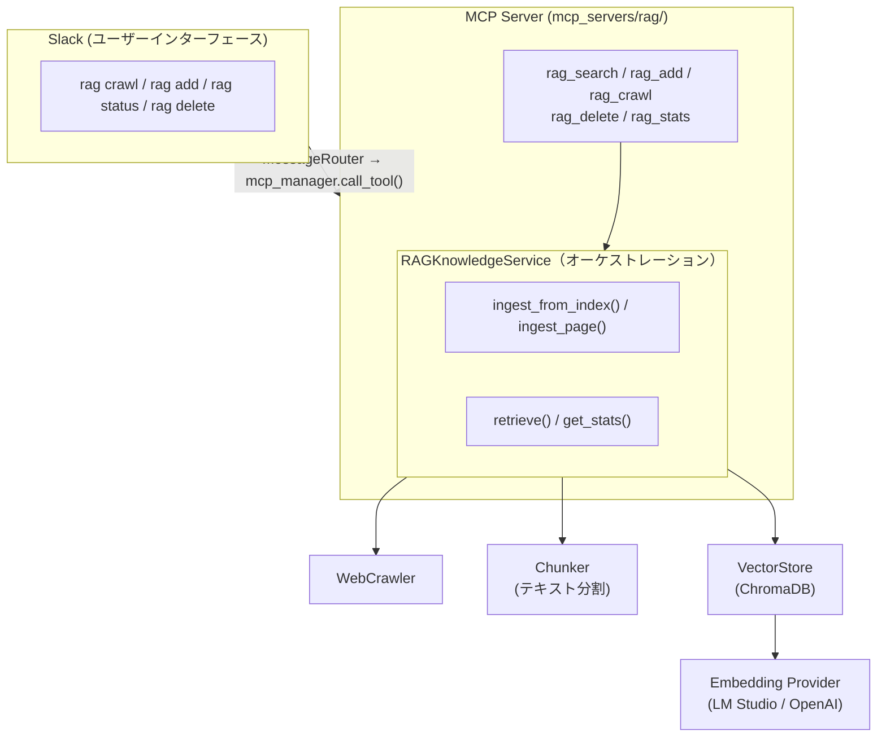
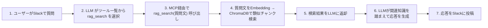
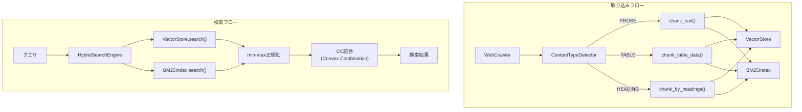

# F9: RAGナレッジ機能

## 概要

外部Webページから収集した知識をベクトルDBに蓄積し、ユーザーの質問に関連する情報を自動検索してチャット応答に活用するRAG（Retrieval-Augmented Generation）機能を実装する。

## 背景

- 現在のアシスタントはLLMの学習済み知識とリアルタイムの会話コンテキストのみで応答している
- 特定のWebサイトの情報を知識ベースとして蓄積し、ユーザーの質問に関連する情報を自動的に検索・活用できるようにしたい
- Embeddingモデルはローカル（LM Studio）とオンライン（OpenAI）を切替可能にし、既存のLLM使い分けルールと整合させる
- ChromaDB（SQLiteベース）を採用し、既存プロジェクトの軽量構成と親和させる

## ユーザーストーリー

- ユーザーとして、Slackでボットに知識ベースの内容について質問すると、取り込み済みWebページの情報に基づいた回答を得たい
- ユーザーとして、リンク集ページのURLを指定するだけで、配下の記事を一括で知識ベースに取り込みたい
- ユーザーとして、単一のWebページを手軽に知識ベースに追加したい
- ユーザーとして、知識ベースの現在の状態（件数等）を確認したい
- ユーザーとして、不要になった知識をソースURL単位で削除したい
- ユーザーとして、テーブルデータを含むページからも正確に情報を検索したい
- ユーザーとして、固有名詞（キャラクター名など）で検索したとき、その名前を含む情報を確実に見つけたい
- 開発者として、RAG検索でどのチャンクがマッチしたかをログで確認したい
- 開発者として、RAG関連コード変更時に精度テストを実行し、リグレッションを早期発見したい
- 管理者として、RAG機能の有効/無効を `MCP_ENABLED` と `config/mcp_servers.json` で制御したい
- 管理者として、Embeddingプロバイダーをローカルとオンラインで切り替えたい

---

## アーキテクチャ

### RAGシステム全体像



### チャット応答時のフロー



### ハイブリッド検索アーキテクチャ

> **Note**: 各コンポーネント（ContentTypeDetector, TableChunker, HeadingChunker, BM25Index, HybridSearchEngine）の基盤実装は完了済み。RAGKnowledgeServiceへの統合も完了（PR #217）。



### 検索パラメータチューニングガイド

ハイブリッド検索の精度は以下のパラメータの組み合わせで決まる。

| パラメータ | 環境変数 | 型 | 目安値 | 説明 |
|-----------|---------|---|-------|------|
| α (vector_weight) | `RAG_VECTOR_WEIGHT` | float | 0.8〜0.95 | ベクトル検索スコアの重み（1−α が BM25 の重み） |
| n_results | `RAG_RETRIEVAL_COUNT` | int | 3〜5 | 返却結果の最大数。少ないほど精度重視、多いほど再現率重視 |
| threshold | `RAG_SIMILARITY_THRESHOLD` | float\|None | None / 0.5〜0.7 | cosine 距離の閾値。None で無効 |
| k1 | `RAG_BM25_K1` | float | 1.5〜3.0 | BM25 の用語頻度飽和パラメータ。大きいほど高頻度語を重視 |
| b | `RAG_BM25_B` | float | 0.3〜0.75 | BM25 の文書長正規化パラメータ。大きいほど短い文書を優遇 |
| min_combined_score | `RAG_MIN_COMBINED_SCORE` | float\|None | 0.6〜0.8 | combined_score の下限閾値。None で無効 |
| chunk_size | `RAG_CHUNK_SIZE` | int | 150〜300 | チャンク最大文字数。小さいほどピンポイント検索向き |
| chunk_overlap | `RAG_CHUNK_OVERLAP` | int | 20〜50 | チャンク間のオーバーラップ文字数 |

> **パラメータ間の相互作用**:
>
> - α を高くすると意味的検索が優勢になるが、固有名詞のような表層一致には BM25（1−α）が有効
> - n_results を増やすと再現率は上がるが、無関係なチャンクが混入しやすくなる。min_combined_score と併用して低品質結果を除外するのが効果的
> - chunk_size を小さくすると検索精度は上がりやすいが、文脈が失われる可能性がある

---

## 入出力仕様

### Slackコマンド

```
@bot rag crawl <URL> [パターン]  — リンク集ページからクロール＆取り込み
@bot rag add <URL>               — 単一ページ取り込み
@bot rag status                  — ナレッジベース統計表示
@bot rag delete <URL>            — ソースURL指定で削除
```

### 入力例

```
ユーザー: @bot rag crawl https://example.com/articles
ユーザー: @bot rag crawl https://example.com/docs \.html$
ユーザー: @bot rag add https://example.com/guide/getting-started
ユーザー: @bot rag status
ユーザー: @bot rag delete https://example.com/guide/getting-started
```

### 出力例（正常系）

#### rag crawl

```
ユーザー: @bot rag crawl https://example.com/docs

bot: クロールを開始しました... (リンク収集中)
  └─ 完了: 15ページ / 128チャンク / エラー: 2件
```

**進捗フィードバック仕様**:

- **開始メッセージ**: コマンド受信後、即座に「クロールを開始しました... (リンク収集中)」を投稿
- **完了メッセージ**: 処理完了後、結果サマリーをスレッド内に投稿
  - 形式: `└─ 完了: {ページ数}ページ / {チャンク数}チャンク / エラー: {エラー数}件`

> **Note**: 進捗通知は開始/完了メッセージのみ。ページ単位の進捗コールバックは提供しない。

#### rag add / status / delete

```
bot: ページを取り込みました: https://example.com/page (8チャンク)

bot: ナレッジベース統計:
     総チャンク数: 342
     ソースURL数: 20

bot: 削除しました: https://example.com/guide/getting-started (8チャンク)
```

### 出力例（エラー系）

```
bot: エラー: RAG機能が無効です。管理者に連絡してください。

bot: エラー: クロールに失敗しました。
     原因: 接続がタイムアウトしました (30秒)

bot: エラー: ページの取り込みに失敗しました。
     URL: https://example.com/broken-page
     原因: HTTP 404 Not Found
```

### チャット応答（MCP経由の自動検索）

```
ユーザー: @bot Pythonのasync/awaitについて教えて

（MCP有効で RAG MCP サーバーが登録済みの場合）
→ LLM がツール一覧から rag_search を選択し、MCP経由で検索
→ 検索結果を踏まえて応答を生成

（MCP無効、または RAG MCP サーバー未登録の場合）
→ 従来通りLLMの学習済み知識のみで応答
```

---

## 技術仕様

### 依存パッケージ

```toml
# pyproject.toml に追加
dependencies = [
    "chromadb>=0.5,<1",
    "beautifulsoup4>=4.12,<5",
    "bm25s>=0.3,<1",
    "fugashi>=1.3,<2",
    "unidic-lite>=1.0,<2",
]
```

### ディレクトリ構成

```
ai-assistant/
├── mcp_servers/
│   └── rag/                          # RAG MCP サーバー
│       ├── .env                      # MCP サーバー専用設定（git管理外）
│       ├── .env.example              # 設定テンプレート
│       ├── __init__.py
│       ├── server.py                 # FastMCP エントリポイント（5ツール定義）
│       ├── config.py                 # RAGSettings（pydantic BaseSettings）
│       ├── embedding/                # Embeddingプロバイダー
│       │   ├── __init__.py
│       │   ├── base.py               # EmbeddingProvider 抽象基底クラス
│       │   ├── lmstudio_embedding.py # LM Studio経由
│       │   ├── openai_embedding.py   # OpenAI Embeddings API
│       │   └── factory.py            # get_embedding_provider()
│       ├── chunker.py                # テキストチャンキング
│       ├── content_detector.py       # コンテンツタイプ検出
│       ├── table_chunker.py          # テーブルチャンキング
│       ├── heading_chunker.py        # 見出しチャンキング
│       ├── bm25_index.py             # BM25インデックス
│       ├── hybrid_search.py          # ハイブリッド検索
│       ├── vector_store.py           # ChromaDBラッパー
│       ├── evaluation.py             # 評価メトリクス
│       ├── cli.py                    # 評価CLIエントリポイント
│       ├── rag_knowledge.py          # RAGナレッジサービス
│       ├── web_crawler.py            # Webクローラー
│       └── safe_browsing.py          # Google Safe Browsing API
├── src/
│   ├── messaging/
│   │   └── router.py                # ragコマンド → mcp_manager.call_tool() 経由
│   └── config/
│       └── settings.py              # MCP基盤設定（RAG設定は mcp_servers/rag/config.py に移動）
├── tests/
│   ├── fixtures/
│   │   ├── rag_test_pages/          # テストページ
│   │   ├── rag_evaluation_dataset.json
│   │   ├── rag_chunking_evaluation.json
│   │   ├── rag_test_documents.json
│   │   └── rag_evaluation_extended/ # 拡充評価データ（Wikipedia）
│   │       ├── rag_test_documents_extended.json
│   │       └── rag_evaluation_dataset_extended.json
│   ├── test_embedding.py
│   ├── test_chunker.py
│   ├── test_vector_store.py
│   ├── test_web_crawler.py
│   ├── test_rag_knowledge.py
│   ├── test_rag_knowledge_hybrid.py
│   ├── test_content_detector.py
│   ├── test_table_chunker.py
│   ├── test_heading_chunker.py
│   ├── test_bm25_index.py
│   ├── test_hybrid_search.py
│   ├── test_rag_cli.py
│   ├── test_rag_evaluation.py
│   ├── test_safe_browsing.py
│   ├── test_rag_mcp_server.py       # MCP サーバーのツール公開テスト
│   └── test_slack_rag_handlers.py
├── scripts/
│   ├── parameter_sweep.py           # パラメータスイープスクリプト
│   ├── embedding_prefix_comparison.py # Embeddingプレフィックスあり/なし比較
│   ├── collect_evaluation_data.py   # Wikipedia APIデータ収集スクリプト
│   └── eval_data_config.json        # 収集対象トピック設定
├── tests/fixtures/rag/
│   └── baseline.json                # ベースライン（リポジトリ管理）
├── .tmp/
│   └── rag-evaluation/
│       ├── report.json              # 最新評価結果
│       └── report.md                # Markdownレポート
├── config/
│   └── mcp_servers.json             # MCP サーバー設定（rag エントリ追加）
└── .env.example
```

> **フラット構造の理由**: `mcp_servers/rag/rag/` の二重ネストを回避。内部は相対 import で参照。`mcp_servers/` は `src/` を import しないルール（CLAUDE.md 参照）に従い、RAG に必要なモジュールはすべて `mcp_servers/rag/` 配下に配置する。

### Embeddingプロバイダー (`mcp_servers/rag/embedding/`)

既存の `LLMProvider` とは入出力が異なるため、独立した `EmbeddingProvider` 階層として実装する。

#### 抽象基底クラス (`mcp_servers/rag/embedding/base.py`)

```python
class EmbeddingProvider(abc.ABC):
    """Embedding生成の抽象基底クラス.

    仕様: docs/specs/f9-rag.md
    """

    @abc.abstractmethod
    async def embed(self, texts: list[str]) -> list[list[float]]:
        """テキストリストをベクトルリストに変換する."""

    async def embed_documents(self, texts: list[str]) -> list[list[float]]:
        """ドキュメント用Embedding（デフォルトはembed()に委譲）."""

    async def embed_query(self, text: str) -> list[float]:
        """クエリ用Embedding（デフォルトはembed()に委譲）."""

    @abc.abstractmethod
    async def is_available(self) -> bool:
        """プロバイダーが利用可能かチェックする."""
```

`embed_documents()` / `embed_query()` は concrete メソッド（abstract ではない）。デフォルトでは `embed()` に委譲するため、既存サブクラスの変更は不要。

**`LLMProvider` と別階層にする理由**:

- chat completionとembeddingは入出力が根本的に異なる（`Message→str` vs `str→float[]`）
- モデルも別（chat用モデルとembedding用モデル）
- 既存の `LLMProvider` 実装を変更不要

#### LM Studio Embedding (`mcp_servers/rag/embedding/lmstudio_embedding.py`)

```python
class LMStudioEmbedding(EmbeddingProvider):
    """LM Studio経由のEmbeddingプロバイダー.

    仕様: docs/specs/f9-rag.md
    """

    DOCUMENT_PREFIX = "search_document: "
    QUERY_PREFIX = "search_query: "

    def __init__(
        self,
        base_url: str = "http://localhost:1234/v1",
        model: str = "nomic-embed-text",
        prefix_enabled: bool = False,
    ) -> None:
        self._client = AsyncOpenAI(base_url=base_url, api_key="lm-studio")
        self._model = model
        self._prefix_enabled = prefix_enabled

    async def embed(self, texts: list[str]) -> list[list[float]]:
        response = await self._client.embeddings.create(
            model=self._model, input=texts,
        )
        return [item.embedding for item in response.data]

    async def embed_documents(self, texts: list[str]) -> list[list[float]]:
        # prefix_enabled=True 時は "search_document: " を付加
        ...

    async def embed_query(self, text: str) -> list[float]:
        # prefix_enabled=True 時は "search_query: " を付加
        ...

    async def is_available(self) -> bool:
        # モデル一覧取得で疎通確認
        ...
```

`prefix_enabled` パラメータ（デフォルト: `False`）により、nomic-embed-text のタスク固有プレフィックスを制御する。`embed()` 自体は変更なし（後方互換性）。

#### OpenAI Embedding (`mcp_servers/rag/embedding/openai_embedding.py`)

`AsyncOpenAI(api_key=...)` を使用し、同じインターフェースで OpenAI Embeddings API を呼び出す。

#### ファクトリ関数 (`mcp_servers/rag/embedding/factory.py`)

```python
def get_embedding_provider(
    settings: RAGSettings,
    provider_setting: Literal["local", "online"],
) -> EmbeddingProvider:
    """設定に応じたEmbeddingプロバイダーを返す.

    - "local": LMStudioEmbedding
    - "online": OpenAIEmbedding
    """
```

### テキストチャンキング (`mcp_servers/rag/chunker.py`)

```python
def chunk_text(
    text: str,
    chunk_size: int = 500,
    chunk_overlap: int = 50,
) -> list[str]:
    """テキストをオーバーラップ付きチャンクに分割する.

    仕様: docs/specs/f9-rag.md

    分割優先順: 段落 → 文 → 文字数
    外部依存なし（LangChain不要）。
    """
```

- 段落（空行区切り）でまず分割
- 段落が `chunk_size` を超える場合は文（句点区切り）で分割
- それでも超える場合は文字数で分割
- 各チャンクは `chunk_overlap` 文字分オーバーラップさせ、文脈の断絶を軽減

### コンテンツタイプ検出 (`mcp_servers/rag/content_detector.py`)

```python
def detect_content_type(text: str) -> ContentType:
    """テキストの内容タイプを検出する.

    Returns:
        ContentType: PROSE（通常テキスト）, TABLE（テーブルデータ）, MIXED（混合）
    """
```

**テーブルデータの検出ヒューリスティック**:

- Markdownテーブル形式（`|`区切り＋セパレータ行）
- タブ/複数スペース区切りの列構造（3列以上）
- 構造化された行が30%以上、または数値行が20%以上

### 見出しベースのチャンキング (`mcp_servers/rag/heading_chunker.py`)

```python
def chunk_by_headings(
    text: str,
    max_chunk_size: int = 500,
) -> list[HeadingChunk]:
    """見出し単位でテキストを分割する.

    - Markdown見出し（#, ##, ###）を検出
    - HTML見出し（<h1>〜<h6>）を検出
    - 見出し＋本文をセットでチャンク化
    - 見出しがない場合は従来のチャンキングにフォールバック
    """
```

```python
@dataclass
class HeadingChunk:
    """見出し付きチャンク."""
    heading: str          # 見出しテキスト（検索用メタデータ）
    content: str          # 本文
    heading_level: int    # 見出しレベル（1〜6）
    parent_headings: list[str]  # 親見出しの階層（パンくずリスト用）
```

### テーブルチャンキング (`mcp_servers/rag/table_chunker.py`)

```python
def chunk_table_data(
    text: str,
    header_row: str | None = None,
    row_context_size: int = 1,
) -> list[TableChunk]:
    """テーブルデータをチャンキングする.

    - ヘッダー行を各チャンクに付加
    - 行単位で分割（意味的な単位を保持）
    - 前後の行をコンテキストとして含める
    """
```

### ChromaDB ベクトルストア (`mcp_servers/rag/vector_store.py`)

#### データ型

```python
@dataclass
class DocumentChunk:
    """ベクトルストアに格納するチャンク."""
    id: str                           # ユニークID（URLハッシュ + chunk_index）
    text: str                         # チャンク本文
    metadata: dict[str, str | int]    # source_url, title, chunk_index, crawled_at

@dataclass
class RetrievalResult:
    """検索結果."""
    text: str
    metadata: dict[str, str | int]
    distance: float                   # 小さいほど類似度が高い
```

#### VectorStoreクラス

```python
class VectorStore:
    """ChromaDBベースのベクトルストア.

    仕様: docs/specs/f9-rag.md
    """

    def __init__(
        self,
        embedding_provider: EmbeddingProvider,
        persist_directory: str = "./chroma_db",
        collection_name: str = "knowledge",
    ) -> None:
        self._embedding = embedding_provider
        self._client = chromadb.PersistentClient(path=persist_directory)
        self._collection = self._client.get_or_create_collection(
            name=collection_name,
            metadata={"hnsw:space": "cosine"},
        )

    async def add_documents(self, chunks: list[DocumentChunk]) -> int:
        """チャンクをEmbedding→ベクトルストアに追加. Returns: 追加件数."""

    async def search(self, query: str, n_results: int = 5) -> list[RetrievalResult]:
        """クエリに類似するチャンクを検索する."""

    async def delete_by_source(self, source_url: str) -> int:
        """ソースURL指定でチャンクを削除. Returns: 削除件数."""

    def get_stats(self) -> dict[str, int]:
        """ナレッジベース統計（総チャンク数等）を返す."""
```

**設計ポイント**:

- ChromaDBは同期APIのため `asyncio.to_thread()` でラップ（`feed_collector.py` の `feedparser.parse` と同パターン）
- SQLAlchemyモデルは追加しない（ChromaDB自身がSQLiteに永続化するため）
- Embeddingは `VectorStore` 内で呼び出す（外部から渡す必要なし）

### BM25インデックス (`mcp_servers/rag/bm25_index.py`)

```python
class BM25Index:
    """BM25ベースのキーワード検索インデックス.

    仕様: docs/specs/f9-rag.md
    """

    def __init__(
        self,
        k1: float = 1.5,  # 用語頻度の飽和パラメータ
        b: float = 0.75,  # 文書長の正規化パラメータ
        persist_dir: str | None = None,  # 永続化ディレクトリ（Noneでインメモリ）
    ) -> None: ...

    def add_documents(
        self,
        documents: list[tuple[str, str, str]],  # (id, text, source_url)
    ) -> int:
        """ドキュメントをインデックスに追加する."""

    def search(
        self,
        query: str,
        n_results: int = 10,
    ) -> list[BM25Result]:
        """クエリでキーワード検索を実行する."""

    def delete_by_source(self, source_url: str) -> int:
        """ソースURL指定でドキュメントを削除する."""
```

#### 永続化

Bot再起動時にBM25インデックスを復元するため、ディスクへの自動保存/ロード機能を提供する。

**設定**:

| 設定名 | 型 | デフォルト | 説明 |
|--------|---|----------|------|
| `BM25_PERSIST_DIR` | str | `./bm25_index` | BM25インデックスの永続化ディレクトリ |

**ディレクトリ構造**:

```
bm25_index/
├── metadata.json          # doc_ids, documents, doc_source_map, version
└── bm25s/                 # bm25s ネイティブファイル
```

**動作**:

- `persist_dir` 指定時: `__init__` でディスクからロード、`add_documents()` / `delete_by_source()` 後に自動保存（本番は `BM25_PERSIST_DIR` 設定値を使用、デフォルト: `./bm25_index`）
- `persist_dir=None` 明示時: 従来のインメモリ動作（テスト・評価CLI用）
- **アトミック書き込み**: 一時ディレクトリ → リネームで書き込み中の破損を防止
- **フェイルセーフ**: データ破損・バージョン不一致時は空インデックスで起動（警告ログ出力）

**日本語トークナイザ**:

```python
def tokenize_japanese(text: str) -> list[str]:
    """日本語テキストをトークン化する.

    - 形態素解析（fugashi/MeCab）を使用
    - 名詞・動詞・形容詞のみ抽出
    - ストップワード除去
    """
```

### ハイブリッド検索 (`mcp_servers/rag/hybrid_search.py`)

#### データ型

```python
@dataclass
class HybridSearchResult:
    """ハイブリッド検索結果."""
    doc_id: str
    text: str
    metadata: dict[str, str | int]
    vector_distance: float | None  # ベクトル検索での距離（Noneの場合はBM25のみでヒット）
    bm25_score: float | None       # BM25スコア（Noneの場合はベクトル検索のみでヒット）
    combined_score: float          # CC で統合されたスコア
```

#### HybridSearchEngineクラス

```python
class HybridSearchEngine:
    """ベクトル検索とBM25を組み合わせたハイブリッド検索.

    仕様: docs/specs/f9-rag.md
    """

    def __init__(
        self,
        vector_store: VectorStore,
        bm25_index: BM25Index,
        vector_weight: float = 0.5,
    ) -> None: ...

    async def search(
        self,
        query: str,
        n_results: int = 5,
        similarity_threshold: float | None = None,
        min_combined_score: float | None = None,
    ) -> list[HybridSearchResult]:
        """ハイブリッド検索を実行する.

        1. ベクトル検索で候補を取得（fetch_count件）
        2. BM25検索で候補を取得（fetch_count件）
        3. 各スコアをmin-max正規化（0〜1に変換）
        4. Convex Combination（CC）で重み付き加算
        5. 統合スコアでソート
        6. min_combined_score 未満の結果を除外
        """
```

**Convex Combination (CC) + min-max 正規化**:

```python
def min_max_normalize(scores: list[float]) -> list[float]:
    """スコアをmin-max正規化する（0〜1に変換）.

    - 全スコアが同値の場合は全て1.0を返す
    - 空リストの場合は空リストを返す
    """

def convex_combination(
    norm_vector_scores: dict[str, float],
    norm_bm25_scores: dict[str, float],
    vector_weight: float = 0.5,
) -> dict[str, float]:
    """正規化済みスコアをCCで統合する.

    combined_score(d) = α * norm_vector(d) + (1 - α) * norm_bm25(d)

    - α: vector_weight（デフォルト: 0.5）
    - 片方の手法にしか出現しないドキュメントは、出現しない側のスコアを0として計算
    - BM25ゼロヒット時: combined_score = α * norm_vector（自然にα倍に減衰）
    """
```

**RRFからCCに変更した理由**:

- RRFは順位のみで統合し、スコアの大きさ（基数情報）を捨てる。0.99と0.51の差も同順位なら同じ扱い
- CCは正規化スコアの重み付き加算で、スコアの大きさを保持する
- Bruch et al. (arXiv:2210.11934) でCCがRRFより優れることが実証済み
- プロダクション実績: Weaviate v1.24（デフォルト変更、6%改善）、Elasticsearch 8.18+（Linear Retriever追加）、OpenSearch（min-max + 算術平均が最良と検証）

**BM25ゼロヒット時の挙動**:

CCの構造により、BM25がゼロヒットの場合は `combined_score = α * norm_vector + 0` となり、最大スコアが α に制限される。α=0.5 なら最大0.5で、最終スコア閾値と組み合わせることで無関係な結果を排除できる。追加のペナルティパラメータは導入しない。

**ベクトル検索全滅時の挙動（CC自然減衰の対称性）**:

上記の逆パターンとして、ベクトル検索で全ドキュメントが閾値を超過した場合（similarity_threshold 設定時）やベクトル検索に全くヒットしなかった場合、BM25のみでヒットしたドキュメントは `combined_score = 0 + (1-α) * norm_bm25` となる。α=0.5 なら最大0.5で、BM25ゼロヒット時と対称的に自然減衰する。

この挙動は意図的な設計であり、追加のハードフィルタ（BM25-only ドキュメントの除外等）は導入しない。キーワード検索が有効に機能するケース（固有名詞検索等）をブロックしないためである。ノイズクエリの制御は `vector_weight`（α）の調整で対応する。α を大きくすると BM25-only ヒットの最大スコアが (1-α) に下がり、ノイズが自然に抑制される。

**fetch_count**: 正規化の安定性のため、`max(n_results * 3, 30)` で下限を30に設定。ベクトル検索単体の閾値フィルタリング（最低20件）より多いのは、min-max正規化で外れ値の影響を緩和するために十分なサンプル数が必要なため。

### Webクローラー (`mcp_servers/rag/web_crawler.py`)

```python
@dataclass
class CrawledPage:
    """クロール結果."""
    url: str
    title: str
    text: str          # 抽出済みプレーンテキスト
    crawled_at: str    # ISO 8601 タイムスタンプ

class WebCrawler:
    """Webページクローラー.

    仕様: docs/specs/f9-rag.md
    """

    def __init__(
        self,
        timeout: float = 30.0,
        max_pages: int = 50,
        crawl_delay: float = 1.0,
    ) -> None: ...

    def validate_url(self, url: str) -> str:
        """URL検証. 問題なければ正規化済みURLを返す.

        検証内容:
        - スキームが http または https であること
        - ホスト名がプライベートIP/localhost/リンクローカルでないこと（SSRF対策）
        - フラグメント(`#...`)を除去し、正規化済みURLを返す
        - 検証失敗時は ValueError を送出
        """

    async def crawl_index_page(
        self, index_url: str, url_pattern: str = "",
    ) -> list[str]:
        """リンク集ページ内の <a> タグからURLリストを抽出する（深度1のみ）.

        - 同一ドメインのURLのみ抽出（外部ドメインはスキップ）
        - フラグメント除去で重複排除
        - max_pages で制限
        """

    async def crawl_page(self, url: str) -> CrawledPage | None:
        """単一ページの本文テキストを取得する. 失敗時は None."""

    async def crawl_pages(self, urls: list[str]) -> list[CrawledPage]:
        """複数ページを並行クロールする.

        - 各リクエスト間に crawl_delay 秒の待機を挿入
        """
```

**セキュリティ要件（SSRF対策）**:

- **スキーム制限**: `http://` と `https://` のみ許可
- **プライベートIPブロック**: DNS解決後のIPアドレスを検証し、以下へのアクセスを拒否
  - localhost / 127.0.0.0/8（ループバック）
  - 10.0.0.0/8, 172.16.0.0/12, 192.168.0.0/16（RFC1918 プライベート）
  - 169.254.0.0/16（リンクローカル、AWS metadata endpoint 等）
  - IPv6 ループバック (::1)、ユニークローカル (fc00::/7)、リンクローカル (fe80::/10)
- **リダイレクト無効化**: SSRFを防ぐため、HTTPリダイレクトの追従を無効化

**クロール制御**:

- **ページ数上限**: `RAG_MAX_CRAWL_PAGES`（デフォルト: 50）
- **リクエスト間隔**: `RAG_CRAWL_DELAY_SEC`（デフォルト: 1.0秒）
- **robots.txt 遵守**: `RAG_RESPECT_ROBOTS_TXT`（デフォルト: `true`）

### robots.txt 解析・遵守

サイト運営者の意図を尊重するため、クロール前に対象サイトの `robots.txt` を取得・解析し、Disallow 指定されたパスのクロールをスキップする。

**実装方式**:

- Python 標準ライブラリ `urllib.robotparser.RobotFileParser` を使用（外部依存なし）
- `robots.txt` の取得は `aiohttp` で非同期に行い、取得した内容を `RobotFileParser.parse()` に渡す
- User-Agent は `AIAssistantBot` を使用（`*` にもフォールバック）

**機能**:

- クロール前に対象サイトの `robots.txt` を取得・解析
- Disallow 指定されたパスはクロールをスキップ（`can_fetch()` で判定）
- `Crawl-delay` の遵守: `robots.txt` の `Crawl-delay` と設定値（`RAG_CRAWL_DELAY_SEC`）のうち大きい方を採用
- `robots.txt` のキャッシュ: ドメイン単位でキャッシュし、TTL（`RAG_ROBOTS_TXT_CACHE_TTL`）で制御

**設定項目**:

| 設定名 | 型 | デフォルト | 説明 |
|--------|---|----------|------|
| `RAG_RESPECT_ROBOTS_TXT` | bool | `true` | robots.txt 遵守の有効/無効 |
| `RAG_ROBOTS_TXT_CACHE_TTL` | int | `3600` | robots.txt キャッシュTTL（秒） |

**エラーハンドリング**:

- `robots.txt` の取得に失敗した場合（タイムアウト、HTTP エラー等）はクロールを許可する（フェイルオープン）
- ログに警告を出力する

**HTML本文抽出ロジック（BeautifulSoup4使用）**:

1. `<script>`, `<style>`, `<nav>`, `<header>`, `<footer>` タグを除去
2. `<article>` → `<main>` → `<body>` の優先順で本文領域を特定
3. テキストを抽出してクリーンアップ

### URL安全性チェック (`mcp_servers/rag/safe_browsing.py`)

マルウェア・フィッシングサイトへのアクセスを防ぐため、Google Safe Browsing APIによる事前判定機能を提供する。

**設定項目:**

| 設定名 | 型 | デフォルト | 説明 |
|--------|---|----------|------|
| `RAG_URL_SAFETY_CHECK` | bool | `false` | URL安全性チェックの有効/無効 |
| `GOOGLE_SAFE_BROWSING_API_KEY` | str | `""` | Google Safe Browsing APIキー |
| `RAG_URL_SAFETY_CACHE_TTL` | int | `300` | キャッシュTTL（秒） |
| `RAG_URL_SAFETY_FAIL_OPEN` | bool | `true` | API障害時にフェイルオープンするか |
| `RAG_URL_SAFETY_TIMEOUT` | float | `5.0` | APIタイムアウト（秒） |

### RAGナレッジサービス (`mcp_servers/rag/rag_knowledge.py`)

各コンポーネントを統合するオーケストレーションサービス。

```python
class RAGKnowledgeService:
    """RAGナレッジ管理サービス.

    仕様: docs/specs/f9-rag.md
    """

    def __init__(
        self,
        vector_store: VectorStore,
        web_crawler: WebCrawler,
        *,
        chunk_size: int,
        chunk_overlap: int,
        similarity_threshold: float | None,
        safe_browsing_client: SafeBrowsingClient | None = None,
        bm25_index: BM25Index | None = None,
        hybrid_search_enabled: bool = False,
        vector_weight: float = 1.0,
        min_combined_score: float | None = None,
        debug_log_enabled: bool = False,
    ) -> None: ...

    async def ingest_from_index(
        self, index_url: str, url_pattern: str = "",
    ) -> dict[str, int]:
        """リンク集ページから一括取り込み.

        Returns:
            {"pages_crawled": N, "chunks_stored": M, "errors": E}
        """

    async def ingest_page(self, url: str) -> int:
        """単一ページ取り込み.

        同一URLの再取り込み時は、新規チャンクをupsert後に古いチャンクを削除する。
        Returns: チャンク数.
        """

    async def retrieve(self, query: str, n_results: int = 5) -> RAGRetrievalResult:
        """関連知識を検索し、結果を返す.

        ハイブリッド検索有効時は BM25 + ベクトル検索を CC（Convex Combination）で統合。
        無効時はベクトル検索のみ。
        """

    async def delete_source(self, source_url: str) -> int:
        """ソースURL指定で知識を削除."""

    async def get_stats(self) -> dict[str, int]:
        """ナレッジベース統計."""
```

### RAG検索結果のデバッグ・可視化

#### ログ出力

`RAGKnowledgeService.retrieve()` 実行時に、検索結果の詳細をログ出力する。

```
INFO RAG retrieve: query="しれんのしろ アイテム"
INFO RAG result 1: distance=0.234 source="https://example.com/page1"
DEBUG RAG result 1 text: "しれんのしろには以下のアイテムがあります..."[:100]
```

- **INFO レベル**: クエリ、各結果の distance・source
- **DEBUG レベル**: テキストプレビュー（先頭100文字）、全文
- `RAG_DEBUG_LOG_ENABLED=false` でログ出力を無効化可能

#### 戻り値型

```python
@dataclass
class RAGRetrievalResult:
    """RAG検索結果."""
    context: str  # フォーマット済みテキスト
    sources: list[str]  # ユニークなソースURLリスト
```

### 類似度閾値フィルタリング

| 設定名 | 型 | デフォルト | 説明 |
|--------|---|----------|------|
| `RAG_SIMILARITY_THRESHOLD` | float \| None | `None` | cosine距離の閾値。この値より大きい距離の結果を除外。推奨値: `0.5`〜`0.7` |

**動作**: 閾値フィルタリング時は多めに取得（n_results × 3、最低20件）してからフィルタリング。

### 評価メトリクス (`mcp_servers/rag/evaluation.py`)

```python
def calculate_precision_recall(
    retrieved_sources: list[str],
    expected_sources: list[str],
) -> PrecisionRecallResult:
    """Precision/Recall を計算する."""

def calculate_ndcg(
    retrieved_sources: list[str],
    expected_sources: list[str],
    k: int | None = None,
) -> float:
    """NDCG@K（Normalized Discounted Cumulative Gain）を計算する.

    ランキング順序の品質を評価する指標。上位に正解が来るほど高スコア。
    - k未指定時は全件で計算
    - 正解が全て上位に来ていれば1.0
    """

def calculate_mrr(
    retrieved_sources: list[str],
    expected_sources: list[str],
) -> float:
    """MRR（Mean Reciprocal Rank）を計算する.

    最初の正解が何位に来るかの逆数。
    - 1位に正解があれば1.0、2位なら0.5、3位なら0.333...
    - 正解がなければ0.0
    """

async def evaluate_retrieval(
    rag_service: RAGKnowledgeService,
    dataset_path: str,
    n_results: int = 5,
) -> EvaluationReport:
    """データセットを使ってRAG検索の精度を評価する."""
```

### 評価CLIツール (`mcp_servers/rag/cli.py`)

```bash
# 評価実行（chunk-size, chunk-overlap, vector-weight は必須）
python -m mcp_servers.rag.cli evaluate \
  --chunk-size 200 \
  --chunk-overlap 30 \
  --vector-weight 0.6 \
  --dataset tests/fixtures/rag_evaluation_dataset.json \
  --output-dir .tmp/rag-evaluation \
  --baseline-file tests/fixtures/rag/baseline.json \
  --persist-dir .tmp/test_chroma_db \
  --n-results 5 \
  --threshold 0.5 \
  --fail-on-regression

# テスト用ChromaDB初期化（chunk-size, chunk-overlap は必須）
python -m mcp_servers.rag.cli init-test-db \
  --chunk-size 200 \
  --chunk-overlap 30 \
  --persist-dir .tmp/test_chroma_db \
  --fixture tests/fixtures/rag_test_documents.json
```

**CLIオプション（evaluate）**:

| オプション | 必須 | デフォルト | 説明 |
|-----------|------|----------|------|
| `--chunk-size` | **必須** | — | チャンクサイズ |
| `--chunk-overlap` | **必須** | — | チャンクオーバーラップ |
| `--vector-weight` | **必須** | — | ベクトル検索の重み α（0.0〜1.0） |
| `--dataset` | | `tests/fixtures/rag_evaluation_dataset.json` | 評価データセットのパス |
| `--output-dir` | | `.tmp/rag-evaluation` | レポート出力ディレクトリ |
| `--baseline-file` | | `None` | ベースラインJSONファイルのパス |
| `--n-results` | | `5` | 各クエリで取得する結果数 |
| `--threshold` | | `None` | 類似度閾値 |
| `--fixture` | | `tests/fixtures/rag_test_documents.json` | BM25インデックス構築用フィクスチャ |
| `--persist-dir` | | `None` | ChromaDB永続化ディレクトリ |
| `--fail-on-regression` | | `False` | リグレッション検出時に exit code 1 で終了 |
| `--regression-threshold` | | `0.1` | F1スコアの低下がこの値を超えたらリグレッション判定 |
| `--save-baseline` | | `False` | 現在の結果をベースラインとして保存 |

**CLIオプション（init-test-db）**:

| オプション | 必須 | デフォルト | 説明 |
|-----------|------|----------|------|
| `--chunk-size` | **必須** | — | チャンクサイズ |
| `--chunk-overlap` | **必須** | — | チャンクオーバーラップ |
| `--persist-dir` | | `.tmp/test_chroma_db` | ChromaDB永続化ディレクトリ |
| `--fixture` | | `tests/fixtures/rag_test_documents.json` | テストドキュメントフィクスチャ |

**出力ファイル**: `report.json`, `report.md`, `baseline.json`

### MCP サーバー (`mcp_servers/rag/server.py`)

FastMCP を使用して 5 つの RAG ツールを公開する。

```python
from mcp.server.fastmcp import FastMCP

mcp = FastMCP("rag")

@mcp.tool()
async def rag_search(query: str, n_results: int | None = None) -> str:
    """ナレッジベースから関連情報を検索する.

    n_results 未指定時は RAGSettings.rag_retrieval_count を使用。

    Returns:
        検索結果テキスト。各チャンクを以下の形式で連結:

        ## Source: <ソースURL>
        <本文テキスト>

        ソースURLが含まれるため、LLM が回答内で自然に参照元を提示できる。
        結果が0件の場合は「該当する情報が見つかりませんでした」を返す。
    """

@mcp.tool()
async def rag_add(url: str) -> str:
    """単一ページをナレッジベースに取り込む."""

@mcp.tool()
async def rag_crawl(url: str, pattern: str = "") -> str:
    """リンク集ページからクロール＆一括取り込み."""

@mcp.tool()
async def rag_delete(url: str) -> str:
    """ソースURL指定でナレッジから削除."""

@mcp.tool()
async def rag_stats() -> str:
    """ナレッジベースの統計情報を表示."""
```

#### MCP サーバー設定 (`config/mcp_servers.json`)

```json
{
  "mcpServers": {
    "weather": { "..." : "..." },
    "rag": {
      "transport": "stdio",
      "command": "python",
      "args": ["mcp_servers/rag/server.py"],
      "env": {}
    }
  }
}
```

### MCP経由のRAG統合

`ChatService` は RAG サービスを直接参照しない。LLM が MCP ツール一覧から `rag_search` を自律的に選択し、検索を実行する。

- `ChatService` は `rag_service` 引数を持たない
- RAG コンテキストのシステムプロンプト自動注入は行わない（LLM が MCP ツール結果を踏まえて応答を生成する）
- RAG の利用可否は `MCP_ENABLED=true` かつ RAG MCP サーバーが `config/mcp_servers.json` に登録されているかで決まる

#### Slackコマンドのルーティング (`src/messaging/router.py`)

`rag crawl/add/status/delete` コマンドは引き続き `MessageRouter._parse_rag_command()` でパースし、`mcp_manager.call_tool()` 経由で対応する MCP ツールを呼び出す。

```python
# 例: rag add コマンドの処理
result = await self._mcp_manager.call_tool("rag_add", {"url": url})
```

- `rag_service`・`rag_crawl_progress_interval` 引数は持たない
- 進捗通知は開始/完了メッセージのみ
- RAG 利用可否の判定: `self._mcp_manager is not None`
  - ツール未登録時は `MCPToolNotFoundError` をキャッチしてユーザーフレンドリーなエラー表示

### RAG 設定 (`mcp_servers/rag/config.py`)

RAG 関連の設定は `mcp_servers/rag/config.py` の `RAGSettings` で管理する。`src/config/settings.py` は RAG 関連設定を持たない（RAG の有無は MCP サーバー設定で決まる）。

**設定の独立性**: MCP サーバーは将来的に別マシンや Docker コンテナで実行される可能性がある。そのため、プロジェクトルートの `.env` は参照せず、MCP サーバー専用の設定ファイル `mcp_servers/rag/.env` から設定を読み込む。

```python
from pathlib import Path
from typing import Literal

from pydantic_settings import BaseSettings, SettingsConfigDict

DEFAULT_LMSTUDIO_BASE_URL = "http://localhost:1234/v1"

# MCP サーバー専用 .env（プロジェクトルートの .env とは独立）
_ENV_FILE = Path(__file__).parent / ".env"

class RAGSettings(BaseSettings):
    # Embedding設定
    embedding_provider: Literal["local", "online"] = "local"
    embedding_model_local: str = "nomic-embed-text"
    embedding_model_online: str = "text-embedding-3-small"
    embedding_prefix_enabled: bool = True
    lmstudio_base_url: str = DEFAULT_LMSTUDIO_BASE_URL
    openai_api_key: str = ""

    # ストレージ（MCP サーバー起動 cwd からの相対パス）
    chromadb_persist_dir: str = "./chroma_db"
    bm25_persist_dir: str = "./bm25_index"

    # チャンキング
    rag_chunk_size: int = 200
    rag_chunk_overlap: int = 30

    # 検索
    rag_retrieval_count: int = 3
    rag_similarity_threshold: float | None = None

    # ハイブリッド検索
    rag_hybrid_search_enabled: bool = False
    rag_vector_weight: float = 0.90
    rag_bm25_k1: float = 2.5
    rag_bm25_b: float = 0.50
    rag_min_combined_score: float | None = 0.75

    # クロール
    rag_max_crawl_pages: int = 50
    rag_crawl_delay_sec: float = 1.0

    # robots.txt
    rag_respect_robots_txt: bool = True
    rag_robots_txt_cache_ttl: int = 3600

    # URL安全性チェック (Google Safe Browsing API)
    rag_url_safety_check: bool = False
    google_safe_browsing_api_key: str = ""
    rag_url_safety_cache_ttl: int = 300
    rag_url_safety_fail_open: bool = True
    rag_url_safety_timeout: float = 5.0

    # デバッグ
    rag_debug_log_enabled: bool = False

    model_config = SettingsConfigDict(
        env_file=str(_ENV_FILE),
        env_file_encoding="utf-8",
        extra="ignore",
    )

def get_settings() -> RAGSettings:
    return RAGSettings()
```

> **バリデーション**: 既存の `Settings` と同等の `Field()` 制約および `model_validator` を移植すること（例: `rag_chunk_overlap >= rag_chunk_size` の検出、`rag_similarity_threshold` の範囲制約等）。上記コード例では簡略化のため省略している。
>
> **ストレージの相対パス**: `chromadb_persist_dir`・`bm25_persist_dir` のデフォルト値 `./chroma_db`・`./bm25_index` は MCP サーバーの起動 cwd（通常はプロジェクトルート）からの相対パスとして解決される。Docker やリモート実行時は絶対パスの指定を推奨する。
>
> **`mcp_servers.json` の `env` フィールドとの優先順位**: pydantic-settings の仕様により、環境変数 > `.env` ファイルの順で解決される。`mcp_servers.json` の `env` フィールドはプロセスの環境変数として渡されるため、`mcp_servers/rag/.env` より優先される。
>
> **`src/config/settings.py`**: RAG 関連設定は持たない。MCP 基盤設定（`mcp_enabled`、`mcp_servers_config` 等）のみ。

#### 設定ファイルの配置

```
mcp_servers/rag/
├── .env              # RAG MCP サーバー専用設定（git管理外）
├── .env.example      # 設定テンプレート
├── server.py
├── config.py
└── ...
```

**`mcp_servers/rag/.env.example`** の内容:

```bash
# RAG MCP Server Configuration
# Copy to .env and edit as needed

# Embedding
EMBEDDING_PROVIDER=local
EMBEDDING_MODEL_LOCAL=nomic-embed-text
EMBEDDING_MODEL_ONLINE=text-embedding-3-small
EMBEDDING_PREFIX_ENABLED=true
LMSTUDIO_BASE_URL=http://localhost:1234/v1
OPENAI_API_KEY=

# Storage
CHROMADB_PERSIST_DIR=./chroma_db
BM25_PERSIST_DIR=./bm25_index

# Chunking
RAG_CHUNK_SIZE=200
RAG_CHUNK_OVERLAP=30

# Search
RAG_RETRIEVAL_COUNT=3
# RAG_SIMILARITY_THRESHOLD=

# Hybrid Search (BM25 + Vector)
RAG_HYBRID_SEARCH_ENABLED=false
RAG_VECTOR_WEIGHT=0.90
RAG_BM25_K1=2.5
RAG_BM25_B=0.50
RAG_MIN_COMBINED_SCORE=0.75

# Crawl
RAG_MAX_CRAWL_PAGES=50
RAG_CRAWL_DELAY_SEC=1.0

# robots.txt
RAG_RESPECT_ROBOTS_TXT=true
RAG_ROBOTS_TXT_CACHE_TTL=3600

# URL Safety Check (Google Safe Browsing API)
RAG_URL_SAFETY_CHECK=false
GOOGLE_SAFE_BROWSING_API_KEY=
RAG_URL_SAFETY_CACHE_TTL=300
RAG_URL_SAFETY_FAIL_OPEN=true
RAG_URL_SAFETY_TIMEOUT=5.0

# Debug
RAG_DEBUG_LOG_ENABLED=false
```

#### デプロイ方式ごとの設定注入

| デプロイ方式 | 設定注入方法 |
|-------------|-------------|
| ローカル開発 | `mcp_servers/rag/.env` ファイル |
| Docker | Dockerfile の `ENV` / compose の `environment:` / `env_file:` |
| リモート MCP | MCP サーバー側の環境変数 |

---

## 受け入れ条件

### Embeddingプロバイダー

- [ ] **AC1**: `EmbeddingProvider` 抽象基底クラスが `embed()` と `is_available()` メソッドを定義すること
- [ ] **AC2**: `LMStudioEmbedding` が LM Studio 経由でテキストをベクトルに変換できること
- [ ] **AC3**: `OpenAIEmbedding` が OpenAI Embeddings API でテキストをベクトルに変換できること
- [ ] **AC4**: `get_embedding_provider()` が `EMBEDDING_PROVIDER` 設定に応じたプロバイダーを返すこと

### テキストチャンキング

- [ ] **AC5**: `chunk_text()` がテキストを指定サイズのチャンクに分割できること
- [ ] **AC6**: チャンク間にオーバーラップが適用されること
- [ ] **AC7**: 空文字列や短いテキストに対しても正常に動作すること

### ChromaDB ベクトルストア

- [ ] **AC8**: `VectorStore.add_documents()` でチャンクをEmbedding→ChromaDBに保存できること
- [ ] **AC9**: `VectorStore.search()` でクエリに類似するチャンクを検索できること
- [ ] **AC10**: `VectorStore.delete_by_source()` でソースURL指定のチャンクを削除できること
- [ ] **AC11**: `VectorStore.get_stats()` でナレッジベースの統計情報を取得できること

### Webクローラー

- [ ] **AC12**: `WebCrawler.crawl_index_page()` がリンク集ページからURLリストを抽出できること
- [ ] **AC13**: URLパターン（正規表現）によるフィルタリングが機能すること
- [ ] **AC14**: `WebCrawler.crawl_page()` が単一ページの本文テキストを取得できること
- [ ] **AC15**: `WebCrawler.crawl_pages()` が複数ページを並行クロールし、ページ単位のエラーを隔離すること

### RAGナレッジサービス

- [ ] **AC16**: `ingest_from_index()` がリンク集ページから記事を一括クロール→チャンキング→ベクトル保存できること
- [ ] **AC17**: `ingest_page()` が単一ページをクロール→チャンキング→ベクトル保存できること
- [ ] **AC18**: `retrieve()` がクエリに関連するチャンクを検索し、フォーマット済みテキストを返すこと
- [ ] **AC19**: `retrieve()` で結果がない場合は空文字列を返すこと

### MCP サーバー

- [ ] **AC20**: RAG MCP サーバーが `rag_search` ツールを公開し、LLM から呼び出し可能であること
- [ ] **AC21**: `MCP_ENABLED=false` 時は RAG 機能が無効となること
- [ ] **AC22**: RAG管理コマンド（add/crawl/delete/status）が `mcp_manager.call_tool()` 経由で MCP ツールとして動作すること

### Slackコマンド

- [ ] **AC23**: `rag crawl <URL> [パターン]` でリンク集ページからの一括取り込みができること
- [ ] **AC24**: `rag add <URL>` で単一ページの取り込みができること
- [ ] **AC25**: `rag status` でナレッジベースの統計が表示されること
- [ ] **AC26**: `rag delete <URL>` でソースURL指定の削除ができること

### 設定

- [ ] **AC27**: RAG の有効/無効が `MCP_ENABLED` と `config/mcp_servers.json` の RAG エントリ登録で制御されること
- [ ] **AC28**: `EMBEDDING_PROVIDER` で `local` / `online` を切り替えられること
- [ ] **AC29**: チャンクサイズ・オーバーラップ・検索件数が環境変数で設定可能であること

### セキュリティ・クロール制御

- [ ] **AC31**: `http` / `https` 以外のスキームが拒否されること
- [ ] **AC32**: プライベートIPへのアクセスが拒否されること
- [ ] **AC33**: HTTPリダイレクトの追従が無効化されていること
- [ ] **AC34**: 1回のクロールで取得するページ数が制限されること
- [ ] **AC35**: 同一ドメインへの連続リクエスト間に待機が挿入されること

### URL正規化

- [ ] **AC36**: `validate_url()` がURLからフラグメントを除去した正規化済みURLを返すこと
- [ ] **AC37**: 同一ページのアンカー違いが1つのページとして取り込まれること

### 類似度閾値・評価メトリクス

- [ ] **AC38**: `RAG_SIMILARITY_THRESHOLD` 設定で閾値フィルタリングが機能すること
- [ ] **AC39**: `calculate_precision_recall()` が正しく Precision/Recall/F1 を計算すること
- [ ] **AC40**: `evaluate_retrieval()` がデータセットを読み込み評価レポートを生成すること

### 外部ドメイン制限

- [ ] **AC41**: `crawl_index_page()` で外部ドメインへのリンクがスキップされること

### クロール進捗フィードバック

- [ ] **AC42**: `rag crawl` コマンド実行時、即座に開始メッセージがスレッド内に投稿されること
- [ ] **AC44**: クロール完了時、結果サマリーがスレッド内に投稿されること
- [ ] **AC45**: 進捗メッセージはスレッド内のみに投稿され、チャンネルへの通知は発生しないこと

### チャンキング改善

- [ ] **AC46**: テーブルデータを検出し、行単位でチャンキングできること
- [ ] **AC47**: 各テーブルチャンクにヘッダー行が付加されること
- [ ] **AC48**: 見出し単位でのチャンキングができること
- [ ] **AC49**: 見出しチャンクに親見出しの階層情報が含まれること
- [ ] **AC50**: 従来のチャンキングとの後方互換性が保たれること
- [ ] **AC51**: 大きなコンテンツが `max_chunk_size` で適切に分割されること

### ハイブリッド検索

- [ ] **AC52**: BM25インデックスの追加・検索・削除ができること
- [ ] **AC53**: 日本語テキストのトークナイズができること
- [ ] **AC54**: Convex Combination（CC）+ min-max正規化によるスコア統合ができること
- [ ] **AC55**: `RAG_HYBRID_SEARCH_ENABLED=false` 時は従来のベクトル検索のみ動作すること
- [ ] **AC56**: `vector_weight`（α）でベクトル検索とBM25の比率を調整できること
- [ ] **AC57**: `HybridSearchResult` がベクトル検索スコア、BM25スコア、統合スコア（`combined_score`）を保持できること

### デバッグ・可視化

- [ ] **AC58**: `RAG_DEBUG_LOG_ENABLED=true` の場合、検索クエリと結果がログに出力されること
- [ ] **AC59**: `RAG_DEBUG_LOG_ENABLED=false` の場合、ログが出力されないこと

### 評価メトリクス（NDCG/MRR）

- [ ] **AC76**: NDCG@K（Normalized Discounted Cumulative Gain）が計算できること
- [ ] **AC77**: MRR（Mean Reciprocal Rank）が計算できること
- [ ] **AC78**: 評価レポートにNDCG@K・MRRが含まれること

### 評価CLIツール

- [ ] **AC63**: `python -m mcp_servers.rag.cli evaluate` で評価が実行できること
- [ ] **AC64**: JSON/Markdown形式のレポートが出力されること
- [ ] **AC65**: ベースライン比較でリグレッション検出ができること
- [ ] **AC66**: `--fail-on-regression` 指定時、リグレッション検出で exit code 1 になること
- [ ] **AC67**: `init-test-db` コマンドでテスト用ChromaDBを初期化できること

### robots.txt 遵守

- [ ] **AC71**: `RAG_RESPECT_ROBOTS_TXT=true` の場合、Disallow 指定されたパスのクロールがスキップされること
- [ ] **AC72**: `RAG_RESPECT_ROBOTS_TXT=false` の場合、robots.txt を無視してクロールすること
- [ ] **AC73**: robots.txt の `Crawl-delay` が `RAG_CRAWL_DELAY_SEC` より大きい場合、`Crawl-delay` の値が採用されること
- [ ] **AC74**: robots.txt の取得に失敗した場合、フェイルオープンでクロールを許可すること
- [ ] **AC75**: robots.txt がドメイン単位でキャッシュされ、TTL 内は再取得されないこと

### BM25インデックス永続化

- [ ] **AC79**: `persist_dir` 指定時、`add_documents()` / `delete_by_source()` 後にインデックスがディスクに保存され、新インスタンスで復元できること
- [ ] **AC80**: `persist_dir=None` の場合、従来のインメモリ動作と同一であること
- [ ] **AC81**: 破損データやバージョン不一致時に空インデックスで起動し、エラーで停止しないこと

### テストケース

- [ ] **AC68**: テストページを使ったローカル評価ができること
- [ ] **AC69**: 「りゅうおう」クエリでテーブル内のデータが検索できること
- [ ] **AC70**: キーワード完全一致のケースで確実にヒットすること

---

## テスト方針

### テスト戦略

- **Embeddingプロバイダー**: `AsyncOpenAI` クライアントを `AsyncMock` でモック
- **VectorStore**: `chromadb.EphemeralClient()`（インメモリ）を使用し、ファイルシステム副作用を回避
- **Webクローラー**: `aiohttp.ClientSession` を `AsyncMock` でモック、HTMLサンプルで本文抽出を検証
- **RAGナレッジサービス**: VectorStore・WebCrawler をモック化してオーケストレーションを検証
- **MCP サーバー**: weather テストと同パターンで `importlib.import_module("mcp_servers.rag.server")` でツール公開を検証
- **Slackコマンド（router）**: `mcp_manager.call_tool()` の呼び出しをモック検証（旧 `rag_service` モックから差し替え）
- **BM25**: テストデータは3件以上用意（IDF計算の特性上、2件だと IDF=0 になる）

### test-runnerによるRAG精度テスト自動実行

以下のファイルが変更された場合、test-runnerが精度テストを自動実行:

| 変更ファイル | 精度テストの必要性 |
|-------------|-------------------|
| `mcp_servers/rag/chunker.py`, `heading_chunker.py`, `table_chunker.py` | **必須** |
| `mcp_servers/rag/vector_store.py`, `hybrid_search.py`, `bm25_index.py` | **必須** |
| `mcp_servers/rag/embedding/**` | **必須** |
| `mcp_servers/rag/rag_knowledge.py` | 推奨 |
| `mcp_servers/rag/cli.py`, `evaluation.py` | 不要（ユニットテストで十分） |

---

## 使用LLMプロバイダー

| タスク | プロバイダー | 理由 |
|--------|-------------|------|
| Embedding生成 | ローカル (LM Studio + `nomic-embed-text`) またはオンライン (OpenAI `text-embedding-3-small`) | `EMBEDDING_PROVIDER` で切替 |
| チャット応答生成 | 既存の `ChatService` 設定に従う | RAG固有のLLM設定は不要 |
| Webクロール・チャンキング | なし | LLM不要（テキスト処理のみ） |

---

## 実装ステップ

### Phase 1: 基盤 (#115, #116, #117, #118)

1. Embeddingプロバイダー実装
2. テキストチャンキング・ChromaDBベクトルストア実装
3. Webクローラー実装
4. RAGナレッジサービス・既存コード統合

### Phase 1 追加: 評価・可視化 (#173)

1. RAG検索結果のログ出力
2. Slack回答時のソース情報表示
3. `retrieve()` の戻り値拡張

### Phase 2: 類似度閾値・評価メトリクス (#176)

1. 類似度閾値フィルタリング
2. Precision/Recall計測

### Phase 2 追加: チャンキング改善・ハイブリッド検索 (#195)

1. コンテンツタイプ検出
2. テーブルチャンキング・見出しチャンキング
3. BM25インデックス
4. ハイブリッド検索（スコア統合）
5. RAGKnowledgeServiceへの統合

### Phase 3: 自動評価パイプライン (#177)

1. 評価CLIコマンド
2. リグレッション検出
3. テスト用ChromaDB初期化
4. test-runnerサブエージェントでの自動実行

### Phase 4: ハイブリッド検索統合手法の改善 (#501)

1. 評価テスト拡充（テストケース 8→17〜18件、NDCG/MRR 計算ロジック追加）
2. RRF でベースライン取得
3. CC（Convex Combination）+ min-max 正規化への移行（`hybrid_search.py` 全面書き換え）
4. Before/After 評価
5. パラメータスイープ（α の最適値探索）

### Phase 5: MCP 全移行 (#547)

1. `mcp-servers/` → `mcp_servers/` ディレクトリリネーム (#561)
2. 仕様書更新 — 本ドキュメントの MCP 前提への書き換え (#563)
3. RAG MCP 全移行 — ファイル移動、MCP サーバー実装、`src/` 側の RAG 依存削除 (#564)

---

## 注意事項

1. **RAG の有効化**: `MCP_ENABLED=true` かつ `config/mcp_servers.json` に RAG エントリを登録することで有効化される
2. **ChromaDBの永続化**: `CHROMADB_PERSIST_DIR` で指定したディレクトリにSQLiteファイルが作成される。デフォルトの `chroma_db/` は既に `.gitignore` 済みだが、ディレクトリを変更する場合は適宜 `.gitignore` に追加すること
3. **Embeddingモデルの整合性**: モデルを変更した場合、既存データとの類似度計算が不正確になるため、コレクションの再構築が必要
4. **Webクローラーの負荷配慮**: `asyncio.Semaphore` で同時接続数を制限
5. **LLMコンテキストウィンドウ**: `RAG_RETRIEVAL_COUNT` で検索件数を制限
6. **既存テストへの影響**: MCP 移行でテストの import パスが `importlib.import_module("mcp_servers.rag.xxx")` に変更される
7. **robots.txt**: `RAG_RESPECT_ROBOTS_TXT=true`（デフォルト）で `robots.txt` を遵守する。Python 標準ライブラリ `urllib.robotparser` を使用
8. **BM25は少数ドキュメントでの評価に不向き**: IDF計算の特性上、テストには十分なドキュメント数が必要
9. **辞書サイズ**: `unidic-lite` は約50MB。本番環境でのディスク使用量に注意
10. **ベースライン管理**: ベースラインファイルは `tests/fixtures/rag/baseline.json` に配置してリポジトリにコミットし、チーム全体で共有。`.tmp/rag-evaluation/` はローカル一時ファイル用でコミットしない
11. **`mcp_servers/` の独立性**: `mcp_servers/` は `src/` のモジュールを import しないこと（CLAUDE.md 参照）。RAG に必要なモジュールはすべて `mcp_servers/rag/` 配下に配置する。設定もプロジェクトルートの `.env` を参照せず、`mcp_servers/rag/.env` を使用する

## 未着手Issue

| Issue | 内容 |
|-------|------|
| #157 | ドメイン許可リストをSlackから動的管理 |
| #159 | URL安全性チェック（Google Safe Browsing API） |
| ~~#160~~ | ~~robots.txt の解析・遵守~~（実装済み） |

## 関連ドキュメント

- ガイド: [docs/guides/rag-overview.md](../guides/rag-overview.md) — RAGシステムの概要（初心者向け）
- ガイド: [docs/guides/rag-evaluation-data.md](../guides/rag-evaluation-data.md) — RAG評価データ収集・管理ガイド
- 計画: [Issue #547](https://github.com/becky3/ai-assistant/issues/547) — RAG MCP全移行の親Issue
- ジャーナル（レトロ変換）: `memory/journal/20260217-062709-retro-f9-rag.md`

## 変更履歴

| 日付 | 内容 |
|------|------|
| 2026-02-20 | MCP 前提に仕様書更新: アーキテクチャ図を MCP ツール経由に変更、ディレクトリ構成を `mcp_servers/rag/` に更新、`RAG_ENABLED` 廃止（MCP で制御）、`rag_show_sources` 廃止、ページ単位の進捗コールバック廃止、RAG 設定を `RAGSettings` に移動、MCP サーバー仕様追加（#563） |
| 2026-02-19 | スイープ確定パラメータを settings.py デフォルト値に反映（`rag_vector_weight` 1.0→0.90, `rag_bm25_k1` 1.5→2.5, `rag_bm25_b` 0.75→0.50, `rag_retrieval_count` 5→3）、`rag_min_combined_score` 新規追加、検索パラメータチューニングガイドセクション追加（#535） |
| 2026-02-19 | チャンクサイズ縮小（`rag_chunk_size` 500→200, `rag_chunk_overlap` 50→30）、`RAGKnowledgeService` コンストラクタを必須引数化（`similarity_threshold` / `vector_weight` / `debug_log_enabled` 追加、内部 `get_settings()` 参照廃止）、評価CLI の環境変数ハック廃止、`init_test_db` / BM25インデックス構築を `_ingest_crawled_page` / `_smart_chunk` 経由に統一（#522） |
| 2026-02-19 | パラメータスイープ再実行（拡充データ101件+プレフィックス有効）で `RAG_VECTOR_WEIGHT` 推奨値を 0.5→1.0 に更新（#518） |
| 2026-02-19 | Embeddingプレフィックス検証: `embed_documents()` / `embed_query()` メソッド追加、`EMBEDDING_PREFIX_ENABLED` 設定追加（#517） |
| 2026-02-18 | 評価CLIに `--vector-weight` オプション追加、CC自然減衰の対称性を記述（#509） |
| 2026-02-18 | BM25インデックスの永続化機能を追加（#497） |
| 2026-02-18 | ハイブリッド検索の統合手法を RRF → CC（Convex Combination）+ min-max 正規化に変更、NDCG/MRR 評価指標を追加（#501） |
| 2026-02-18 | BM25ライブラリを rank-bm25 から bm25s に差し替え（#329） |
| 2026-02-17 | robots.txt 解析・遵守機能を追加（#160） |
| 2026-02-12 | 4つの仕様書を統合・整理（旧: f9-rag-knowledge.md, f9-rag-evaluation.md, f9-rag-chunking-hybrid.md, f9-rag-auto-evaluation.md） |
| 2026-02-11 | クロール進捗フィードバック機能を追加（#158） |
| 2026-02-10 | PR #211 レビュー対応: 土台実装のみであることをアーキテクチャセクションに明記 |
| 2026-02-09 | Phase 3: 自動評価パイプライン追加 (#177) |
| 2026-02-09 | Phase 2: 類似度閾値・評価メトリクス機能を追加 (#176) |
| 2026-02-09 | URL正規化（フラグメント除去）による重複取り込み防止を追加 (#161) |
| 2026-02-09 | チャンキング改善・ハイブリッド検索追加 (#195) |
