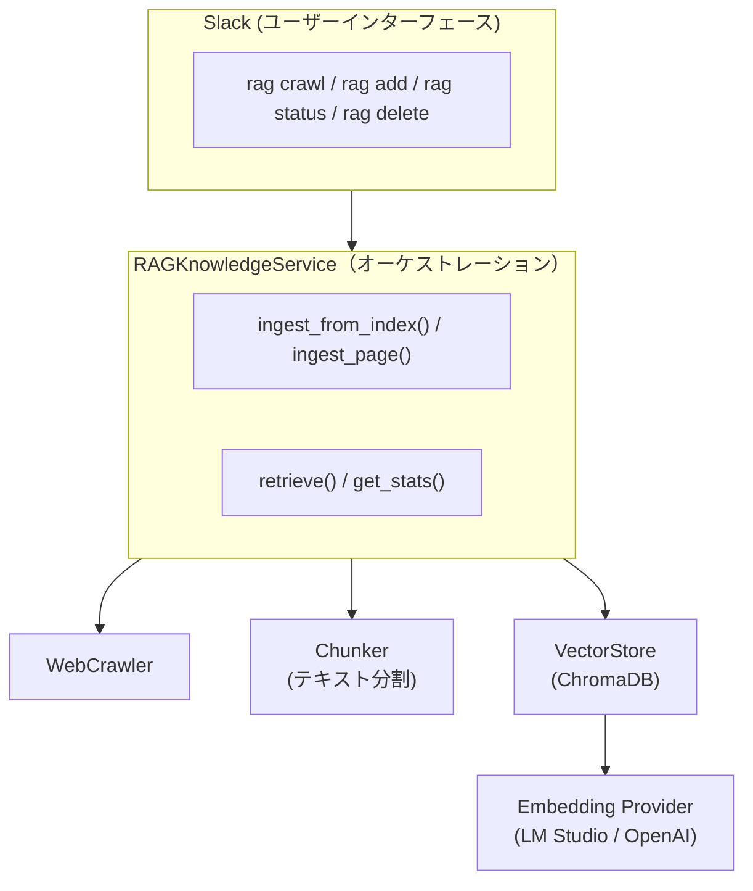
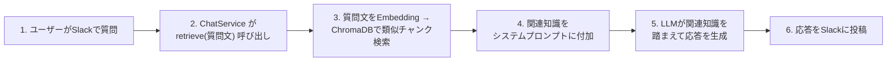
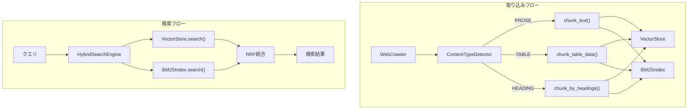

# F9: RAGナレッジ機能

## 概要

外部Webページから収集した知識をベクトルDBに蓄積し、ユーザーの質問に関連する情報を自動検索してチャット応答に活用するRAG（Retrieval-Augmented Generation）機能を実装する。

## 背景

- 現在のアシスタントはLLMの学習済み知識とリアルタイムの会話コンテキストのみで応答している
- 特定のWebサイトの情報を知識ベースとして蓄積し、ユーザーの質問に関連する情報を自動的に検索・活用できるようにしたい
- Embeddingモデルはローカル（LM Studio）とオンライン（OpenAI）を切替可能にし、既存のLLM使い分けルールと整合させる
- ChromaDB（SQLiteベース）を採用し、既存プロジェクトの軽量構成と親和させる

## ユーザーストーリー

- ユーザーとして、Slackでボットに知識ベースの内容について質問すると、取り込み済みWebページの情報に基づいた回答を得たい
- ユーザーとして、リンク集ページのURLを指定するだけで、配下の記事を一括で知識ベースに取り込みたい
- ユーザーとして、単一のWebページを手軽に知識ベースに追加したい
- ユーザーとして、知識ベースの現在の状態（件数等）を確認したい
- ユーザーとして、不要になった知識をソースURL単位で削除したい
- ユーザーとして、テーブルデータを含むページからも正確に情報を検索したい
- ユーザーとして、固有名詞（キャラクター名など）で検索したとき、その名前を含む情報を確実に見つけたい
- 開発者として、RAG検索でどのチャンクがマッチしたかをログで確認したい
- 開発者として、RAG関連コード変更時に精度テストを実行し、リグレッションを早期発見したい
- 管理者として、RAG機能の有効/無効を `.env` で制御したい
- 管理者として、Embeddingプロバイダーをローカルとオンラインで切り替えたい

---

## アーキテクチャ

### RAGシステム全体像



### チャット応答時のフロー



### ハイブリッド検索アーキテクチャ

> **Note**: 各コンポーネント（ContentTypeDetector, TableChunker, HeadingChunker, BM25Index, HybridSearchEngine）の基盤実装は完了済み。RAGKnowledgeServiceへの統合も完了（PR #217）。



---

## 入出力仕様

### Slackコマンド

```
@bot rag crawl <URL> [パターン]  — リンク集ページからクロール＆取り込み
@bot rag add <URL>               — 単一ページ取り込み
@bot rag status                  — ナレッジベース統計表示
@bot rag delete <URL>            — ソースURL指定で削除
```

### 入力例

```
ユーザー: @bot rag crawl https://example.com/articles
ユーザー: @bot rag crawl https://example.com/docs \.html$
ユーザー: @bot rag add https://example.com/guide/getting-started
ユーザー: @bot rag status
ユーザー: @bot rag delete https://example.com/guide/getting-started
```

### 出力例（正常系）

#### rag crawl（リアルタイム進捗表示）

```
ユーザー: @bot rag crawl https://example.com/docs

bot: クロールを開始しました... (リンク収集中)
  └─ [親スレッド内に進捗メッセージを投稿]

  └─ 5ページ取得中...
  └─ 10ページ取得中...
  └─ 完了: 15ページ / 128チャンク / エラー: 2件
```

**進捗フィードバック仕様**:

- **開始メッセージ**: コマンド受信後、即座に「クロールを開始しました... (リンク収集中)」を投稿
- **進捗メッセージ**: クロール中、一定間隔で進捗状況をスレッド内に投稿
  - 形式: `└─ {取得済みページ数}ページ取得中...`
  - 投稿間隔: `RAG_CRAWL_PROGRESS_INTERVAL` ページごと（デフォルト: 5）
- **完了メッセージ**: 処理完了後、結果サマリーをスレッド内に投稿
  - 形式: `└─ 完了: {ページ数}ページ / {チャンク数}チャンク / エラー: {エラー数}件`

#### rag add / status / delete

```
bot: ページを取り込みました: https://example.com/page (8チャンク)

bot: ナレッジベース統計:
     総チャンク数: 342
     ソースURL数: 20

bot: 削除しました: https://example.com/guide/getting-started (8チャンク)
```

### 出力例（エラー系）

```
bot: エラー: RAG機能が無効です。管理者に連絡してください。

bot: エラー: クロールに失敗しました。
     原因: 接続がタイムアウトしました (30秒)

bot: エラー: ページの取り込みに失敗しました。
     URL: https://example.com/broken-page
     原因: HTTP 404 Not Found
```

### チャット応答（自動統合）

```
ユーザー: @bot Pythonのasync/awaitについて教えて

（RAGが有効で、関連知識がある場合）
→ システムプロンプトに関連チャンクが自動注入される
→ LLMが取り込み済み知識を踏まえて応答

（RAGが無効、または関連知識がない場合）
→ 従来通りLLMの学習済み知識のみで応答
```

---

## 技術仕様

### 依存パッケージ

```toml
# pyproject.toml に追加
dependencies = [
    "chromadb>=0.5,<1",
    "beautifulsoup4>=4.12,<5",
    "rank-bm25>=0.2,<1",
    "fugashi>=1.3,<2",
    "unidic-lite>=1.0,<2",
]
```

### ディレクトリ構成

```
ai-assistant/
├── src/
│   ├── embedding/                  # Embeddingプロバイダー
│   │   ├── __init__.py
│   │   ├── base.py                 # EmbeddingProvider 抽象基底クラス
│   │   ├── lmstudio_embedding.py   # LM Studio経由
│   │   ├── openai_embedding.py     # OpenAI Embeddings API
│   │   └── factory.py              # get_embedding_provider()
│   ├── rag/                        # RAGインフラ
│   │   ├── __init__.py
│   │   ├── chunker.py              # テキストチャンキング
│   │   ├── content_detector.py     # コンテンツタイプ検出
│   │   ├── table_chunker.py        # テーブルチャンキング
│   │   ├── heading_chunker.py      # 見出しチャンキング
│   │   ├── bm25_index.py           # BM25インデックス
│   │   ├── hybrid_search.py        # ハイブリッド検索
│   │   ├── vector_store.py         # ChromaDBラッパー
│   │   ├── evaluation.py           # 評価メトリクス
│   │   └── cli.py                  # 評価CLIエントリポイント
│   ├── services/
│   │   ├── web_crawler.py          # Webクローラー
│   │   ├── rag_knowledge.py        # RAGナレッジサービス
│   │   └── safe_browsing.py        # Google Safe Browsing API
│   ├── config/
│   │   └── settings.py             # RAG設定
│   └── slack/
│       └── handlers.py             # ragコマンドハンドラ
├── tests/
│   ├── fixtures/
│   │   ├── rag_test_pages/         # テストページ
│   │   ├── rag_evaluation_dataset.json
│   │   ├── rag_chunking_evaluation.json
│   │   └── rag_test_documents.json
│   ├── test_embedding.py
│   ├── test_chunker.py
│   ├── test_vector_store.py
│   ├── test_web_crawler.py
│   ├── test_rag_knowledge.py
│   ├── test_rag_knowledge_hybrid.py
│   ├── test_content_detector.py
│   ├── test_table_chunker.py
│   ├── test_heading_chunker.py
│   ├── test_bm25_index.py
│   ├── test_hybrid_search.py
│   ├── test_rag_cli.py
│   ├── test_rag_evaluation.py
│   ├── test_safe_browsing.py
│   └── test_slack_rag_handlers.py
├── reports/
│   └── rag-evaluation/
│       ├── baseline.json           # ベースライン（リポジトリ管理）
│       ├── report.json             # 最新評価結果
│       └── report.md               # Markdownレポート
└── .env.example
```

### Embeddingプロバイダー (`src/embedding/`)

既存の `LLMProvider` とは入出力が異なるため、独立した `EmbeddingProvider` 階層として実装する。

#### 抽象基底クラス (`src/embedding/base.py`)

```python
class EmbeddingProvider(abc.ABC):
    """Embedding生成の抽象基底クラス.

    仕様: docs/specs/f9-rag.md
    """

    @abc.abstractmethod
    async def embed(self, texts: list[str]) -> list[list[float]]:
        """テキストリストをベクトルリストに変換する."""

    @abc.abstractmethod
    async def is_available(self) -> bool:
        """プロバイダーが利用可能かチェックする."""
```

**`LLMProvider` と別階層にする理由**:

- chat completionとembeddingは入出力が根本的に異なる（`Message→str` vs `str→float[]`）
- モデルも別（chat用モデルとembedding用モデル）
- 既存の `LLMProvider` 実装を変更不要

#### LM Studio Embedding (`src/embedding/lmstudio_embedding.py`)

```python
class LMStudioEmbedding(EmbeddingProvider):
    """LM Studio経由のEmbeddingプロバイダー.

    仕様: docs/specs/f9-rag.md
    """

    def __init__(
        self,
        base_url: str = "http://localhost:1234/v1",
        model: str = "nomic-embed-text",
    ) -> None:
        self._client = AsyncOpenAI(base_url=base_url, api_key="lm-studio")
        self._model = model

    async def embed(self, texts: list[str]) -> list[list[float]]:
        response = await self._client.embeddings.create(
            model=self._model, input=texts,
        )
        return [item.embedding for item in response.data]

    async def is_available(self) -> bool:
        # モデル一覧取得で疎通確認
        ...
```

#### OpenAI Embedding (`src/embedding/openai_embedding.py`)

`AsyncOpenAI(api_key=...)` を使用し、同じインターフェースで OpenAI Embeddings API を呼び出す。

#### ファクトリ関数 (`src/embedding/factory.py`)

```python
def get_embedding_provider(
    settings: Settings,
    provider_setting: Literal["local", "online"],
) -> EmbeddingProvider:
    """設定に応じたEmbeddingプロバイダーを返す.

    - "local": LMStudioEmbedding
    - "online": OpenAIEmbedding
    """
```

### テキストチャンキング (`src/rag/chunker.py`)

```python
def chunk_text(
    text: str,
    chunk_size: int = 500,
    chunk_overlap: int = 50,
) -> list[str]:
    """テキストをオーバーラップ付きチャンクに分割する.

    仕様: docs/specs/f9-rag.md

    分割優先順: 段落 → 文 → 文字数
    外部依存なし（LangChain不要）。
    """
```

- 段落（空行区切り）でまず分割
- 段落が `chunk_size` を超える場合は文（句点区切り）で分割
- それでも超える場合は文字数で分割
- 各チャンクは `chunk_overlap` 文字分オーバーラップさせ、文脈の断絶を軽減

### コンテンツタイプ検出 (`src/rag/content_detector.py`)

```python
def detect_content_type(text: str) -> ContentType:
    """テキストの内容タイプを検出する.

    Returns:
        ContentType: PROSE（通常テキスト）, TABLE（テーブルデータ）, MIXED（混合）
    """
```

**テーブルデータの検出ヒューリスティック**:

- Markdownテーブル形式（`|`区切り＋セパレータ行）
- タブ/複数スペース区切りの列構造（3列以上）
- 構造化された行が30%以上、または数値行が20%以上

### 見出しベースのチャンキング (`src/rag/heading_chunker.py`)

```python
def chunk_by_headings(
    text: str,
    max_chunk_size: int = 500,
) -> list[HeadingChunk]:
    """見出し単位でテキストを分割する.

    - Markdown見出し（#, ##, ###）を検出
    - HTML見出し（<h1>〜<h6>）を検出
    - 見出し＋本文をセットでチャンク化
    - 見出しがない場合は従来のチャンキングにフォールバック
    """
```

```python
@dataclass
class HeadingChunk:
    """見出し付きチャンク."""
    heading: str          # 見出しテキスト（検索用メタデータ）
    content: str          # 本文
    heading_level: int    # 見出しレベル（1〜6）
    parent_headings: list[str]  # 親見出しの階層（パンくずリスト用）
```

### テーブルチャンキング (`src/rag/table_chunker.py`)

```python
def chunk_table_data(
    text: str,
    header_row: str | None = None,
    row_context_size: int = 1,
) -> list[TableChunk]:
    """テーブルデータをチャンキングする.

    - ヘッダー行を各チャンクに付加
    - 行単位で分割（意味的な単位を保持）
    - 前後の行をコンテキストとして含める
    """
```

### ChromaDB ベクトルストア (`src/rag/vector_store.py`)

#### データ型

```python
@dataclass
class DocumentChunk:
    """ベクトルストアに格納するチャンク."""
    id: str                           # ユニークID（URLハッシュ + chunk_index）
    text: str                         # チャンク本文
    metadata: dict[str, str | int]    # source_url, title, chunk_index, crawled_at

@dataclass
class RetrievalResult:
    """検索結果."""
    text: str
    metadata: dict[str, str | int]
    distance: float                   # 小さいほど類似度が高い
```

#### VectorStoreクラス

```python
class VectorStore:
    """ChromaDBベースのベクトルストア.

    仕様: docs/specs/f9-rag.md
    """

    def __init__(
        self,
        embedding_provider: EmbeddingProvider,
        persist_directory: str = "./chroma_db",
        collection_name: str = "knowledge",
    ) -> None:
        self._embedding = embedding_provider
        self._client = chromadb.PersistentClient(path=persist_directory)
        self._collection = self._client.get_or_create_collection(
            name=collection_name,
            metadata={"hnsw:space": "cosine"},
        )

    async def add_documents(self, chunks: list[DocumentChunk]) -> int:
        """チャンクをEmbedding→ベクトルストアに追加. Returns: 追加件数."""

    async def search(self, query: str, n_results: int = 5) -> list[RetrievalResult]:
        """クエリに類似するチャンクを検索する."""

    async def delete_by_source(self, source_url: str) -> int:
        """ソースURL指定でチャンクを削除. Returns: 削除件数."""

    def get_stats(self) -> dict[str, int]:
        """ナレッジベース統計（総チャンク数等）を返す."""
```

**設計ポイント**:

- ChromaDBは同期APIのため `asyncio.to_thread()` でラップ（`feed_collector.py` の `feedparser.parse` と同パターン）
- SQLAlchemyモデルは追加しない（ChromaDB自身がSQLiteに永続化するため）
- Embeddingは `VectorStore` 内で呼び出す（外部から渡す必要なし）

### BM25インデックス (`src/rag/bm25_index.py`)

```python
class BM25Index:
    """BM25ベースのキーワード検索インデックス.

    仕様: docs/specs/f9-rag.md
    """

    def __init__(
        self,
        k1: float = 1.5,  # 用語頻度の飽和パラメータ
        b: float = 0.75,  # 文書長の正規化パラメータ
    ) -> None: ...

    def add_documents(
        self,
        documents: list[tuple[str, str, str]],  # (id, text, source_url)
    ) -> int:
        """ドキュメントをインデックスに追加する."""

    def search(
        self,
        query: str,
        n_results: int = 10,
    ) -> list[BM25Result]:
        """クエリでキーワード検索を実行する."""

    def delete_by_source(self, source_url: str) -> int:
        """ソースURL指定でドキュメントを削除する."""
```

**日本語トークナイザ**:

```python
def tokenize_japanese(text: str) -> list[str]:
    """日本語テキストをトークン化する.

    - 形態素解析（fugashi/MeCab）を使用
    - 名詞・動詞・形容詞のみ抽出
    - ストップワード除去
    """
```

### ハイブリッド検索 (`src/rag/hybrid_search.py`)

```python
class HybridSearchEngine:
    """ベクトル検索とBM25を組み合わせたハイブリッド検索.

    仕様: docs/specs/f9-rag.md
    """

    def __init__(
        self,
        vector_store: VectorStore,
        bm25_index: BM25Index,
        vector_weight: float = 0.5,
        rrf_k: int = 60,
    ) -> None: ...

    async def search(
        self,
        query: str,
        n_results: int = 5,
        similarity_threshold: float | None = None,
    ) -> list[HybridSearchResult]:
        """ハイブリッド検索を実行する.

        1. ベクトル検索で候補を取得
        2. BM25検索で候補を取得
        3. RRF（Reciprocal Rank Fusion）でスコアを統合
        4. 統合スコアでソート
        """
```

**Reciprocal Rank Fusion (RRF)**:

```python
def reciprocal_rank_fusion(
    rankings: list[list[str]],
    k: int = 60,
) -> dict[str, float]:
    """RRFでスコアを統合する.

    RRF_score(d) = Σ 1 / (k + rank(d))
    """
```

### Webクローラー (`src/services/web_crawler.py`)

```python
@dataclass
class CrawledPage:
    """クロール結果."""
    url: str
    title: str
    text: str          # 抽出済みプレーンテキスト
    crawled_at: str    # ISO 8601 タイムスタンプ

class WebCrawler:
    """Webページクローラー.

    仕様: docs/specs/f9-rag.md
    """

    def __init__(
        self,
        timeout: float = 30.0,
        max_pages: int = 50,
        crawl_delay: float = 1.0,
    ) -> None: ...

    def validate_url(self, url: str) -> str:
        """URL検証. 問題なければ正規化済みURLを返す.

        検証内容:
        - スキームが http または https であること
        - ホスト名がプライベートIP/localhost/リンクローカルでないこと（SSRF対策）
        - フラグメント(`#...`)を除去し、正規化済みURLを返す
        - 検証失敗時は ValueError を送出
        """

    async def crawl_index_page(
        self, index_url: str, url_pattern: str = "",
    ) -> list[str]:
        """リンク集ページ内の <a> タグからURLリストを抽出する（深度1のみ）.

        - 同一ドメインのURLのみ抽出（外部ドメインはスキップ）
        - フラグメント除去で重複排除
        - max_pages で制限
        """

    async def crawl_page(self, url: str) -> CrawledPage | None:
        """単一ページの本文テキストを取得する. 失敗時は None."""

    async def crawl_pages(self, urls: list[str]) -> list[CrawledPage]:
        """複数ページを並行クロールする.

        - 各リクエスト間に crawl_delay 秒の待機を挿入
        """
```

**セキュリティ要件（SSRF対策）**:

- **スキーム制限**: `http://` と `https://` のみ許可
- **プライベートIPブロック**: DNS解決後のIPアドレスを検証し、以下へのアクセスを拒否
  - localhost / 127.0.0.0/8（ループバック）
  - 10.0.0.0/8, 172.16.0.0/12, 192.168.0.0/16（RFC1918 プライベート）
  - 169.254.0.0/16（リンクローカル、AWS metadata endpoint 等）
  - IPv6 ループバック (::1)、ユニークローカル (fc00::/7)、リンクローカル (fe80::/10)
- **リダイレクト無効化**: SSRFを防ぐため、HTTPリダイレクトの追従を無効化

**クロール制御**:

- **ページ数上限**: `RAG_MAX_CRAWL_PAGES`（デフォルト: 50）
- **リクエスト間隔**: `RAG_CRAWL_DELAY_SEC`（デフォルト: 1.0秒）
- **robots.txt 遵守**: `RAG_RESPECT_ROBOTS_TXT`（デフォルト: `true`）

### robots.txt 解析・遵守

サイト運営者の意図を尊重するため、クロール前に対象サイトの `robots.txt` を取得・解析し、Disallow 指定されたパスのクロールをスキップする。

**実装方式**:

- Python 標準ライブラリ `urllib.robotparser.RobotFileParser` を使用（外部依存なし）
- `robots.txt` の取得は `aiohttp` で非同期に行い、取得した内容を `RobotFileParser.parse()` に渡す
- User-Agent は `AIAssistantBot` を使用（`*` にもフォールバック）

**機能**:

- クロール前に対象サイトの `robots.txt` を取得・解析
- Disallow 指定されたパスはクロールをスキップ（`can_fetch()` で判定）
- `Crawl-delay` の遵守: `robots.txt` の `Crawl-delay` と設定値（`RAG_CRAWL_DELAY_SEC`）のうち大きい方を採用
- `robots.txt` のキャッシュ: ドメイン単位でキャッシュし、TTL（`RAG_ROBOTS_TXT_CACHE_TTL`）で制御

**設定項目**:

| 設定名 | 型 | デフォルト | 説明 |
|--------|---|----------|------|
| `RAG_RESPECT_ROBOTS_TXT` | bool | `true` | robots.txt 遵守の有効/無効 |
| `RAG_ROBOTS_TXT_CACHE_TTL` | int | `3600` | robots.txt キャッシュTTL（秒） |

**エラーハンドリング**:

- `robots.txt` の取得に失敗した場合（タイムアウト、HTTP エラー等）はクロールを許可する（フェイルオープン）
- ログに警告を出力する

**HTML本文抽出ロジック（BeautifulSoup4使用）**:

1. `<script>`, `<style>`, `<nav>`, `<header>`, `<footer>` タグを除去
2. `<article>` → `<main>` → `<body>` の優先順で本文領域を特定
3. テキストを抽出してクリーンアップ

### URL安全性チェック（Google Safe Browsing API）

マルウェア・フィッシングサイトへのアクセスを防ぐため、Google Safe Browsing APIによる事前判定機能を提供する。

**設定項目:**

| 設定名 | 型 | デフォルト | 説明 |
|--------|---|----------|------|
| `RAG_URL_SAFETY_CHECK` | bool | `false` | URL安全性チェックの有効/無効 |
| `GOOGLE_SAFE_BROWSING_API_KEY` | str | `""` | Google Safe Browsing APIキー |
| `RAG_URL_SAFETY_CACHE_TTL` | int | `300` | キャッシュTTL（秒） |
| `RAG_URL_SAFETY_FAIL_OPEN` | bool | `true` | API障害時にフェイルオープンするか |
| `RAG_URL_SAFETY_TIMEOUT` | float | `5.0` | APIタイムアウト（秒） |

### RAGナレッジサービス (`src/services/rag_knowledge.py`)

各コンポーネントを統合するオーケストレーションサービス。

```python
class RAGKnowledgeService:
    """RAGナレッジ管理サービス.

    仕様: docs/specs/f9-rag.md
    """

    def __init__(
        self,
        vector_store: VectorStore,
        web_crawler: WebCrawler,
        chunk_size: int = 500,
        chunk_overlap: int = 50,
        bm25_index: BM25Index | None = None,
        hybrid_search_enabled: bool = False,
    ) -> None: ...

    async def ingest_from_index(
        self, index_url: str, url_pattern: str = "",
        progress_callback: Callable[[int, int], Awaitable[None]] | None = None,
    ) -> dict[str, int]:
        """リンク集ページから一括取り込み.

        Returns:
            {"pages_crawled": N, "chunks_stored": M, "errors": E}
        """

    async def ingest_page(self, url: str) -> int:
        """単一ページ取り込み.

        同一URLの再取り込み時は、新規チャンクをupsert後に古いチャンクを削除する。
        Returns: チャンク数.
        """

    async def retrieve(self, query: str, n_results: int = 5) -> RAGRetrievalResult:
        """関連知識を検索し、結果を返す.

        ハイブリッド検索有効時は BM25 + ベクトル検索を RRF で統合。
        無効時はベクトル検索のみ。
        """

    async def delete_source(self, source_url: str) -> int:
        """ソースURL指定で知識を削除."""

    async def get_stats(self) -> dict[str, int]:
        """ナレッジベース統計."""
```

### RAG検索結果のデバッグ・可視化

#### ログ出力

`RAGKnowledgeService.retrieve()` 実行時に、検索結果の詳細をログ出力する。

```
INFO RAG retrieve: query="しれんのしろ アイテム"
INFO RAG result 1: distance=0.234 source="https://example.com/page1"
DEBUG RAG result 1 text: "しれんのしろには以下のアイテムがあります..."[:100]
```

- **INFO レベル**: クエリ、各結果の distance・source
- **DEBUG レベル**: テキストプレビュー（先頭100文字）、全文
- `RAG_DEBUG_LOG_ENABLED=false` でログ出力を無効化可能

#### ソース情報表示

`RAG_SHOW_SOURCES=true` 時、Slack回答末尾にソースURLリストを表示:

```
（LLMの回答本文）

---
参照元:
• https://example.com/page1
• https://example.com/page2
```

#### 戻り値型

```python
@dataclass
class RAGRetrievalResult:
    """RAG検索結果."""
    context: str  # フォーマット済みテキスト（システムプロンプト注入用）
    sources: list[str]  # ユニークなソースURLリスト
```

### 類似度閾値フィルタリング

| 設定名 | 型 | デフォルト | 説明 |
|--------|---|----------|------|
| `RAG_SIMILARITY_THRESHOLD` | float \| None | `None` | cosine距離の閾値。この値より大きい距離の結果を除外。推奨値: `0.5`〜`0.7` |

**動作**: 閾値フィルタリング時は多めに取得（n_results × 3、最低20件）してからフィルタリング。

### 評価メトリクス (`src/rag/evaluation.py`)

```python
def calculate_precision_recall(
    retrieved_sources: list[str],
    expected_sources: list[str],
) -> PrecisionRecallResult:
    """Precision/Recall を計算する."""

async def evaluate_retrieval(
    rag_service: RAGKnowledgeService,
    dataset_path: str,
    n_results: int = 5,
) -> EvaluationReport:
    """データセットを使ってRAG検索の精度を評価する."""
```

### 評価CLIツール (`src/rag/cli.py`)

```bash
# 基本実行
python -m src.rag.cli evaluate

# オプション指定
python -m src.rag.cli evaluate \
  --dataset tests/fixtures/rag_evaluation_dataset.json \
  --output-dir reports/rag-evaluation \
  --baseline-file reports/rag-evaluation/baseline.json \
  --persist-dir ./test_chroma_db \
  --n-results 5 \
  --threshold 0.5 \
  --fail-on-regression

# テスト用ChromaDB初期化
python -m src.rag.cli init-test-db \
  --persist-dir ./test_chroma_db \
  --fixture tests/fixtures/rag_test_documents.json
```

**CLIオプション**:

| オプション | デフォルト | 説明 |
|-----------|----------|------|
| `--dataset` | `tests/fixtures/rag_evaluation_dataset.json` | 評価データセットのパス |
| `--output-dir` | `reports/rag-evaluation` | レポート出力ディレクトリ |
| `--baseline-file` | `None` | ベースラインJSONファイルのパス |
| `--n-results` | `5` | 各クエリで取得する結果数 |
| `--threshold` | `None` | 類似度閾値 |
| `--fail-on-regression` | `False` | リグレッション検出時に exit code 1 で終了 |
| `--regression-threshold` | `0.1` | F1スコアの低下がこの値を超えたらリグレッション判定 |
| `--save-baseline` | `False` | 現在の結果をベースラインとして保存 |

**出力ファイル**: `report.json`, `report.md`, `baseline.json`

### ChatServiceへの自動統合 (`src/services/chat.py`)

`ThreadHistoryService` や `MCPClientManager` と同じオプショナル注入パターンで統合する。

```python
class ChatService:
    def __init__(
        self,
        llm: LLMProvider,
        session_factory: async_sessionmaker[AsyncSession],
        system_prompt: str = "",
        thread_history_service: ThreadHistoryService | None = None,
        mcp_manager: MCPClientManager | None = None,
        rag_service: RAGKnowledgeService | None = None,
    ) -> None: ...
```

- `rag_service=None` 時は既存動作と完全同一（後方互換性）
- RAG検索に失敗した場合は例外をキャッチしてログ出力し、通常応答を継続

### 設定 (`src/config/settings.py`)

```python
class Settings(BaseSettings):
    # RAG基本設定
    rag_enabled: bool = False
    embedding_provider: Literal["local", "online"] = "local"
    embedding_model_local: str = "nomic-embed-text"
    embedding_model_online: str = "text-embedding-3-small"
    chromadb_persist_dir: str = "./chroma_db"
    rag_chunk_size: int = 500
    rag_chunk_overlap: int = 50
    rag_retrieval_count: int = 5
    rag_max_crawl_pages: int = 50
    rag_crawl_delay_sec: float = 1.0
    rag_crawl_progress_interval: int = 5

    # robots.txt
    rag_respect_robots_txt: bool = True
    rag_robots_txt_cache_ttl: int = 3600

    # ハイブリッド検索
    rag_hybrid_search_enabled: bool = False
    rag_vector_weight: float = 0.5
    rag_bm25_k1: float = 1.5
    rag_bm25_b: float = 0.75
    rag_rrf_k: int = 60

    # 類似度閾値
    rag_similarity_threshold: float | None = None

    # デバッグ・可視化
    rag_debug_log_enabled: bool = True
    rag_show_sources: bool = False
```

---

## 受け入れ条件

### Embeddingプロバイダー

- [ ] **AC1**: `EmbeddingProvider` 抽象基底クラスが `embed()` と `is_available()` メソッドを定義すること
- [ ] **AC2**: `LMStudioEmbedding` が LM Studio 経由でテキストをベクトルに変換できること
- [ ] **AC3**: `OpenAIEmbedding` が OpenAI Embeddings API でテキストをベクトルに変換できること
- [ ] **AC4**: `get_embedding_provider()` が `EMBEDDING_PROVIDER` 設定に応じたプロバイダーを返すこと

### テキストチャンキング

- [ ] **AC5**: `chunk_text()` がテキストを指定サイズのチャンクに分割できること
- [ ] **AC6**: チャンク間にオーバーラップが適用されること
- [ ] **AC7**: 空文字列や短いテキストに対しても正常に動作すること

### ChromaDB ベクトルストア

- [ ] **AC8**: `VectorStore.add_documents()` でチャンクをEmbedding→ChromaDBに保存できること
- [ ] **AC9**: `VectorStore.search()` でクエリに類似するチャンクを検索できること
- [ ] **AC10**: `VectorStore.delete_by_source()` でソースURL指定のチャンクを削除できること
- [ ] **AC11**: `VectorStore.get_stats()` でナレッジベースの統計情報を取得できること

### Webクローラー

- [ ] **AC12**: `WebCrawler.crawl_index_page()` がリンク集ページからURLリストを抽出できること
- [ ] **AC13**: URLパターン（正規表現）によるフィルタリングが機能すること
- [ ] **AC14**: `WebCrawler.crawl_page()` が単一ページの本文テキストを取得できること
- [ ] **AC15**: `WebCrawler.crawl_pages()` が複数ページを並行クロールし、ページ単位のエラーを隔離すること

### RAGナレッジサービス

- [ ] **AC16**: `ingest_from_index()` がリンク集ページから記事を一括クロール→チャンキング→ベクトル保存できること
- [ ] **AC17**: `ingest_page()` が単一ページをクロール→チャンキング→ベクトル保存できること
- [ ] **AC18**: `retrieve()` がクエリに関連するチャンクを検索し、フォーマット済みテキストを返すこと
- [ ] **AC19**: `retrieve()` で結果がない場合は空文字列を返すこと

### ChatService統合

- [ ] **AC20**: RAG有効時、チャット応答に関連知識がシステムプロンプトとして自動注入されること
- [ ] **AC21**: RAG無効時（`rag_enabled=False`）は従来通りの動作をすること
- [ ] **AC22**: RAG検索に失敗した場合、エラーログを出力し通常応答を継続すること

### Slackコマンド

- [ ] **AC23**: `rag crawl <URL> [パターン]` でリンク集ページからの一括取り込みができること
- [ ] **AC24**: `rag add <URL>` で単一ページの取り込みができること
- [ ] **AC25**: `rag status` でナレッジベースの統計が表示されること
- [ ] **AC26**: `rag delete <URL>` でソースURL指定の削除ができること

### 設定

- [ ] **AC27**: `RAG_ENABLED` 環境変数でRAG機能のON/OFFを制御できること
- [ ] **AC28**: `EMBEDDING_PROVIDER` で `local` / `online` を切り替えられること
- [ ] **AC29**: チャンクサイズ・オーバーラップ・検索件数が環境変数で設定可能であること

### セキュリティ・クロール制御

- [ ] **AC31**: `http` / `https` 以外のスキームが拒否されること
- [ ] **AC32**: プライベートIPへのアクセスが拒否されること
- [ ] **AC33**: HTTPリダイレクトの追従が無効化されていること
- [ ] **AC34**: 1回のクロールで取得するページ数が制限されること
- [ ] **AC35**: 同一ドメインへの連続リクエスト間に待機が挿入されること

### URL正規化

- [ ] **AC36**: `validate_url()` がURLからフラグメントを除去した正規化済みURLを返すこと
- [ ] **AC37**: 同一ページのアンカー違いが1つのページとして取り込まれること

### 類似度閾値・評価メトリクス

- [ ] **AC38**: `RAG_SIMILARITY_THRESHOLD` 設定で閾値フィルタリングが機能すること
- [ ] **AC39**: `calculate_precision_recall()` が正しく Precision/Recall/F1 を計算すること
- [ ] **AC40**: `evaluate_retrieval()` がデータセットを読み込み評価レポートを生成すること

### 外部ドメイン制限

- [ ] **AC41**: `crawl_index_page()` で外部ドメインへのリンクがスキップされること

### クロール進捗フィードバック

- [ ] **AC42**: `rag crawl` コマンド実行時、即座に開始メッセージがスレッド内に投稿されること
- [ ] **AC43**: クロール中、`RAG_CRAWL_PROGRESS_INTERVAL` ページごとに進捗メッセージがスレッド内に投稿されること
- [ ] **AC44**: クロール完了時、結果サマリーがスレッド内に投稿されること
- [ ] **AC45**: 進捗メッセージはスレッド内のみに投稿され、チャンネルへの通知は発生しないこと

### チャンキング改善

- [ ] **AC46**: テーブルデータを検出し、行単位でチャンキングできること
- [ ] **AC47**: 各テーブルチャンクにヘッダー行が付加されること
- [ ] **AC48**: 見出し単位でのチャンキングができること
- [ ] **AC49**: 見出しチャンクに親見出しの階層情報が含まれること
- [ ] **AC50**: 従来のチャンキングとの後方互換性が保たれること
- [ ] **AC51**: 大きなコンテンツが `max_chunk_size` で適切に分割されること

### ハイブリッド検索

- [ ] **AC52**: BM25インデックスの追加・検索・削除ができること
- [ ] **AC53**: 日本語テキストのトークナイズができること
- [ ] **AC54**: RRFによるスコア統合ができること
- [ ] **AC55**: `RAG_HYBRID_SEARCH_ENABLED=false` 時は従来のベクトル検索のみ動作すること
- [ ] **AC56**: 重み設定でベクトル検索とBM25の比率を調整できること
- [ ] **AC57**: `HybridSearchResult` がベクトル検索スコア、BM25スコア、RRFスコアを保持できること

### デバッグ・可視化

- [ ] **AC58**: `RAG_DEBUG_LOG_ENABLED=true` の場合、検索クエリと結果がログに出力されること
- [ ] **AC59**: `RAG_DEBUG_LOG_ENABLED=false` の場合、ログが出力されないこと
- [ ] **AC60**: `RAG_SHOW_SOURCES=true` の場合、Slack回答末尾にソースURLリストが表示されること
- [ ] **AC61**: ソースURLは重複なく表示されること
- [ ] **AC62**: `RAG_SHOW_SOURCES=false` の場合、ソース情報が表示されないこと

### 評価CLIツール

- [ ] **AC63**: `python -m src.rag.cli evaluate` で評価が実行できること
- [ ] **AC64**: JSON/Markdown形式のレポートが出力されること
- [ ] **AC65**: ベースライン比較でリグレッション検出ができること
- [ ] **AC66**: `--fail-on-regression` 指定時、リグレッション検出で exit code 1 になること
- [ ] **AC67**: `init-test-db` コマンドでテスト用ChromaDBを初期化できること

### robots.txt 遵守

- [ ] **AC71**: `RAG_RESPECT_ROBOTS_TXT=true` の場合、Disallow 指定されたパスのクロールがスキップされること
- [ ] **AC72**: `RAG_RESPECT_ROBOTS_TXT=false` の場合、robots.txt を無視してクロールすること
- [ ] **AC73**: robots.txt の `Crawl-delay` が `RAG_CRAWL_DELAY_SEC` より大きい場合、`Crawl-delay` の値が採用されること
- [ ] **AC74**: robots.txt の取得に失敗した場合、フェイルオープンでクロールを許可すること
- [ ] **AC75**: robots.txt がドメイン単位でキャッシュされ、TTL 内は再取得されないこと

### テストケース

- [ ] **AC68**: テストページを使ったローカル評価ができること
- [ ] **AC69**: 「りゅうおう」クエリでテーブル内のデータが検索できること
- [ ] **AC70**: キーワード完全一致のケースで確実にヒットすること

---

## テスト方針

### テスト戦略

- **Embeddingプロバイダー**: `AsyncOpenAI` クライアントを `AsyncMock` でモック
- **VectorStore**: `chromadb.EphemeralClient()`（インメモリ）を使用し、ファイルシステム副作用を回避
- **Webクローラー**: `aiohttp.ClientSession` を `AsyncMock` でモック、HTMLサンプルで本文抽出を検証
- **RAGナレッジサービス**: VectorStore・WebCrawler をモック化してオーケストレーションを検証
- **ChatService統合**: RAGKnowledgeService をモック化してコンテキスト注入を検証
- **BM25**: テストデータは3件以上用意（IDF計算の特性上、2件だと IDF=0 になる）

### test-runnerによるRAG精度テスト自動実行

以下のファイルが変更された場合、test-runnerが精度テストを自動実行:

| 変更ファイル | 精度テストの必要性 |
|-------------|-------------------|
| `src/rag/chunker.py`, `heading_chunker.py`, `table_chunker.py` | **必須** |
| `src/rag/vector_store.py`, `hybrid_search.py`, `bm25_index.py` | **必須** |
| `src/embedding/**` | **必須** |
| `src/services/rag_knowledge.py` | 推奨 |
| `src/rag/cli.py`, `evaluation.py` | 不要（ユニットテストで十分） |

---

## 使用LLMプロバイダー

| タスク | プロバイダー | 理由 |
|--------|-------------|------|
| Embedding生成 | ローカル (LM Studio + `nomic-embed-text`) またはオンライン (OpenAI `text-embedding-3-small`) | `EMBEDDING_PROVIDER` で切替 |
| チャット応答生成 | 既存の `ChatService` 設定に従う | RAG固有のLLM設定は不要 |
| Webクロール・チャンキング | なし | LLM不要（テキスト処理のみ） |

---

## 実装ステップ

### Phase 1: 基盤 (#115, #116, #117, #118)

1. Embeddingプロバイダー実装
2. テキストチャンキング・ChromaDBベクトルストア実装
3. Webクローラー実装
4. RAGナレッジサービス・既存コード統合

### Phase 1 追加: 評価・可視化 (#173)

1. RAG検索結果のログ出力
2. Slack回答時のソース情報表示
3. `retrieve()` の戻り値拡張

### Phase 2: 類似度閾値・評価メトリクス (#176)

1. 類似度閾値フィルタリング
2. Precision/Recall計測

### Phase 2 追加: チャンキング改善・ハイブリッド検索 (#195)

1. コンテンツタイプ検出
2. テーブルチャンキング・見出しチャンキング
3. BM25インデックス
4. ハイブリッド検索（RRF統合）
5. RAGKnowledgeServiceへの統合

### Phase 3: 自動評価パイプライン (#177)

1. 評価CLIコマンド
2. リグレッション検出
3. テスト用ChromaDB初期化
4. test-runnerサブエージェントでの自動実行

---

## 注意事項

1. **RAG_ENABLED のデフォルト**: `false`。明示的に有効化しない限り、既存の動作に一切影響しない
2. **ChromaDBの永続化**: `CHROMADB_PERSIST_DIR` で指定したディレクトリにSQLiteファイルが作成される。`.gitignore` に追加すること
3. **Embeddingモデルの整合性**: モデルを変更した場合、既存データとの類似度計算が不正確になるため、コレクションの再構築が必要
4. **Webクローラーの負荷配慮**: `asyncio.Semaphore` で同時接続数を制限
5. **LLMコンテキストウィンドウ**: `RAG_RETRIEVAL_COUNT` で検索件数を制限
6. **既存テストへの影響**: RAGサービスはオプショナル注入のため、既存テストに変更は不要
7. **robots.txt**: `RAG_RESPECT_ROBOTS_TXT=true`（デフォルト）で `robots.txt` を遵守する。Python 標準ライブラリ `urllib.robotparser` を使用
8. **BM25は少数ドキュメントでの評価に不向き**: IDF計算の特性上、テストには十分なドキュメント数が必要
9. **辞書サイズ**: `unidic-lite` は約50MB。本番環境でのディスク使用量に注意
10. **ベースライン管理**: ベースラインファイルはリポジトリにコミットし、チーム全体で共有

## 未着手Issue

| Issue | 内容 |
|-------|------|
| #157 | ドメイン許可リストをSlackから動的管理 |
| #159 | URL安全性チェック（Google Safe Browsing API） |
| ~~#160~~ | ~~robots.txt の解析・遵守~~（実装済み） |

## 関連ドキュメント

- ガイド: [docs/guides/rag-overview.md](../guides/rag-overview.md) — RAGシステムの概要（初心者向け）
- ジャーナル（レトロ変換）: `memory/journal/20260217-062709-retro-f9-rag.md`

## 変更履歴

| 日付 | 内容 |
|------|------|
| 2026-02-17 | robots.txt 解析・遵守機能を追加（#160） |
| 2026-02-12 | 4つの仕様書を統合・整理（旧: f9-rag-knowledge.md, f9-rag-evaluation.md, f9-rag-chunking-hybrid.md, f9-rag-auto-evaluation.md） |
| 2026-02-11 | クロール進捗フィードバック機能を追加（#158） |
| 2026-02-10 | PR #211 レビュー対応: 土台実装のみであることをアーキテクチャセクションに明記 |
| 2026-02-09 | Phase 3: 自動評価パイプライン追加 (#177) |
| 2026-02-09 | Phase 2: 類似度閾値・評価メトリクス機能を追加 (#176) |
| 2026-02-09 | URL正規化（フラグメント除去）による重複取り込み防止を追加 (#161) |
| 2026-02-09 | チャンキング改善・ハイブリッド検索追加 (#195) |
