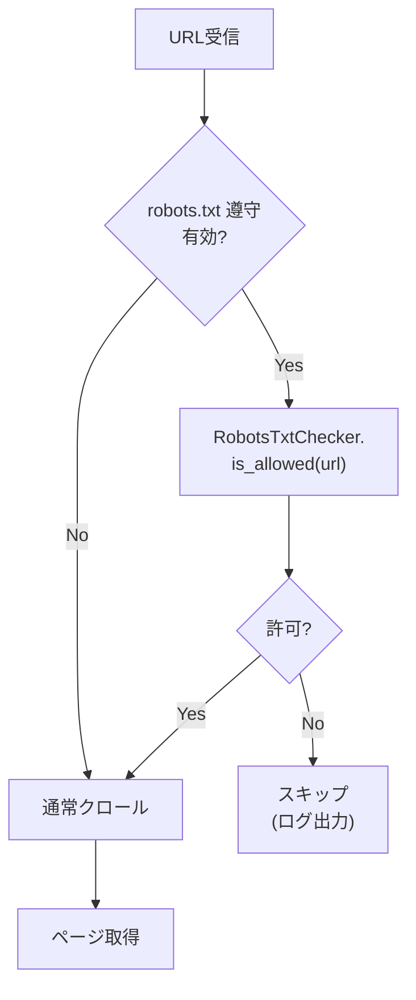
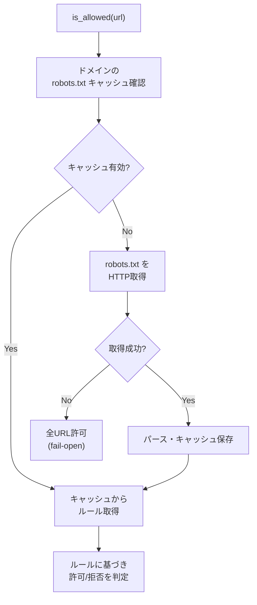

# F9: robots.txt 解析・遵守機能

## 概要

WebクローラーがクロールURLにアクセスする前に、対象サイトの robots.txt を取得・解析し、
Disallow 指定されたパスへのアクセスをスキップする機能を実装する。
RFC 9309（Robots Exclusion Protocol）に準拠する。

## 背景

- 現在の WebCrawler は robots.txt を確認せずにクロールを行っている
- サイト運営者がクロールを拒否しているパスへのアクセスは、マナー違反であり法的リスクもある
- 親仕様書（f9-rag.md）の注意事項に「将来対応予定」と記載されている

## ユーザーストーリー

- 管理者として、クローラーが robots.txt を自動的に遵守し、サイト運営者の意図を尊重してほしい
- 管理者として、robots.txt 遵守機能の有効/無効を設定で制御したい
- 管理者として、User-Agent 名を設定でカスタマイズしたい

## 関連ファイル

- `src/services/web_crawler.py` — 統合先の WebCrawler
- `src/services/robots_txt.py` — 新規作成（RobotsTxtChecker）
- `src/config/settings.py` — 設定項目の追加
- `tests/test_robots_txt.py` — テスト
- `tests/test_web_crawler.py` — 統合テスト追加
- `docs/specs/f9-rag.md` — 親仕様書

## アーキテクチャ

### クロール時のフロー



### robots.txt 取得・キャッシュフロー



---

## 技術仕様

### RobotsTxtChecker クラス (`src/services/robots_txt.py`)

```python
class RobotsTxtChecker:
    """robots.txt の取得・解析・キャッシュを行うチェッカー.

    仕様: docs/specs/f9-robots-txt.md

    RFC 9309 準拠:
    - User-agent マッチング（大文字小文字不問）
    - Allow / Disallow ルールの最長一致
    - ワイルドカード (*) と終端 ($) のサポート
    - robots.txt 取得失敗時は全URL許可（fail-open）
    """

    def __init__(
        self,
        user_agent: str = "AIAssistantBot/1.0",
        cache_ttl: int = 3600,
        timeout: float = 10.0,
    ) -> None: ...

    async def is_allowed(self, url: str) -> bool:
        """指定URLへのアクセスが robots.txt で許可されているか判定する."""

    def get_crawl_delay(self, url: str) -> float | None:
        """指定URLのドメインの Crawl-delay 値を取得する（キャッシュ済みの場合のみ）."""

    def clear_cache(self) -> None:
        """キャッシュを全クリアする."""
```

### パースロジック

RFC 9309 に基づくパース:

1. **行ごとの解析**: `#` 以降はコメントとして無視
2. **User-agent グループ**: 連続する `User-agent:` 行で始まるグループを識別
3. **ルールの適用順序**:
   - 自身の User-Agent に完全一致するグループを優先
   - 一致しない場合は `*`（ワイルドカード）グループを使用
   - どちらもない場合は全URL許可
4. **最長一致**: Allow と Disallow の両方にマッチする場合、パスが長い方を優先
5. **同一長さ**: 同じ長さの場合は Allow を優先（RFC 9309 準拠）

### パスマッチング

- `*`: 0文字以上の任意の文字列にマッチ
- `$`: パターンの終端を示す（パスの末尾と一致する必要がある）
- 大文字小文字を区別する（RFC 9309 準拠）

### キャッシュ

- ドメイン単位でキャッシュ（`dict[str, CachedRobotsTxt]`）
- TTL ベース（デフォルト: 3600秒）
- robots.txt 取得失敗時も「全許可」としてキャッシュ（不要な再取得を防止）

### エラーハンドリング

- **HTTP 4xx**: robots.txt が存在しない → 全URL許可
- **HTTP 5xx**: サーバーエラー → 全URL許可（fail-open）
- **タイムアウト/ネットワークエラー**: 全URL許可（fail-open）
- **パースエラー**: 不正な形式の行は無視して続行

### Crawl-delay の遵守

- robots.txt に `Crawl-delay` ディレクティブがある場合、値を取得可能にする
- WebCrawler 側で、設定の `crawl_delay` と robots.txt の `Crawl-delay` を比較し、大きい方を採用

> **Note**: Crawl-delay は RFC 9309 の正式な仕様には含まれないが、
> 多くのサイトで使用されているデファクト拡張のため対応する。

---

## 設定項目

| 環境変数 | Settings フィールド | 型 | デフォルト | 説明 |
|----------|-------------------|---|----------|------|
| `RAG_RESPECT_ROBOTS_TXT` | `rag_respect_robots_txt` | `bool` | `true` | robots.txt 遵守の有効/無効 |
| `RAG_ROBOTS_TXT_CACHE_TTL` | `rag_robots_txt_cache_ttl` | `int` | `3600` | キャッシュ TTL（秒） |
| `RAG_USER_AGENT` | `rag_user_agent` | `str` | `"AIAssistantBot/1.0"` | User-Agent 名 |

---

## WebCrawler への統合

### crawl_page() の変更

```python
async def crawl_page(self, url: str) -> CrawledPage | None:
    # 既存: URL検証
    validated_url = self.validate_url(url)

    # 追加: robots.txt チェック
    if self._robots_checker is not None:
        if not await self._robots_checker.is_allowed(validated_url):
            logger.info("Blocked by robots.txt: %s", validated_url)
            return None

    # 既存: ページ取得
    ...
```

### crawl_pages() の変更

```python
async def crawl_pages(self, urls: list[str]) -> list[CrawledPage]:
    # 追加: Crawl-delay の調整
    # robots.txt の Crawl-delay が設定値より大きい場合はそちらを採用
    ...
```

### crawl_index_page() の変更

```python
async def crawl_index_page(self, index_url: str, url_pattern: str = "") -> list[str]:
    # 追加: 抽出されたURLのうち、robots.txt で禁止されたものをフィルタリング
    ...
```

### コンストラクタの変更

```python
def __init__(
    self,
    timeout: float = 30.0,
    max_pages: int = 50,
    crawl_delay: float = 1.0,
    max_concurrent: int = 5,
    robots_checker: RobotsTxtChecker | None = None,  # 追加
) -> None:
```

---

## 受け入れ条件

### robots.txt 取得・パース

- [ ] **AC1**: robots.txt をHTTP経由で取得し、ルールをパースできること
- [ ] **AC2**: User-agent `*` のルールが適用されること
- [ ] **AC3**: 自身の User-Agent に一致するグループが優先されること
- [ ] **AC4**: robots.txt が存在しない場合（HTTP 404等）、全URLが許可されること
- [ ] **AC5**: robots.txt 取得がタイムアウトした場合、全URLが許可されること（fail-open）

### パスマッチング

- [ ] **AC6**: Disallow 指定されたパスがブロックされること
- [ ] **AC7**: Allow 指定されたパスが許可されること
- [ ] **AC8**: Allow と Disallow が競合する場合、最長一致のルールが優先されること
- [ ] **AC9**: ワイルドカード `*` パターンが正しくマッチすること
- [ ] **AC10**: 終端 `$` パターンが正しくマッチすること
- [ ] **AC11**: 空の Disallow（`Disallow:`）が全URL許可として扱われること

### キャッシュ

- [ ] **AC12**: 同一ドメインへの複数リクエストで robots.txt が再取得されないこと（キャッシュ有効）
- [ ] **AC13**: キャッシュ TTL 経過後に robots.txt が再取得されること

### Crawl-delay

- [ ] **AC14**: robots.txt の Crawl-delay が取得できること
- [ ] **AC15**: WebCrawler が設定値と Crawl-delay の大きい方を採用すること

### WebCrawler 統合

- [ ] **AC16**: `crawl_page()` で Disallow されたURLがスキップされること
- [ ] **AC17**: `crawl_index_page()` で抽出URLのうち Disallow されたものがフィルタリングされること
- [ ] **AC18**: `robots_checker=None` の場合、従来通りの動作をすること（後方互換性）

---

## テスト方針

### ユニットテスト (`tests/test_robots_txt.py`)

- robots.txt パースのテスト（各種ディレクティブ）
- パスマッチングのテスト（ワイルドカード、終端$、最長一致）
- キャッシュ動作のテスト
- エラーハンドリングのテスト（404、タイムアウト等）

### 統合テスト (`tests/test_web_crawler.py` への追加)

- WebCrawler + RobotsTxtChecker の統合動作
- robots.txt で禁止されたURLのスキップ確認
- Crawl-delay の適用確認

### テスト戦略

- HTTP通信は `aiohttp.ClientSession` をモックで置換
- robots.txt の内容はテスト用文字列として直接提供
- キャッシュのTTLテストは `time.monotonic()` をモック

---

## 変更履歴

| 日付 | 内容 |
|------|------|
| 2026-02-15 | 初版作成（Issue #160） |
