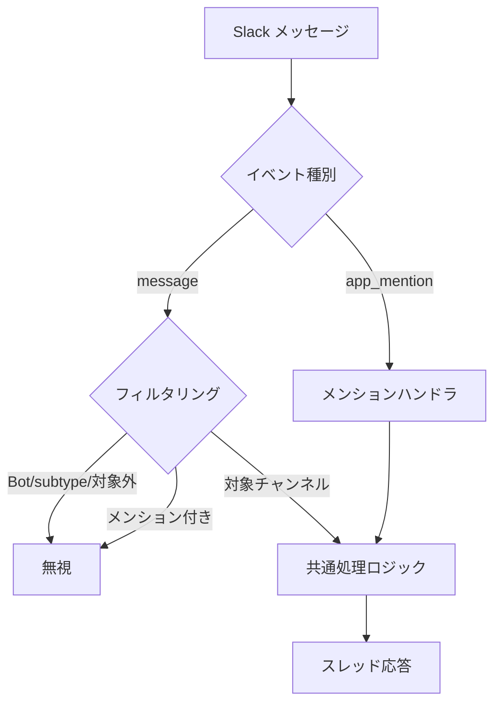

# 特定チャンネル自動返信

## 概要

特定の Slack チャンネルでは、ボットへのメンションなしでも全ての投稿に対して自動的に返信する機能。専用の質問チャンネルや学習サポートチャンネルでの利便性を向上させる。

## 背景

- 質問チャンネル等では毎回メンションするのが煩雑
- 指定チャンネルでの自動応答により、ユーザーの利便性を向上させる

## 制約

- 自動返信チャンネルは環境変数で明示的に指定する。意図しないチャンネルでの自動返信を防止するため
- 高トラフィックチャンネルでの使用は非推奨。API 呼び出し過多やレート制限超過のリスクがあるため

## 操作一覧

| 操作 | トリガー | 概要 |
| --- | --- | --- |
| 自動返信 | 対象チャンネルへのメッセージ投稿 | メンションなしで自動応答 |

## 各操作の仕様

### 自動返信

**トリガー**: 環境変数で指定されたチャンネルへのメッセージ投稿

**振る舞い**:

1. メッセージイベントを受信する
2. フィルタリングを実施する:
   - Bot 自身の投稿 → 無視
   - メッセージのサブタイプ（編集・削除等） → 無視
   - 対象外チャンネル → 無視
   - メンション付きメッセージ → 無視（`app_mention` イベント側で処理。二重応答防止）
3. 共通メッセージ処理ロジック（キーワード判定 → チャット応答等）で応答する

**出力**:

- スレッド内にテキストメッセージで応答（新規投稿の場合は新しいスレッドを作成）

## エッジケース

| ケース | 振る舞い |
| --- | --- |
| 環境変数が未設定・空 | 自動返信機能は無効（通常のメンション応答のみ） |
| メンション付きメッセージ | `message` ハンドラではスキップし、`app_mention` 側で処理 |
| スレッド内の会話 | 会話履歴を保持し、文脈を踏まえた応答を返す |

## コンポーネント構成

| コンポーネント | 役割 |
| --- | --- |
| メッセージハンドラ | `message` イベントのフィルタリング・ルーティング |
| 共通処理ロジック | キーワード判定、チャット応答 / プロファイル抽出 / トピック提案の呼び出し |
| 設定 | 自動返信対象チャンネル ID リストの提供 |
