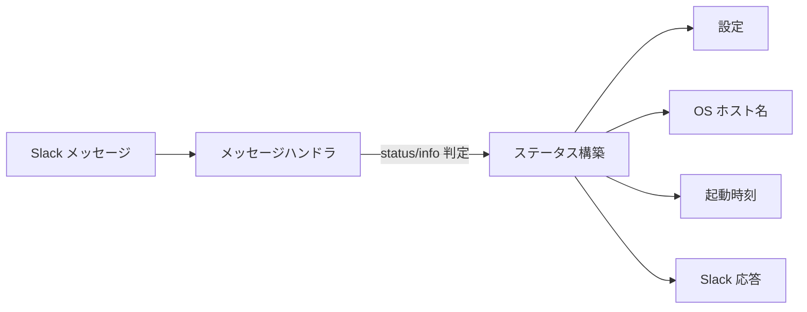

# ボットステータスコマンド

## 概要

ボットがどのサーバーで稼働しているかを確認できるコマンドを提供する。ローカル環境と本番環境の両方でボットが起動していた場合に、どちらが応答しているか判別可能にする。

## 背景

- 開発・運用時に複数環境でボットが稼働している場合、どの環境が応答しているかを判別する手段がない
- 稼働状態（起動時刻・稼働時間）を確認する手段が必要

## 制約

以下の情報はセキュリティ上の理由から表示しない:

- IP アドレス
- ファイルパス
- 環境変数の値
- DB の接続先詳細

## 操作一覧

| 操作 | トリガー | 概要 |
|---|---|---|
| ステータス表示 | `status` または `info` キーワード | ボットの稼働情報を返す |

- キーワードは大文字小文字不問で認識する
- メンション付き・自動返信チャンネルの両方で動作する

## 各操作の仕様

### ステータス表示

**トリガー**: メッセージに `status` または `info` キーワードが含まれる場合

**振る舞い**:

1. OS からホスト名を取得する
2. 起動時刻と現在時刻から稼働時間を算出する
3. 環境識別子（環境変数 `ENV_NAME`）の設定有無に応じて出力を分岐する

**出力**:

環境識別子が設定されている場合:

```
🤖 ボットステータス
ホスト: prod-server-01
環境: production
起動: 2026-02-05 10:30:00 JST（稼働 2時間15分）
```

環境識別子が未設定（空文字）の場合:

```
🤖 ボットステータス
ホスト: DESKTOP-ABC123
起動: 2026-02-05 10:30:00 JST（稼働 2時間15分）
```

- 時刻は設定のタイムゾーンで表示する
- 稼働時間は「N時間M分」形式
- 環境識別子が未設定の場合、「環境」行を省略する

## コンポーネント構成



| コンポーネント | 役割 |
|---|---|
| メッセージハンドラ | キーワード判定・ステータス応答のルーティング |
| ステータス構築 | ホスト名・稼働時間・環境識別子を組み立てて応答メッセージを生成 |
| 設定 | 環境識別子（`ENV_NAME`）・タイムゾーンを提供 |

## 関連ドキュメント

- [auto-reply](auto-reply.md): 自動返信チャンネルでのコマンド動作
