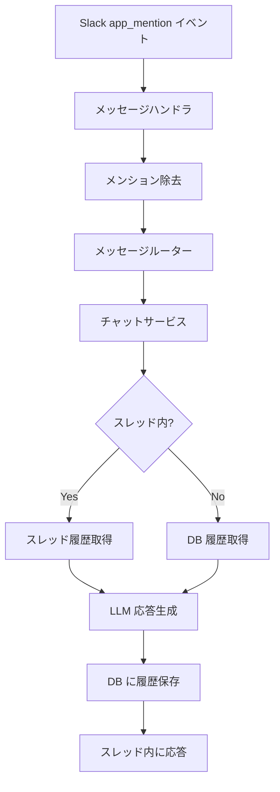

# チャット応答

## 概要

Slack でボットにメンションされた際に、性格設定に基づいてスレッド内で会話応答を行う機能。

会話履歴を保持し、文脈を踏まえた応答を返す。MCP ツール連携・RAG ナレッジ検索の詳細は別仕様で定義する。

## 背景

- Slack 上で自然な会話体験を提供するため
- 性格設定により、プロジェクトに適した応答トーンを実現する
- 会話の文脈を保持し、継続的なやり取りを可能にする

## 制約

- メンション部分（`<@BOT_ID>`）は LLM に送信する前に除去する。メンション文字列がそのまま LLM に渡ると応答品質が低下するため
- 会話履歴（ユーザーメッセージ・アシスタント応答）は DB に保存する。スレッド履歴取得が失敗した場合のフォールバックデータとして機能するため
- LLM プロバイダーは環境変数で切り替え可能

## 操作一覧

| 操作 | トリガー | 概要 |
|------|---------|------|
| チャット応答 | Slack `app_mention` イベント | メンションに対してスレッド内で会話応答を返す |

## 各操作の仕様

### チャット応答

**トリガー**: Slack `app_mention` イベント（ボットへのメンション）

**振る舞い**:

- メンション部分を除去してユーザーの入力テキストを抽出する
- フォーマット指示と性格設定からシステムプロンプトを構成する（フォーマット指示の詳細は `slack-formatting.md` を参照）
- 会話履歴を取得する（スレッド内: Slack API → DB フォールバック / スレッド外: DB。詳細は `thread-support.md` を参照）
- LLM に送信して応答を生成する
- ユーザーメッセージとアシスタント応答を DB に保存する

**出力**: スレッド内にテキストメッセージで応答

## エッジケース

| ケース | 振る舞い |
|--------|---------|
| メンション除去後にテキストが空 | 応答を行わない（無視する） |
| LLM API 呼び出し失敗 | ユーザーにエラーメッセージを返す |
| MCP ツール呼び出しタイムアウト | エラー結果をツールループに戻し、テキスト応答を生成する |
| ツール呼び出しループ上限到達 | 現在の情報での回答を強制的に要求する |
| Slack API によるスレッド履歴取得失敗 | DB 履歴にフォールバックする（`thread-support.md` 参照） |

## コンポーネント構成

| コンポーネント | 役割 |
|--------------|------|
| メッセージハンドラ | Slack イベントを受信し、メンション除去後にメッセージルーターに委譲 |
| メッセージルーター | キーワードルーティングに基づき適切なサービスに委譲 |
| チャットサービス | 履歴取得・LLM 応答生成・DB 保存のオーケストレーション |
| LLM プロバイダー | 応答テキストを生成（プロバイダーは環境変数で切り替え可能） |

## 関連ドキュメント

- [スレッド対応](thread-support.md) — スレッド履歴取得・フォールバック
- [MCP 統合](../infrastructure/mcp-integration.md) — ツール呼び出しループ・自動コンテキスト注入
- [特定チャンネル自動返信](auto-reply.md) — 自動返信チャンネルとの統合
- [Slack mrkdwn 形式対応](slack-formatting.md) — フォーマット指示の構成・適用
- [RAG ナレッジ](../infrastructure/rag-knowledge.md) — RAG 検索・ソース表示
