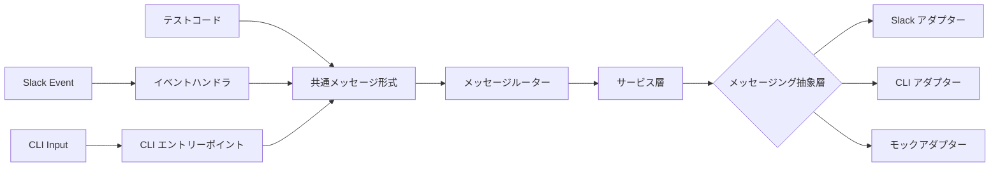

# CLI アダプター

## 概要

メッセージングを抽象化し、Slack 以外のインターフェース（CLI、テスト）から同一のコードパスで動作確認できるようにする機能。

本仕様はメッセージングの抽象化層と CLI モードの振る舞いを定義する。各キーワードコマンドの詳細は個別の仕様書を参照。

## 背景

- Slack 接続なしでボットの動作確認を行う手段がなかった
- CLI からメッセージを入力して同一のロジックで動作確認したい
- メッセージング層を疎結合にし、テストの容易性とプラットフォーム拡張性を確保する

## 制約

- CLI モードと Slack モードで共通のメッセージルーター・サービス層を通ること。
  異なるのは入口（イベント抽出 / stdin）と出口（Slack API / stdout）のみ
- Slack 接続が必要な操作（feed deliver / collect / test）は CLI 単体モードではエラーメッセージを返却する

## 操作一覧

| 操作 | トリガー | 概要 |
| --- | --- | --- |
| REPL モード | CLI 起動（引数なし） | 対話型ループで繰り返しメッセージを処理 |
| ワンショットモード | CLI 起動（`--message` 指定） | 単発メッセージを処理して終了 |

- CLI 起動オプション: `--user-id`（ユーザー ID）、`--message`（ワンショットメッセージ）、`--db-dir`（DB 保存先）

## 各操作の仕様

### REPL モード

**トリガー**: `--message` オプションなしで CLI を起動

**振る舞い**:

1. セッション ID を生成する
2. プロンプトを表示し、ユーザー入力を待つ
3. 入力メッセージを共通メッセージルーターに渡す
4. 応答を stdout に表示する
5. 2〜4 を繰り返す（EOF または終了コマンドで終了）

**出力**:

- 各応答を stdout にテキストとして表示

### ワンショットモード

**トリガー**: `--message` オプション付きで CLI を起動

**振る舞い**:

1. セッション ID を生成する
2. 指定されたメッセージを共通メッセージルーターに渡す
3. 応答を stdout に表示して終了する

**出力**:

- 応答を stdout にテキストとして表示し、プロセスを終了

## エッジケース

| ケース | 振る舞い |
| --- | --- |
| Slack 専用コマンド（feed deliver 等）を CLI で実行 | エラーメッセージを返却 |
| CLI でファイルアップロード操作 | ローカルファイルとして保存 |
| スレッド履歴の取得 | CLI では `None` を返却し、DB フォールバックを使用 |
| フォーマット指示の取得 | CLI では空文字列を返却（プレーンテキスト出力） |

## コンポーネント構成

| コンポーネント | 役割 |
| --- | --- |
| メッセージング抽象層 | メッセージ送信・ファイル送信・履歴取得・フォーマット指示のインターフェース定義 |
| Slack アダプター | Slack API を使用したメッセージング実装 |
| CLI アダプター | stdout / ローカルファイルを使用したメッセージング実装 |
| モックアダプター | テスト用のメッセージング実装 |
| メッセージルーター | 入力メッセージに応じた適切なサービスへの振り分け |
| 共通メッセージ形式 | Slack / CLI 共通の入力メッセージ構造 |

**Slack と CLI の出力対応**:

| 操作 | Slack | CLI |
| --- | --- | --- |
| メッセージ送信 | Slack API で投稿 | stdout に表示 |
| ファイル送信 | Slack API でアップロード | ローカルファイルに保存 |
| スレッド履歴取得 | Slack API で取得 | `None` 返却（DB フォールバック） |
| フォーマット指示 | Slack mrkdwn 形式 | 空文字列（プレーンテキスト） |

## 関連ドキュメント

<!-- リンク先は未移行。#648 で一括修正予定 -->
- [chat-response](chat-response.md) — チャット応答（メッセージルーターの主要な処理先）
- [auto-reply](auto-reply.md) — 自動返信チャンネル機能
