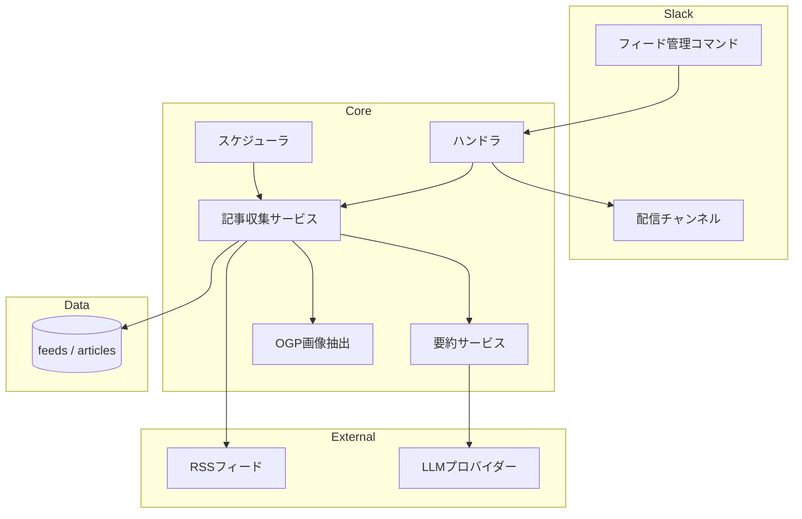

# 情報収集・配信

## 概要

RSSフィードから学習関連記事を自動収集し、LLMで要約したうえで、Slackの専用チャンネルに自動配信する。フィードの管理（追加・削除・一括操作）もSlackコマンドで行える。

## 背景

- 学習テーマに関する最新記事を個別にチェックするのは手間がかかる
- RSSの自動収集・要約・配信を行うことで、毎朝Slackを開くだけで最新情報をキャッチアップできる
- フィード管理機能により、情報源の追加・整理をボットとの対話で完結させる

## 制約

### 配信形式

- Slackメッセージは Block Kit 形式で出力する
- フィードごとに親メッセージ（チャンネル直下）＋スレッド内に記事を投稿する構造
- 1記事 = 1スレッド投稿（一括投稿しない）
- 投稿は逐次型（1記事の処理完了後に次の記事へ進む）
- スレッド投稿間に1秒のスリープ（Slack APIレート制限対策）

### 日時・ソート

- 記事の更新日時は `published_at` を使用し、`None` の場合は `collected_at` にフォールバック
- 日時フォーマットは `MM-dd HH:mm`（年なし）。タイムゾーンは `Asia/Tokyo`（`Settings.timezone`）
- 記事はスレッド内で投稿日時の昇順（古い→新しい）で表示
- フィード一覧は URL 昇順でソート（`feed list` / `feed export` / 配信処理で共通）

### 設定値

| 環境変数 | 説明 |
| --- | --- |
| `FEED_ARTICLES_PER_FEED` | フィードあたりの最大表示件数 |
| `FEED_CARD_LAYOUT` | 配信カードの表示形式（`horizontal` / `vertical`） |
| `FEED_SUMMARIZE_TIMEOUT` | 1記事あたりの要約タイムアウト秒数。超過時はそのフィードの収集を中止 |
| `FEED_COLLECT_DAYS` | 収集対象の日数。`published_at` がこの日数より古い記事はスキップ。`published_at` が NULL の記事はスキップしない |
| `SLACK_NEWS_CHANNEL_ID` | 配信先チャンネルID |

### 配信カードレイアウト

| 形式 | 振る舞い |
| --- | --- |
| `horizontal`（デフォルト） | タイトル＋要約を1セクションにまとめ、OGP画像がある場合のみ accessory として右側に配置 |
| `vertical` | タイトルはリンク付き太字、OGP画像は独立 image ブロック、要約はテキストブロック |

画像がない記事は両形式ともテキストのみで正常に表示される。

## 操作一覧

| 操作 | トリガー | 概要 |
| --- | --- | --- |
| RSS記事収集 | スケジューラ / 手動 | フィードから記事を取得し、LLMで要約してDBに保存 |
| 毎朝自動配信 | スケジューラ（毎朝） | 未配信記事をSlackに Block Kit 形式で配信 |
| 手動配信テスト | メンション + `deliver` | 毎朝配信と同一処理を手動実行 |
| フィードテスト配信 | メンション + `feed test` | 既存記事で配信表示を確認（副作用なし） |
| フィード管理 | メンション + `feed` + サブコマンド | フィードの追加・削除・有効化・無効化・一覧表示 |
| フィード一括インポート | メンション + `feed import` + CSV添付 | CSVからフィードを一括登録 |
| フィード一括置換 | メンション + `feed replace` + CSV添付 | 全削除→CSVから再登録 |
| フィードエクスポート | メンション + `feed export` | 全フィードをCSVファイルで出力 |
| 要約スキップ収集 | メンション + `feed collect --skip-summary` | LLM要約なしで記事を収集・配信 |
| 情報源探索 | ユーザーリクエスト | オンラインLLMで新しいRSSフィードを提案 |

## 各操作の仕様

### RSS記事収集

各フィードから feedparser で記事を取得し、新規記事のみ処理する。

| 条件 | 振る舞い |
| --- | --- |
| URL重複 | 収集済みの URL はスキップ |
| 要約生成 | description あり → 概要に基づいて要約。なし/不足 → タイトルから推測して要約 |
| 要約の品質制約 | 「情報が不足」「把握できません」等の非要約応答は禁止 |
| 要約タイムアウト | `FEED_SUMMARIZE_TIMEOUT` 超過時はそのフィードの収集を中止 |
| OGP画像 | 取得可能な場合のみ保存 |
| 収集日数 | `published_at` が `FEED_COLLECT_DAYS` より古い記事はスキップ |

### 毎朝自動配信

未配信の記事をSlackに配信する。

配信メッセージ構成:

1. ヘッダーメッセージ: `:newspaper: 今日のニュース (YYYY-MM-DD)`
2. フィード別親メッセージ: `:file_folder: *{フィード名}*`
3. スレッド内記事投稿（1記事1投稿）: タイトル（リンク付き）・日時・要約・OGP画像
4. フッターメッセージ: `:bulb: 気になる記事があれば、スレッドで聞いてね！`

フィードは逐次処理（1フィードずつ）。記事投稿完了後、配信済みとしてマークする。

### 手動配信テスト

メンション + `deliver` で毎朝配信と同一処理を実行する。開始時に「配信を開始します...」、完了時に「配信が完了しました」と応答する。

### フィードテスト配信

メンション + `feed test` で既存記事の配信表示を確認する。

| 項目 | 振る舞い |
| --- | --- |
| 対象 | 有効フィードの先頭3件、各フィード5記事まで |
| 要約 | 生成しない（既存記事のみ使用） |
| 配信済みフラグ | 更新しない（副作用なし） |
| ヘッダー | `:newspaper: 今日のニュース (YYYY-MM-DD)（テスト）` |
| 投稿形式 | 通常配信と同じ共通関数を使用 |

### フィード管理

メンション + `feed` + サブコマンドで操作する。

| コマンド | 振る舞い |
| --- | --- |
| `feed add <URL> [カテゴリ]` | フィード追加。タイトルは RSS の title タグから自動取得（失敗時は URL をフォールバック）。カテゴリ省略時は「一般」。複数URL対応 |
| `feed list` | 有効/無効で分類して一覧表示。各フィードは `URL — フィード名` 形式 |
| `feed delete <URL>` | フィード削除。関連記事も CASCADE 削除。複数URL対応 |
| `feed enable <URL>` | フィード有効化。複数URL対応 |
| `feed disable <URL>` | フィード無効化。複数URL対応 |

コマンド解析: `http://` または `https://` で始まるトークンを URL、それ以外をカテゴリとして認識。サブコマンドは大文字小文字不問。不明なサブコマンドはヘルプメッセージを表示。

### フィード一括インポート

メンション + `feed import` + CSV添付でフィードを一括登録する。

CSV形式: `url,name,category`（`category` 省略時は「一般」）。重複URLはスキップし、他の行は継続処理する。処理結果のサマリー（成功数/失敗数/詳細）を返答する。

添付ファイルがない場合、CSV以外の場合はエラーメッセージを表示する。

### フィード一括置換

メンション + `feed replace` + CSV添付で既存フィードを全削除し、CSVから再登録する。

CSV形式はインポートと同一。全削除後のインポートで失敗しても、削除は取り消されない（非トランザクション）。処理結果のサマリー（削除件数・登録成功数・失敗数）を返答する。

### フィードエクスポート

メンション + `feed export` で全フィード（有効・無効問わず）をCSVファイルとして出力する。

CSV形式はインポート/置換と同一（`url,name,category`）。CSVファイルはSlackにファイル添付として投稿する。フィードが0件の場合はエラーメッセージを表示する。

Slack API権限: `files:write` スコープが必須、`files:read` が推奨。権限不足時はエラーメッセージを表示する。

### 要約スキップ収集

メンション + `feed collect --skip-summary` でLLM要約なしの収集を実行する。

| 項目 | 振る舞い |
| --- | --- |
| LLM呼び出し | なし |
| summary 保存値 | description（HTMLタグ除去済み）。空の場合はプレースホルダ「（要約なし）」 |
| OGP画像 | 通常収集と同様に取得 |
| Slack投稿 | 通常配信と同じ逐次投稿フロー |
| エラー時 | 該当フィードをスキップし、他のフィードの処理を継続 |

### 情報源探索

ユーザーの「この分野の情報源を追加して」等のリクエストに対し、オンラインLLMで新しいRSSフィードを提案し、承認後に登録する。

## エッジケース

| ケース | 振る舞い |
| --- | --- |
| RSS取得失敗 | エラーをログに記録し、他のフィードの処理を継続 |
| 重複URL追加 | エラー通知 |
| 存在しないURL操作 | エラー通知（削除・有効化・無効化共通） |
| 配信済み記事の再配信 | 配信済みフラグにより防止 |
| OGP画像取得失敗 | 画像なしで表示（エラーにしない） |
| 要約タイムアウト | そのフィードの収集を中止し、他のフィードは継続 |
| 不正な `FEED_CARD_LAYOUT` 値 | 起動時に ValidationError |

## コンポーネント構成

| コンポーネント | 役割 |
| --- | --- |
| 記事収集サービス | RSS取得・新規記事判定・OGP画像取得統合 |
| 要約サービス | LLMによる記事要約 |
| OGP画像抽出 | 記事URLからOGP画像URLを取得 |
| スケジューラ | 毎朝の定期実行ジョブ |
| ハンドラ | Slackコマンドの解析・応答 |

## 関連ドキュメント

<!-- chat-response は未移行パスを含む。#648 で一括修正予定 -->
- [チャット応答](../features/chat-response.md) — 配信コマンドのルーティング
