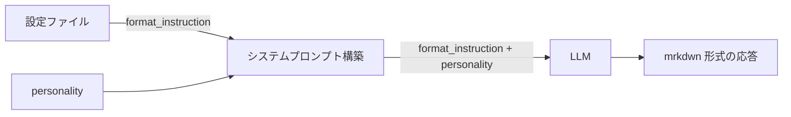

# Slack mrkdwn 形式対応

## 概要

LLM からの返信を Slack の mrkdwn 形式で出力し、太字・リスト等の装飾が正しく表示されるようにする機能。

## 背景

- LLM はデフォルトで Markdown 形式のテキストを出力するが、Slack は独自の mrkdwn 形式を使用しており、標準 Markdown の装飾記法がそのまま表示されてしまう
- プロンプト指示方式により、変換処理のエッジケースや保守コストなしに対応する

## 制約

- 後処理変換方式（Markdown → mrkdwn の正規表現変換）は採用しない。コードブロック内の誤変換リスクと保守コストが高いため

## 操作一覧

| 操作 | トリガー | 概要 |
| --- | --- | --- |
| フォーマット指示 | チャット応答時（自動） | システムプロンプトに mrkdwn 出力指示を付与 |

- ユーザー操作は不要。設定ファイルにフォーマット指示が定義されていれば自動的に適用される

## 各操作の仕様

### フォーマット指示

**トリガー**: チャット応答時に自動適用

**振る舞い**:

1. 設定ファイルからフォーマット指示を読み込む
2. フォーマット指示をシステムプロンプトの先頭に配置する（personality より前）
3. LLM に mrkdwn 形式での出力を指示する

**出力**:

- LLM の応答が Slack mrkdwn 形式で出力される

**Markdown と Slack mrkdwn の対応表**:

| 要素 | Markdown | Slack mrkdwn |
| --- | --- | --- |
| 太字 | `**text**` | `*text*` |
| イタリック | `*text*` | `_text_` |
| 取り消し線 | `~~text~~` | `~text~` |
| リンク | `[text](url)` | `<url&#124;text>` |
| 順序なしリスト | `- item` | `• item` |
| 見出し | `# heading` | `*heading*`（太字で代替） |
| 引用 | `> text` | `> text`（同じ） |
| コードブロック | `` ```code``` `` | `` ```code``` ``（同じ） |

## エッジケース

| ケース | 振る舞い |
| --- | --- |
| フォーマット指示が未設定・空 | システムプロンプトに影響せず、通常の Markdown 出力 |

## コンポーネント構成



| コンポーネント | 役割 |
| --- | --- |
| 設定ファイル | フォーマット指示の定義 |
| システムプロンプト構築 | フォーマット指示を personality の前に配置 |
| LLM | mrkdwn 形式で応答を生成 |
