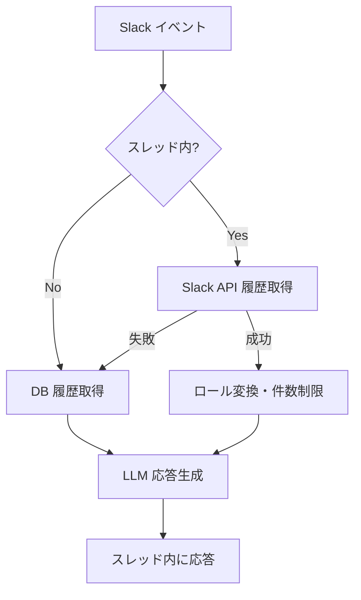

# スレッド対応

## 概要

Slack スレッド内でボットがメンションされた際、スレッド内の過去メッセージを Slack API から取得し、会話の文脈を踏まえた応答を返す機能。

## 背景

- スレッドの途中からボットが呼ばれた場合、それ以前のやり取りのコンテキストがなく的外れな応答になる
- DB に保存されるのはボットが処理したメッセージのみであり、他ユーザーの発言やボット処理前の発言は含まれない
- スレッド全体の流れを把握した応答を実現するため、Slack API から直接履歴を取得する

## 制約

- 取得件数は環境変数 `THREAD_HISTORY_LIMIT` で制御する。コスト・パフォーマンスのバランスを調整可能にするため
- Slack API 失敗時は DB 履歴にフォールバックする。可用性を維持するため
- DB への保存は Slack API 取得時も従来どおり維持する。フォールバック用のデータを確保するため
- トークン上限による切り捨ては行わない（将来課題）。現段階では件数制限のみで対応

## 操作一覧

| 操作 | トリガー | 概要 |
| --- | --- | --- |
| スレッド履歴取得 | スレッド内でのメンション / 自動返信チャンネルのスレッド内メッセージ | Slack API からスレッド履歴を取得し、文脈を踏まえた応答を返す |

## 各操作の仕様

### スレッド履歴取得

**トリガー**: スレッド内でのメンション、または自動返信チャンネルのスレッド内メッセージ

**振る舞い**:

1. スレッド内メッセージかどうかを判定する
2. スレッド内の場合、Slack API からスレッドの過去メッセージを取得する
3. 取得したメッセージをロール別に変換する:
   - ボット自身のメッセージ → `assistant` ロール
   - 他ユーザーのメッセージ → `user` ロール（ユーザー ID を付与して発言者を区別）
4. サブタイプ付きメッセージ（編集通知等）やテキストなしメッセージはスキップする
5. トリガーメッセージ自体は履歴から除外する（チャット応答ロジック側で追加されるため）
6. 件数制限を超えた場合は古いメッセージを切り捨て、最新 N 件を使用する

**出力**: LLM に渡すメッセージリストにスレッド履歴が含まれ、スレッド内にテキストで応答

### スレッド判定ロジック

| 条件 | 履歴ソース |
| --- | --- |
| トップレベルメッセージ（スレッド外） | DB |
| スレッド内メッセージ | Slack API → 失敗時は DB にフォールバック |

判定方法: イベントに `thread_ts` が存在する場合をスレッド内と判定する。

## エッジケース

| ケース | 振る舞い |
| --- | --- |
| Slack API 呼び出し失敗 | DB 履歴にフォールバックし、エラーログを出力 |
| スレッド外からの呼び出し | 従来どおり DB 履歴を使用 |
| スレッド内メッセージが件数制限を超過 | 古いメッセージを切り捨て、最新 N 件を使用 |

## コンポーネント構成

| コンポーネント | 役割 |
| --- | --- |
| スレッド履歴サービス | Slack API からスレッドメッセージを取得し、LLM 用メッセージに変換 |
| チャットサービス | 履歴ソースの切り替え（Slack API / DB）と LLM 応答生成 |
| メッセージハンドラ | イベントからスレッド判定情報を抽出し、チャットサービスに伝搬 |

## 関連ドキュメント

<!-- chat-response は未移行。#648 で一括修正予定 -->
- [チャット応答](chat-response.md) — DB 履歴・応答生成
- [特定チャンネル自動返信](auto-reply.md) — 自動返信チャンネル仕様
