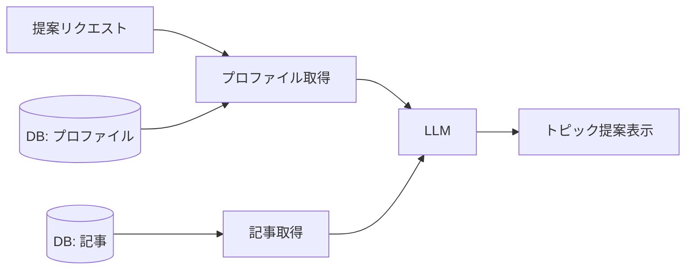

# 学習トピック提案

## 概要

収集した記事情報とユーザープロファイルを組み合わせ、「次に学ぶべきトピック」をパーソナライズして提案する機能。

## 背景

- ユーザーが自分で学習トピックを探すのは時間がかかる
- プロファイル情報と最近の記事を組み合わせることで、個人に合った提案が可能

## 操作一覧

| 操作 | トリガー | 概要 |
| --- | --- | --- |
| トピック提案 | ユーザーがキーワードで要求 | パーソナライズされた学習トピックを提案 |

## 各操作の仕様

### トピック提案

**トリガー**: ユーザーがトピック提案キーワード（`おすすめのトピック` 等）を含むメッセージを送信

**振る舞い**:

1. ユーザープロファイル（interests, skills, goals）を DB から取得する
2. 最近の収集記事のタイトル・要約一覧を取得する
3. LLM に以下を渡してトピック提案を生成する:
   - ユーザーの現在のスキル・興味・目標
   - 最近のトレンド記事
   - 3〜5 個のトピック提案指示
4. 各提案にユーザーのスキル・目標との関連性の説明を含める

**出力**:

- パーソナライズされた 3〜5 個のトピック提案をスレッド内に表示

## エッジケース

| ケース | 振る舞い |
| --- | --- |
| プロファイルが空 | 一般的なおすすめを返しつつ、プロファイル充実を促す |
| 記事データが少ない | プロファイル情報のみに基づいて提案する |

## コンポーネント構成

| コンポーネント | 役割 |
| --- | --- |
| プロファイル取得 | ユーザーの興味・スキル・目標を DB から取得 |
| 記事取得 | 最近の収集記事を DB から取得 |
| LLM | プロファイルと記事を組み合わせてトピック提案を生成 |

## 関連ドキュメント

- [user-profiling](user-profiling.md): プロファイル抽出・蓄積
