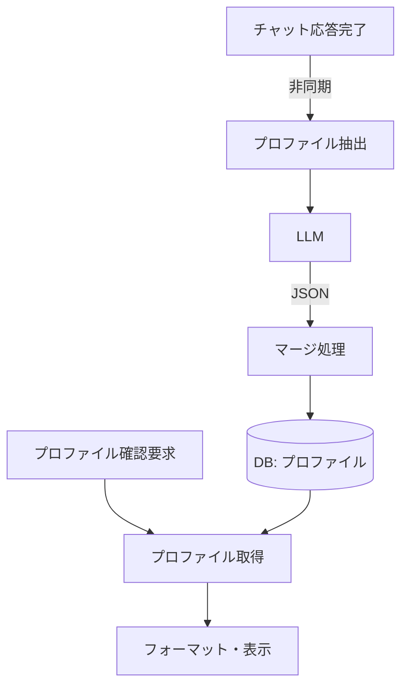

# ユーザー情報抽出

## 概要

ボットとの会話からユーザーの興味・スキル・学習目標を自動的に抽出し、DB に蓄積する機能。蓄積された情報はトピック提案や情報収集のパーソナライズに活用する。

## 背景

- ユーザーの興味やスキルを手動で登録するのは煩雑
- 会話から自動抽出することで、意識せずにパーソナライズの恩恵を受けられる

## 操作一覧

| 操作 | トリガー | 概要 |
| --- | --- | --- |
| プロファイル抽出 | チャット応答後（自動・非同期） | 会話から興味・スキル・目標を抽出し DB に保存 |
| プロファイル確認 | ユーザーがキーワードで要求 | 蓄積されたプロファイル情報を表示 |

## 各操作の仕様

### プロファイル抽出

**トリガー**: チャット応答後に非同期で自動実行（応答速度に影響しない）

**振る舞い**:

1. LLM に会話内容を渡し、構造化データとして抽出する:
   - interests: 興味のあるトピック
   - skills: スキルと経験レベル
   - goals: 学習目標
2. 既存のプロファイルとマージする:
   - interests / goals: 既存リストに新規項目を追加し、重複を除去
   - skills: 同名スキルはレベルを上書き更新、新規スキルは追加
3. DB に保存する

**出力**:

- DB のプロファイルレコードが更新される

### プロファイル確認

**トリガー**: ユーザーがプロファイル確認キーワードを含むメッセージを送信

**振る舞い**:

1. ユーザーの DB プロファイルを取得する
2. 興味・スキル・目標をフォーマットして返す

**出力**:

- プロファイル情報をスレッド内に表示

## エッジケース

| ケース | 振る舞い |
| --- | --- |
| LLM の抽出結果が不正な JSON | エラーをログに記録し、抽出処理をスキップ |
| 抽出結果の型が不正（配列でない等） | 不正な要素をフィルタして有効な項目のみ保存 |
| プロファイルが空 | 「まだ情報がない」旨を表示し、会話を促す |

## コンポーネント構成

| コンポーネント | 役割 |
| --- | --- |
| プロファイル抽出 | LLM を使って会話から構造化データを抽出 |
| マージ処理 | 既存プロファイルと新規抽出データの統合 |
| プロファイル取得 | DB からユーザーのプロファイルを取得・フォーマット |

## 関連ドキュメント

- [topic-recommend](topic-recommend.md): プロファイルを活用したトピック提案
