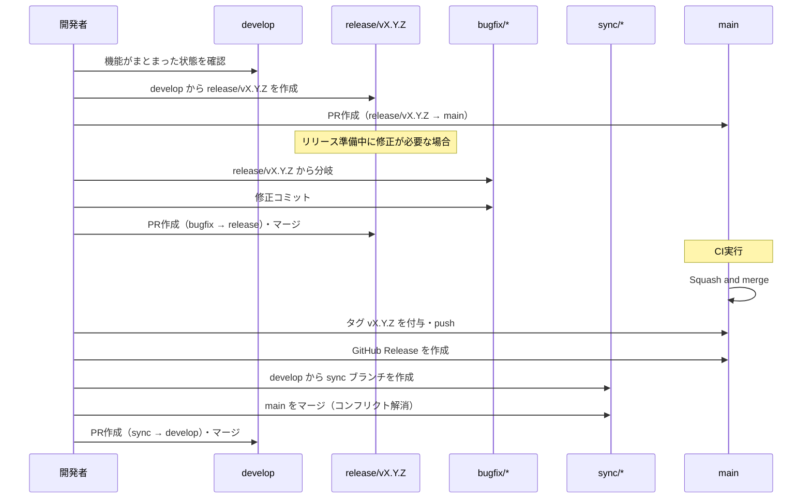

# git-flow ブランチ運用

## 概要

本プロジェクトのブランチ戦略を GitHub Flow（現行）から git-flow ベースの運用に移行する。
`develop` ブランチを開発の統合先として導入し、`main` は安定版のみを保持する。
`release/*` ブランチを導入し、リリース単位の履歴管理を行う。

## 背景

- 現行は全 feature ブランチが `main` に直接マージされる運用
- リリーススケジュールは特に設けないが、`main` には安定版のみを反映したい
- 開発中の機能が `main` に混在するリスクを低減する
- どの期間にどの機能が導入されたかをリリース単位で追跡したい

## ユーザーストーリー

- 開発者として、`main` ブランチを安定版として維持し、開発中の機能が混在するリスクを低減したい
- 開発者として、`develop` ブランチで機能統合を行い、まとまったタイミングで `main` に反映したい
- 開発者として、リリースブランチを通じてリリース単位の変更履歴を管理したい

## ブランチ構成


### 常設ブランチ

| ブランチ | 役割 | マージ元 | 保護 |
|---------|------|---------|------|
| `main` | 安定版（本番相当） | `release/*`, `hotfix/*` | 直接プッシュ禁止 |
| `develop` | 開発統合 | `feature/*`, `bugfix/*`, `sync/*`（リリース後同期） | 直接プッシュ禁止 |

### 作業ブランチ

| プレフィックス | 用途 | ベース | マージ先 | 命名規則 |
|--------------|------|--------|---------|---------|
| `feature/` | 新機能開発 | `develop` | `develop` | `feature/f{N}-{機能名}-#{Issue番号}` |
| `bugfix/` | バグ修正 | `develop` または対象 `release/*` | ベースと同一ブランチ | `bugfix/{修正内容}-#{Issue番号}` |
| `release/` | リリース準備 | `develop` | `main`（squash） | `release/v{X.Y.Z}` |
| `hotfix/` | 本番緊急修正 | `main` | `main` + `develop` | `hotfix/{修正内容}-#{Issue番号}` |
| `sync/` | リリース後の main → develop 同期 | `develop` | `develop` | `sync/main-to-develop-v{X.Y.Z}` |
| `claude/` | Claude Code自動生成 | `develop`(*) | `develop` | `claude/issue-{N}-{date}-{id}`（自動命名） |

(*) `claude/` ブランチは claude-code-action が自動生成するため、命名規則はシステム依存。

## ワークフロー

### 通常開発


1. `develop` から `feature/f{N}-{機能名}-#{Issue番号}` を作成
2. 実装・テスト・コミット
3. `develop` に向けてPR作成
4. CI通過 + レビュー後にマージ

### main への反映（リリース）



1. ある程度機能がまとまったタイミングで `develop` から `release/v{X.Y.Z}` ブランチを作成
2. `release/v{X.Y.Z}` → `main` に向けてPR作成（リリースPR）
3. リリース準備中に修正が必要な場合は、bugfix ブランチを `release/*` から作成し、PRで `release/*` にマージする（詳細は下記「release ブランチ上の修正」参照）
4. マージ方法: **Squash and merge**（リリース単位で1コミットにまとめる。詳細は「マージ方式」セクション参照）
5. マージ判断は開発者が行う
6. **main にタグ `v{X.Y.Z}` を付与し push する**（詳細は下記「タグ付けと GitHub Release」参照）
7. **GitHub Release を作成する**（タグから自動生成 or 手動作成）
8. **main → develop に差分を反映する**（sync ブランチ経由。詳細は下記「main → develop の差分反映」参照）

#### release ブランチ上の修正

リリース準備中に修正が必要な場合、release ブランチに直接コミットせず、bugfix ブランチを経由してPRでマージする。

- **理由**: release PRに修正を直接混ぜると、どの時点で何が修正されたか追跡しづらくなる。PR単位で修正履歴を残すことでトレーサビリティを確保する
- **ブランチ命名**: `bugfix/{修正内容}-#{Issue番号}` （release ブランチからの分岐。Issue がない軽微な修正は番号省略可）
- **マージ先**: `release/v{X.Y.Z}`
- **マージ方式**: 通常マージ

```bash
# release ブランチから bugfix ブランチを作成
git checkout -b bugfix/fix-something release/v0.0.1

# 修正して push
git push -u origin bugfix/fix-something

# release ブランチに向けてPR作成
gh pr create --base release/v0.0.1 --head bugfix/fix-something
```

#### タグ付けと GitHub Release

main への squash マージ後、リリースバージョンのタグを付与し、GitHub Release を作成する。

```bash
# main を最新に更新してからタグを付与
git checkout main
git pull --ff-only
git tag v{X.Y.Z}
git push origin v{X.Y.Z}

# GitHub Release を作成（GitHub UI または gh CLI）
gh release create v{X.Y.Z} --title "v{X.Y.Z} — リリースタイトル" --generate-notes
```

#### main → develop の差分反映

squash マージにより `main` に新しいコミットが作成されるため、`develop` と `main` の間に差分が生じる。
sync ブランチを経由してPRで反映する。

> **注意**: `main` → `develop` に直接PRを作成するとコンフリクトが発生する（squash コミットと元コミットのSHAが異なるため）。
> ローカルで sync ブランチを作成し、コンフリクトを解消してからPRにすること。

```bash
# develop から sync ブランチを作成
git checkout -b sync/main-to-develop-v{X.Y.Z} develop

# main をマージ（コンフリクト解消）
git merge main
# コンフリクトがある場合: ファイルごとに適切な側を採用
# リリースブランチでのみ変更されたファイル → main 側（--theirs）
# develop でも並行して変更されたファイル → 手動で内容を確認・統合
git add <resolved-files>
git commit --no-edit

# push して PR 作成
git push -u origin sync/main-to-develop-v{X.Y.Z}
gh pr create --base develop --head sync/main-to-develop-v{X.Y.Z} \
  --title "sync: main → develop (release/v{X.Y.Z})" \
  --body "リリース後の差分反映"
```

マージ後、`git diff develop..main --stat` で差分がゼロ（main 側にあって develop にない変更が存在しない）であることを確認する。

### hotfix（緊急修正）


1. `main` から `hotfix/{修正内容}-#{Issue番号}` を作成
2. 修正・コミット
3. `main` に向けてPR作成・マージ
4. `main` の変更を `develop` にもマージ（hotfix は通常マージのため `git merge main` で直接反映可。squash マージではないため SHA 不一致が起きない）

## マージ方式

| マージ先 | 方式 | コマンド | 理由 |
|---------|------|---------|------|
| feature/bugfix → develop | 通常マージ | `gh pr merge --merge` | 開発履歴を保持 |
| bugfix → release（リリース準備中の修正） | 通常マージ | `gh pr merge --merge` | 修正履歴を保持し、トレーサビリティを確保 |
| release → main（リリース） | squash マージ | `gh pr merge --squash` | リリース単位で1コミットにまとめ、main の履歴をきれいに保つ |
| sync → develop（リリース後同期） | 通常マージ | `gh pr merge --merge` | sync ブランチ経由で main の squash コミットを develop に取り込み、差分を解消する |
| hotfix → main | 通常マージ | `gh pr merge --merge` | 緊急修正の履歴を保持 |

**注意**: GitHub リポジトリ設定で squash merge を有効化する必要がある（Settings > General > Pull Requests > Allow squash merging）。

## コミットメッセージ規約

現行ルールを維持:

- `feat(f{N}): 説明 (#{Issue番号})` — 新機能
- `fix: 説明 (#{Issue番号})` — バグ修正
- `docs: 説明` — ドキュメント変更
- `refactor: 説明` — リファクタリング
- `test: 説明` — テスト追加・修正

## PRの運用

### feature/bugfix → develop

- PR body は `.github/pull_request_template.md` のテンプレートに従う（仕様: `docs/specs/pr-body-template.md`）
- `Closes #{Issue番号}` で紐付け
- CIチェック（pytest / mypy / ruff / markdownlint）必須
- **base ブランチ**: `develop`

### bugfix → release（リリース準備中の修正）

- PRタイトル例: `fix: 修正内容`
- `release/v{X.Y.Z}` をbaseとする
- CIチェック必須
- リリースPRに直接コミットせず、必ずPR経由でマージする

### release → main

- PRタイトル例: `Release: v1.0.0`
- 含まれる変更の一覧をPR本文に記載
- CIチェック必須
- マージ後に `main` → `develop` への差分反映を忘れないこと

### hotfix → main

- PRタイトル例: `Hotfix: 修正内容 (#Issue番号)`
- `main` をbaseとする
- マージ後に `develop` への反映を忘れないこと

## GitHub Actions への影響

### claude.yml（Claude Code Action）

- claude-code-action が自動生成する `claude/` ブランチのPRのbase先を制御する必要がある
- **対応**: claude-code-action の設定で `default_branch` をリポジトリのデフォルトブランチから取得するため、GitHub上でデフォルトブランチを `develop` に変更すれば自動で対応される
- ワークフローのトリガー条件に変更は不要

### pr-review.yml（PR自動レビュー）

- `base_ref` をdiffの基点として使用しており、ブランチ名に依存しない設計
- **対応不要**（`develop` ベースのPRでも正しく動作する）

## 変更が必要なファイル一覧

| ファイル | 変更内容 | 優先度 |
|---------|---------|--------|
| **GitHub設定** | デフォルトブランチを `main` → `develop` に変更 | 必須 |
| **GitHub設定** | `main` ブランチ保護ルール設定（直接プッシュ禁止） | 推奨 |
| **GitHub設定** | `develop` ブランチ保護ルール設定（直接プッシュ禁止） | 推奨 |
| `CLAUDE.md` | Git運用セクションの更新（develop追加、PR base変更） | 必須 |
| `docs/specs/overview.md` | Git運用セクションの更新 | 必須 |
| `README.md` | 開発フロー概要の更新 | 必須 |

### CLAUDE.md の具体的な変更箇所

1. **Git運用セクション**: ブランチ命名規則にbugfix/hotfixを追加、base branchの説明追加
2. **PR作成コマンド**: `--base main` → `--base develop`（通常時）
3. **claude-code-action設定**: デフォルトブランチが `develop` であることの説明

### GitHub Actions の変更

- `claude.yml`: 変更不要（デフォルトブランチ変更で自動対応）
- `pr-review.yml`: 変更不要（base_ref動的取得のため）

## 移行手順

1. `develop` ブランチを `main` から作成

   ```bash
   git checkout main
   git checkout -b develop
   git push origin develop
   ```

2. GitHubリポジトリ設定でデフォルトブランチを `develop` に変更
3. `main` ブランチの保護ルールを設定（推奨）
4. `develop` ブランチの保護ルールを設定（推奨）
5. `CLAUDE.md` / `docs/specs/overview.md` / `README.md` を更新
6. 既存のオープンPRがある場合、base branchを `develop` に変更

## 受け入れ条件

- [x] AC1: `develop` ブランチが作成されている
- [x] AC2: GitHubのデフォルトブランチが `develop` に設定されている
- [x] AC3: `CLAUDE.md` のGit運用セクションが git-flow に対応している
- [x] AC4: `docs/specs/overview.md` のGit運用セクションが更新されている
- [x] AC5: `README.md` の開発フロー概要が更新されている
- [x] AC6: feature/bugfix ブランチは `develop` からの分岐・マージで運用される（bugfix は `release/*` からの分岐・マージも可）
- [x] AC7: GitHub Actions（claude.yml, pr-review.yml）が `develop` ベースで正しく動作する
- [ ] AC8: `main` への反映は `release/v{X.Y.Z}` ブランチを経由して行われる
- [ ] AC9: `release/v{X.Y.Z}` → `main` は squash マージで行われる
- [ ] AC10: リリース後に `main` → `develop` の差分反映が行われる
- [ ] AC11: 仕様書・CLAUDE.md・overview.md にリリースブランチの運用が記載されている

## テスト方針

本仕様はブランチ運用ルールの定義であり、受け入れ条件の検証は手動で行う（GitHub設定の確認、ドキュメント整合性のレビュー等）。

## 関連ファイル

- `CLAUDE.md` — Git運用セクション
- `docs/specs/overview.md` — Git運用セクション
- `README.md` — 開発フロー概要
- `.github/workflows/claude.yml` — Claude Code Action
- `.github/workflows/pr-review.yml` — PR自動レビュー
