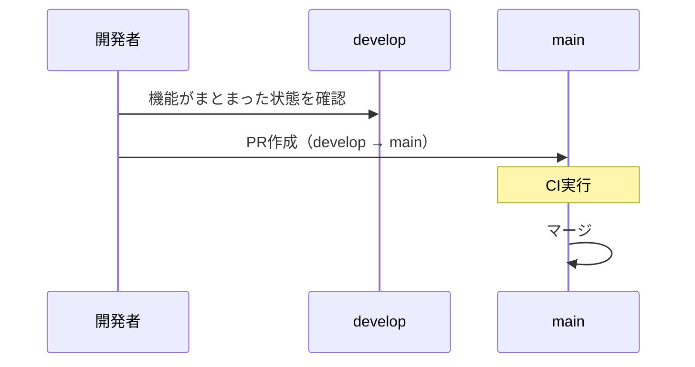

# git-flow ブランチ運用

## 概要

本プロジェクトのブランチ戦略を GitHub Flow（現行）から git-flow ベースの運用に移行する。
`develop` ブランチを開発の統合先として導入し、`main` は安定版のみを保持する。

## 背景

- 現行は全 feature ブランチが `main` に直接マージされる運用
- リリーススケジュールは特に設けないが、`main` には安定版のみを反映したい
- 開発中の機能が `main` に混在するリスクを低減する

## ユーザーストーリー

- 開発者として、`main` ブランチを安定版として維持し、開発中の機能が混在するリスクを低減したい
- 開発者として、`develop` ブランチで機能統合を行い、まとまったタイミングで `main` に反映したい

## ブランチ構成


### 常設ブランチ

| ブランチ | 役割 | マージ元 | 保護 |
|---------|------|---------|------|
| `main` | 安定版（本番相当） | `develop`, `hotfix/*` | 直接プッシュ禁止 |
| `develop` | 開発統合 | `feature/*`, `bugfix/*` | 直接プッシュ禁止 |

### 作業ブランチ

| プレフィックス | 用途 | ベース | マージ先 | 命名規則 |
|--------------|------|--------|---------|---------|
| `feature/` | 新機能開発 | `develop` | `develop` | `feature/f{N}-{機能名}-#{Issue番号}` |
| `bugfix/` | バグ修正 | `develop` | `develop` | `bugfix/{修正内容}-#{Issue番号}` |
| `hotfix/` | 本番緊急修正 | `main` | `main` + `develop` | `hotfix/{修正内容}-#{Issue番号}` |
| `claude/` | Claude Code自動生成 | `develop`(*) | `develop` | `claude/issue-{N}-{date}-{id}`（自動命名） |

(*) `claude/` ブランチは claude-code-action が自動生成するため、命名規則はシステム依存。

### release ブランチについて

本プロジェクトはリリーススケジュールを設けないため、`release/*` ブランチは導入しない。
`develop` → `main` への直接マージで運用する（後述「mainへの反映」参照）。

## ワークフロー

### 通常開発


1. `develop` から `feature/f{N}-{機能名}-#{Issue番号}` を作成
2. 実装・テスト・コミット
3. `develop` に向けてPR作成
4. CI通過 + レビュー後にマージ

### main への反映



- リリース日は設けず、ある程度機能がまとまったタイミングで `develop` → `main` にPR作成
- マージ方法: **Create a merge commit**（履歴を保持）
- マージ判断は開発者が行う

### hotfix（緊急修正）


1. `main` から `hotfix/{修正内容}-#{Issue番号}` を作成
2. 修正・コミット
3. `main` に向けてPR作成・マージ
4. `main` の変更を `develop` にもマージ（`git merge main` または PR）

## コミットメッセージ規約

現行ルールを維持:

- `feat(f{N}): 説明 (#{Issue番号})` — 新機能
- `fix: 説明 (#{Issue番号})` — バグ修正
- `docs: 説明` — ドキュメント変更
- `refactor: 説明` — リファクタリング
- `test: 説明` — テスト追加・修正

## PRの運用

### feature/bugfix → develop

- PRテンプレートは現行を維持
- `Closes #{Issue番号}` で紐付け
- CIチェック（pytest / mypy / ruff / markdownlint）必須
- **base ブランチ**: `develop`

### develop → main

- PRタイトル例: `Release: develop → main（機能概要）`
- 含まれる変更の一覧をPR本文に記載
- CIチェック必須

### hotfix → main

- PRタイトル例: `Hotfix: 修正内容 (#Issue番号)`
- `main` をbaseとする
- マージ後に `develop` への反映を忘れないこと

## GitHub Actions への影響

### claude.yml（Claude Code Action）

- claude-code-action が自動生成する `claude/` ブランチのPRのbase先を制御する必要がある
- **対応**: claude-code-action の設定で `default_branch` をリポジトリのデフォルトブランチから取得するため、GitHub上でデフォルトブランチを `develop` に変更すれば自動で対応される
- ワークフローのトリガー条件に変更は不要

### pr-review.yml（PR自動レビュー）

- `base_ref` をdiffの基点として使用しており、ブランチ名に依存しない設計
- **対応不要**（`develop` ベースのPRでも正しく動作する）

## 変更が必要なファイル一覧

| ファイル | 変更内容 | 優先度 |
|---------|---------|--------|
| **GitHub設定** | デフォルトブランチを `main` → `develop` に変更 | 必須 |
| **GitHub設定** | `main` ブランチ保護ルール設定（直接プッシュ禁止） | 推奨 |
| **GitHub設定** | `develop` ブランチ保護ルール設定（直接プッシュ禁止） | 推奨 |
| `CLAUDE.md` | Git運用セクションの更新（develop追加、PR base変更） | 必須 |
| `docs/specs/overview.md` | Git運用セクションの更新 | 必須 |
| `README.md` | 開発フロー概要の更新 | 必須 |

### CLAUDE.md の具体的な変更箇所

1. **Git運用セクション**: ブランチ命名規則にbugfix/hotfixを追加、base branchの説明追加
2. **PR作成コマンド**: `--base main` → `--base develop`（通常時）
3. **claude-code-action設定**: デフォルトブランチが `develop` であることの説明

### GitHub Actions の変更

- `claude.yml`: 変更不要（デフォルトブランチ変更で自動対応）
- `pr-review.yml`: 変更不要（base_ref動的取得のため）

## 移行手順

1. `develop` ブランチを `main` から作成

   ```bash
   git checkout main
   git checkout -b develop
   git push origin develop
   ```

2. GitHubリポジトリ設定でデフォルトブランチを `develop` に変更
3. `main` ブランチの保護ルールを設定（推奨）
4. `develop` ブランチの保護ルールを設定（推奨）
5. `CLAUDE.md` / `docs/specs/overview.md` / `README.md` を更新
6. 既存のオープンPRがある場合、base branchを `develop` に変更

## 受け入れ条件

- [ ] AC1: `develop` ブランチが作成されている
- [ ] AC2: GitHubのデフォルトブランチが `develop` に設定されている
- [ ] AC3: `CLAUDE.md` のGit運用セクションが git-flow に対応している
- [ ] AC4: `docs/specs/overview.md` のGit運用セクションが更新されている
- [ ] AC5: `README.md` の開発フロー概要が更新されている
- [ ] AC6: feature/bugfix ブランチは `develop` からの分岐・マージで運用される
- [ ] AC7: `main` への反映は `develop` からのPRで行われる
- [ ] AC8: GitHub Actions（claude.yml, pr-review.yml）が `develop` ベースで正しく動作する

## テスト方針

本仕様はブランチ運用ルールの定義であり、受け入れ条件の検証は手動で行う（GitHub設定の確認、ドキュメント整合性のレビュー等）。

## 関連ファイル

- `CLAUDE.md` — Git運用セクション
- `docs/specs/overview.md` — Git運用セクション
- `README.md` — 開発フロー概要
- `.github/workflows/claude.yml` — Claude Code Action
- `.github/workflows/pr-review.yml` — PR自動レビュー
