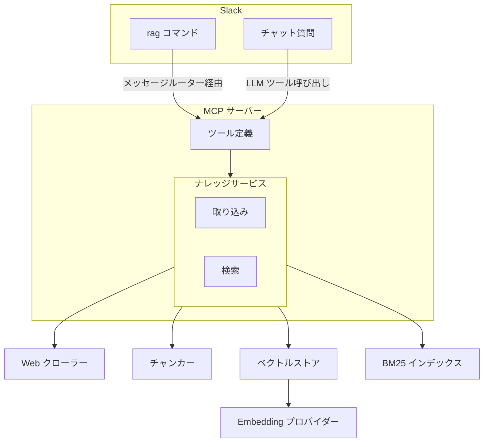
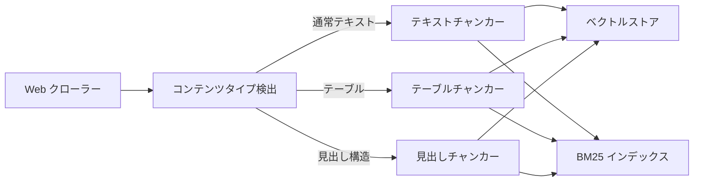
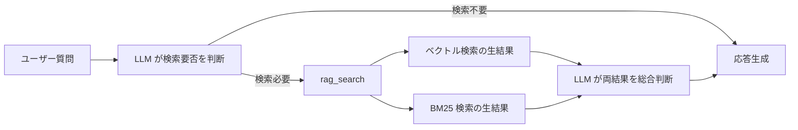

# RAG ナレッジ

## 概要

外部 Web ページから収集した知識をベクトル DB に蓄積し、
チャット応答時に関連情報を自動検索して活用する
RAG（Retrieval-Augmented Generation）基盤。
MCP サーバーとして独立動作し、5 つのツールを提供する。

スコープ:

- 知識の取り込み（クロール・単一ページ追加）
- 知識の検索（ベクトル検索・BM25 キーワード検索）
- 知識の管理（統計表示・削除）
- 検索精度の評価（評価 CLI）

## 背景

- LLM の学習済み知識とリアルタイムの会話コンテキストのみでは、特定 Web サイトの情報に基づいた回答ができない
- 知識ベースの蓄積・検索を MCP サーバーとして独立させ、本体アプリケーションとの疎結合を維持したい
- Embedding モデルはローカルとオンラインを切替可能にし、既存の LLM 使い分けルールと整合させる

## 制約

- MCP サーバー（`mcp_servers/rag/`）は `src/` のモジュールを import しない。必要なモジュールはすべて MCP サーバー配下に配置する
- MCP サーバー専用の設定ファイルを使用し、プロジェクトルートの設定とは独立する
- Embedding モデルを変更した場合、既存データとの類似度計算が不正確になるため、コレクション再構築が必要
- RAG の利用可否は MCP 基盤の有効化と MCP サーバー設定への登録で決まる

## インターフェース

### MCP ツール

MCP サーバーが公開する 5 つのツール。

| ツール | 入力 | 振る舞い |
| --- | --- | --- |
| rag_search | クエリ、件数 | ベクトル検索と BM25 の生結果を個別に返す。ページ全文を返却し、同一 URL は省略する |
| rag_add | URL | 単一ページをクロールして取り込む。同一 URL の再取り込み時は既存の知識を最新に置き換える |
| rag_crawl | URL、パターン | リンク集ページから一括クロールして取り込む。同一ドメインのみ対象 |
| rag_delete | URL | ソース URL 指定でナレッジを削除する |
| rag_stats | なし | 統計情報（総チャンク数、ソース URL 数）を返す |

### Slack コマンド

ユーザーが Slack から実行する管理コマンド。メッセージルーターがパースし、MCP ツール経由で処理する。

| コマンド | 対応ツール |
| --- | --- |
| `rag crawl <URL> [パターン]` | rag_crawl |
| `rag add <URL>` | rag_add |
| `rag status` | rag_stats |
| `rag delete <URL>` | rag_delete |

**クロール進捗フィードバック**:

- 開始メッセージ: コマンド受信後、即座にスレッド内に投稿する
- 完了メッセージ: 処理完了後、結果サマリー（ページ数・チャンク数・エラー数）をスレッド内に投稿する

### チャット統合（準 Agentic Search）

LLM がツールループ内で rag_search を呼ぶかどうかを自律的に判断する。

- MCP サーバー設定の指示文により、ナレッジベース関連の質問時に検索を促す
- 挨拶・雑談では検索をスキップする
- rag_search はベクトル検索と BM25 検索の生結果を個別に返し、LLM が両方の結果を総合判断して回答を生成する
- ソース URL の付与はアプリケーション側で行う（LLM 任せにしない）

<!-- How追加理由: 統合パイプライン(CC)を迂回する設計判断の根拠 -->
統合パイプライン（正規化・スコア結合）を迂回し、
各エンジンの生結果を LLM に渡す方式を採用している。
個別の検索エンジンは良好な精度を示す一方、
統合パイプラインが有用な信号を破壊するケースがあったため。
既存の統合パイプラインは設定で戻せるよう保持している。

### 評価 CLI

検索精度の評価とリグレッション検出を行うコマンドラインツール。

| サブコマンド | 振る舞い |
| --- | --- |
| evaluate | 評価データセットで検索精度を計測しレポートを出力する。ベースライン比較でリグレッションを検出できる |
| init-test-db | テスト用のベクトル DB と BM25 インデックスを初期化する |

評価指標: Precision、Recall、F1、NDCG@K、MRR

## コンポーネント構成

### 全体アーキテクチャ

### 取り込みフロー

### 検索フロー（準 Agentic Search）

### コンポーネント一覧

| コンポーネント | 役割 |
| --- | --- |
| ナレッジサービス | 取り込み・検索・削除のオーケストレーション |
| Web クローラー | ページの取得と本文テキスト抽出。SSRF 対策・robots.txt 遵守を含む |
| コンテンツタイプ検出 | テキストの種類（通常・テーブル・見出し構造）を判定する |
| テキストチャンカー | 段落・文・文字数の優先順で分割する。チャンク間にオーバーラップを適用する |
| テーブルチャンカー | テーブルデータを行単位で分割し、各チャンクにヘッダー行を付加する |
| 見出しチャンカー | 見出し単位で分割し、親見出しの階層情報を保持する |
| ベクトルストア | Embedding 生成とベクトル DB への格納・検索を担う |
| BM25 インデックス | 日本語形態素解析によるキーワード検索。ディスク永続化に対応する |
| ハイブリッド検索エンジン | ベクトル検索と BM25 のスコアを正規化・統合する。設定で有効化できる |
| Embedding プロバイダー | テキストをベクトルに変換する。ローカルとオンラインを切替可能 |
| URL 安全性チェック | 外部 API によるマルウェア・フィッシングサイト判定 |
| 評価ツール | Precision、Recall、F1、NDCG、MRR の計算とベースライン比較 |

## 外部連携

| 連携先 | 用途 | 接続方式 |
| --- | --- | --- |
| ChromaDB | ベクトルの永続化・類似度検索 | 組み込みモード |
| LM Studio | ローカル Embedding 生成 | OpenAI 互換 API |
| OpenAI Embeddings API | オンライン Embedding 生成 | REST API |
| Google Safe Browsing API | URL 安全性チェック | REST API（オプション） |
| 対象 Web サイト | クロール対象 | HTTP/HTTPS |

## エッジケース

| ケース | 振る舞い |
| --- | --- |
| MCP 未有効・RAG サーバー未登録 | RAG 関連コマンドはエラーメッセージを返却する。チャット応答は LLM の学習済み知識のみで行う |
| ツール未登録エラー | ユーザーフレンドリーなエラーメッセージを表示する |
| クロール時の個別ページエラー | ページ単位でエラーを隔離し、成功したページの処理を続行する |
| プライベート IP・localhost へのアクセス | SSRF 対策としてリクエストを拒否する |
| HTTP リダイレクト | SSRF 防止のためリダイレクト追従を無効化する |
| robots.txt の Disallow | クロールをスキップする。取得失敗時はフェイルオープンでクロールを許可する |
| BM25 インデックスの破損 | 空インデックスで起動する（フェイルセーフ） |
| Embedding プロバイダー接続不可 | 疎通確認で検出し、エラーを返す |

## 関連ドキュメント

<!-- mcp-integration, chat-response は未移行。リンク一括修正時に対応 -->
- [MCP 統合](../features/mcp-integration.md) --- MCP サーバーの接続管理・ツール呼び出し基盤
- [chat-response](../features/chat-response.md) --- チャット応答（ソース URL 付与）
