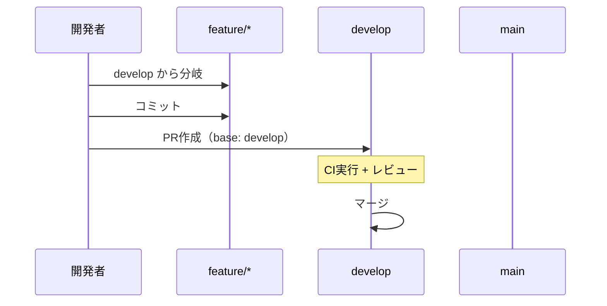
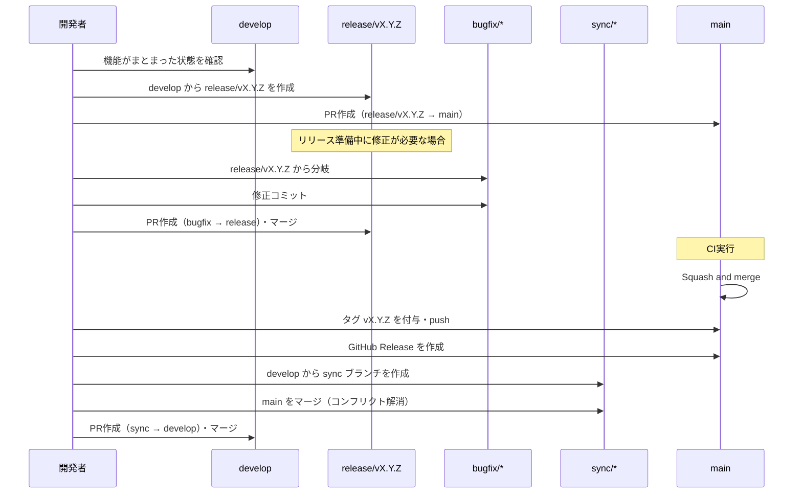
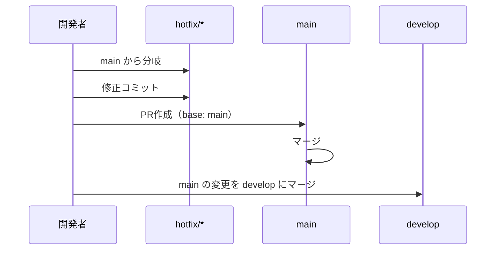

# git-flow ブランチ運用

## 概要

本プロジェクトの git-flow ベースのブランチ戦略を定義する。`develop` ブランチを開発の統合先とし、`main` は安定版のみを保持する。`release/*` ブランチによりリリース単位の履歴管理を行う。

## 背景

- `main` には安定版のみを反映し、開発中の機能が混在するリスクを低減する
- `develop` ブランチで機能統合を行い、まとまったタイミングで `main` に反映する
- リリースブランチを通じてリリース単位の変更履歴を管理する

## ブランチ構成

### 常設ブランチ

| ブランチ | 役割 | マージ元 | 保護 |
|---------|------|---------|------|
| `main` | 安定版（本番相当） | `release/*`, `hotfix/*` | 直接プッシュ禁止 |
| `develop` | 開発統合 | `feature/*`, `bugfix/*`, `sync/*` | 直接プッシュ禁止 |

### 作業ブランチ

| プレフィックス | 用途 | ベース | マージ先 | 命名規則 |
|--------------|------|--------|---------|---------|
| `feature/` | 新機能開発 | `develop` | `develop` | `feature/{機能名}-#{Issue番号}` |
| `bugfix/` | バグ修正 | `develop` または対象 `release/*` | ベースと同一ブランチ | `bugfix/{修正内容}-#{Issue番号}` |
| `release/` | リリース準備 | `develop` | `main`（squash） | `release/v{X.Y.Z}` |
| `hotfix/` | 本番緊急修正 | `main` | `main` + `develop` | `hotfix/{修正内容}-#{Issue番号}` |
| `sync/` | リリース後の main → develop 同期 | `develop` | `develop` | `sync/main-to-develop-v{X.Y.Z}` |
| `claude/` | Claude Code 自動生成 | `develop` | `develop` | `claude/issue-{N}-{date}-{id}`（自動命名） |

※ `claude/` ブランチは claude-code-action が自動生成するため、命名規則はシステム依存。

## ワークフロー

### 通常開発

1. `develop` から `feature/{機能名}-#{Issue番号}` を作成
2. 実装・テスト・コミット
3. `develop` に向けてPR作成
4. CI通過 + レビュー後にマージ

### リリース

1. `develop` から `release/v{X.Y.Z}` を作成
2. `main` に向けてPR作成（リリースPR）
3. リリース準備中の修正は bugfix ブランチ経由でPRマージ（release ブランチへの直接コミット禁止）
4. `main` へ squash マージ
5. `main` にタグ `v{X.Y.Z}` を付与し push
6. GitHub Release を作成
7. sync ブランチ経由で `main` → `develop` に差分反映

#### release ブランチ上の修正

release ブランチへの直接コミットは禁止。修正は bugfix ブランチを経由してPRでマージする。

- PR単位で修正履歴を残し、トレーサビリティを確保するため
- bugfix ブランチは `release/v{X.Y.Z}` から分岐する（Issue がない軽微な修正は番号省略可）

#### タグ付けと GitHub Release

main への squash マージ後、リリースバージョンのタグを付与し GitHub Release を作成する。

#### main → develop の差分反映

squash マージにより `main` と `develop` の間に差分が生じるため、sync ブランチ経由でPR反映する。

<!-- How追加理由: squash マージ後の差分反映手順は直感に反するため、手順を誤りやすい -->

- `main` → `develop` に直接PRを作成するとコンフリクトが発生する（squash コミットと元コミットの SHA が異なるため）
- ローカルで `develop` から sync ブランチを作成し、`main` をマージしてコンフリクトを解消してからPRにする
- マージ後、`git diff develop..main --stat` で差分がゼロであることを確認する

### hotfix（緊急修正）

1. `main` から `hotfix/{修正内容}-#{Issue番号}` を作成
2. 修正・コミット
3. `main` に向けてPR作成・マージ
4. `main` の変更を `develop` にもマージ（hotfix は通常マージのため SHA 不一致が起きず直接マージ可能）

## マージ方式

| マージ元 → マージ先 | 方式 | 理由 |
|---|---|---|
| feature/bugfix → develop | 通常マージ | 開発履歴を保持 |
| bugfix → release（リリース準備中の修正） | 通常マージ | 修正履歴を保持し、トレーサビリティを確保 |
| release → main（リリース） | squash マージ | リリース単位で1コミットにまとめ、main の履歴を簡潔に保つ |
| sync → develop（リリース後同期） | 通常マージ | main の squash コミットを develop に取り込み、差分を解消 |
| hotfix → main | 通常マージ | 緊急修正の履歴を保持 |

## PR 運用

### feature/bugfix → develop

- PR body は `.github/pull_request_template.md` の形式に従う
- `Closes #{Issue番号}` で紐付け
- CI チェック必須
- base ブランチ: `develop`

### bugfix → release（リリース準備中の修正）

- `release/v{X.Y.Z}` を base とする
- CI チェック必須
- release ブランチへの直接コミット禁止（必ずPR経由）

### release → main

- 含まれる変更の一覧をPR本文に記載
- CI チェック必須
- マージ後に `main` → `develop` への差分反映を忘れないこと

### hotfix → main

- `main` を base とする
- マージ後に `develop` への反映を忘れないこと

## コミットメッセージ規約

コミットメッセージの形式・scope のルール・type 一覧は `docs/specs/style-guide.md` の「コミットメッセージ規約」セクションを参照。

## 関連ドキュメント

- `docs/specs/style-guide.md` — コミットメッセージ規約・ブランチ命名規約
- `docs/specs/workflows/pr-body-template.md` — PR body テンプレート仕様
- `docs/specs/workflows/github/auto-progress.md` — 自動進行管理（develop ベースで動作）
