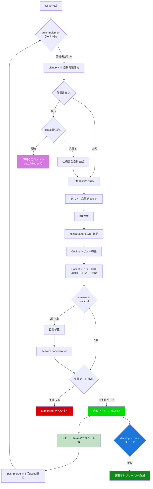
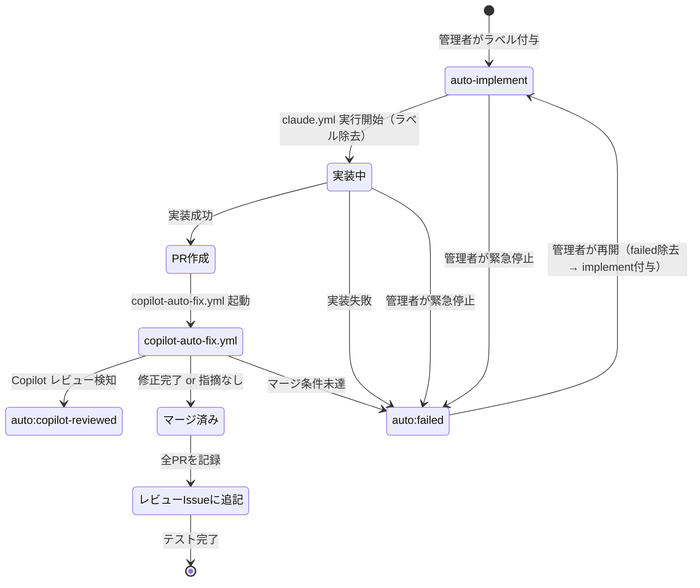
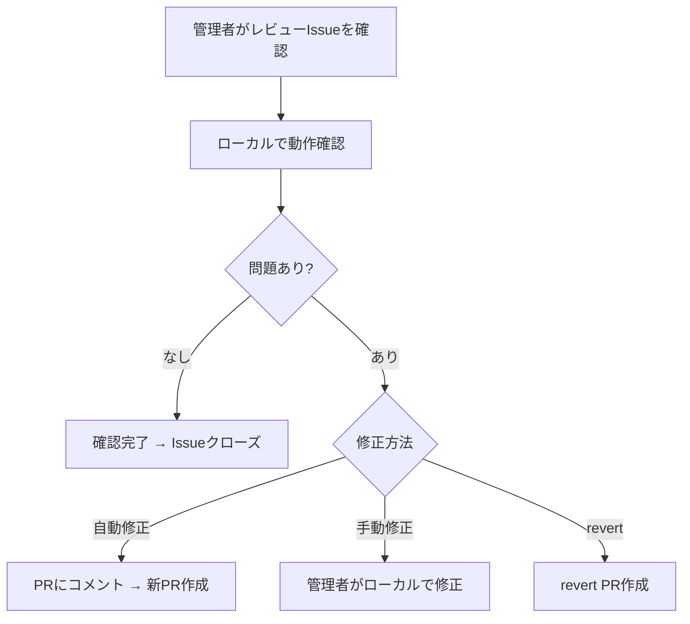

<!-- 配置先は workflows/github/ だが、複数ワークフローを束ねるパイプライン仕様のため、
     workflows テンプレート（種別固有セクション後日確定）を適用する -->

# 自動進行管理（auto-progress）

## 概要

Issue から PR マージまでの全工程を自動化するパイプライン。管理者が Issue に `auto-implement` ラベルを貼るだけで、仕様確認・実装・PR 作成・レビュー・指摘対応・マージまでを自律的に実行する。

**コンセプト**: 「管理者は Issue にラベルを貼るだけ、朝にはマージ済み」

## 背景

- 管理者1名体制のため、人間のチェック（レビュー確認・マージ判断等）がボトルネック
- 既存の `@claude` メンション方式は手動トリガーが前提
- PR レビュー後の指摘対応 → 再レビュー → マージの繰り返しサイクルが特に遅延の原因

## 制約

### GitHub Actions 環境の制約

GitHub Actions（ubuntu-latest）環境では以下が利用不可:

| 制約 | 理由 |
|------|------|
| ローカル LLM | Actions 環境からローカルマシンにアクセスできない |
| Slack Bot 実行テスト | Bot トークンでの実際のメッセージ送受信ができない |
| 統合テスト全般 | 外部サービスへの接続が必要 |

実行可能なテスト: pytest（モック使用のユニットテスト）、mypy、ruff、markdownlint

### 自動実装の対象外

以下に該当する Issue は自動実装せず、Issue にコメントで理由を報告する:

- セキュリティに関わる変更（認証、権限、暗号化等）
- 外部サービスの契約・設定変更が必要なもの
- 破壊的変更（既存 API の変更、DB スキーマ変更等）
- Issue 本文が曖昧で仕様書の作成が困難なもの

## 全体フロー

## 自動設計フェーズ

仕様書がない Issue や、ざっくりとした Issue に対して、実装前に自動で仕様書を作成するフェーズ。

### 仕様書の存在チェック

以下の順序で仕様書の有無を判定する:

1. Issue の本文・コメントに `docs/specs/` へのパス参照があるか
2. Issue 番号に紐づく仕様書があるか（`docs/specs/` 内を検索）
3. Issue タイトルのキーワードで `docs/specs/` を照合

### Issue 具体性の判定基準

**具体的と見なす条件**（いずれかを満たす）:

- Issue に入出力の例が書かれている
- 既存の類似機能が特定でき、差分が明確
- 「〇〇を△△に変更する」のような具体的な変更指示
- バグ修正で再現手順が書かれている

**曖昧と見なす条件**（いずれかに該当）:

- 「〇〇の検討」「〇〇を改善」のみで具体策がない
- 複数の異なる要求が1つの Issue に混在
- 外部サービスとの連携で仕様が未確定
- 「どうするか考えて」系の検討 Issue

曖昧判定時は、判定理由・不足情報の具体例を Issue にコメントし、`auto:failed` ラベルを付与して停止する。

### 自動生成仕様書の扱い（事後拒否権モデル）

仕様書の事前承認ステップは設けない。デフォルトは「進む」、止めたい時だけ管理者が `auto:failed` で停止する。

- 自動生成した仕様書はそのまま実装に進み、PR に含めてコミットする
- PR 作成時の GitHub 通知で管理者に自動的に届く
- 管理者は通知を見て、問題があれば `auto:failed` で停止する
- 問題がなければ何もしなくてよい（デフォルトで進行）

## ラベル設計

| ラベル | 用途 | 付与者 |
|--------|------|--------|
| `auto-implement` | 自動実装トリガー（Issue 用） | 管理者が手動 |
| `auto:pipeline` | 自動パイプラインで作成された PR のマーカー | claude.yml |
| `auto:copilot-reviewed` | Copilot レビュー完了のステータスマーカー | copilot-auto-fix.yml |
| `auto:merged` | 自動マージ済みマーカー（post-merge.yml の発火条件） | copilot-auto-fix.yml |
| `auto:failed` | 自動処理の失敗・停止（緊急停止にも使用） | 各ワークフロー or 管理者 |
| `auto:review-batch` | 自動マージレビューバッチ Issue | post-merge.yml |

**命名規則**: `auto-implement` = Issue 側（ユーザーが手動付与）、`auto:*` = PR 側（ワークフローが自動管理）

### ラベル状態遷移

## ワークフロー構成

| ワークフロー | トリガー | 役割 |
|-------------|---------|------|
| `claude.yml` | `issues[labeled]` | `auto-implement` ラベルで自動実装開始 |
| `copilot-auto-fix.yml` | `pull_request[opened]` + `workflow_dispatch` | Copilot レビュー検知 + 自動修正 + マージ |
| `post-merge.yml` | `pull_request[closed]` | マージ後の全 PR レビュー記録 + 次 Issue 自動ピックアップ |
| `auto-fix.yml` | `workflow_dispatch` のみ | 無効化（copilot-auto-fix.yml に移行済み） |

### レビュー方式

自動パイプラインでは Copilot のネイティブレビューが PR 作成時に自動実行される。手動レビューは Claude Code 上で `/code-review` スキルを使用する。

### Resolve conversation

PR レビューの「Resolve conversation」を GitHub GraphQL API で自動実行する。check-pr スキルの指摘対応後に、判断済みスレッドを resolve する。

パイプライン内の位置: 自動修正の完了後に resolve を実行し、その後マージ判定（第5層: マージ前6条件チェック）に進む。resolve 後も unresolved スレッドが残っている場合はマージ条件未達となる。

- 個別スレッドの resolve 失敗はログして次のスレッドに継続する（1件の失敗で全体を止めない）
- 全スレッドの resolve が失敗した場合はエラーログを記録する（`auto:failed` は付与しない）

## ブランチ戦略

簡易 git-flow（develop + main）を採用する。自動パイプラインのマージ先を develop にすることで、main（本番）の安定性を保証する。

| ブランチ | 役割 | マージ方式 |
|---------|------|-----------|
| `main` | 本番（プロダクション）。常に安定版 | develop からの手動マージ |
| `develop` | ステージング。自動マージ先 | feature ブランチからの自動マージ |
| `feature/*` | 機能開発ブランチ。develop から分岐 | develop への PR マージ |

### ブランチ保護ルール

**develop ブランチ**: PR 必須、承認不要（自動マージ許可）。品質チェックはエージェント内テストで担保する。

**main ブランチ**: PR 必須、承認必須（手動マージのみ）。自動マージは develop にのみ実行し、main への直接自動マージは禁止。

### リリースフロー

develop → main のリリース PR は管理者が手動で作成する。main への自動マージは行わない。

## 安全弁設計

多層防御により自動マージの安全性を担保する。

### 第1層: 単方向フロー制約

再レビューループを行わず、1回の修正のみ実行する。修正後にマージ条件を満たさなければ `auto:failed` で停止。

### 第2層: 禁止パターン（自動マージ不可ファイル）

以下のファイルが変更に含まれる PR は自動マージしない（auto-fix は続行し、マージ判定でブロック）:

| パターン | 理由 |
|---------|------|
| `.env*` | 環境変数・シークレット |
| `pyproject.toml` | 依存パッケージ・ツール設定 |

`.github/workflows/*` は禁止パターンに含まない。自動マージは `auto/` ブランチの develop 向け PR のみを処理するため、ワークフロー変更が main に直接自動マージされることはない。

### 第3層: `auto:failed` ラベル（緊急停止ボタン兼用）

- Issue/PR に `auto:failed` ラベルを付与すると全自動処理が即停止する
- 全ワークフローの if 条件で最初にチェックされる
- 管理者が手動で除去し `auto-implement` を再付与すると再開する

### 第4層: concurrency グループ

PR 番号ごとの concurrency グループで同じ PR に対する同時実行を防止する。進行中のジョブはキャンセルしない。

### 第5層: マージ前6条件チェック

自動マージ実行前に以下を全て確認する:

1. PR が OPEN 状態
2. レビュー指摘ゼロ
3. ステータスチェック通過（外部 CI 未設定時は自動 PASS）
4. コンフリクトなし
5. `auto:failed` ラベルなし
6. 禁止パターンなし

### 第6層: ブランチ保護ルール

develop と main の2層構成で保護する（詳細は「ブランチ戦略」セクション参照）。

### 第7層: ロールバック準備

自動マージ後に develop のテストが壊れた場合、revert PR を作成する。main はリリース PR 経由でのみ更新されるため、develop で revert すれば main は無傷。

### 第8層: 段階的信頼

ドライラン → docs 限定 → 全面解禁の段階的な移行で、自動マージの信頼性を検証する。

### 第9層: リリース PR ゲートキーピング

develop → main のリリース PR で、自動マージされた全変更を管理者が一括確認する。

## マージ後レビュー

`auto:review-batch` ラベル付きの集約 Issue で管理する。全ての自動マージ PR をコメントとして記録し、管理者がまとめてレビューする。

- `auto:review-batch` ラベルの Open Issue は常に1つのみ
- Issue が存在しない場合は新規作成してピン留めする
- 各 PR の情報（PR 番号・タイトル・変更ファイル一覧）はコメントで追記する
- 管理者がまとめてチェックし、問題なければ Issue をクローズする

### 問題発見時のフロー

## エッジケース

### 失敗時の振る舞い

| パターン | 対応 |
|---------|------|
| テスト失敗 | 1回修正を試行。解消しなければ `auto:failed` で停止 |
| 仕様不明確 | Issue にコメントで不明点を報告し、`auto:failed` で停止 |
| 実装が長時間 | `--max-turns` で間接制御。タイムアウト時に停止 |
| API/権限エラー | 即座に停止。エラー内容を通知 |
| コンフリクト | 既存の `@claude` フローで手動対応 |
| 同時実行 | concurrency グループで防止 |

### 管理者の復旧手順

- `auto:failed` 通知を受けたら PR/Issue コメントでエラー内容を確認する
- 修正可能: Issue/PR の内容を修正し、`auto:failed` 除去 → `auto-implement` 再付与
- 修正不要: `auto:failed` のまま放置（手動対応に切り替え）

## 関連ドキュメント

- [copilot-auto-fix](copilot-auto-fix.md) — Copilot レビュー検知 + 自動修正 + マージの詳細設計
- [claude-code-actions](claude-code-actions.md) — GitHub Actions 上の Claude Code 統合
- [check-review-batch スキル](../../agentic/skills/check-review-batch-skill.md) — 自動マージレビューバッチチェック
- [git-flow](../git-flow.md) — ブランチ戦略・マージ方式の統一ルール
