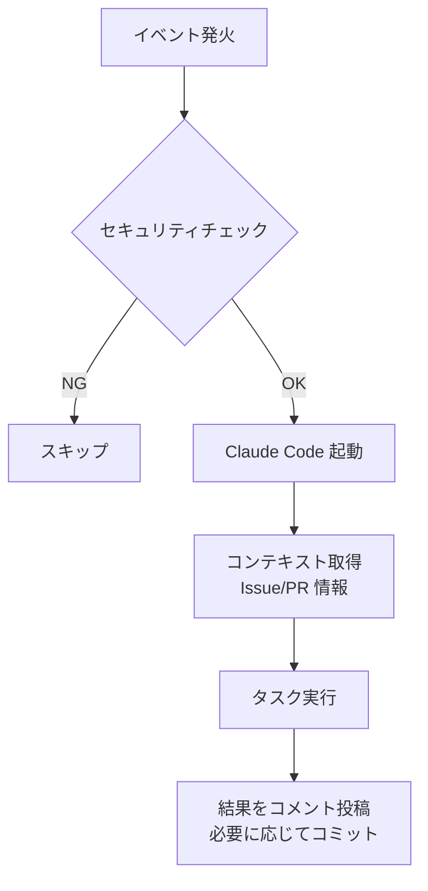

# Claude Code Actions

## 概要

GitHub PR や Issue で `@claude` メンションすることで Claude Code を呼び出し、コードレビュー・実装・質問応答を自動化するワークフロー。

本仕様はメンショントリガーによる対話型の Claude Code 呼び出しを対象とする。ラベルトリガーによる自動実装（`auto-implement`）は自動進行管理ワークフローの範囲。

## 背景

- PR や Issue 上で直接 AI に作業を依頼できると、開発サイクルが短縮される
- GitHub Actions との統合により、手動でのツール切り替えなしに AI 支援を受けられる

## 制約

### セキュリティガード

| ガード | 内容 |
| --- | --- |
| ユーザー制限 | 許可ユーザーのみ実行可能 |
| イベントフィルタリング | 対象イベントのコメントまたは本文に `@claude` メンションを含む場合のみ実行 |
| トークン保護 | シークレット経由で参照（ハードコードしない） |
| ターン制限 | 無限ループ防止のためターン数を制限 |

### 認証方式

OAuth 認証を使用する。

前提条件:

- GitHub Actions から Claude Code 用の OAuth アクセストークンを参照できること
- リポジトリシークレット `CLAUDE_CODE_OAUTH_TOKEN`: Claude GitHub App により発行された OAuth トークンを格納する

## トリガー条件

以下の GitHub イベントで `@claude` メンションが含まれる場合に発火する:

| イベント | 対象 |
| --- | --- |
| `issue_comment` | Issue / PR へのコメント |
| `pull_request_review_comment` | PR レビューコメント |
| `issues` | Issue 作成・アサイン |
| `pull_request_review` | PR レビュー投稿 |

## 処理フロー

1. **セキュリティチェック**: ユーザー制限・メンション有無を検証し、条件を満たさない場合はスキップ
2. **Claude Code 起動**: OAuth トークンで認証し、ターン制限付きで起動
3. **コンテキスト取得**: 対象の Issue / PR の情報を取得
4. **タスク実行**: メンション内容に基づきコードレビュー・実装・質問応答を実行
5. **結果出力**: Issue / PR へのコメントとして回答を投稿。必要に応じてコード変更をコミット・プッシュ

## 出力

### 成功時

- Issue / PR へのコメントとして回答を投稿
- 実装依頼の場合はコード変更のコミット・プッシュ

### 失敗・スキップ時

- セキュリティチェック不合格: 何も出力せずスキップ
- Claude Code 実行エラー: GitHub Actions のログに記録

## 関連ドキュメント

<!-- auto-progress は未移行。#648 で一括修正予定 -->
- [auto-progress](auto-progress.md) — 自動進行管理（`auto-implement` ラベルトリガーを含む）
